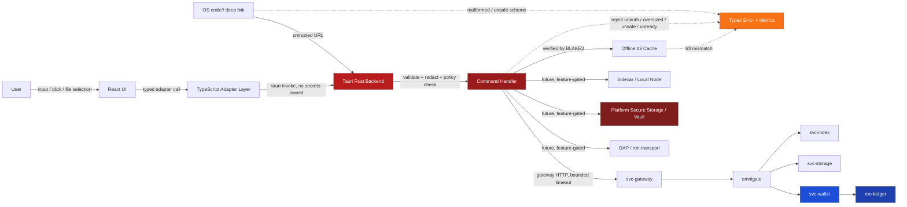
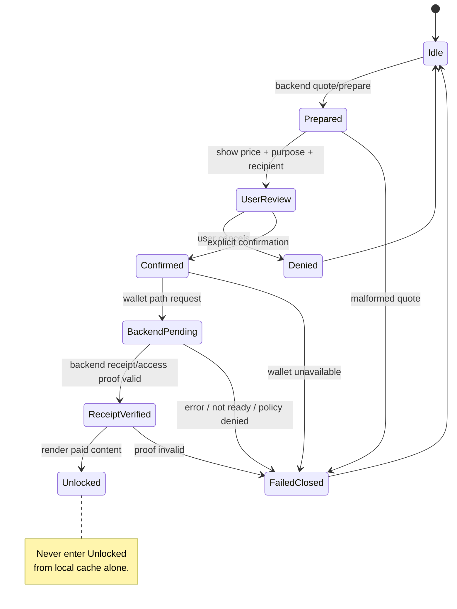
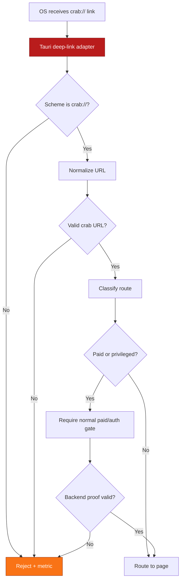
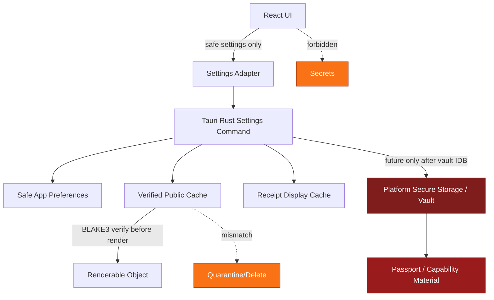

````markdown
---
title: Security Notes — CrabLink Tauri
app: crablink-tauri
repo: crablink
owner: Stevan White
last-reviewed: 2026-05-17
status: draft
target-path: apps/crablink-tauri/docs/SECURITY_NOTES.md
related-blueprints:
  - CRABLINK_TAURI_IDB.MD
  - TAURI_MIGRATION_IDB.MD
  - OAP_CLIENT_IDB.MD
  - PASSPORT_WALLET_VAULT_IDB.MD
  - SECURITY_AND_AMNESIA_IDB.MD
  - OFFLINE_CACHE_IDB.MD
  - MEDIA_TAURI_IDB.MD
  - FACET_SANDBOX_IDB.MD
---

# Security Documentation — CrabLink Tauri

RO:WHAT — Security notes for the CrabLink Tauri native app.

RO:WHY — The Tauri pivot moves CrabLink from a Chrome-extension proof client into a native Rust-backed RON client with a larger local trust boundary: Rust commands, platform storage, native deep links, future OAP, future local vault, media paths, offline cache, and sidecar/local-node supervision.

RO:INTERACTS — React UI, TypeScript adapter layer, Tauri Rust backend, platform adapters, svc-gateway, omnigate, ron-app-sdk, oap, ron-proto, ron-transport, ron-auth, ron-kms, svc-passport, svc-wallet, ron-ledger, svc-storage, svc-index, svc-edge, svc-sandbox, svc-mod, micronode, macronode.

RO:INVARIANTS — No fake ROC. No fake receipts. No silent spend. No wallet truth in UI. No direct ledger mutation from CrabLink. No arbitrary code execution from crab links. No public main→alt leakage. No secrets in React/TypeScript/localStorage/logs/deep links. OAP is Rust-side only. b3 hashes are canonical.

RO:METRICS — Security rejection metrics, command error class metrics, auth failure metrics, deep-link rejection metrics, cache integrity failure metrics, sidecar lifecycle security metrics, paid gate denial metrics, redaction regression metrics.

RO:CONFIG — App security posture is controlled by endpoint config, OAP enablement, sidecar enablement, amnesia mode, secure storage/vault mode, cache policy, debug mode, dev token policy, media caps, and platform feature flags.

RO:SECURITY — React is display/orchestration only. Tauri Rust owns privileged commands. Secrets never cross into UI state. Capabilities fail closed. Paid actions require explicit confirmation. Backend remains wallet/ledger truth.

RO:TEST — Unit tests, command tests, adapter tests, deep-link parser tests, redaction tests, cache verification tests, paid-gate tests, sidecar lifecycle tests, OAP frame tests, fuzz/property tests, mobile smoke, and destructive local-state wipe tests.

This document defines the **threat model**, **security boundaries**, and **hardening requirements** specific to `crablink-tauri`.

It complements the repo-wide RustyOnions hardening, interop, OAP, wallet/ledger, b3, passport, amnesia, and gateway-boundary rules.

---

## 0) Security Posture Summary

CrabLink Tauri is not just a UI wrapper.

It is a native RON client shell with three layers:

```text
React UI
→ TypeScript adapter layer
→ Tauri Rust backend
→ RustyOnions services / gateway / future OAP / future sidecar
````

The core security rule is:

```text
React displays.
TypeScript adapts.
Tauri Rust mediates privilege.
RustyOnions backend owns durable truth.
```

The Tauri app may eventually handle local capabilities, platform secure storage, offline b3 caches, and local node supervision, but it must not become a hidden wallet, ledger, storage service, index service, or policy engine.

Current safe default:

```text
gateway-compatible first
OAP disabled until OAP_CLIENT_IDB is implemented
sidecar disabled until sidecar lifecycle gates are implemented
vault disabled until PASSPORT_WALLET_VAULT_IDB is implemented
offline cache display-only until b3 verification gates are implemented
facet execution disabled until FACET_SANDBOX_IDB is implemented
```

---

## 1) Threat Model (STRIDE)

| Category                   | Threats                                                                                                                                                                                                                          | Relevant in `crablink-tauri`? | Mitigation                                                                                                                                                                                                                                                                                                      |
| -------------------------- | -------------------------------------------------------------------------------------------------------------------------------------------------------------------------------------------------------------------------------- | ----------------------------- | --------------------------------------------------------------------------------------------------------------------------------------------------------------------------------------------------------------------------------------------------------------------------------------------------------------- |
| **S**poofing               | Fake gateway, fake passport, fake wallet account, fake profile, fake creator identity, fake sidecar, spoofed `crab://` deep link, malicious local service pretending to be RustyOnions                                           | Yes                           | TLS where applicable, configured gateway allowlist, capability tokens/macaroons, backend-derived identity, signed/verified passport/profile data, sidecar binary verification before bundled mode, source labeling in UI, fail-closed capabilities                                                              |
| **T**ampering              | Mutated asset bytes, modified manifest, corrupted offline cache, malicious route payload, changed receipt JSON, local settings tampering, sidecar output tampering, tampered OAP frame                                           | Yes                           | BLAKE3 `b3:<64 lowercase hex>` verification, strict DTO schemas, cache integrity checks, backend receipt verification, typed command envelopes, OAP frame bounds, redacted and typed errors, signed release artifacts, no trust in local cache metadata                                                         |
| **R**epudiation            | Missing paid-action audit trail, missing spend confirmation record, no correlation ID across UI/Rust/gateway, unclear source for receipt/access proof                                                                            | Yes                           | `corr_id` propagation, structured logs, receipt display cache marked as cache, backend receipts remain source of truth, paid gate event logging, command envelopes include source and correlation ID, user confirmation events recorded locally without storing secrets                                         |
| **I**nformation Disclosure | Passport/wallet linkage leak, public main→alt leakage, token leakage in logs/errors, private key exposure, seed phrase exposure, file path leakage, deep-link secret leakage, crash dump secret leakage, profile privacy leakage | Yes                           | No secrets in React/TypeScript state, no seed phrase UX until vault IDB, platform secure storage only through Rust adapter, zeroization for in-memory secrets, redaction at command boundary, amnesia mode, no secrets in URLs, no raw tokens in logs, no public main→alt linkage by default                    |
| **D**enial of Service      | Deep-link flood, command spam, gateway retry storm, large media memory blowup, unbounded cache, decompression bombs, sidecar restart loop, oversized OAP frames, slow gateway/OAP responses                                      | Yes                           | 5s default request timeout where applicable, bounded command queues, bounded retries with jitter, media range/segment discipline, cache quota, decompression caps, sidecar restart backoff, OAP max frame 1 MiB, preferred streaming chunk 64 KiB, readiness/health gating                                      |
| **E**levation of Privilege | React invokes privileged Rust command directly, malicious crab link triggers filesystem/network/wallet action, sidecar gets wallet authority, content facet executes arbitrary code, dev token becomes production authority      | Yes                           | Tauri command allowlist, command-level policy checks, explicit paid confirmation, no wallet mutation except through backend wallet path, no arbitrary code execution, facet execution disabled by default, dev mode clearly gated, least-privilege platform permissions, sidecar no wallet authority by default |

---

## 2) Security Boundaries

### 2.1 Inbound

Inbound surfaces into `crablink-tauri`:

```text
Tauri window/webview:
  - React route navigation
  - form input
  - file picker selections
  - drag/drop files if enabled
  - media playback UI events
  - copy/paste actions if enabled

Tauri command bridge:
  - health_check
  - ready_check
  - version_check
  - resolve_crab_url
  - get_asset_page
  - prepare_paid_action
  - confirm_paid_action
  - get_wallet_balance
  - get_identity_me
  - read_setting
  - write_setting
  - clear_cache_category
  - verify_cached_b3
  - open_deep_link
  - sidecar_status
  - vault_status

Native platform:
  - `crab://...` deep links
  - app launch args
  - OS file picker results
  - platform secure storage callbacks
  - network availability changes
  - mobile app lifecycle events

Future local service inputs:
  - sidecar stdout/stderr/status
  - local node health/ready endpoints
  - OAP responses
```

Inbound data is untrusted until normalized, schema-validated, and policy-checked.

---

### 2.2 Outbound

Outbound surfaces from `crablink-tauri`:

```text
Gateway HTTP:
  - svc-gateway /healthz
  - svc-gateway /readyz
  - svc-gateway /identity/me
  - svc-gateway /wallet/:account/balance
  - svc-gateway /crab/resolve?url=...
  - svc-gateway /b3/<hash>.<kind>
  - svc-gateway /sites/:name
  - svc-gateway paid prepare/hold/access routes
  - svc-gateway asset/site publish routes

Future OAP:
  - ron-app-sdk
  - oap
  - ron-proto DTOs
  - ron-transport

Future sidecar/local node:
  - micronode/macronode local process
  - local service health/ready endpoints
  - local OAP endpoint
  - local storage/index/cache surfaces if explicitly enabled

Platform:
  - secure storage
  - filesystem cache directory
  - app data directory
  - file picker read handles
  - OS deep-link registration
  - media playback APIs
```

Outbound requests must carry only the minimum authority required.

---

### 2.3 Trust Zone

`crablink-tauri` runs as a **local native client**.

Trust zones:

```text
Untrusted:
  - crab:// input
  - gateway responses until schema-checked
  - OAP responses until decoded/validated
  - sidecar output until parsed/validated
  - local cache bytes until b3-verified
  - file picker bytes until size/type checked
  - user-provided URLs
  - public manifests
  - remote media metadata
  - deep-link payloads

Low-trust:
  - React UI state
  - TypeScript adapter state
  - local display cache
  - recent receipts display cache
  - last-known balance display
  - local route history
  - draft manifests

Privileged:
  - Tauri Rust command layer
  - platform secure storage adapter
  - vault adapter after vault IDB
  - OAP adapter after OAP IDB
  - sidecar supervisor after sidecar gates
  - cache manager for verified objects

Authoritative:
  - svc-wallet for wallet mutation
  - ron-ledger for durable economic truth
  - svc-gateway public contract for app-facing HTTP
  - omnigate for product hydration
  - svc-storage for CAS bytes
  - svc-index for name/pointer resolution
  - ron-policy for policy decisions
  - svc-passport / ron-auth / ron-kms for identity and capability truth
```

---

### 2.4 Assumptions

```text
- RustyOnions backend services enforce their own /readyz and quotas.
- svc-wallet remains the normal mutation front-door for economic operations.
- ron-ledger remains durable replayable economic truth.
- svc-gateway remains the public HTTP compatibility boundary.
- omnigate hydrates product views and does not directly mutate ledger state.
- Storage stores bytes by content ID only.
- Name/profile/manifest resolution stays upstream in gateway/omnigate/index/naming.
- OAP/1 frame bounds and error taxonomy remain enforced in OAP code.
- Platform secure storage is accessed only through the Rust platform adapter.
- Sidecar/local node mode is disabled until explicitly implemented and tested.
- The Chrome extension remains a proof/companion client and does not define Tauri security truth.
```

---

## 3) Key & Credential Handling

### 3.1 Types of keys and credentials

Potential credential categories:

```text
Gateway credentials:
  - dev bearer token
  - future macaroon/capability token
  - correlation ID, not secret

Passport / identity:
  - passport subject labels
  - public profile identifiers
  - future local passport signing keys
  - future alt passport keys
  - future device-bound identity material

Wallet:
  - wallet account labels
  - future wallet permission grants
  - future spend capabilities
  - never ledger truth in app state

OAP:
  - future OAP capability bytes
  - future session keys
  - future transport credentials

TLS / transport:
  - pinned/expected gateway endpoint config if added
  - future local TLS certs for sidecar
  - future mTLS identity if added

Platform:
  - secure storage handles
  - biometric/PIN gate state
  - app-scoped encryption keys where supported

Sidecar:
  - sidecar launch config
  - local node capability material if explicitly enabled
  - local endpoint auth token if generated
```

---

### 3.2 Storage policy

Default storage policy:

```text
React state:
  - no secrets
  - no private keys
  - no seed phrases
  - no spend capabilities
  - no long-lived bearer tokens

TypeScript adapter:
  - no secret ownership
  - may hold transient request data only
  - must not persist authority

Tauri Rust memory:
  - may hold short-lived secrets where needed
  - secrets wrapped in Zeroizing where applicable
  - redacted before returning to UI

Platform secure storage:
  - future home for real local credentials
  - only after PASSPORT_WALLET_VAULT_IDB.MD
  - biometric/PIN gate where available
  - app-specific namespace

Filesystem:
  - safe preferences only
  - public verified cache only
  - encrypted private cache only after cache/vault IDBs
  - no raw tokens in logs
  - no seed phrases
  - no private keys outside secure storage
```

---

### 3.3 Amnesia mode

In amnesia mode:

```text
- Prefer memory-only settings/session state.
- Do not persist private cache.
- Do not persist receipt display cache unless explicitly allowed.
- Do not persist recent route history unless explicitly allowed.
- Clear in-memory capability material on lock/logout/shutdown.
- Clear sidecar local auth material on shutdown where possible.
- Avoid crash dump secret exposure.
- Logs must be minimal and redacted.
```

---

### 3.4 Rotation policy

Initial draft policy:

```text
Dev bearer token:
  - local-development only
  - user-visible
  - clearable
  - never logged
  - not treated as production spend authority

Future macaroon/capability token:
  - short TTL
  - scoped caveats
  - revocation via backend capability registry / passport service
  - rotate at or below 30 days, preferably much shorter for spend authority

Future local passport keys:
  - require PASSPORT_WALLET_VAULT_IDB.MD
  - rotation path documented before production use
  - revocation or key-loss story documented
  - main/alt separation tested

Future OAP/session keys:
  - session scoped
  - zeroized on disconnect/shutdown
  - no UI exposure
```

---

### 3.5 Zeroization

Required for Rust code that touches secret material:

```text
- Use zeroize::Zeroizing or equivalent wrappers for secret buffers.
- Avoid cloning secret strings.
- Do not format secrets with Debug or Display.
- Do not include secrets in serde-serialized command responses.
- Drop secret material before await boundaries where possible.
- Never send raw secret material to React.
```

If a secret must live longer than a single command, it must be owned by a clearly documented Rust state manager and protected by a vault/security IDB.

---

## 4) Hardening Checklist

### 4.1 App-wide hardening

* [ ] React has no direct secret ownership.
* [ ] TypeScript adapters have no persistent secret ownership.
* [ ] Tauri commands are allowlisted and narrowly scoped.
* [ ] Every privileged command performs command-level validation.
* [ ] Every command returns typed success/problem envelopes.
* [ ] Command errors are redacted before crossing into React.
* [ ] Correlation IDs exist across UI → Tauri → gateway/OAP where possible.
* [ ] Debug mode is explicit and visibly marked.
* [ ] No raw token appears in logs, UI, error messages, crash dumps, or copied diagnostics.
* [ ] No seed phrase UX exists until vault IDB.
* [ ] No private-key custody exists until vault IDB.
* [ ] No arbitrary JS/WASM/facet execution exists until sandbox IDB.
* [ ] No direct ledger mutation exists from CrabLink.
* [ ] No direct storage/index mutation exists from UI.
* [ ] No fake local receipt unlocks.
* [ ] No fake local b3 CIDs.

---

### 4.2 Request and protocol hardening

* [ ] 5s default timeout on gateway/OAP requests unless route-specific reason is documented.
* [ ] Concurrency cap: default 512 app/backend inflight ceiling for service-style paths; lower UI command caps are preferred where practical.
* [ ] RPS cap: default 500 per service boundary; local command spam should be lower and UI-friendly.
* [ ] Request body cap: 1 MiB for non-stream/simple command routes.
* [ ] OAP max frame: 1 MiB.
* [ ] Preferred streaming chunk posture: 64 KiB.
* [ ] Decompression ratio ≤ 10× where decompression exists.
* [ ] Absolute decompression output cap enforced where decompression exists.
* [ ] No full-file large media buffering through Tauri commands.
* [ ] Range/segment/media paths must be used for large media.
* [ ] Retries are bounded and jittered.
* [ ] Gateway fallback must not bypass policy.
* [ ] OAP path must not bypass policy.

---

### 4.3 Deep-link hardening

* [ ] Only `crab://` deep links are accepted by CrabLink handler.
* [ ] Deep-link URLs are normalized by shared parser.
* [ ] Malformed b3 hashes are rejected.
* [ ] Uppercase/noncanonical b3 forms are normalized only if policy allows; canonical output is lowercase.
* [ ] `file://`, `javascript:`, `data:`, shell fragments, and path traversal attempts are rejected.
* [ ] Deep links cannot trigger spend without explicit confirmation.
* [ ] Deep links cannot read local files.
* [ ] Deep links cannot execute code.
* [ ] Deep-link payloads are never treated as credentials.
* [ ] Deep-link errors are logged redacted.

---

### 4.4 Cache hardening

* [ ] Offline cache has a quota.
* [ ] Cached bytes are verified with BLAKE3 before render.
* [ ] Cache metadata never overrides content hash truth.
* [ ] Corrupted cache objects are rejected and quarantined/deleted.
* [ ] Cache integrity failures increment a metric.
* [ ] Cached receipts are display cache only unless backend proof remains valid.
* [ ] Last-known balances are marked stale unless refreshed.
* [ ] Clear-cache controls exist.
* [ ] Amnesia mode disables or clears persistence categories as configured.

---

### 4.5 Sidecar/local-node hardening

* [ ] Sidecar mode disabled by default.
* [ ] Sidecar cannot auto-install silently.
* [ ] Sidecar launch requires explicit config.
* [ ] Sidecar binary provenance is verified for bundled mode.
* [ ] Sidecar stdout/stderr are bounded and redacted.
* [ ] Restart loop uses bounded jitter/backoff.
* [ ] Sidecar health/ready are truthful.
* [ ] Sidecar does not receive wallet authority by default.
* [ ] Sidecar state does not become ledger truth.
* [ ] Mobile builds do not assume sidecar availability.

---

### 4.6 Wallet/payment hardening

* [ ] Every paid action has explicit user confirmation.
* [ ] Quote/prepare is shown before spend.
* [ ] Recipient/purpose/price are shown before confirmation.
* [ ] Hold/capture/release/transfer routes go through backend wallet path.
* [ ] Receipt unlock requires backend receipt/access proof.
* [ ] No silent spend.
* [ ] No hidden subscription renewal.
* [ ] No local ledger truth.
* [ ] No UI-invented balance.
* [ ] Balance source/status is displayed.
* [ ] Wallet account labels are not treated as private keys.
* [ ] Passports are not treated as wallets.

---

### 4.7 Platform storage hardening

* [ ] Safe preferences and secret storage are separate.
* [ ] Secure storage adapter is Rust-owned.
* [ ] React cannot read raw secret material.
* [ ] Vault lock/logout clears in-memory secrets.
* [ ] Platform-specific storage failures fail closed.
* [ ] Mobile secure storage uses platform best practice where available.
* [ ] Desktop secure storage fallback is documented before use.
* [ ] Export/import of secret material is forbidden until designed.

---

### 4.8 UDS / local IPC hardening

If local UDS/IPC is used for sidecars:

* [ ] UDS socket directory mode `0700`.
* [ ] UDS socket mode `0600`.
* [ ] `SO_PEERCRED` allowlist where supported.
* [ ] Windows named pipe equivalent ACLs documented.
* [ ] Mobile has separate transport behavior.
* [ ] Local IPC auth token is generated per session and redacted.
* [ ] Local IPC cannot mutate ledger directly.

---

### 4.9 Chaos and readiness hardening

* [ ] Restart sidecar under load; UI remains responsive.
* [ ] Kill gateway; UI shows degraded/unavailable state.
* [ ] Kill wallet service; paid actions fail closed.
* [ ] Corrupt cache object; render rejects it.
* [ ] Feed malformed deep link; app rejects safely.
* [ ] Feed oversized OAP frame; Rust rejects deterministically.
* [ ] Slow gateway/OAP response times out.
* [ ] `/readyz` or local app diagnostics reflect degraded state truthfully.

---

## 5) Observability for Security

### 5.1 Metrics

Suggested metrics:

```text
crablink_security_rejected_total{reason}
crablink_command_invocations_total{command,status}
crablink_command_latency_seconds{command}
crablink_command_failures_total{command,reason}
crablink_auth_failures_total{source}
crablink_redaction_events_total{source}
crablink_deeplink_rejected_total{reason}
crablink_paid_gate_denied_total{reason}
crablink_paid_confirmations_total{action}
crablink_cache_integrity_fail_total{kind}
crablink_cache_evictions_total{reason}
crablink_sidecar_restarts_total{reason}
crablink_sidecar_security_rejected_total{reason}
crablink_oap_rejected_total{reason}
crablink_gateway_failures_total{route_class,reason}
```

Sensitive values must not be labels.

Forbidden metric labels:

```text
raw passport subject
raw wallet account
raw bearer token
raw capability token
raw URL with secrets
full file path
full b3 if not necessary
user-entered profile text
```

Preferred labels:

```text
route_class
source
status
reason
command
feature_flag
amnesia=on|off
cache_category
```

---

### 5.2 Logs

Logs must be structured and redacted.

Required fields where applicable:

```text
service="crablink-tauri"
component
command
reason
corr_id
source
route_class
status
amnesia
feature_flag
```

Optional fields:

```text
gateway_host_class
oap_enabled
sidecar_mode
cache_category
platform
```

Forbidden in logs:

```text
raw bearer tokens
macaroons
private keys
seed phrases
passwords/PINs
full local file paths unless explicitly debug-redacted
private main→alt mapping
raw wallet spend authority
unredacted crash dumps
```

---

### 5.3 Health and readiness

CrabLink Tauri should expose an internal diagnostic status panel for development:

```text
App shell: ready/degraded
React route registry: ready/degraded
Tauri command bridge: ready/degraded
Gateway: ready/degraded/unavailable
OAP: disabled/ready/degraded
Vault: disabled/locked/unlocked/error
Sidecar: disabled/starting/ready/degraded/stopped
Cache: ready/degraded/integrity-fail
Amnesia: on/off
```

Security-sensitive readiness behavior:

```text
- Paid actions fail closed if wallet/gateway status is degraded.
- OAP path fails closed if OAP adapter status is degraded.
- Vault-protected actions fail closed if vault is locked/unavailable.
- Sidecar path fails closed if sidecar identity/health is uncertain.
- Cached content render fails closed on b3 mismatch.
```

---

## 6) Dependencies & Supply Chain

### 6.1 Security-sensitive dependencies

Expected or likely dependency classes:

```text
Tauri:
  - tauri
  - tauri-build
  - tauri-plugin-deep-link
  - tauri-plugin-store or custom settings layer
  - platform-specific secure storage plugin or custom adapter

Rust async/networking:
  - tokio
  - reqwest or hyper client stack
  - tokio-rustls / rustls where TLS is direct
  - ron-transport when OAP path is enabled

RustyOnions:
  - ron-app-sdk
  - oap
  - ron-proto
  - ron-naming
  - ron-policy
  - ron-auth
  - ron-kms where vault work exists

Serialization/schema:
  - serde
  - serde_json
  - strict DTO validation helpers

Security:
  - blake3
  - zeroize
  - secrecy if adopted
  - keyring/secure-storage backend if adopted

Frontend:
  - React
  - Vite
  - route and UI libraries already approved in crablink
```

Do not add security-sensitive dependencies casually.

---

### 6.2 Pinned versions

Rules:

```text
- Rust dependencies pinned through Cargo.lock.
- JS dependencies pinned through package-lock/pnpm-lock/yarn-lock.
- Tauri version upgrades require security review.
- Secure storage plugin changes require security review.
- Crypto/key dependencies require security review.
- OAP/transport dependency changes require OAP/security tests.
```

---

### 6.3 Supply chain controls

Required controls:

```text
- cargo-deny for Rust advisories/licenses/bans.
- cargo-audit or equivalent advisory check.
- npm audit or equivalent JS advisory check.
- lockfile committed.
- dependency diff reviewed in PR.
- release builds reproducible where practical.
- SBOM generated at release.
- Code signing/notarization plan before public desktop release.
```

Suggested release artifacts:

```text
docs/sbom/crablink-tauri/<version>/sbom.cdx.json
docs/security/crablink-tauri/<version>/dependency-review.md
docs/security/crablink-tauri/<version>/release-signing.md
```

---

### 6.4 Build and release integrity

Before public tester release:

```text
- Desktop app signing plan exists.
- macOS notarization plan exists.
- Windows signing plan exists.
- Linux package signing/checksum plan exists.
- Auto-update security model documented before enabling auto-update.
- Release checksum published.
- Installer permissions reviewed.
- App entitlements reviewed per platform.
```

Mobile release gates:

```text
- iOS entitlements reviewed.
- Android permissions reviewed.
- Mobile deep-link/app-link behavior tested.
- Mobile secure storage tested.
- No desktop sidecar assumptions in mobile build.
```

---

## 7) Formal & Destructive Validation

### 7.1 Property tests

Required property-test areas:

```text
- crab URL normalization rejects malformed input.
- b3 parser accepts only canonical internal/public forms.
- command envelope serialization is stable.
- redaction removes tokens/secrets from error text.
- cache verifier rejects byte/hash mismatch.
- paid gate state machine never unlocks before receipt proof.
- settings parser rejects unknown/unsafe fields.
- path sanitizer rejects traversal and unsafe schemes.
```

---

### 7.2 Fuzzing

Fuzz targets to add or preserve:

```text
- crab URL parser
- deep-link parser
- b3 address parser
- manifest parser
- command envelope parser
- OAP frame parser when OAP path is enabled
- cache metadata parser
- media manifest parser
- receipt/access proof parser
```

Expected fuzz result:

```text
- no panic
- no uncontrolled allocation
- no secret logging
- deterministic rejection reason where practical
```

---

### 7.3 Loom / concurrency tests

Relevant once Rust-side async state exists:

```text
- command state manager lock ordering
- cache manager concurrent verify/read/delete
- sidecar supervisor start/stop/restart
- OAP adapter shutdown while request in flight
- vault lock while command in flight
- readiness updates during gateway/sidecar transitions
```

Concurrency invariants:

```text
- no lock across await
- bounded channels
- cancel-safe shutdown
- no task leaks
- no unbounded retry storm
```

---

### 7.4 Chaos tests

Destructive local tests:

```text
- gateway down while navigating
- wallet down while confirming paid action
- sidecar crashes during resolve
- cache object corrupted on disk
- app killed during paid gate after hold but before render
- deep-link flood
- huge file selected for upload
- malformed media manifest
- invalid OAP frame stream
- secure storage unavailable
- amnesia-mode shutdown and restart
```

Expected behavior:

```text
- no fake success
- no fake receipt
- no silent retry spend
- no crash loop
- no secret in logs
- truthful degraded state
```

---

### 7.5 TLA+ / state-machine sketches

Recommended state machines for formal or semi-formal validation:

```text
PaidGate:
  idle → prepared → user_confirmed → backend_pending → receipt_verified → unlocked
  denied/error paths never unlock

Vault:
  disabled → locked → unlocking → unlocked → locking → locked
  error paths never expose secret

Sidecar:
  disabled → starting → ready → degraded → restarting → stopped
  restart loops bounded

CacheVerify:
  missing → fetched → stored → verifying → verified → renderable
  mismatch → quarantined, never renderable

DeepLink:
  received → normalized → classified → policy_checked → routed
  invalid/unsafe → rejected, never routed
```

---

## 8) Security Contacts

* **Maintainer:** Stevan White
* **Security contact email:** [security@rustyonions.dev](mailto:security@rustyonions.dev)
* **Disclosure policy:** See repo root `SECURITY.md`.
* **Private report contents should include:**

  * affected app version
  * platform
  * reproduction steps
  * logs with secrets removed
  * whether gateway/OAP/sidecar/vault/cache was enabled
  * whether amnesia mode was enabled

---

## 9) Migration & Upgrades

### 9.1 Breaking changes

Breaking changes require explicit migration notes and versioning discipline when they affect:

```text
- command names
- command response envelopes
- deep-link parsing behavior
- paid gate state machine
- vault/key format
- cache format
- receipt/access proof format
- OAP route selection
- sidecar launch/config behavior
- platform storage namespace
```

Security-sensitive breaking changes should require a major version bump or clearly documented pre-1.0 migration gate.

---

### 9.2 Deprecations

Deprecations must include:

```text
- what is deprecated
- why it is deprecated
- replacement path
- end-of-support window
- migration command or user flow if applicable
- rollback plan if security-sensitive
```

---

### 9.3 Upgrade rules

Upgrade behavior:

```text
- Never silently migrate secrets into weaker storage.
- Never silently enable sidecar mode.
- Never silently enable OAP mode.
- Never silently enable media cache.
- Never silently enable facet execution.
- Never silently create spend authority.
- Never silently link main and alt passports publicly.
- Never silently convert display cache into truth.
```

---

## 10) Mermaid — Security Flow Diagram



---

## 11) Mermaid — Paid Action Security State Machine



---

## 12) Mermaid — Deep-Link Security Flow



---

## 13) Mermaid — Local Storage and Vault Boundary



---

## 14) Reviewer Checklist

Before approving a Tauri security-sensitive PR:

```text
[ ] Does React avoid secret ownership?
[ ] Does TypeScript avoid persistent authority?
[ ] Are all privileged operations behind Tauri Rust commands?
[ ] Are commands narrowly scoped and typed?
[ ] Are command errors redacted?
[ ] Are deep links normalized and policy-gated?
[ ] Are unsafe schemes rejected?
[ ] Are paid actions explicitly confirmed?
[ ] Are receipts backend-derived?
[ ] Are balances backend-derived or clearly stale/cache-labeled?
[ ] Does wallet mutation go through backend wallet path?
[ ] Is there no direct ledger mutation from CrabLink?
[ ] Are b3 hashes canonical and verified where cache is involved?
[ ] Are media/file paths bounded?
[ ] Are OAP paths Rust-side only?
[ ] Are OAP frame bounds enforced when enabled?
[ ] Is sidecar disabled or truthfully supervised?
[ ] Are platform-specific permissions minimal?
[ ] Are logs and metrics free of secrets?
[ ] Does amnesia mode behave honestly?
[ ] Does this avoid arbitrary code/facet execution unless sandbox gates exist?
[ ] Does this avoid public main→alt linkage by default?
[ ] Does this preserve Chrome extension as proof/companion instead of deleting it prematurely?
```

---

## 15) Explicit Anti-Scope

Forbidden until a dedicated design and gates exist:

```text
- Production local private-key custody without PASSPORT_WALLET_VAULT_IDB.MD.
- Seed phrase storage in React, TypeScript, localStorage, plaintext files, or logs.
- Silent spend.
- Fake local receipts.
- Fake local b3 CIDs.
- Fake ROC balances.
- UI-owned wallet truth.
- UI-owned ledger truth.
- Direct ledger mutation from CrabLink.
- Direct storage/index mutation from UI.
- OAP frame construction in React.
- Arbitrary executable code from crab links.
- Facet/game/code execution without sandbox policy.
- Public main→alt linkage by default.
- Unbounded cache.
- Unbounded sidecar logs.
- Unbounded command queues.
- Full-file large media transfer through Tauri commands.
- Auto-enabled sidecar mode.
- Auto-enabled OAP mode before OAP gates.
- Auto-enabled local vault before vault gates.
- Privacy claims without protocol support.
- Anti-rip/DRM claims that cannot be technically guaranteed.
```

---

## 16) First Implementation Security Gates

### Bronze

```text
[ ] Tauri app launches.
[ ] Existing React shell renders.
[ ] Gateway health/ready works.
[ ] No direct secrets in frontend.
[ ] No direct chrome.storage assumption in Tauri build.
[ ] Deep-link parser exists or is explicitly disabled.
[ ] Sidecar disabled truthfully.
[ ] OAP disabled truthfully.
[ ] Vault disabled truthfully.
```

### Silver

```text
[ ] Tauri command bridge exists for health/ready/version.
[ ] Command errors are redacted.
[ ] Native crab:// deep links open app and reject malformed links.
[ ] Settings adapter separates safe preferences from future secrets.
[ ] Paid gates still require explicit confirmation.
[ ] Gateway route behavior preserved.
```

### Gold

```text
[ ] OAP_CLIENT_IDB.MD exists.
[ ] Rust-side OAP proof command exists behind feature flag.
[ ] OAP max frame 1 MiB enforced.
[ ] Preferred streaming chunk posture documented.
[ ] Gateway fallback remains available.
[ ] Memory-first runtime state exists.
[ ] Selective persistence categories exist.
```

### Platinum

```text
[ ] PASSPORT_WALLET_VAULT_IDB.MD exists.
[ ] Platform secure storage adapter exists.
[ ] Offline cache verifies b3 before render.
[ ] Sidecar/local node path is supervised and bounded.
[ ] Media transfer avoids full-file command buffering.
[ ] Mobile permission posture is reviewed.
```

### Diamond

```text
[ ] Desktop + iOS + Android security posture documented.
[ ] Code signing/notarization/mobile permissions reviewed.
[ ] Security regression suite runs in CI.
[ ] Chrome extension remains green as proof/companion.
[ ] Tauri is primary client without weakening RustyOnions invariants.
```

```
```
