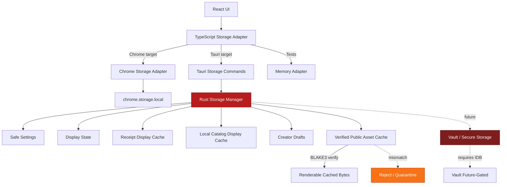
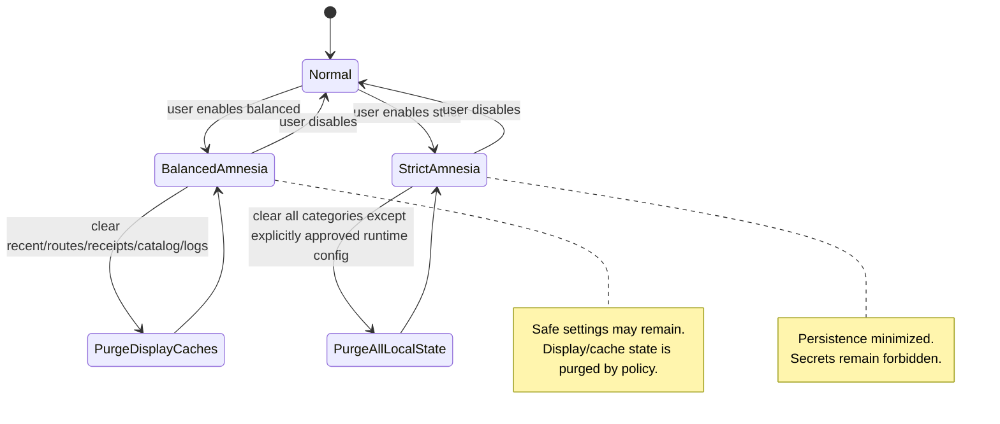

````markdown id="x72xvj"
---
title: STORAGE_AND_SETTINGS_IDB
version: 0.1.0
status: draft
last-updated: 2026-05-17
audience: contributors, app engineers, RustyOnions service owners, security reviewers, ops, auditors
repo-target: crablink
primary-app-target: apps/crablink-tauri
related-blueprints:
  - CRABLINK_TAURI_IDB.MD
  - SECURITY_NOTES_CRABLINK_TAURI.MD
  - TAURI_MIGRATION_IDB.MD
  - RUN_STACK_AND_MODES_IDB.MD
  - TAURI_COMMAND_BRIDGE_IDB.MD
  - CRAB_URL_AND_DEEP_LINK_IDB.MD
  - PAID_ACTIONS_AND_RECEIPTS_IDB.MD
  - PASSPORT_WALLET_VAULT_IDB.MD
  - OFFLINE_CACHE_IDB.MD
  - MEDIA_TAURI_IDB.MD
  - SIDECAR_LOCAL_NODE_IDB.MD
  - TESTING_MATRIX_TAURI_IDB.MD
---

# STORAGE_AND_SETTINGS_IDB

RO:WHAT — Defines CrabLink Tauri’s settings, local state, display caches, persistence categories, adapter boundaries, amnesia behavior, wipe/export controls, and storage security rules.

RO:WHY — Tauri gives CrabLink real local persistence and native filesystem access. That power must be separated into safe preferences, display caches, verified public cache, future encrypted private cache, and future vault storage so local state never becomes fake backend truth.

RO:INTERACTS — React UI, TypeScript storage adapters, Tauri Rust settings commands, platform app data directories, future secure storage adapter, future offline cache verifier, future vault adapter, local catalog, recent receipts display cache, gateway client, paid gates, svc-gateway, svc-wallet, ron-ledger, svc-storage, svc-index, svc-passport, ron-auth, ron-kms.

RO:INVARIANTS — Memory-first by default. Persist only explicit categories. Settings are not wallet truth. Local catalog is not index truth. Receipt display cache is not receipt truth. Last-known balance display is not ledger truth. Offline bytes must be b3-verified before render. Secrets never live in React state, TypeScript state, localStorage, plaintext settings, logs, URLs, or diagnostics. Vault/private key custody requires a separate IDB.

RO:METRICS — Settings read/write result, storage backend selected, migration result, cache category sizes, wipe counts, amnesia purge counts, cache integrity failures, receipt cache stale reads, local catalog stale reads, secure storage availability, and redaction events.

RO:CONFIG — Storage backend, run mode, gateway endpoint, developer mode, amnesia mode, persistence categories, cache quotas, retention windows, diagnostics visibility, import/export policy, wipe policy, secure storage availability, and platform feature flags.

RO:SECURITY — Safe settings and secrets are separate. React reads safe settings only. Tauri Rust mediates native persistence. Platform secure storage is used only after vault/security gates. Cache data is source-labeled and never upgrades into backend truth. Amnesia mode disables or purges persistence categories by policy.

RO:TEST — Settings adapter tests, migration tests, no-secret-storage tests, redaction tests, amnesia wipe tests, cache quota tests, b3 verification tests, stale label tests, local catalog truth-boundary tests, receipt display cache tests, and platform storage smoke tests.

---

## 0. Status

This blueprint defines how CrabLink Tauri stores local data.

It answers:

```text
What can be persisted?
What stays memory-only?
What belongs in safe settings?
What belongs in display cache?
What belongs in verified public cache?
What belongs in encrypted private cache?
What belongs in the future vault?
What must never be stored?
How do Chrome storage and Tauri storage share one product model?
How do we support amnesia mode?
How do we avoid fake backend truth?
````

The central rule:

```text id="43cwqk"
Local state may improve UX.
Local state must not become backend truth.
```

---

## 1. Invariants (MUST)

### [I-1] Memory-first runtime by default

CrabLink Tauri should start from a memory-first posture.

Default runtime state:

```text id="89njf2"
current route
current page state
in-flight requests
temporary form state
selected tab
open drawer/modal state
last command result
transient paid gate state
transient upload draft state
```

This state should be lost on app restart unless explicitly saved under a named persistence category.

---

### [I-2] Persistence must be explicit by category

No generic “dump the app state to disk” behavior.

Every persistent value must belong to one category:

```text id="p3h3y2"
safe_settings
display_state
recent_routes
recent_receipts_display_cache
local_catalog_display_cache
creator_drafts
verified_public_asset_cache
encrypted_private_cache_future
vault_future
sidecar_runtime_state
diagnostic_logs
migration_state
```

Each category must define:

```text id="zalgeq"
purpose
allowed fields
forbidden fields
storage backend
retention
wipe behavior
export behavior
amnesia behavior
source/truth label
```

---

### [I-3] Safe settings are not secrets

Safe settings may include:

```text id="x27q87"
gateway URL
request timeout
run mode
theme
developer mode
require spend confirmation
default starting route
last opened route if enabled
safe passport display label
safe wallet account label
preferred route source
diagnostics visibility
```

Safe settings must not include:

```text id="xmj7jx"
private keys
seed phrases
wallet signing material
raw capability tokens
uncapped spend authority
vault unlock secrets
sidecar auth secrets
OAP session keys
private main→alt mappings
ledger truth
receipt truth
ownership truth
```

---

### [I-4] Gateway endpoint is a setting, not a hardcoded constant

CrabLink Tauri must support configured gateway endpoints.

Examples:

```text id="ugzrt7"
http://127.0.0.1:8090
https://gateway.example
https://selfhosted.example
https://lan-gateway.local
```

Rules:

```text id="sh0i3b"
- Localhost is valid for Local Dev Stack Mode.
- Localhost is not hardcoded as product destiny.
- Endpoint changes are user/developer-visible.
- Endpoint is shown in diagnostics.
- Remote production-like endpoints should prefer HTTPS.
```

---

### [I-5] Local labels are convenience state only

The app may store safe labels like:

```text id="c5zslg"
passport subject label
wallet account label
requested username
confirmed public handle
profile crab URL
public profile CID if backend-confirmed
last identity check timestamp
```

These labels are not:

```text id="tr9gxk"
passport private key
wallet private key
spend permission
identity proof
current backend truth
```

UI must label stale or local draft fields honestly.

---

### [I-6] Last-known balance display is not ledger truth

The app may store display metadata for UX:

```text id="y7sac4"
last balance display string
last balance source
last balance refreshed timestamp
last balance ledger-backed flag if backend supplied it
last balance unavailable reason
```

Rules:

```text id="yd94xg"
- Local balance display is stale unless freshly refreshed.
- It must not be used to authorize spending.
- It must not be used as current wallet truth.
- It must not be used to unlock paid content.
- Backend wallet/ledger path remains authoritative.
```

---

### [I-7] Receipt display cache is not receipt truth

The app may store recent receipt metadata for user convenience.

Allowed:

```text id="admbz6"
receipt ID
receipt hash
action kind
asset kind
crab URL
b3 CID
display amount
created timestamp
source
status label
safe summary
```

Forbidden:

```text id="yieclu"
forged receipt
receipt signing key
spend authority
private wallet key
raw unredacted authorization headers
receipt cache as paid unlock proof without backend/access validation
```

Receipt display cache must be labeled:

```text id="qglb3o"
display cache
last known
backend-derived when fetched
not durable economic truth
```

---

### [I-8] Local catalog is not index truth

The app may store a local catalog for UX:

```text id="3o1fpq"
recently opened assets
recently created assets
recently opened sites
recently created sites
draft profile/library entries
local display summaries
```

The local catalog must not claim:

```text id="hbrveh"
global index truth
ownership truth
provider truth
current payout truth
current moderation truth
current popularity truth
```

Global lookup truth belongs upstream in:

```text id="xgbiy5"
svc-index
ron-naming
svc-gateway
omnigate
```

---

### [I-9] Creator drafts are local drafts until published

Creator drafts may include:

```text id="d7x9oi"
image draft metadata
site draft metadata
post draft
comment draft
article draft
video/music/podcast/stream draft metadata
manifest form state
tags
description
local preview state
```

Rules:

```text id="so1pq7"
- Drafts are not published assets.
- Drafts have no b3 content ID until bytes/manifest are actually stored.
- Drafts have no receipt until backend returns one.
- Drafts have no ownership proof until backend/index/manifest confirms it.
- Drafts may be wiped by user action.
```

---

### [I-10] Verified public asset cache requires b3 verification

Before rendering bytes from cache:

```text id="ordw50"
read bytes
compute BLAKE3
compare to requested b3:<hash>
render only if match
reject/quarantine if mismatch
```

Rules:

```text id="e5yazi"
- Cache metadata cannot override b3 truth.
- Cache path cannot imply ownership.
- Cache hit cannot imply paid access unless valid access proof exists.
- Cache hit cannot imply current name resolution.
```

---

### [I-11] Encrypted private cache is future-gated

Encrypted private cache may later support:

```text id="dgf56q"
private drafts
private offline files
encrypted profile data
encrypted wallet/passport adjunct state
private app notes
```

But it requires:

```text id="w9sgtt"
SECURITY_AND_AMNESIA_IDB.MD
PASSPORT_WALLET_VAULT_IDB.MD
OFFLINE_CACHE_IDB.MD if asset cache is involved
platform secure storage adapter
key lifecycle design
wipe/export/recovery policy
```

Until then, private encrypted cache is disabled or stubbed truthfully.

---

### [I-12] Vault storage is separate from settings storage

Vault is future security-sensitive storage.

Vault may eventually store:

```text id="ta2sww"
passport private keys
device-bound keys
encrypted capability material
wallet-linked permission grants
platform secure storage handles
```

Vault must not be implemented by:

```text id="8awqle"
plain JSON settings
React state
TypeScript localStorage
unredacted files
debug logs
receipt cache
local catalog
```

Vault requires `PASSPORT_WALLET_VAULT_IDB.MD`.

---

### [I-13] Dev token handling is constrained

During development, the app may hold a dev token or dev bearer label only as a local development convenience.

Rules:

```text id="h47caz"
- Dev token is dev-only.
- Dev token is redacted in UI.
- Dev token is redacted in logs.
- Dev token must be clearable.
- Dev token must not be treated as production spend authority.
- Dev token must not be exported accidentally.
```

Production-grade capabilities require a separate capability/vault design.

---

### [I-14] Amnesia mode must be real, not decorative

When amnesia mode is enabled, the app must either disable or purge configured persistence categories.

Amnesia mode should affect:

```text id="mx0vya"
recent routes
display caches
receipt display cache
local catalog
creator drafts
diagnostic logs
private cache
sidecar runtime state
temporary tokens
```

Safe settings may be handled by policy:

```text id="pgn5k5"
strict amnesia: persist nothing except explicit user-approved endpoint
balanced amnesia: persist safe settings only
dev amnesia: keep dev endpoint, clear volatile state
```

The chosen policy must be visible.

---

### [I-15] Wipe controls are required

The app must provide wipe operations by category.

Required wipe categories:

```text id="ucj3b6"
clear_recent_routes
clear_recent_receipts
clear_local_catalog
clear_creator_drafts
clear_verified_asset_cache
clear_diagnostic_logs
clear_safe_settings
clear_all_local_state
```

Future wipe categories:

```text id="dwx7j0"
lock_vault
wipe_vault
clear_encrypted_private_cache
reset_sidecar_state
```

Dangerous wipe operations require explicit confirmation.

---

### [I-16] Export controls must be explicit

Exportable categories:

```text id="wca4k2"
safe settings
creator drafts
local catalog display summaries
recent receipts display metadata
diagnostic bundle with redaction
```

Non-exportable by default:

```text id="wroprt"
private keys
seed phrases
raw capabilities
spend authority
vault secrets
sidecar auth tokens
raw private cache
private main→alt mapping
```

Any future secret export requires vault-specific design and warnings.

---

### [I-17] Storage migrations must be versioned

Every persisted schema must include:

```text id="a0v1r5"
schema
version
created_at or updated_at where useful
source
```

Migrations must be:

```text id="tlo59k"
idempotent
bounded
backup-aware where needed
redacted
testable
safe to retry
```

If migration fails, app must not fake successful state.

---

### [I-18] Chrome storage and Tauri storage share one conceptual contract

Chrome extension storage and Tauri storage use different backends but the same doctrine.

Shared conceptual categories:

```text id="5pj9lc"
safe settings
display cache
recent receipts
local catalog
drafts
diagnostics
```

Target-specific backend:

```text id="ervavu"
Chrome: chrome.storage.local
Tauri: Rust-mediated settings store / app data directory / future secure storage
Tests: memory adapter
```

Shared React should talk to adapter contracts, not platform storage directly.

---

### [I-19] Storage adapter must be target-owned

Shared React code must not directly import:

```text id="2sk8mt"
chrome.storage
localStorage for authority
@tauri-apps/api/store
filesystem APIs
secure storage APIs
```

Instead:

```text id="tcnxfz"
React
→ TypeScript storage adapter
→ Chrome adapter or Tauri command adapter
→ target storage backend
```

---

### [I-20] Storage must never bypass run-mode rules

Changing local settings must not secretly change trust boundaries.

Examples:

```text id="gpliy3"
setting gateway_url changes endpoint only
setting run_mode changes diagnostics/route selection only through policy
setting sidecar_enabled must not auto-start without sidecar gates
setting oap_enabled must not enable React OAP frames
setting amnesia_mode must purge/disable configured categories
```

---

## 2. Design Principles (SHOULD)

### [P-1] Treat storage as a product safety system

Storage is not just persistence.

It controls:

```text id="c6iz16"
what users trust
what state survives restart
what can leak
what can be stale
what can be wiped
what can be exported
what can be recovered
```

Therefore every stored value should have a reason.

---

### [P-2] Prefer memory unless persistence improves user control

Persist because:

```text id="vx8i5a"
the user expects it
restart would be painful
offline mode needs it
the user explicitly saves a draft
the user explicitly opts into cache
the user wants diagnostics
```

Do not persist because:

```text id="kvqsv8"
it is easy
the framework makes it easy
we might need it later
debugging is convenient
```

---

### [P-3] Show source labels everywhere stale state appears

Examples:

```text id="de801y"
Backend-confirmed
Last known
Local draft
Local display cache
Offline b3-verified
Fixture/dev only
Unavailable
```

This avoids confusing local state with backend truth.

---

### [P-4] Separate “safe label” from “authority”

A wallet account label is not spend authority.

A passport subject label is not a private key.

A receipt row is not durable receipt truth.

A gateway URL is not a trust guarantee.

---

### [P-5] Make amnesia mode a first-class runtime posture

Amnesia should be part of settings, diagnostics, testing, and wipe behavior.

It should not be a marketing label.

---

### [P-6] Use platform adapters for cross-platform storage

Storage must work across:

```text id="55rjhh"
desktop macOS
desktop Windows
desktop Linux
future iOS
future Android
```

Platform quirks belong in adapters.

---

### [P-7] Keep Chrome proof client green

The Chrome extension remains proof/companion.

Do not break:

```text id="k0s4so"
chrome.storage local behavior
gateway URL setting
identity/wallet display labels
recent receipts
local catalog proof
check-chrome script
react lane checks
```

---

### [P-8] Do not overbuild vaults in this blueprint

This blueprint may reserve the vault boundary.

It must not implement passport private-key custody.

Vault design belongs in:

```text id="gs5cti"
PASSPORT_WALLET_VAULT_IDB.MD
```

---

### [P-9] Local indexes/catalogues are UX accelerators only

They are useful for:

```text id="6p90e4"
library page
recent assets
recent sites
draft workspace
quick reopen
offline browsing
```

They are not replacements for `svc-index`.

---

### [P-10] Prefer redacted diagnostic export

Diagnostics can help development.

But export bundles must redact:

```text id="0f81ny"
tokens
wallet-sensitive authority
private mappings
full local paths where unnecessary
raw private drafts unless user opts in
```

---

## 3. Storage Categories (HOW)

### [C-1] Category: `safe_settings`

Purpose:

```text id="zx5vln"
Persist non-secret app preferences and endpoint configuration.
```

Allowed:

```text id="485lse"
schema version
gateway URL
request timeout
run mode
theme
developer mode flag
require spend confirmation flag
default route
last route if enabled
preferred route source
diagnostics visibility
safe passport subject label
safe wallet account label
public handle display
```

Forbidden:

```text id="mnu9fh"
private keys
seed phrases
raw capabilities
spend authority
vault secrets
receipt truth
ledger truth
ownership truth
```

Storage backend:

```text id="3c934f"
Tauri: Rust-mediated settings file or app config store
Chrome: chrome.storage.local
Tests: memory adapter
```

Amnesia behavior:

```text id="wn8r06"
balanced: keep safe endpoint/theme settings
strict: clear all
```

---

### [C-2] Category: `display_state`

Purpose:

```text id="8l5ntg"
Remember harmless UI preferences.
```

Allowed:

```text id="u8d6fh"
sidebar open state
selected tab
card collapsed state
developer panel visibility
last selected route category
layout density
theme preference
```

Forbidden:

```text id="j6hsd5"
payment state
private route credentials
tokens
receipt proof authority
```

Retention:

```text id="1eyrce"
optional, user-controlled, wipeable
```

---

### [C-3] Category: `recent_routes`

Purpose:

```text id="j5m81f"
Help users reopen recently visited crab routes.
```

Allowed:

```text id="d2i9mj"
crab URL
route kind
opened timestamp
source label
safe page title if backend-derived
```

Forbidden:

```text id="22htqz"
secret query params
private file paths
tokens
spend confirmation flags
private main→alt mappings
```

Retention:

```text id="miwzec"
bounded count, default max 100
```

---

### [C-4] Category: `recent_receipts_display_cache`

Purpose:

```text id="jn1fsz"
Display recent backend-derived receipts for user convenience.
```

Allowed:

```text id="tmqj2k"
receipt ID
receipt hash
action kind
asset kind
crab URL
b3 CID
display amount
safe summary
created timestamp
source
backend-derived flag
```

Forbidden:

```text id="k1n4ga"
receipt signing keys
wallet private keys
spend authority
receipt forgery fields
unredacted authorization headers
```

Retention:

```text id="r7ktrv"
bounded count, default max 250
```

Important:

```text id="ouq98n"
Receipt display cache does not unlock paid content by itself.
```

---

### [C-5] Category: `local_catalog_display_cache`

Purpose:

```text id="pfjctd"
Power library UX and recent asset/site views.
```

Allowed:

```text id="4d4asz"
asset kind
crab URL
b3 CID
title
description
tags
owner display label if backend-derived
created/opened timestamp
last source
safe thumbnail pointer if verified
```

Forbidden:

```text id="sz53ad"
ownership truth claims
payout truth claims
provider truth claims
moderation truth claims
global popularity truth claims
```

Retention:

```text id="ba0kdz"
bounded count, configurable
```

---

### [C-6] Category: `creator_drafts`

Purpose:

```text id="k8e7ha"
Persist unfinished creator work when user opts in.
```

Allowed:

```text id="e41vfl"
draft type
title
description
tags
draft body text
manifest form fields
local file reference metadata
safe preview state
last edited timestamp
```

Forbidden:

```text id="8c9573"
private keys
spend authority
fake b3 content IDs
fake receipts
fake ownership proof
raw local file bytes unless explicit import/cache policy exists
```

Retention:

```text id="o27dnz"
user-controlled, wipeable, exportable
```

---

### [C-7] Category: `verified_public_asset_cache`

Purpose:

```text id="xtj5ua"
Support offline or faster rendering of public b3-addressed assets.
```

Allowed:

```text id="8tpajm"
bytes addressed by b3
content type
asset kind
verified b3 digest
fetched timestamp
source
size
cache metadata
```

Forbidden:

```text id="gygyvl"
unverified bytes
secret files
paid unlock proof by cache alone
ownership truth
name resolution truth
```

Verification:

```text id="ase4fx"
BLAKE3 verification required before render.
```

Retention:

```text id="vt9efd"
quota-bound, eviction policy required
```

Requires:

```text id="h5j59l"
OFFLINE_CACHE_IDB.MD before serious implementation
```

---

### [C-8] Category: `encrypted_private_cache_future`

Purpose:

```text id="ewbm4s"
Future encrypted local private data.
```

Status:

```text id="09vc55"
disabled until security/vault/offline cache gates exist
```

Possible future content:

```text id="kt0n4n"
private drafts
private profile notes
private offline assets
encrypted local user data
```

Requires:

```text id="dg3plt"
SECURITY_AND_AMNESIA_IDB.MD
PASSPORT_WALLET_VAULT_IDB.MD
OFFLINE_CACHE_IDB.MD if asset-related
```

---

### [C-9] Category: `vault_future`

Purpose:

```text id="m1re3w"
Future secure storage for passport/wallet authority material.
```

Status:

```text id="xigda3"
disabled until PASSPORT_WALLET_VAULT_IDB.MD
```

Potential future content:

```text id="raqmqz"
passport private keys
device keys
encrypted capability material
wallet-linked permission grants
```

Forbidden in current storage work:

```text id="g2jyg6"
seed phrases
raw private keys
production spend authority
vault secrets
```

---

### [C-10] Category: `sidecar_runtime_state`

Purpose:

```text id="ldcl36"
Future local node/sidecar lifecycle state.
```

Allowed after sidecar IDB:

```text id="5dbcbg"
profile
last status
last start timestamp
bounded logs
safe port map
safe health status
```

Forbidden:

```text id="c6t3fa"
wallet authority
ledger truth
raw local auth token in plaintext
unbounded logs
silent auto-start state
```

Requires:

```text id="0qrkfk"
SIDECAR_LOCAL_NODE_IDB.MD
```

---

### [C-11] Category: `diagnostic_logs`

Purpose:

```text id="7f979r"
Support debugging without leaking secrets.
```

Allowed:

```text id="xkk87d"
command names
route class
safe error code
correlation ID
source
timing
feature status
redacted endpoint
```

Forbidden:

```text id="vflszs"
tokens
private keys
seed phrases
wallet authority
private mappings
raw authorization headers
unredacted file paths where not needed
```

Retention:

```text id="r8rdqg"
short, bounded, user-clearable
```

---

## 4. Adapter Contracts (HOW)

### [A-1] TypeScript storage adapter interface

```ts id="mx2wud"
export interface StorageAdapter {
  backend(): Promise<StorageBackendInfo>;

  readSafeSettings(): Promise<SafeSettings>;
  writeSafeSettings(next: SafeSettings): Promise<SafeSettings>;
  resetSafeSettings(): Promise<SafeSettings>;

  readDisplayState(): Promise<DisplayState>;
  writeDisplayState(next: DisplayState): Promise<DisplayState>;

  readRecentRoutes(): Promise<RecentRoute[]>;
  writeRecentRoutes(next: RecentRoute[]): Promise<RecentRoute[]>;

  readRecentReceipts(): Promise<RecentReceiptDisplay[]>;
  writeRecentReceipts(next: RecentReceiptDisplay[]): Promise<RecentReceiptDisplay[]>;

  readLocalCatalog(): Promise<LocalCatalogSnapshot>;
  writeLocalCatalog(next: LocalCatalogSnapshot): Promise<LocalCatalogSnapshot>;

  clearCategory(category: StorageCategory): Promise<ClearStorageResult>;
  clearAllLocalState(options: ClearAllOptions): Promise<ClearStorageResult>;

  exportSafeBundle(options: ExportSafeBundleOptions): Promise<SafeExportBundle>;
}
```

---

### [A-2] Storage backend info

```ts id="yxcbxc"
export interface StorageBackendInfo {
  schema: "crablink.storage-backend.v1";
  target: "chrome" | "tauri" | "memory";
  backend: string;
  safeSettings: boolean;
  displayCache: boolean;
  verifiedAssetCache: boolean;
  secureStorage: boolean;
  amnesiaMode: boolean;
}
```

---

### [A-3] Storage categories enum

```ts id="n8gkz6"
export type StorageCategory =
  | "safe_settings"
  | "display_state"
  | "recent_routes"
  | "recent_receipts_display_cache"
  | "local_catalog_display_cache"
  | "creator_drafts"
  | "verified_public_asset_cache"
  | "encrypted_private_cache_future"
  | "vault_future"
  | "sidecar_runtime_state"
  | "diagnostic_logs";
```

---

### [A-4] Tauri storage command set

Initial commands:

```text id="w6n3pt"
storage_backend_info
read_safe_settings
write_safe_settings
reset_safe_settings
read_recent_receipts
write_recent_receipts
read_local_catalog
write_local_catalog
clear_storage_category
clear_all_local_state
export_safe_diagnostics_bundle
```

Future commands:

```text id="abtdxa"
verify_cached_b3
cache_public_asset
evict_cache_objects
vault_status
lock_vault
wipe_vault
```

---

### [A-5] Rust storage state layout

Suggested modules:

```text id="45rb7v"
apps/crablink-tauri/src-tauri/src/storage/
  mod.rs
  categories.rs
  safe_settings.rs
  display_state.rs
  recent_routes.rs
  recent_receipts.rs
  local_catalog.rs
  drafts.rs
  clear.rs
  export.rs
  migrations.rs
  amnesia.rs
  redaction.rs
  platform_paths.rs
```

Future modules:

```text id="zfrvkc"
  verified_cache.rs
  b3_verify.rs
  encrypted_private_cache.rs
  vault.rs
```

---

### [A-6] Safe settings shape

```ts id="fq5o0z"
export interface SafeSettings {
  schema: "crablink.safe-settings.v1";
  version: number;

  gatewayUrl: string;
  requestTimeoutMs: number;
  runMode: "gateway" | "local_dev_stack" | "gateway_rust_commands" | "oap_client" | "sidecar_node" | "offline_cache" | "mobile_gateway";

  theme: "system" | "dark" | "light";
  developerMode: boolean;
  requireSpendConfirm: boolean;

  defaultCrabUrl: string;
  lastCrabUrl?: string;

  passportSubjectLabel?: string;
  walletAccountLabel?: string;
  publicHandle?: string;
  publicProfileCrabUrl?: string;
  publicProfileCid?: string;

  diagnosticsVisible: boolean;
  amnesiaMode: boolean;
}
```

Rules:

```text id="4img43"
No private keys.
No raw capabilities.
No seed phrases.
No spend authority.
```

---

### [A-7] Recent receipt display shape

```ts id="dyfbvc"
export interface RecentReceiptDisplay {
  schema: "crablink.recent-receipt-display.v1";
  receiptId: string;
  receiptHash?: string;
  action: string;
  assetKind?: string;
  crabUrl?: string;
  b3Cid?: string;
  displayAmount?: string;
  source: "gateway" | "oap" | "sidecar" | "fixture";
  backendDerived: boolean;
  createdAt: string;
  cachedAt: string;
  stale: boolean;
}
```

Invariant:

```text id="4htlqg"
This is display metadata only.
```

---

### [A-8] Local catalog entry shape

```ts id="dnu9zq"
export interface LocalCatalogEntry {
  schema: "crablink.local-catalog-entry.v1";
  kind: "asset" | "site" | "profile" | "draft";
  crabUrl: string;
  b3Cid?: string;
  title?: string;
  description?: string;
  tags?: string[];
  source: "gateway" | "oap" | "cache" | "local_draft" | "fixture";
  backendConfirmed: boolean;
  cached: boolean;
  createdAt?: string;
  updatedAt?: string;
}
```

Invariant:

```text id="d04ig0"
Local catalog is UX state, not global index truth.
```

---

### [A-9] Clear category result shape

```ts id="i0tnfv"
export interface ClearStorageResult {
  schema: "crablink.clear-storage-result.v1";
  category: StorageCategory | "all";
  cleared: boolean;
  affectedCount?: number;
  safeMessage: string;
}
```

---

### [A-10] Amnesia policy shape

```ts id="g8lw6a"
export interface AmnesiaPolicy {
  schema: "crablink.amnesia-policy.v1";
  mode: "off" | "balanced" | "strict" | "dev";
  persistSafeSettings: boolean;
  persistRecentRoutes: boolean;
  persistRecentReceipts: boolean;
  persistLocalCatalog: boolean;
  persistCreatorDrafts: boolean;
  persistVerifiedPublicCache: boolean;
  persistDiagnosticLogs: boolean;
}
```

---

## 5. Platform Backends (HOW)

### [B-1] Chrome backend

Storage backend:

```text id="q57ilu"
chrome.storage.local
```

Allowed:

```text id="vl4bh1"
safe settings
display cache
recent receipts display cache
local catalog display cache
dev labels
```

Forbidden:

```text id="nwusnm"
private keys
seed phrases
production spend authority
raw unredacted tokens in logs
```

Purpose:

```text id="l2jnr2"
proof/companion client
```

---

### [B-2] Tauri desktop backend

Storage backend options:

```text id="zie8nj"
Rust-mediated JSON/TOML settings file for safe settings
app data directory for display caches
quota-managed cache directory for verified public assets
platform secure storage for future vault handles
```

Rules:

```text id="dcs4kn"
React never reads files directly.
TypeScript calls commands.
Rust owns paths.
Rust redacts errors.
Rust enforces category boundaries.
```

---

### [B-3] Tauri mobile backend

Storage backend considerations:

```text id="lrux3z"
platform app data directory
platform secure storage
mobile lifecycle purge behavior
no sidecar assumption
bounded cache
minimal background persistence
```

Rules:

```text id="2nxj74"
No desktop-only persistence assumptions in shared core.
```

---

### [B-4] Memory backend

Purpose:

```text id="ton6hg"
tests
fixtures
storybook/dev preview
HTTP preview fallback
```

Rules:

```text id="2fj737"
Memory backend must label data as fixture/dev-only when appropriate.
Memory backend must not hide that persistence is unavailable.
```

---

## 6. Migrations (HOW)

### [M-1] Chrome-to-Tauri conceptual migration

Do not blindly copy Chrome local storage into Tauri.

Migration should map:

```text id="izmyjk"
gatewayUrl              → safe_settings.gatewayUrl
requestTimeoutMs        → safe_settings.requestTimeoutMs
requireSpendConfirm     → safe_settings.requireSpendConfirm
devMode                 → safe_settings.developerMode
lastCrabUrl             → safe_settings.lastCrabUrl or recent_routes
recentReceipts          → recent_receipts_display_cache
passportSubject         → safe passport subject label
walletAccount           → safe wallet account label
publicProfileCid        → safe backend-derived display label if source is known
rocBalanceDisplay       → last-known display metadata, stale by default
```

Dev token migration:

```text id="ac4n3h"
Do not auto-migrate production-like tokens.
If imported for dev, mark as dev-only and redacted.
```

---

### [M-2] Schema versioning

Every persisted store should have:

```text id="8hgnor"
schema
version
updated_at
```

Migration record:

```ts id="u3ogqf"
export interface StorageMigrationRecord {
  schema: "crablink.storage-migration-record.v1";
  fromVersion: number;
  toVersion: number;
  startedAt: string;
  finishedAt?: string;
  status: "ok" | "failed" | "skipped";
  safeMessage: string;
}
```

---

### [M-3] Failed migration behavior

If migration fails:

```text id="et5pxb"
- Do not delete old data automatically.
- Do not pretend new settings exist.
- Show safe error.
- Offer export/clear options.
- Log redacted diagnostic.
```

---

## 7. Acceptance Gates (PROOF)

### [G-1] Storage doctrine gate

```text id="br1rvq"
[ ] STORAGE_AND_SETTINGS_IDB.MD exists.
[ ] Storage categories are defined.
[ ] Safe settings are separated from secrets.
[ ] Display cache is separated from backend truth.
[ ] Vault storage is marked future-gated.
[ ] Offline cache is marked b3-verification-gated.
[ ] Amnesia behavior is defined.
```

---

### [G-2] Adapter gate

```text id="lu3w57"
[ ] Shared React code uses storage adapter interface.
[ ] Chrome adapter uses chrome.storage.local.
[ ] Tauri adapter uses Rust commands.
[ ] Memory adapter exists for tests.
[ ] No shared core imports chrome.storage.
[ ] No shared core imports Tauri filesystem/store APIs.
[ ] Adapter reports backend info.
```

---

### [G-3] Safe settings gate

```text id="iyxzws"
[ ] gatewayUrl persists.
[ ] requestTimeoutMs persists.
[ ] runMode persists.
[ ] theme persists.
[ ] requireSpendConfirm persists and defaults true.
[ ] developerMode persists only as safe flag.
[ ] safe passport/wallet labels persist.
[ ] no private keys persist.
[ ] no seed phrases persist.
[ ] no spend authority persists.
```

---

### [G-4] Truth boundary gate

```text id="1t5ep1"
[ ] Last-known balance display is labeled stale unless refreshed.
[ ] Recent receipt cache is labeled display cache.
[ ] Local catalog is labeled local cache/draft where applicable.
[ ] Drafts are labeled unpublished.
[ ] Offline cache is labeled b3-verified or unverified/unavailable.
[ ] UI does not treat cache as backend truth.
```

---

### [G-5] Amnesia gate

```text id="h0rp99"
[ ] Amnesia mode setting exists or is truthfully stubbed.
[ ] Amnesia policy is visible in diagnostics.
[ ] Amnesia clears configured categories on request.
[ ] Amnesia clears configured categories on shutdown where policy requires.
[ ] Amnesia does not leave diagnostic logs with secrets.
[ ] Tests cover balanced and strict modes.
```

---

### [G-6] Wipe controls gate

```text id="39bwk1"
[ ] Clear recent routes works.
[ ] Clear recent receipts works.
[ ] Clear local catalog works.
[ ] Clear creator drafts works.
[ ] Clear diagnostic logs works.
[ ] Clear all local state works.
[ ] Dangerous wipe actions require confirmation.
[ ] Wipe does not call backend revoke/delete unless explicitly designed.
```

---

### [G-7] Export gate

```text id="k438xb"
[ ] Safe settings export exists or is explicitly deferred.
[ ] Diagnostic export is redacted.
[ ] Receipt display export is clearly labeled display cache.
[ ] Local catalog export is clearly labeled local catalog.
[ ] Secret export is forbidden until vault IDB.
```

---

### [G-8] Offline cache gate

```text id="jrwo4t"
[ ] Verified public cache is disabled or stubbed until OFFLINE_CACHE_IDB.MD.
[ ] If cache exists, bytes are BLAKE3-verified before render.
[ ] Cache has quota.
[ ] Cache mismatch rejects render.
[ ] Cache does not unlock paid content by itself.
```

---

### [G-9] Migration gate

```text id="3d4sem"
[ ] Chrome settings mapping is documented.
[ ] Tauri settings schema is versioned.
[ ] Migration is idempotent.
[ ] Failed migration is safe.
[ ] Dev token migration is redacted/dev-only.
[ ] Tests cover old settings shapes.
```

---

### [G-10] Platform gate

```text id="nzq1py"
[ ] Tauri desktop paths are Rust-owned.
[ ] React does not read local files.
[ ] Mobile storage limitations are documented.
[ ] Secure storage availability is reported.
[ ] Sidecar state is disabled or future-gated.
```

---

### [G-11] Security gate

```text id="chmvqw"
[ ] No raw token in settings export.
[ ] No raw token in diagnostics.
[ ] No private keys in safe settings.
[ ] No seed phrases in any current storage.
[ ] No spend authority in safe settings.
[ ] Redaction tests exist.
[ ] Storage errors are redacted.
```

---

## 8. Anti-Scope (Forbidden)

Forbidden in this storage/settings layer:

```text id="4tqktm"
- Dumping full app state to disk.
- Treating local storage as backend truth.
- Treating local catalog as svc-index truth.
- Treating receipt cache as durable receipt truth.
- Treating last-known balance as current ledger truth.
- Storing private keys in safe settings.
- Storing seed phrases anywhere in current implementation.
- Storing wallet signing material in React/TypeScript/plaintext files.
- Storing uncapped spend authority in settings.
- Storing raw capability tokens without vault design.
- Exporting secrets in diagnostic bundles.
- Logging secrets during storage failures.
- Using offline cache to unlock paid content by itself.
- Serving cached bytes without b3 verification.
- Auto-migrating dev tokens into production capability storage.
- Adding vault storage before PASSPORT_WALLET_VAULT_IDB.MD.
- Adding encrypted private cache before security/vault/cache gates.
- Adding sidecar state that silently starts services.
- Making mobile depend on desktop filesystem assumptions.
```

---

## 9. References

Primary references:

```text id="sa6uqo"
CRABLINK_TAURI_IDB.MD
SECURITY_NOTES_CRABLINK_TAURI.MD
TAURI_MIGRATION_IDB.MD
RUN_STACK_AND_MODES_IDB.MD
TAURI_COMMAND_BRIDGE_IDB.MD
CRAB_URL_AND_DEEP_LINK_IDB.MD
Pasted text.txt
NOTES.MD
CODEBUNDLE_CHROME_EXTENSION.md
CODEBUNDLE_RS.md
ALLNOTES.MD
ALL_DOCS_COMBINED.MD
NEXT_LEVEL.MD
QUICKCHAIN.MD
CODECHECK.md
CODECOMMENTS.MD
```

Existing Chrome storage lessons:

```text id="08p3he"
Chrome storage owns convenience settings.
It is not wallet truth.
It is not ledger truth.
It is not passport private-key custody.
It can store gateway URL, safe labels, display metadata, recent receipts, and local catalog display state.
```

Tauri storage direction:

```text id="75ai1n"
memory-first runtime
explicit persistence categories
Rust-mediated storage commands
platform adapters
amnesia behavior
future vault separate from settings
future offline cache b3-verified
```

---

## 10. Reviewer Checklist

Before approving storage/settings work:

```text id="ob1let"
[ ] Is this value safe to persist?
[ ] Which storage category owns it?
[ ] Is it backend truth or display/cache state?
[ ] Is stale state labeled?
[ ] Does it contain secrets?
[ ] Does React access it only through adapters?
[ ] Does Tauri Rust own filesystem paths?
[ ] Is wipe behavior defined?
[ ] Is export behavior defined?
[ ] Is amnesia behavior defined?
[ ] Is migration versioned?
[ ] Are errors redacted?
[ ] Does this avoid fake receipts?
[ ] Does this avoid fake balances?
[ ] Does this avoid fake b3 CIDs?
[ ] Does this avoid wallet/ledger authority?
[ ] Does this preserve Chrome proof client behavior?
[ ] Does this preserve mobile-forward architecture?
```

---

## 11. First Implementation Batch Recommendation

### Batch S1 — Storage adapter contract

Files likely to add:

```text id="u5ipkc"
packages/crablink-core/src/storage/storageTypes.ts
packages/crablink-core/src/storage/storageAdapter.ts
packages/crablink-core/src/storage/memoryStorageAdapter.ts

apps/crablink-tauri/src/adapters/storage/tauriStorageAdapter.ts
apps/crablink-tauri/src-tauri/src/storage/mod.rs
apps/crablink-tauri/src-tauri/src/storage/safe_settings.rs
apps/crablink-tauri/src-tauri/src/storage/categories.rs
apps/crablink-tauri/src-tauri/src/commands/storage.rs
```

Goal:

```text id="w6hymu"
Shared React talks to a storage adapter, not Chrome or Tauri APIs directly.
```

---

### Batch S2 — Safe settings

Initial persisted fields:

```text id="9pdl7e"
gateway URL
request timeout
run mode
theme
developer mode
require spend confirmation
default route
last route if enabled
safe passport label
safe wallet account label
diagnostics visible
amnesia mode
```

Gate:

```text id="xcb2ei"
No secrets in safe settings.
```

---

### Batch S3 — Display caches

Move behind adapters:

```text id="qjh6np"
recent receipts display cache
local catalog display cache
recent routes
```

Gate:

```text id="3t2lq1"
All display caches are labeled as local/stale/cache where appropriate.
```

---

### Batch S4 — Wipe controls

Add UI/command support:

```text id="n0rc22"
clear recent receipts
clear local catalog
clear recent routes
clear all local display state
```

Gate:

```text id="d4pnfy"
Clear local state does not call backend revoke/delete.
```

---

### Batch S5 — Amnesia mode stub

Initial behavior:

```text id="lqjfyd"
amnesia mode visible in diagnostics
strict mode clears volatile/display categories
balanced mode keeps safe settings only
```

Gate:

```text id="ovprsq"
Amnesia mode is truthful and tested.
```

---

## 12. Mermaid — Storage Boundary Diagram



---

## 13. Mermaid — Amnesia Mode Flow



---

## 14. Plain-English Summary

Storage in CrabLink Tauri should be simple and strict:

```text id="l2672j"
Save only what has a category.
Label everything that is local or stale.
Never turn cache into truth.
Never put secrets in settings.
Never unlock paid content from cache alone.
Use memory first.
Persist selectively.
Let users wipe local state.
```

Correct mental model:

```text id="38iajb"
Settings = preferences.
Display cache = convenience.
Local catalog = UX helper.
Drafts = unpublished work.
Verified cache = b3-checked bytes.
Vault = future secure authority boundary.
Backend = truth.
```

Most important rule:

```text id="8hjls5"
If it can spend, sign, unlock, prove ownership, or prove ledger truth,
it does not belong in normal settings storage.
```

```
```
