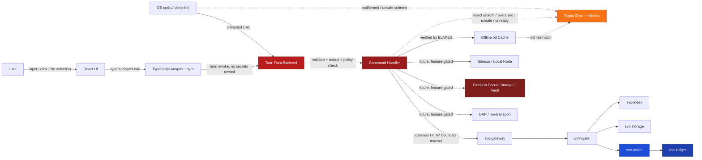
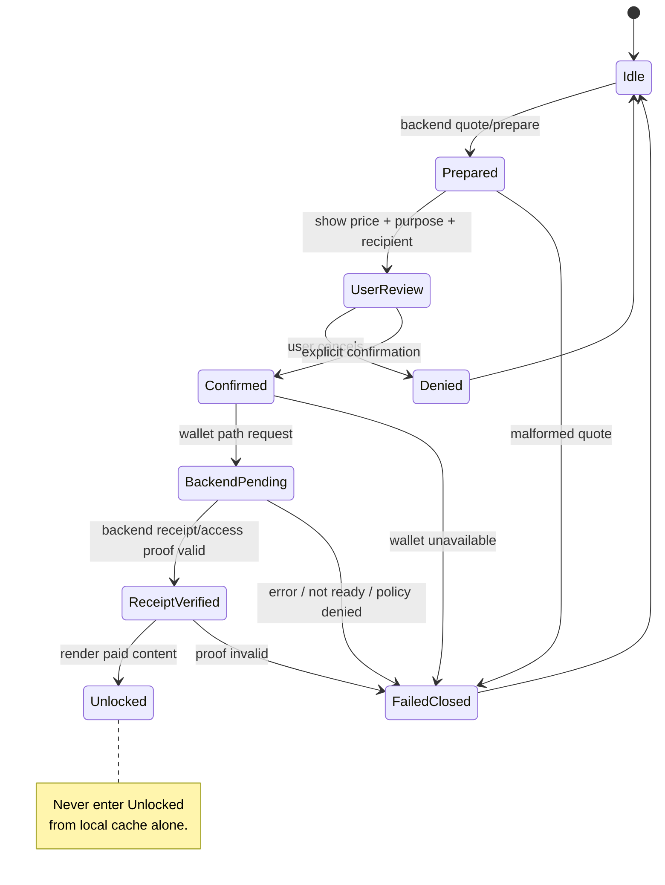
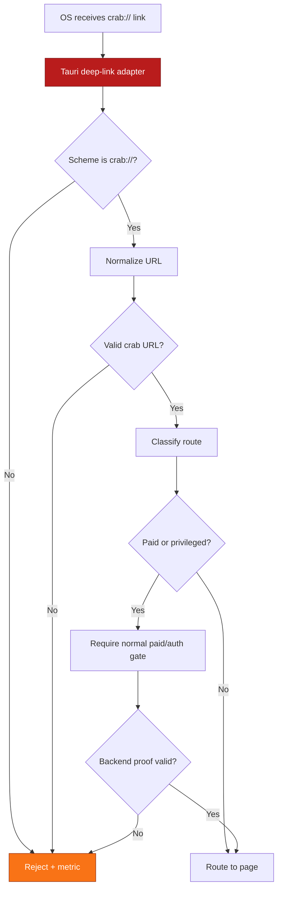
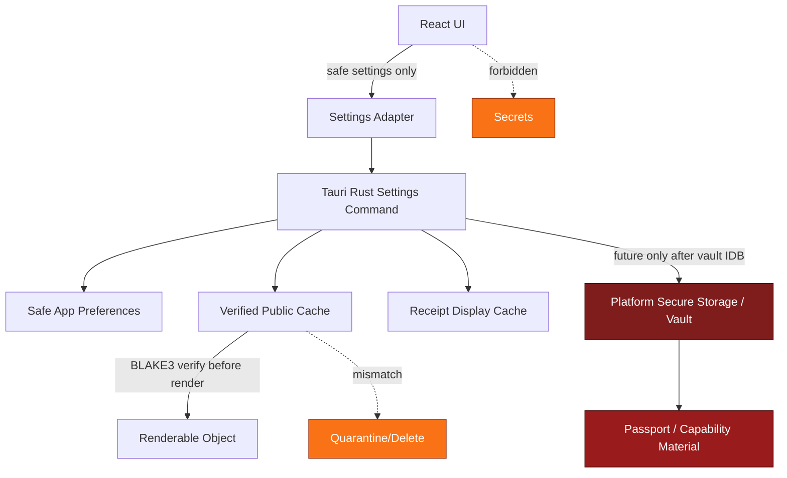
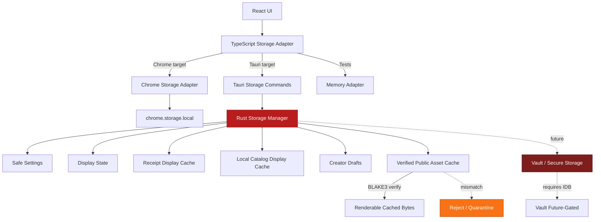
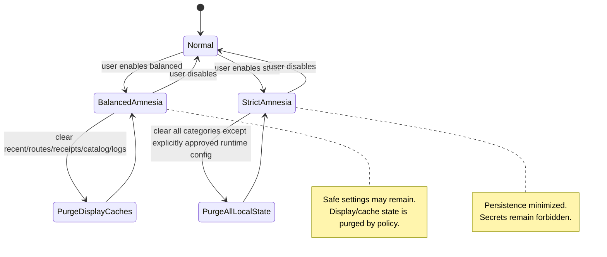

### The following are the combined IDBs we have created so far conveniently placed inside one markdown file to save space in the project folder of ChatGPT


````markdown
---
title: CRABLINK_TAURI_IDB
version: 0.1.0
status: draft
last-updated: 2026-05-17
audience: contributors, app engineers, RustyOnions service owners, security reviewers, ops, auditors
repo-target: crablink
primary-app-target: apps/crablink-tauri
related-repos:
  - RustyOnions
  - crablink
supersedes:
  - Chrome-extension-first CrabLink product direction
does-not-delete:
  - CrabLink Chrome Extension proof client
---

# CRABLINK_TAURI_IDB

RO:WHAT — Top-level invariant-driven blueprint for moving CrabLink from Chrome-extension-first to Tauri-first.

RO:WHY — The Chrome extension proved the UX/product loop, but the next phase needs native Rust capability: OAP/1 client integration, secure local persistence, native `crab://` deep links, media paths, local service orchestration, and desktop/mobile packaging.

RO:INTERACTS — CrabLink React app, Tauri Rust backend, TypeScript adapter layer, svc-gateway, omnigate, ron-app-sdk, oap, ron-proto, ron-naming, ron-policy, ron-auth, ron-kms, svc-passport, svc-wallet, ron-ledger, svc-storage, svc-index, svc-edge, svc-sandbox, svc-mod, micronode, macronode.

RO:INVARIANTS — Tauri is the primary client; Chrome extension becomes proof/companion. Gateway compatibility comes first. OAP is Rust-side only. b3 hashes are canonical. Wallet/ledger truth remains backend-owned. No fake balances, no fake receipts, no silent spend, no arbitrary code execution.

RO:METRICS — Future app telemetry must expose command latency, gateway/OAP path selection, deep-link open counts, paid-gate outcomes, receipt cache status, sidecar lifecycle state, offline cache verification, media transfer bounds, and redacted error classes.

RO:CONFIG — Tauri app config owns endpoint selection, gateway fallback, OAP enablement, sidecar enablement, amnesia mode, storage quota, cache policy, vault policy, media bounds, and platform feature flags.

RO:SECURITY — React owns display only. Tauri Rust owns privileged operations. Secrets never live in React state, localStorage, URL params, logs, or unredacted errors. Capabilities fail closed. Private alt/main relationships are not public.

RO:TEST — Desktop smoke, React unit tests, Rust command tests, gateway compatibility tests, deep-link tests, vault tests, OAP tests, paid-gate tests, offline cache tests, sidecar lifecycle tests, media bounds tests, mobile smoke, security regression tests.

---

## 0. Status

This blueprint is the first Tauri-native IDB for CrabLink.

It is not a request to write the full Tauri app immediately.

The correct sequence is:

```text
1. Lock this top-level Tauri IDB.
2. Create TAURI_MIGRATION_IDB.MD.
3. Scaffold the Tauri app.
4. Mount/reuse the existing React shell.
5. Preserve gateway HTTP route behavior first.
6. Move Chrome storage/settings behind adapters.
7. Preserve paid view gates.
8. Add native crab:// deep-link handling.
9. Add safe Rust command bridge for health/ready/resolve.
10. Add OAP_CLIENT_IDB.MD before serious OAP work.
11. Add PASSPORT_WALLET_VAULT_IDB.MD before real local authority.
12. Add MEDIA_TAURI_IDB.MD before serious media.
13. Add FACET_SANDBOX_IDB.MD before executable/game/code facets.
14. Add OFFLINE_CACHE_IDB.MD before trusted offline mode.
15. Add TESTING_MATRIX_TAURI_IDB.MD before broad platform work.
````

The goal is not to create a normal desktop wrapper.

The goal is:

```text
CrabLink Tauri = native Rust-backed RON client
```

---

## 1. Invariants (MUST)

### [I-1] Tauri is now the primary CrabLink product target

The Chrome extension remains valuable, but its role changes:

```text
Chrome extension:
  role: proof client / browser companion / gateway smoke client
  future work: maintenance, route proofing, small compatibility fixes

Tauri app:
  role: primary CrabLink native RON client
  future work: desktop-first, mobile-forward product development
```

The Tauri app must not be constrained by Chrome extension limitations.

---

### [I-2] Do not start from scratch

The existing React work is a proven asset.

Carry forward where practical:

```text
App shell
route registry
address bar
theme system
truth boundaries
asset pages
AssetContentViewAccess
AssetHydratedView
site render/sandbox concepts
profile scaffolds
passport drawer concepts
receipt panels
local catalog panels
creator workspace layouts
video/music/podcast/stream draft pages
code/facet pages
game/algo/ad pages
shared components
shared manifest builders
shared embed registry
```

Retire or adapt Chrome-only assumptions:

```text
chrome.storage
chrome.action
extension popup/options-only logic
host permissions
browser extension CSP assumptions
extension-only routing
Chrome packaging as the primary release path
```

---

### [I-3] React is display and orchestration, not authority

React may:

```text
render routes
collect user input
show backend-derived state
call TypeScript adapter functions
request Tauri commands
show confirmation dialogs
display receipts returned by backend truth
format values for humans
```

React must not:

```text
own private keys
own wallet truth
own ledger truth
invent balances
invent receipts
build OAP frames manually
mutate service state directly
bypass Tauri Rust command policy
store spend authority in browser-like storage
run arbitrary code from crab links
```

---

### [I-4] Tauri Rust backend is the native trust boundary

The Tauri Rust layer owns privileged local operations:

```text
command handlers
state manager
OAP client adapter
ron-app-sdk integration
vault adapter
platform secure storage adapter
local cache manager
sidecar/local node supervisor
deep-link handler
file/media adapters
redaction and error normalization
```

The Rust layer must remain modular. It must not become a hidden monolith that duplicates svc-wallet, ron-ledger, svc-storage, svc-index, omnigate, or svc-gateway.

---

### [I-5] Gateway compatibility comes first

The first Tauri milestone must preserve the currently proven route behavior through `svc-gateway`.

Initial Tauri networking should support:

```text
GET  /healthz
GET  /readyz
GET  /version where available
GET  /identity/me
GET  /wallet/:account/balance
GET  /crab/resolve?url=...
GET  /b3/<hash>.<kind>
GET  /sites/:name
POST /wallet/hold
POST /assets/image/prepare
POST /assets/image
POST /sites/prepare
POST /sites
POST /content/view or equivalent paid view route
```

The first Tauri app must not require OAP to be finished before it can render existing CrabLink routes.

---

### [I-6] OAP is Rust-side only

React must never manually construct OAP frames.

OAP rules:

```text
Tauri Rust commands/adapters may use OAP/1.
ron-proto carries DTOs.
ron-transport carries transport.
ron-policy decides rules.
svc-wallet and ron-ledger own economic truth.
OAP does not absorb app semantics.
OAP frame max is 1 MiB.
Preferred streaming DATA chunk posture is 64 KiB.
Oversized frames reject deterministically.
Buffers are bounded.
No locks across await.
```

---

### [I-7] b3 content IDs remain canonical

Every object, asset, manifest, and stored byte object must remain content-addressed.

Canonical internal form:

```text
b3:<64 lowercase hex>
```

Public typed asset form:

```text
crab://<64 lowercase hex>.<kind>
```

Examples:

```text
crab://<hash>.image
crab://<hash>.post
crab://<hash>.comment
crab://<hash>.article
crab://<hash>.video
crab://<hash>.music
```

Named site form:

```text
crab://<site_name>
```

Identity pointer form:

```text
crab://@username
```

Rules:

```text
Names are human pointers.
b3 hashes are canonical truth.
Storage stores bytes by content ID.
Ownership/payout/profile/manifest lookup belongs upstream in naming/index/gateway/omnigate.
```

---

### [I-8] ROC remains internal and backend-owned

The Tauri app must preserve the internal ROC value-plane rules:

```text
ROC remains internal.
No ROX in active app scope.
No Solana in active app scope.
No external settlement.
No staking.
No liquidity.
No exchange-facing logic.
No public bridge.
No chain logic inside CrabLink.
```

All ROC amounts used for truth must be integer ROC units from backend/service DTOs or compatible wire fields.

---

### [I-9] No silent spend

Every paid operation must require explicit user confirmation before spend authority is used.

Paid operations include:

```text
storage upload
image publish
site creation
site visit
content view
article view
post view
comment view
future music play
future video watch
future app/site access
future paid download
```

Rules:

```text
No hidden hold.
No hidden capture.
No hidden transfer.
No hidden subscription renewal.
No background spend from cached permissions.
No “unlock” unless backend receipt/access proof is valid.
```

---

### [I-10] Wallet mutation goes through svc-wallet

CrabLink Tauri must not mutate ledger state directly.

Allowed mutation front-door:

```text
svc-wallet
```

Durable truth:

```text
ron-ledger
```

Forbidden mutation owners:

```text
React
TypeScript SDK helpers
Tauri UI state
Tauri cache
Tauri local catalog
Tauri sidecar supervisor
svc-gateway
omnigate
svc-storage
svc-index
ron-accounting
svc-rewarder
passport logic
facet logic
media logic
```

svc-rewarder may plan deterministic payouts, but wallet/ledger commit remains separate.

---

### [I-11] No fake balances, receipts, profiles, reputation, or moderation truth

The app may cache display data, but cached data must be labeled as cached/stale when applicable.

Never invent:

```text
wallet balance
hold receipt
capture receipt
release receipt
content_view receipt
site_visit receipt
profile verification
reputation score
moderation role
payout address
ownership proof
provider proof
```

If backend truth is unavailable, the UI must show unavailable/degraded state.

---

### [I-12] Passports are identity/capability records, not wallets

The Tauri app may display and manage passport UX, but must preserve the model:

```text
Passport = identity/capability record
Wallet = account/economic authority
Profile = public display surface
Alt passport = pseudonymous identity with no public main linkage
```

Rules:

```text
A passport may link to a wallet permission.
A passport is not itself a wallet balance.
Alt passports do not automatically inherit main wallet authority.
Main→alt links are private unless explicitly designed otherwise.
Private alt mappings must not appear in public manifests.
```

---

### [I-13] Local vault work requires its own IDB

The top-level Tauri app may define the vault boundary, but must not implement real local key custody casually.

Before real local custody, create:

```text
PASSPORT_WALLET_VAULT_IDB.MD
SECURITY_AND_AMNESIA_IDB.MD
```

Until then:

```text
store safe labels only
use backend/dev identity bootstrap where needed
do not store seed phrases
do not store raw spend authority
do not store long-lived uncapped bearer tokens
```

---

### [I-14] Memory-first runtime, selective persistence

Default posture:

```text
memory-first runtime
explicit persistence categories
amnesia mode available
clear local state controls
no hidden disk spill for sensitive data
```

Persistence categories must be separated:

```text
safe UI preferences
gateway endpoint config
recent public routes
receipt display cache
offline public asset cache
encrypted private cache
passport/vault secrets
sidecar runtime state
debug logs
```

Each category needs explicit retention, wipe, and export policy.

---

### [I-15] Offline cache is never ownership truth

Offline cache may improve UX.

It must not become:

```text
ownership proof
wallet proof
ledger proof
receipt proof
profile proof
moderation proof
provider proof
```

Every cached object must be verified by b3 hash before serving from cache.

---

### [I-16] Deep links are native entry points, not authority bypasses

Native `crab://` handling must route into the same resolver and policy path as typed user navigation.

Rules:

```text
crab:// link opens Tauri app
link is normalized
link is classified
route policy applies
paid gates still apply
unsafe schemes are rejected
no command injection through URL
no local file read from crab URL
no secret passed in deep-link URL
```

---

### [I-17] Sidecars/local nodes are supervised, explicit, and bounded

The Tauri app may eventually supervise local services or node bundles.

Rules:

```text
sidecar disabled by default until implemented intentionally
explicit config controls sidecar mode
truthful health/ready state
bounded logs
bounded restarts
no silent privileged install
no direct ledger mutation by supervisor
no app-specific logic inside substrate crates
desktop first; mobile constraints respected
```

Sidecar/local node work requires a separate lifecycle/runbook section or IDB before production use.

---

### [I-18] Media must be bounded and honest

The Tauri app is allowed to become media-capable, but media must not bypass RustyOnions invariants.

Rules:

```text
no full-file buffering through Tauri commands for large media
range/segment paths preferred
b3 verification required
manifests define renditions
OAP/gateway media paths must be bounded
offline cache quota enforced
no fake DRM claims
no fake anti-rip guarantees
```

Serious media work requires:

```text
MEDIA_TAURI_IDB.MD
OFFLINE_CACHE_IDB.MD
OAP_CLIENT_IDB.MD
```

---

### [I-19] Facet/code/game/algo execution is forbidden until sandboxed

CrabLink Tauri must not run arbitrary code from crab links.

Before any executable/plugin/game/code facet:

```text
FACET_SANDBOX_IDB.MD must exist.
facet.toml contract must exist.
ron-policy allowlist must exist.
svc-sandbox role must be clear.
resource limits must be enforced.
network/wallet/profile/storage permissions must be explicit.
```

Default behavior:

```text
render as inert manifest/page
do not execute
do not eval JS/WASM
do not grant filesystem/network/wallet access
```

---

### [I-20] Desktop-first, mobile-forward

The first target is desktop, but architecture must not trap core logic in desktop-only APIs.

Rules:

```text
platform adapters isolate OS-specific behavior
mobile unsupported features degrade clearly
core route/render/payment logic remains portable
file dialogs/media APIs are adapter-owned
deep links use platform adapter
secure storage uses platform adapter
sidecar features may be desktop-only initially
```

---

### [I-21] Observability is part of the app contract

Tauri must expose truthful diagnostics for development and later operations.

Required diagnostic categories:

```text
app version
frontend build version
Rust backend version
gateway endpoint
gateway health/ready
OAP enabled/disabled
sidecar enabled/disabled
sidecar health/ready
cache mode
amnesia mode
vault mode
last route error
last paid gate outcome
```

No secrets in logs, metrics, crash dumps, or UI debug panels.

---

### [I-22] Errors are typed, redacted, and user-safe

The app must normalize errors across:

```text
React render errors
TypeScript adapter errors
Tauri invoke errors
Rust command errors
gateway HTTP errors
OAP errors
vault errors
sidecar errors
cache verification errors
deep-link parsing errors
```

Rules:

```text
no raw secrets in errors
no bearer tokens in logs
no private passport material in diagnostics
no wallet account IDs in high-cardinality metrics labels
no stack traces shown to normal users by default
developer diagnostics are opt-in
```

---

## 2. Design Principles (SHOULD)

### [P-1] Preserve the proven product loop before native expansion

The first Tauri app should prove:

```text
existing React shell loads
gateway health works
crab://home works
typed b3 asset pages render
paid view gates still work
receipt-driven unlocks still work
```

Only after that should it add native-specific features.

---

### [P-2] Use adapter boundaries, not rewrites

Preferred structure:

```text
apps/crablink-tauri/
  src/
    React app shell
    route registry
    pages
    shared UI
    TypeScript adapters

  src-tauri/
    Rust commands
    app state
    platform adapters
    gateway client
    future OAP adapter
    future vault adapter
    future sidecar supervisor

crablink-core/
  shared React components
  route registry
  asset renderers
  manifest builders
  truth boundaries
  shared DTO helpers
```

---

### [P-3] Keep route ownership clear

A page owns its page behavior.

Shared systems own cross-cutting behavior:

```text
route registry owns route classification
gateway client owns HTTP gateway calls
Tauri invoke adapter owns Rust command calls
truth boundary owns source labeling
paid gate owns confirmation flow
receipt panel owns receipt display
manifest builder owns manifest shape
```

Avoid patch-heavy global page scripts.

---

### [P-4] Prefer gateway fallback before native OAP

Tauri should start with the currently proven gateway contract, then add OAP behind a config switch.

Target path evolution:

```text
Bronze: gateway HTTP only
Silver: gateway HTTP + Rust command bridge
Gold: gateway HTTP + Rust-side OAP proof
Platinum: gateway/OAP selectable per route
Diamond: native RON client with sidecar/local-node options
```

---

### [P-5] Treat local state as convenience unless cryptographically verified

Local state can make the app pleasant.

It must be labeled and bounded.

Examples:

```text
recent routes
recent receipts display cache
local catalog
draft manifests
offline public assets
last known balance display
```

These are not truth unless verified by backend or cryptographic proof.

---

### [P-6] Make paid UX boring, explicit, and consistent

Every paid flow should feel the same:

```text
quote/prepare
show price and recipient/purpose
user confirms
wallet hold/transfer/capture via backend
receipt returned
unlock only after proof
receipt stored in recent receipts display cache
balance refresh requested
```

No “magic spend” UX.

---

### [P-7] Keep Tauri commands small and typed

Tauri commands should be narrow:

```text
health_check
ready_check
resolve_crab_url
get_asset_page
prepare_paid_action
confirm_wallet_hold
get_wallet_balance
open_deep_link
read_safe_setting
write_safe_setting
verify_cached_b3
```

Avoid giant commands like:

```text
doEverythingForPage()
runNativeBrowser()
mutateWalletAndRender()
```

---

### [P-8] Make mobile constraints visible early

Mobile may not support every desktop feature.

Examples likely desktop-first:

```text
sidecar/local node
large local cache
developer diagnostics
advanced file watching
some media filesystem flows
```

Do not let those become hard requirements for core route rendering.

---

### [P-9] Use feature gates for risky layers

Feature-gate:

```text
OAP native client
sidecar supervisor
local vault
offline encrypted cache
media streaming
facet execution
developer diagnostics
experimental mobile behavior
```

Default disabled until acceptance gates are green.

---

### [P-10] Document truth boundaries in the UI

The UI should make source of truth understandable:

```text
backend-confirmed
gateway-derived
OAP-derived
cached display
offline verified by b3
unverified local draft
dev fallback
unavailable
```

Users and developers should not confuse local display cache with durable truth.

---

## 3. Implementation (HOW)

### [C-1] Proposed repository layout

```text
crablink/
  apps/
    crablink-tauri/
      package.json
      index.html
      vite.config.ts

      src/
        main.jsx
        app/
          App.jsx
          router.js
          routeRegistry.js
          appState.js
          appEvents.js
          settings.js
          shell/
          pages/
          shared/

        adapters/
          gateway/
            gatewayClient.ts
            routeContracts.ts
          tauri/
            invokeClient.ts
            commands.ts
            deepLinks.ts
            settingsStore.ts
            platform.ts
          storage/
            settingsAdapter.ts
            localCatalogAdapter.ts
            receiptCacheAdapter.ts

      src-tauri/
        Cargo.toml
        tauri.conf.json
        src/
          main.rs
          app_state.rs
          commands/
            mod.rs
            health.rs
            resolve.rs
            settings.rs
            cache.rs
            wallet.rs
          gateway/
            mod.rs
            client.rs
            errors.rs
          oap_client/
            mod.rs
            disabled.rs
          platform/
            mod.rs
            deep_link.rs
            secure_store.rs
            file_dialog.rs
          sidecar/
            mod.rs
            disabled.rs
          security/
            mod.rs
            redact.rs
            amnesia.rs
          metrics/
            mod.rs

  packages/
    crablink-core/
      src/
        routeRegistry/
        components/
        truthBoundary/
        manifests/
        embeds/
        paidGates/
        receipts/
        catalog/
```

This structure is a direction, not a forced one. The invariant is the boundary separation.

---

### [C-2] Frontend adapter contract

React should call a TypeScript adapter, not raw Tauri APIs everywhere.

Example shape:

```ts
export type ResolveSource = "gateway" | "tauri-command" | "oap" | "cache";

export interface CrabResolveRequest {
  url: string;
  sourcePreference?: ResolveSource;
  correlationId?: string;
}

export interface CrabResolveResult {
  schema: "crablink.resolve-result.v1";
  url: string;
  canonicalUrl?: string;
  source: ResolveSource;
  status: "ok" | "not_found" | "policy_denied" | "not_ready" | "error";
  payload?: unknown;
  problem?: CrabProblem;
  backendConfirmed: boolean;
  cached: boolean;
}
```

Rules:

```text
React consumes ResolveResult.
React does not know whether gateway or OAP was used internally unless source is displayed.
Errors are typed and redacted before reaching components.
```

---

### [C-3] Tauri command naming pattern

Command names should be boring and explicit:

```rust
health_check
ready_check
resolve_crab_url
get_gateway_config
set_gateway_config
get_wallet_balance
prepare_paid_action
verify_b3_cached_object
open_external_safe
clear_cache_category
```

Avoid ambiguous names:

```rust
run
execute
handle
process
do_native
```

---

### [C-4] Rust command result envelope

All Tauri Rust commands should return a stable envelope.

```rust
#[derive(Debug, serde::Serialize)]
#[serde(rename_all = "snake_case")]
pub struct CommandOk<T> {
    pub schema: &'static str,
    pub correlation_id: String,
    pub source: CommandSource,
    pub data: T,
}

#[derive(Debug, serde::Serialize)]
#[serde(rename_all = "snake_case")]
pub struct CommandProblem {
    pub schema: &'static str,
    pub correlation_id: String,
    pub code: String,
    pub message: String,
    pub retryable: bool,
    pub source: CommandSource,
}

#[derive(Debug, serde::Serialize)]
#[serde(rename_all = "snake_case")]
pub enum CommandSource {
    Gateway,
    Oap,
    Cache,
    Vault,
    Sidecar,
    Platform,
}
```

Rules:

```text
Do not expose raw anyhow/debug errors to React.
Do not include secrets in message.
Use correlation IDs across frontend, Tauri, gateway, and OAP where possible.
```

---

### [C-5] Gateway-first implementation pattern

Initial Tauri commands may wrap gateway routes.

```text
React
→ TS adapter
→ Tauri invoke(resolve_crab_url)
→ Rust gateway client
→ svc-gateway
→ omnigate/services
→ typed result
→ React render
```

This preserves proven behavior while moving privileged networking into Rust.

The app may also temporarily allow direct TypeScript gateway calls during migration, but the target should be adapter-owned and command-capable.

---

### [C-6] OAP-later implementation pattern

Future OAP path:

```text
React
→ TS adapter
→ Tauri invoke(resolve_crab_url)
→ Rust route policy
→ ron-app-sdk / OAP adapter
→ ron-transport
→ RustyOnions service/node
→ typed result
→ React render
```

OAP-specific IDB must define:

```text
frame bounds
streaming chunk posture
timeouts
backpressure
capability passing
DTO mapping
error taxonomy
gateway fallback
media transfer strategy
```

---

### [C-7] Settings adapter pattern

Replace Chrome storage with a storage interface.

```ts
export interface CrablinkSettingsStore {
  getSettings(): Promise<CrablinkSettings>;
  saveSettings(next: CrablinkSettings): Promise<CrablinkSettings>;
  resetSettings(): Promise<CrablinkSettings>;
  clearLocalIdentityLabels(): Promise<void>;
}
```

Adapters:

```text
ChromeSettingsStore     used by extension
TauriSettingsStore      used by Tauri app
MemorySettingsStore     used by tests
```

Rules:

```text
Settings are not wallet truth.
Settings are not ledger truth.
Settings are not private key storage.
```

---

### [C-8] Deep-link handling pattern

Native deep-link flow:

```text
OS opens crab://<target>
Tauri platform adapter receives URL
URL normalized by shared crab URL parser
route registry classifies URL
policy checks route type
existing route navigation opens page
paid gates still apply
```

Rejected inputs:

```text
non-crab unsafe schemes
malformed b3 hashes
uppercase/noncanonical b3 where strict canonical form required
path traversal attempts
file:// injection
javascript: URLs
data: URLs
secret-bearing URLs
```

---

### [C-9] Paid gate pattern

Every paid gate should preserve this flow:

```text
prepare/quote
→ render price/purpose/source
→ user confirmation
→ wallet operation through backend path
→ receipt/access proof
→ unlock/render
→ receipt display cache update
→ balance refresh
```

Never:

```text
unlock because local UI says paid
unlock because local cache says paid unless proof is still valid
auto-confirm a spend
hide recipient/purpose
```

---

### [C-10] Sidecar disabled stub

Before sidecar implementation, use explicit disabled modules.

```rust
pub enum SidecarMode {
    Disabled,
    DesktopDev,
    DesktopBundled,
}

pub struct SidecarStatus {
    pub mode: SidecarMode,
    pub available: bool,
    pub ready: bool,
    pub reason: Option<String>,
}
```

The app should be able to show:

```text
Sidecar: disabled
Gateway: ready
OAP: disabled
```

without pretending local node mode exists.

---

### [C-11] Offline cache verification pattern

Before serving cached bytes:

```text
read bytes
compute BLAKE3
compare to requested b3:<hash>
reject on mismatch
record cache_integrity_fail
delete/quarantine bad object
never render corrupted bytes
```

Cache metadata must not override content hash truth.

---

### [C-12] File header convention for paste-ready code

Every future full paste-ready file should keep RustyOnions header conventions.

Rust:

```rust
//! RO:WHAT — <what this file does>
//! RO:WHY — <why it exists>
//! RO:INTERACTS — <nearby modules/services>
//! RO:INVARIANTS — <hard rules>
//! RO:METRICS — <metrics/logs if any>
//! RO:CONFIG — <knobs/env/config if any>
//! RO:SECURITY — <secret/capability considerations>
//! RO:TEST — <unit/smoke/fuzz/chaos hooks>
```

TypeScript/React:

```ts
/**
 * RO:WHAT — <what this file does>
 * RO:WHY — <why it exists>
 * RO:INTERACTS — <nearby modules/services>
 * RO:INVARIANTS — <hard rules>
 * RO:SECURITY — <secret/capability considerations>
 * RO:TEST — <unit/smoke hooks>
 */
```

---

## 4. Acceptance Gates (PROOF)

### [G-1] Bronze gate — Tauri shell preserves proven client behavior

Required:

```text
[ ] Tauri desktop app launches.
[ ] Existing React shell appears.
[ ] Route registry loads.
[ ] crab://home works.
[ ] crab://image works.
[ ] crab://site works.
[ ] crab://post page route still renders.
[ ] crab://comment page route still renders.
[ ] crab://article page route still renders.
[ ] Existing asset page components render.
[ ] Gateway endpoint can be configured.
[ ] Gateway health/ready status displays.
[ ] Chrome extension still builds as proof client.
```

Proof commands, draft:

```bash
cd /Users/mymac/Desktop/crablink
npm run tauri dev

cd /Users/mymac/Desktop/crablink
bash scripts/check-react-lane.sh
bash scripts/check-chrome.sh
```

---

### [G-2] Silver gate — Adapter migration

Required:

```text
[ ] Tauri settings adapter replaces chrome.storage in Tauri build.
[ ] Chrome settings adapter still exists for extension build.
[ ] Shared route registry works in both targets.
[ ] Shared truth boundary components work in both targets.
[ ] Shared paid gates work in both targets.
[ ] No direct chrome.* reference in Tauri runtime bundle.
[ ] No Tauri invoke usage leaks into Chrome build.
[ ] TypeScript adapter tests pass.
```

---

### [G-3] Silver gate — Rust command bridge

Required:

```text
[ ] health_check command exists.
[ ] ready_check command exists.
[ ] resolve_crab_url command exists or stubbed behind feature.
[ ] Commands return typed envelopes.
[ ] Errors are redacted.
[ ] Correlation ID flows through commands.
[ ] React can call commands safely.
[ ] No secrets in command errors.
```

---

### [G-4] Silver gate — Native deep link

Required:

```text
[ ] crab:// deep links open Tauri app on desktop dev platform.
[ ] Deep-link URL is normalized.
[ ] Malformed URL is rejected.
[ ] Paid gates still apply after deep-link open.
[ ] Deep link cannot trigger local file reads.
[ ] Deep link cannot pass secrets into logs.
```

---

### [G-5] Gold gate — Gateway/OAP split is explicit

Required:

```text
[ ] Gateway mode is default.
[ ] OAP mode is disabled until OAP_CLIENT_IDB exists.
[ ] Config exposes current route source.
[ ] UI labels source: gateway, OAP, cache, or unavailable.
[ ] No React OAP frame construction exists.
[ ] Rust OAP module is either absent or feature-gated.
```

---

### [G-6] Gold gate — Memory-first runtime and selective persistence

Required:

```text
[ ] Persistence categories are documented.
[ ] Clear cache controls exist for noncritical local data.
[ ] Amnesia mode switch exists or is stubbed truthfully.
[ ] Receipt display cache is labeled as cache.
[ ] Last known balance is labeled as stale unless refreshed.
[ ] No private keys are stored.
[ ] No seed phrase fields exist.
[ ] No long-lived uncapped spend token is stored.
```

---

### [G-7] Platinum gate — Vault design implemented only after vault IDB

Required before real local key custody:

```text
[ ] PASSPORT_WALLET_VAULT_IDB.MD exists.
[ ] SECURITY_AND_AMNESIA_IDB.MD exists.
[ ] Platform secure storage adapter exists.
[ ] Secrets are encrypted/sealed where persisted.
[ ] React never receives raw secret material.
[ ] Redaction tests pass.
[ ] Lock/unlock lifecycle is tested.
[ ] Main/alt separation is tested.
[ ] No public main→alt leakage.
```

---

### [G-8] Platinum gate — Offline cache is verified

Required:

```text
[ ] OFFLINE_CACHE_IDB.MD exists.
[ ] Cached objects are verified by BLAKE3 before render.
[ ] Cache quota enforced.
[ ] Cache eviction deterministic enough for tests.
[ ] Corrupted cache object is rejected.
[ ] Offline receipt display is clearly labeled.
[ ] Cache never overrides backend ownership truth.
```

---

### [G-9] Platinum gate — Media is bounded

Required before serious media:

```text
[ ] MEDIA_TAURI_IDB.MD exists.
[ ] Large media does not cross Tauri command boundary as full in-memory blob.
[ ] Range/segment path exists or is stubbed honestly.
[ ] b3 verification exists for media objects/manifests.
[ ] Playback errors are typed.
[ ] Offline media cache uses quota.
[ ] UI makes no fake DRM/anti-rip promises.
```

---

### [G-10] Diamond gate — Tauri becomes primary CrabLink client

Required:

```text
[ ] Desktop app is stable enough for daily local development.
[ ] Chrome extension remains green as proof/companion.
[ ] Gateway path works.
[ ] Rust command path works.
[ ] Native deep links work.
[ ] Paid gates work.
[ ] Receipt display works.
[ ] Passport/profile UX works against backend truth.
[ ] Offline verified cache works for safe public assets.
[ ] OAP proof path exists behind config.
[ ] Mobile architecture does not require rewrites of route/payment/core UI.
```

---

## 5. Anti-Scope (Forbidden)

The following are explicitly forbidden in this blueprint’s implementation phase:

```text
- Deleting or abandoning the Chrome extension before Tauri is green.
- Rewriting the React app from scratch without need.
- Putting wallet truth in React.
- Putting ledger truth in React.
- Storing private keys in React state.
- Storing seed phrases in localStorage.
- Storing uncapped spend authority in settings.
- Faking ROC balances.
- Faking receipts.
- Silent ROC spend.
- Direct ledger mutation from CrabLink.
- Direct ledger mutation from gateway.
- Direct ledger mutation from omnigate.
- Direct ledger mutation from storage/index/media/profile/facet logic.
- Chain/QuickChain implementation inside CrabLink.
- ROX/Solana/external settlement logic in active Tauri app.
- OAP frame construction in React.
- App semantics inside OAP.
- Storage semantics inside UI.
- Arbitrary JS/WASM execution from crab links.
- Public main→alt linkage by default.
- Privacy claims without real protocol support.
- Anti-rip/DRM claims that are not technically enforced.
- Unbounded queues.
- Unbounded media buffering.
- Full-file large media transfer through Tauri commands.
- Desktop-only APIs leaking into core route/payment logic.
- Sidecar auto-install or privileged launch without explicit design.
- High-cardinality sensitive metrics labels.
- Raw secrets in logs, crash dumps, or UI diagnostics.
```

---

## 6. References

Primary project references:

```text
Pasted text.txt
NOTES.MD
CODEBUNDLE_CHROME_EXTENSION.md
CODEBUNDLE_RS.md
ALLNOTES.MD
ALL_DOCS_COMBINED.MD
NEXT_LEVEL.MD
QUICKCHAIN.MD
CODECHECK.md
CODECOMMENTS.MD
```

Relevant doctrine carried into this IDB:

```text
Chrome extension is green proof client.
Tauri is primary native RON client.
Reuse existing React as much as possible.
Gateway compatibility comes first.
OAP is future Rust-side native path.
b3 hashes are canonical.
crab:// URLs are user-facing product pointers.
Sites are reference graphs.
Assets are b3-backed manifests/objects.
Passports are identity/capability records, not wallets.
Alt passports must not publicly link to main passports.
Wallet remains mutation front-door.
Ledger remains durable economic truth.
No fake balances.
No fake receipts.
No silent spend.
No arbitrary executable code from crab links.
QuickChain remains future blueprint only.
```

---

## 7. Reviewer Checklist

Before approving any Tauri batch, reviewers must confirm:

```text
[ ] Does this preserve the proven Chrome extension product loop?
[ ] Does this reuse React instead of rewriting unnecessarily?
[ ] Is every Chrome-only API behind an adapter?
[ ] Is every Tauri-only API behind an adapter?
[ ] Does React avoid secrets and wallet truth?
[ ] Do paid actions require explicit confirmation?
[ ] Are balances/receipts backend-derived or clearly labeled cache?
[ ] Are b3 IDs canonical?
[ ] Are crab URLs normalized and safe?
[ ] Are deep links treated as navigation, not authority?
[ ] Is OAP Rust-side only?
[ ] Are buffers bounded?
[ ] Are errors typed and redacted?
[ ] Does this avoid QuickChain/ROX/Solana scope?
[ ] Does this keep sidecar/local-node work explicit and supervised?
[ ] Does this avoid arbitrary code execution?
[ ] Does this preserve main/alt privacy?
[ ] Does this keep mobile-forward architecture possible?
```

---

## 8. Plain-English Summary

CrabLink Tauri is the next primary client for RustyOnions.

The Chrome extension proved:

```text
crab:// routing
b3 asset pages
paid content access
paid image/site/post/comment/article flows
receipt-driven unlocks
route-owned React UX
```

Tauri exists because the next phase needs:

```text
Rust command bridge
native deep links
secure local persistence
future OAP/1 client
future local vault
future local node/sidecar supervision
bounded media paths
desktop/mobile packaging
```

The first Tauri goal is not to invent a new product.

The first Tauri goal is:

```text
move the proven CrabLink product shell into a native Rust-backed app
without breaking RustyOnions invariants.
```

```
```


````markdown
---
title: Security Notes — CrabLink Tauri
app: crablink-tauri
repo: crablink
owner: Stevan White
last-reviewed: 2026-05-17
status: draft
target-path: apps/crablink-tauri/docs/SECURITY_NOTES.md
related-blueprints:
  - CRABLINK_TAURI_IDB.MD
  - TAURI_MIGRATION_IDB.MD
  - OAP_CLIENT_IDB.MD
  - PASSPORT_WALLET_VAULT_IDB.MD
  - SECURITY_AND_AMNESIA_IDB.MD
  - OFFLINE_CACHE_IDB.MD
  - MEDIA_TAURI_IDB.MD
  - FACET_SANDBOX_IDB.MD
---

# Security Documentation — CrabLink Tauri

RO:WHAT — Security notes for the CrabLink Tauri native app.

RO:WHY — The Tauri pivot moves CrabLink from a Chrome-extension proof client into a native Rust-backed RON client with a larger local trust boundary: Rust commands, platform storage, native deep links, future OAP, future local vault, media paths, offline cache, and sidecar/local-node supervision.

RO:INTERACTS — React UI, TypeScript adapter layer, Tauri Rust backend, platform adapters, svc-gateway, omnigate, ron-app-sdk, oap, ron-proto, ron-transport, ron-auth, ron-kms, svc-passport, svc-wallet, ron-ledger, svc-storage, svc-index, svc-edge, svc-sandbox, svc-mod, micronode, macronode.

RO:INVARIANTS — No fake ROC. No fake receipts. No silent spend. No wallet truth in UI. No direct ledger mutation from CrabLink. No arbitrary code execution from crab links. No public main→alt leakage. No secrets in React/TypeScript/localStorage/logs/deep links. OAP is Rust-side only. b3 hashes are canonical.

RO:METRICS — Security rejection metrics, command error class metrics, auth failure metrics, deep-link rejection metrics, cache integrity failure metrics, sidecar lifecycle security metrics, paid gate denial metrics, redaction regression metrics.

RO:CONFIG — App security posture is controlled by endpoint config, OAP enablement, sidecar enablement, amnesia mode, secure storage/vault mode, cache policy, debug mode, dev token policy, media caps, and platform feature flags.

RO:SECURITY — React is display/orchestration only. Tauri Rust owns privileged commands. Secrets never cross into UI state. Capabilities fail closed. Paid actions require explicit confirmation. Backend remains wallet/ledger truth.

RO:TEST — Unit tests, command tests, adapter tests, deep-link parser tests, redaction tests, cache verification tests, paid-gate tests, sidecar lifecycle tests, OAP frame tests, fuzz/property tests, mobile smoke, and destructive local-state wipe tests.

This document defines the **threat model**, **security boundaries**, and **hardening requirements** specific to `crablink-tauri`.

It complements the repo-wide RustyOnions hardening, interop, OAP, wallet/ledger, b3, passport, amnesia, and gateway-boundary rules.

---

## 0) Security Posture Summary

CrabLink Tauri is not just a UI wrapper.

It is a native RON client shell with three layers:

```text
React UI
→ TypeScript adapter layer
→ Tauri Rust backend
→ RustyOnions services / gateway / future OAP / future sidecar
````

The core security rule is:

```text
React displays.
TypeScript adapts.
Tauri Rust mediates privilege.
RustyOnions backend owns durable truth.
```

The Tauri app may eventually handle local capabilities, platform secure storage, offline b3 caches, and local node supervision, but it must not become a hidden wallet, ledger, storage service, index service, or policy engine.

Current safe default:

```text
gateway-compatible first
OAP disabled until OAP_CLIENT_IDB is implemented
sidecar disabled until sidecar lifecycle gates are implemented
vault disabled until PASSPORT_WALLET_VAULT_IDB is implemented
offline cache display-only until b3 verification gates are implemented
facet execution disabled until FACET_SANDBOX_IDB is implemented
```

---

## 1) Threat Model (STRIDE)

| Category                   | Threats                                                                                                                                                                                                                          | Relevant in `crablink-tauri`? | Mitigation                                                                                                                                                                                                                                                                                                      |
| -------------------------- | -------------------------------------------------------------------------------------------------------------------------------------------------------------------------------------------------------------------------------- | ----------------------------- | --------------------------------------------------------------------------------------------------------------------------------------------------------------------------------------------------------------------------------------------------------------------------------------------------------------- |
| **S**poofing               | Fake gateway, fake passport, fake wallet account, fake profile, fake creator identity, fake sidecar, spoofed `crab://` deep link, malicious local service pretending to be RustyOnions                                           | Yes                           | TLS where applicable, configured gateway allowlist, capability tokens/macaroons, backend-derived identity, signed/verified passport/profile data, sidecar binary verification before bundled mode, source labeling in UI, fail-closed capabilities                                                              |
| **T**ampering              | Mutated asset bytes, modified manifest, corrupted offline cache, malicious route payload, changed receipt JSON, local settings tampering, sidecar output tampering, tampered OAP frame                                           | Yes                           | BLAKE3 `b3:<64 lowercase hex>` verification, strict DTO schemas, cache integrity checks, backend receipt verification, typed command envelopes, OAP frame bounds, redacted and typed errors, signed release artifacts, no trust in local cache metadata                                                         |
| **R**epudiation            | Missing paid-action audit trail, missing spend confirmation record, no correlation ID across UI/Rust/gateway, unclear source for receipt/access proof                                                                            | Yes                           | `corr_id` propagation, structured logs, receipt display cache marked as cache, backend receipts remain source of truth, paid gate event logging, command envelopes include source and correlation ID, user confirmation events recorded locally without storing secrets                                         |
| **I**nformation Disclosure | Passport/wallet linkage leak, public main→alt leakage, token leakage in logs/errors, private key exposure, seed phrase exposure, file path leakage, deep-link secret leakage, crash dump secret leakage, profile privacy leakage | Yes                           | No secrets in React/TypeScript state, no seed phrase UX until vault IDB, platform secure storage only through Rust adapter, zeroization for in-memory secrets, redaction at command boundary, amnesia mode, no secrets in URLs, no raw tokens in logs, no public main→alt linkage by default                    |
| **D**enial of Service      | Deep-link flood, command spam, gateway retry storm, large media memory blowup, unbounded cache, decompression bombs, sidecar restart loop, oversized OAP frames, slow gateway/OAP responses                                      | Yes                           | 5s default request timeout where applicable, bounded command queues, bounded retries with jitter, media range/segment discipline, cache quota, decompression caps, sidecar restart backoff, OAP max frame 1 MiB, preferred streaming chunk 64 KiB, readiness/health gating                                      |
| **E**levation of Privilege | React invokes privileged Rust command directly, malicious crab link triggers filesystem/network/wallet action, sidecar gets wallet authority, content facet executes arbitrary code, dev token becomes production authority      | Yes                           | Tauri command allowlist, command-level policy checks, explicit paid confirmation, no wallet mutation except through backend wallet path, no arbitrary code execution, facet execution disabled by default, dev mode clearly gated, least-privilege platform permissions, sidecar no wallet authority by default |

---

## 2) Security Boundaries

### 2.1 Inbound

Inbound surfaces into `crablink-tauri`:

```text
Tauri window/webview:
  - React route navigation
  - form input
  - file picker selections
  - drag/drop files if enabled
  - media playback UI events
  - copy/paste actions if enabled

Tauri command bridge:
  - health_check
  - ready_check
  - version_check
  - resolve_crab_url
  - get_asset_page
  - prepare_paid_action
  - confirm_paid_action
  - get_wallet_balance
  - get_identity_me
  - read_setting
  - write_setting
  - clear_cache_category
  - verify_cached_b3
  - open_deep_link
  - sidecar_status
  - vault_status

Native platform:
  - `crab://...` deep links
  - app launch args
  - OS file picker results
  - platform secure storage callbacks
  - network availability changes
  - mobile app lifecycle events

Future local service inputs:
  - sidecar stdout/stderr/status
  - local node health/ready endpoints
  - OAP responses
```

Inbound data is untrusted until normalized, schema-validated, and policy-checked.

---

### 2.2 Outbound

Outbound surfaces from `crablink-tauri`:

```text
Gateway HTTP:
  - svc-gateway /healthz
  - svc-gateway /readyz
  - svc-gateway /identity/me
  - svc-gateway /wallet/:account/balance
  - svc-gateway /crab/resolve?url=...
  - svc-gateway /b3/<hash>.<kind>
  - svc-gateway /sites/:name
  - svc-gateway paid prepare/hold/access routes
  - svc-gateway asset/site publish routes

Future OAP:
  - ron-app-sdk
  - oap
  - ron-proto DTOs
  - ron-transport

Future sidecar/local node:
  - micronode/macronode local process
  - local service health/ready endpoints
  - local OAP endpoint
  - local storage/index/cache surfaces if explicitly enabled

Platform:
  - secure storage
  - filesystem cache directory
  - app data directory
  - file picker read handles
  - OS deep-link registration
  - media playback APIs
```

Outbound requests must carry only the minimum authority required.

---

### 2.3 Trust Zone

`crablink-tauri` runs as a **local native client**.

Trust zones:

```text
Untrusted:
  - crab:// input
  - gateway responses until schema-checked
  - OAP responses until decoded/validated
  - sidecar output until parsed/validated
  - local cache bytes until b3-verified
  - file picker bytes until size/type checked
  - user-provided URLs
  - public manifests
  - remote media metadata
  - deep-link payloads

Low-trust:
  - React UI state
  - TypeScript adapter state
  - local display cache
  - recent receipts display cache
  - last-known balance display
  - local route history
  - draft manifests

Privileged:
  - Tauri Rust command layer
  - platform secure storage adapter
  - vault adapter after vault IDB
  - OAP adapter after OAP IDB
  - sidecar supervisor after sidecar gates
  - cache manager for verified objects

Authoritative:
  - svc-wallet for wallet mutation
  - ron-ledger for durable economic truth
  - svc-gateway public contract for app-facing HTTP
  - omnigate for product hydration
  - svc-storage for CAS bytes
  - svc-index for name/pointer resolution
  - ron-policy for policy decisions
  - svc-passport / ron-auth / ron-kms for identity and capability truth
```

---

### 2.4 Assumptions

```text
- RustyOnions backend services enforce their own /readyz and quotas.
- svc-wallet remains the normal mutation front-door for economic operations.
- ron-ledger remains durable replayable economic truth.
- svc-gateway remains the public HTTP compatibility boundary.
- omnigate hydrates product views and does not directly mutate ledger state.
- Storage stores bytes by content ID only.
- Name/profile/manifest resolution stays upstream in gateway/omnigate/index/naming.
- OAP/1 frame bounds and error taxonomy remain enforced in OAP code.
- Platform secure storage is accessed only through the Rust platform adapter.
- Sidecar/local node mode is disabled until explicitly implemented and tested.
- The Chrome extension remains a proof/companion client and does not define Tauri security truth.
```

---

## 3) Key & Credential Handling

### 3.1 Types of keys and credentials

Potential credential categories:

```text
Gateway credentials:
  - dev bearer token
  - future macaroon/capability token
  - correlation ID, not secret

Passport / identity:
  - passport subject labels
  - public profile identifiers
  - future local passport signing keys
  - future alt passport keys
  - future device-bound identity material

Wallet:
  - wallet account labels
  - future wallet permission grants
  - future spend capabilities
  - never ledger truth in app state

OAP:
  - future OAP capability bytes
  - future session keys
  - future transport credentials

TLS / transport:
  - pinned/expected gateway endpoint config if added
  - future local TLS certs for sidecar
  - future mTLS identity if added

Platform:
  - secure storage handles
  - biometric/PIN gate state
  - app-scoped encryption keys where supported

Sidecar:
  - sidecar launch config
  - local node capability material if explicitly enabled
  - local endpoint auth token if generated
```

---

### 3.2 Storage policy

Default storage policy:

```text
React state:
  - no secrets
  - no private keys
  - no seed phrases
  - no spend capabilities
  - no long-lived bearer tokens

TypeScript adapter:
  - no secret ownership
  - may hold transient request data only
  - must not persist authority

Tauri Rust memory:
  - may hold short-lived secrets where needed
  - secrets wrapped in Zeroizing where applicable
  - redacted before returning to UI

Platform secure storage:
  - future home for real local credentials
  - only after PASSPORT_WALLET_VAULT_IDB.MD
  - biometric/PIN gate where available
  - app-specific namespace

Filesystem:
  - safe preferences only
  - public verified cache only
  - encrypted private cache only after cache/vault IDBs
  - no raw tokens in logs
  - no seed phrases
  - no private keys outside secure storage
```

---

### 3.3 Amnesia mode

In amnesia mode:

```text
- Prefer memory-only settings/session state.
- Do not persist private cache.
- Do not persist receipt display cache unless explicitly allowed.
- Do not persist recent route history unless explicitly allowed.
- Clear in-memory capability material on lock/logout/shutdown.
- Clear sidecar local auth material on shutdown where possible.
- Avoid crash dump secret exposure.
- Logs must be minimal and redacted.
```

---

### 3.4 Rotation policy

Initial draft policy:

```text
Dev bearer token:
  - local-development only
  - user-visible
  - clearable
  - never logged
  - not treated as production spend authority

Future macaroon/capability token:
  - short TTL
  - scoped caveats
  - revocation via backend capability registry / passport service
  - rotate at or below 30 days, preferably much shorter for spend authority

Future local passport keys:
  - require PASSPORT_WALLET_VAULT_IDB.MD
  - rotation path documented before production use
  - revocation or key-loss story documented
  - main/alt separation tested

Future OAP/session keys:
  - session scoped
  - zeroized on disconnect/shutdown
  - no UI exposure
```

---

### 3.5 Zeroization

Required for Rust code that touches secret material:

```text
- Use zeroize::Zeroizing or equivalent wrappers for secret buffers.
- Avoid cloning secret strings.
- Do not format secrets with Debug or Display.
- Do not include secrets in serde-serialized command responses.
- Drop secret material before await boundaries where possible.
- Never send raw secret material to React.
```

If a secret must live longer than a single command, it must be owned by a clearly documented Rust state manager and protected by a vault/security IDB.

---

## 4) Hardening Checklist

### 4.1 App-wide hardening

* [ ] React has no direct secret ownership.
* [ ] TypeScript adapters have no persistent secret ownership.
* [ ] Tauri commands are allowlisted and narrowly scoped.
* [ ] Every privileged command performs command-level validation.
* [ ] Every command returns typed success/problem envelopes.
* [ ] Command errors are redacted before crossing into React.
* [ ] Correlation IDs exist across UI → Tauri → gateway/OAP where possible.
* [ ] Debug mode is explicit and visibly marked.
* [ ] No raw token appears in logs, UI, error messages, crash dumps, or copied diagnostics.
* [ ] No seed phrase UX exists until vault IDB.
* [ ] No private-key custody exists until vault IDB.
* [ ] No arbitrary JS/WASM/facet execution exists until sandbox IDB.
* [ ] No direct ledger mutation exists from CrabLink.
* [ ] No direct storage/index mutation exists from UI.
* [ ] No fake local receipt unlocks.
* [ ] No fake local b3 CIDs.

---

### 4.2 Request and protocol hardening

* [ ] 5s default timeout on gateway/OAP requests unless route-specific reason is documented.
* [ ] Concurrency cap: default 512 app/backend inflight ceiling for service-style paths; lower UI command caps are preferred where practical.
* [ ] RPS cap: default 500 per service boundary; local command spam should be lower and UI-friendly.
* [ ] Request body cap: 1 MiB for non-stream/simple command routes.
* [ ] OAP max frame: 1 MiB.
* [ ] Preferred streaming chunk posture: 64 KiB.
* [ ] Decompression ratio ≤ 10× where decompression exists.
* [ ] Absolute decompression output cap enforced where decompression exists.
* [ ] No full-file large media buffering through Tauri commands.
* [ ] Range/segment/media paths must be used for large media.
* [ ] Retries are bounded and jittered.
* [ ] Gateway fallback must not bypass policy.
* [ ] OAP path must not bypass policy.

---

### 4.3 Deep-link hardening

* [ ] Only `crab://` deep links are accepted by CrabLink handler.
* [ ] Deep-link URLs are normalized by shared parser.
* [ ] Malformed b3 hashes are rejected.
* [ ] Uppercase/noncanonical b3 forms are normalized only if policy allows; canonical output is lowercase.
* [ ] `file://`, `javascript:`, `data:`, shell fragments, and path traversal attempts are rejected.
* [ ] Deep links cannot trigger spend without explicit confirmation.
* [ ] Deep links cannot read local files.
* [ ] Deep links cannot execute code.
* [ ] Deep-link payloads are never treated as credentials.
* [ ] Deep-link errors are logged redacted.

---

### 4.4 Cache hardening

* [ ] Offline cache has a quota.
* [ ] Cached bytes are verified with BLAKE3 before render.
* [ ] Cache metadata never overrides content hash truth.
* [ ] Corrupted cache objects are rejected and quarantined/deleted.
* [ ] Cache integrity failures increment a metric.
* [ ] Cached receipts are display cache only unless backend proof remains valid.
* [ ] Last-known balances are marked stale unless refreshed.
* [ ] Clear-cache controls exist.
* [ ] Amnesia mode disables or clears persistence categories as configured.

---

### 4.5 Sidecar/local-node hardening

* [ ] Sidecar mode disabled by default.
* [ ] Sidecar cannot auto-install silently.
* [ ] Sidecar launch requires explicit config.
* [ ] Sidecar binary provenance is verified for bundled mode.
* [ ] Sidecar stdout/stderr are bounded and redacted.
* [ ] Restart loop uses bounded jitter/backoff.
* [ ] Sidecar health/ready are truthful.
* [ ] Sidecar does not receive wallet authority by default.
* [ ] Sidecar state does not become ledger truth.
* [ ] Mobile builds do not assume sidecar availability.

---

### 4.6 Wallet/payment hardening

* [ ] Every paid action has explicit user confirmation.
* [ ] Quote/prepare is shown before spend.
* [ ] Recipient/purpose/price are shown before confirmation.
* [ ] Hold/capture/release/transfer routes go through backend wallet path.
* [ ] Receipt unlock requires backend receipt/access proof.
* [ ] No silent spend.
* [ ] No hidden subscription renewal.
* [ ] No local ledger truth.
* [ ] No UI-invented balance.
* [ ] Balance source/status is displayed.
* [ ] Wallet account labels are not treated as private keys.
* [ ] Passports are not treated as wallets.

---

### 4.7 Platform storage hardening

* [ ] Safe preferences and secret storage are separate.
* [ ] Secure storage adapter is Rust-owned.
* [ ] React cannot read raw secret material.
* [ ] Vault lock/logout clears in-memory secrets.
* [ ] Platform-specific storage failures fail closed.
* [ ] Mobile secure storage uses platform best practice where available.
* [ ] Desktop secure storage fallback is documented before use.
* [ ] Export/import of secret material is forbidden until designed.

---

### 4.8 UDS / local IPC hardening

If local UDS/IPC is used for sidecars:

* [ ] UDS socket directory mode `0700`.
* [ ] UDS socket mode `0600`.
* [ ] `SO_PEERCRED` allowlist where supported.
* [ ] Windows named pipe equivalent ACLs documented.
* [ ] Mobile has separate transport behavior.
* [ ] Local IPC auth token is generated per session and redacted.
* [ ] Local IPC cannot mutate ledger directly.

---

### 4.9 Chaos and readiness hardening

* [ ] Restart sidecar under load; UI remains responsive.
* [ ] Kill gateway; UI shows degraded/unavailable state.
* [ ] Kill wallet service; paid actions fail closed.
* [ ] Corrupt cache object; render rejects it.
* [ ] Feed malformed deep link; app rejects safely.
* [ ] Feed oversized OAP frame; Rust rejects deterministically.
* [ ] Slow gateway/OAP response times out.
* [ ] `/readyz` or local app diagnostics reflect degraded state truthfully.

---

## 5) Observability for Security

### 5.1 Metrics

Suggested metrics:

```text
crablink_security_rejected_total{reason}
crablink_command_invocations_total{command,status}
crablink_command_latency_seconds{command}
crablink_command_failures_total{command,reason}
crablink_auth_failures_total{source}
crablink_redaction_events_total{source}
crablink_deeplink_rejected_total{reason}
crablink_paid_gate_denied_total{reason}
crablink_paid_confirmations_total{action}
crablink_cache_integrity_fail_total{kind}
crablink_cache_evictions_total{reason}
crablink_sidecar_restarts_total{reason}
crablink_sidecar_security_rejected_total{reason}
crablink_oap_rejected_total{reason}
crablink_gateway_failures_total{route_class,reason}
```

Sensitive values must not be labels.

Forbidden metric labels:

```text
raw passport subject
raw wallet account
raw bearer token
raw capability token
raw URL with secrets
full file path
full b3 if not necessary
user-entered profile text
```

Preferred labels:

```text
route_class
source
status
reason
command
feature_flag
amnesia=on|off
cache_category
```

---

### 5.2 Logs

Logs must be structured and redacted.

Required fields where applicable:

```text
service="crablink-tauri"
component
command
reason
corr_id
source
route_class
status
amnesia
feature_flag
```

Optional fields:

```text
gateway_host_class
oap_enabled
sidecar_mode
cache_category
platform
```

Forbidden in logs:

```text
raw bearer tokens
macaroons
private keys
seed phrases
passwords/PINs
full local file paths unless explicitly debug-redacted
private main→alt mapping
raw wallet spend authority
unredacted crash dumps
```

---

### 5.3 Health and readiness

CrabLink Tauri should expose an internal diagnostic status panel for development:

```text
App shell: ready/degraded
React route registry: ready/degraded
Tauri command bridge: ready/degraded
Gateway: ready/degraded/unavailable
OAP: disabled/ready/degraded
Vault: disabled/locked/unlocked/error
Sidecar: disabled/starting/ready/degraded/stopped
Cache: ready/degraded/integrity-fail
Amnesia: on/off
```

Security-sensitive readiness behavior:

```text
- Paid actions fail closed if wallet/gateway status is degraded.
- OAP path fails closed if OAP adapter status is degraded.
- Vault-protected actions fail closed if vault is locked/unavailable.
- Sidecar path fails closed if sidecar identity/health is uncertain.
- Cached content render fails closed on b3 mismatch.
```

---

## 6) Dependencies & Supply Chain

### 6.1 Security-sensitive dependencies

Expected or likely dependency classes:

```text
Tauri:
  - tauri
  - tauri-build
  - tauri-plugin-deep-link
  - tauri-plugin-store or custom settings layer
  - platform-specific secure storage plugin or custom adapter

Rust async/networking:
  - tokio
  - reqwest or hyper client stack
  - tokio-rustls / rustls where TLS is direct
  - ron-transport when OAP path is enabled

RustyOnions:
  - ron-app-sdk
  - oap
  - ron-proto
  - ron-naming
  - ron-policy
  - ron-auth
  - ron-kms where vault work exists

Serialization/schema:
  - serde
  - serde_json
  - strict DTO validation helpers

Security:
  - blake3
  - zeroize
  - secrecy if adopted
  - keyring/secure-storage backend if adopted

Frontend:
  - React
  - Vite
  - route and UI libraries already approved in crablink
```

Do not add security-sensitive dependencies casually.

---

### 6.2 Pinned versions

Rules:

```text
- Rust dependencies pinned through Cargo.lock.
- JS dependencies pinned through package-lock/pnpm-lock/yarn-lock.
- Tauri version upgrades require security review.
- Secure storage plugin changes require security review.
- Crypto/key dependencies require security review.
- OAP/transport dependency changes require OAP/security tests.
```

---

### 6.3 Supply chain controls

Required controls:

```text
- cargo-deny for Rust advisories/licenses/bans.
- cargo-audit or equivalent advisory check.
- npm audit or equivalent JS advisory check.
- lockfile committed.
- dependency diff reviewed in PR.
- release builds reproducible where practical.
- SBOM generated at release.
- Code signing/notarization plan before public desktop release.
```

Suggested release artifacts:

```text
docs/sbom/crablink-tauri/<version>/sbom.cdx.json
docs/security/crablink-tauri/<version>/dependency-review.md
docs/security/crablink-tauri/<version>/release-signing.md
```

---

### 6.4 Build and release integrity

Before public tester release:

```text
- Desktop app signing plan exists.
- macOS notarization plan exists.
- Windows signing plan exists.
- Linux package signing/checksum plan exists.
- Auto-update security model documented before enabling auto-update.
- Release checksum published.
- Installer permissions reviewed.
- App entitlements reviewed per platform.
```

Mobile release gates:

```text
- iOS entitlements reviewed.
- Android permissions reviewed.
- Mobile deep-link/app-link behavior tested.
- Mobile secure storage tested.
- No desktop sidecar assumptions in mobile build.
```

---

## 7) Formal & Destructive Validation

### 7.1 Property tests

Required property-test areas:

```text
- crab URL normalization rejects malformed input.
- b3 parser accepts only canonical internal/public forms.
- command envelope serialization is stable.
- redaction removes tokens/secrets from error text.
- cache verifier rejects byte/hash mismatch.
- paid gate state machine never unlocks before receipt proof.
- settings parser rejects unknown/unsafe fields.
- path sanitizer rejects traversal and unsafe schemes.
```

---

### 7.2 Fuzzing

Fuzz targets to add or preserve:

```text
- crab URL parser
- deep-link parser
- b3 address parser
- manifest parser
- command envelope parser
- OAP frame parser when OAP path is enabled
- cache metadata parser
- media manifest parser
- receipt/access proof parser
```

Expected fuzz result:

```text
- no panic
- no uncontrolled allocation
- no secret logging
- deterministic rejection reason where practical
```

---

### 7.3 Loom / concurrency tests

Relevant once Rust-side async state exists:

```text
- command state manager lock ordering
- cache manager concurrent verify/read/delete
- sidecar supervisor start/stop/restart
- OAP adapter shutdown while request in flight
- vault lock while command in flight
- readiness updates during gateway/sidecar transitions
```

Concurrency invariants:

```text
- no lock across await
- bounded channels
- cancel-safe shutdown
- no task leaks
- no unbounded retry storm
```

---

### 7.4 Chaos tests

Destructive local tests:

```text
- gateway down while navigating
- wallet down while confirming paid action
- sidecar crashes during resolve
- cache object corrupted on disk
- app killed during paid gate after hold but before render
- deep-link flood
- huge file selected for upload
- malformed media manifest
- invalid OAP frame stream
- secure storage unavailable
- amnesia-mode shutdown and restart
```

Expected behavior:

```text
- no fake success
- no fake receipt
- no silent retry spend
- no crash loop
- no secret in logs
- truthful degraded state
```

---

### 7.5 TLA+ / state-machine sketches

Recommended state machines for formal or semi-formal validation:

```text
PaidGate:
  idle → prepared → user_confirmed → backend_pending → receipt_verified → unlocked
  denied/error paths never unlock

Vault:
  disabled → locked → unlocking → unlocked → locking → locked
  error paths never expose secret

Sidecar:
  disabled → starting → ready → degraded → restarting → stopped
  restart loops bounded

CacheVerify:
  missing → fetched → stored → verifying → verified → renderable
  mismatch → quarantined, never renderable

DeepLink:
  received → normalized → classified → policy_checked → routed
  invalid/unsafe → rejected, never routed
```

---

## 8) Security Contacts

* **Maintainer:** Stevan White
* **Security contact email:** [security@rustyonions.dev](mailto:security@rustyonions.dev)
* **Disclosure policy:** See repo root `SECURITY.md`.
* **Private report contents should include:**

  * affected app version
  * platform
  * reproduction steps
  * logs with secrets removed
  * whether gateway/OAP/sidecar/vault/cache was enabled
  * whether amnesia mode was enabled

---

## 9) Migration & Upgrades

### 9.1 Breaking changes

Breaking changes require explicit migration notes and versioning discipline when they affect:

```text
- command names
- command response envelopes
- deep-link parsing behavior
- paid gate state machine
- vault/key format
- cache format
- receipt/access proof format
- OAP route selection
- sidecar launch/config behavior
- platform storage namespace
```

Security-sensitive breaking changes should require a major version bump or clearly documented pre-1.0 migration gate.

---

### 9.2 Deprecations

Deprecations must include:

```text
- what is deprecated
- why it is deprecated
- replacement path
- end-of-support window
- migration command or user flow if applicable
- rollback plan if security-sensitive
```

---

### 9.3 Upgrade rules

Upgrade behavior:

```text
- Never silently migrate secrets into weaker storage.
- Never silently enable sidecar mode.
- Never silently enable OAP mode.
- Never silently enable media cache.
- Never silently enable facet execution.
- Never silently create spend authority.
- Never silently link main and alt passports publicly.
- Never silently convert display cache into truth.
```

---

## 10) Mermaid — Security Flow Diagram



---

## 11) Mermaid — Paid Action Security State Machine



---

## 12) Mermaid — Deep-Link Security Flow



---

## 13) Mermaid — Local Storage and Vault Boundary



---

## 14) Reviewer Checklist

Before approving a Tauri security-sensitive PR:

```text
[ ] Does React avoid secret ownership?
[ ] Does TypeScript avoid persistent authority?
[ ] Are all privileged operations behind Tauri Rust commands?
[ ] Are commands narrowly scoped and typed?
[ ] Are command errors redacted?
[ ] Are deep links normalized and policy-gated?
[ ] Are unsafe schemes rejected?
[ ] Are paid actions explicitly confirmed?
[ ] Are receipts backend-derived?
[ ] Are balances backend-derived or clearly stale/cache-labeled?
[ ] Does wallet mutation go through backend wallet path?
[ ] Is there no direct ledger mutation from CrabLink?
[ ] Are b3 hashes canonical and verified where cache is involved?
[ ] Are media/file paths bounded?
[ ] Are OAP paths Rust-side only?
[ ] Are OAP frame bounds enforced when enabled?
[ ] Is sidecar disabled or truthfully supervised?
[ ] Are platform-specific permissions minimal?
[ ] Are logs and metrics free of secrets?
[ ] Does amnesia mode behave honestly?
[ ] Does this avoid arbitrary code/facet execution unless sandbox gates exist?
[ ] Does this avoid public main→alt linkage by default?
[ ] Does this preserve Chrome extension as proof/companion instead of deleting it prematurely?
```

---

## 15) Explicit Anti-Scope

Forbidden until a dedicated design and gates exist:

```text
- Production local private-key custody without PASSPORT_WALLET_VAULT_IDB.MD.
- Seed phrase storage in React, TypeScript, localStorage, plaintext files, or logs.
- Silent spend.
- Fake local receipts.
- Fake local b3 CIDs.
- Fake ROC balances.
- UI-owned wallet truth.
- UI-owned ledger truth.
- Direct ledger mutation from CrabLink.
- Direct storage/index mutation from UI.
- OAP frame construction in React.
- Arbitrary executable code from crab links.
- Facet/game/code execution without sandbox policy.
- Public main→alt linkage by default.
- Unbounded cache.
- Unbounded sidecar logs.
- Unbounded command queues.
- Full-file large media transfer through Tauri commands.
- Auto-enabled sidecar mode.
- Auto-enabled OAP mode before OAP gates.
- Auto-enabled local vault before vault gates.
- Privacy claims without protocol support.
- Anti-rip/DRM claims that cannot be technically guaranteed.
```

---

## 16) First Implementation Security Gates

### Bronze

```text
[ ] Tauri app launches.
[ ] Existing React shell renders.
[ ] Gateway health/ready works.
[ ] No direct secrets in frontend.
[ ] No direct chrome.storage assumption in Tauri build.
[ ] Deep-link parser exists or is explicitly disabled.
[ ] Sidecar disabled truthfully.
[ ] OAP disabled truthfully.
[ ] Vault disabled truthfully.
```

### Silver

```text
[ ] Tauri command bridge exists for health/ready/version.
[ ] Command errors are redacted.
[ ] Native crab:// deep links open app and reject malformed links.
[ ] Settings adapter separates safe preferences from future secrets.
[ ] Paid gates still require explicit confirmation.
[ ] Gateway route behavior preserved.
```

### Gold

```text
[ ] OAP_CLIENT_IDB.MD exists.
[ ] Rust-side OAP proof command exists behind feature flag.
[ ] OAP max frame 1 MiB enforced.
[ ] Preferred streaming chunk posture documented.
[ ] Gateway fallback remains available.
[ ] Memory-first runtime state exists.
[ ] Selective persistence categories exist.
```

### Platinum

```text
[ ] PASSPORT_WALLET_VAULT_IDB.MD exists.
[ ] Platform secure storage adapter exists.
[ ] Offline cache verifies b3 before render.
[ ] Sidecar/local node path is supervised and bounded.
[ ] Media transfer avoids full-file command buffering.
[ ] Mobile permission posture is reviewed.
```

### Diamond

```text
[ ] Desktop + iOS + Android security posture documented.
[ ] Code signing/notarization/mobile permissions reviewed.
[ ] Security regression suite runs in CI.
[ ] Chrome extension remains green as proof/companion.
[ ] Tauri is primary client without weakening RustyOnions invariants.
```

```
```

````markdown
---
title: TAURI_MIGRATION_IDB
version: 0.1.0
status: draft
last-updated: 2026-05-17
audience: contributors, app engineers, RustyOnions service owners, security reviewers, ops, auditors
repo-target: crablink
primary-app-target: apps/crablink-tauri
migration-source:
  - extensions/chrome
  - shared
  - docs
migration-target:
  - apps/crablink-tauri
  - packages/crablink-core
  - packages/crablink-browser-extension
  - packages/crablink-tauri-adapters
related-blueprints:
  - CRABLINK_TAURI_IDB.MD
  - SECURITY_NOTES_CRABLINK_TAURI.MD
  - RUN_STACK_AND_MODES_IDB.MD
  - TAURI_COMMAND_BRIDGE_IDB.MD
  - CRAB_URL_AND_DEEP_LINK_IDB.MD
  - STORAGE_AND_SETTINGS_IDB.MD
  - PAID_ACTIONS_AND_RECEIPTS_IDB.MD
  - OAP_CLIENT_IDB.MD
  - PASSPORT_WALLET_VAULT_IDB.MD
  - OFFLINE_CACHE_IDB.MD
  - MEDIA_TAURI_IDB.MD
  - FACET_SANDBOX_IDB.MD
---

# TAURI_MIGRATION_IDB

RO:WHAT — Defines the migration plan from the Chrome-extension-first CrabLink proof client into the Tauri-first native CrabLink app.

RO:WHY — The Chrome extension proved the product model, but the next phase requires native Rust capability, deep links, secure persistence, future OAP, local service orchestration, media paths, and desktop/mobile packaging without losing the proven React work.

RO:INTERACTS — extensions/chrome, shared, apps/crablink-tauri, packages/crablink-core, React route registry, Tauri Rust backend, TypeScript adapters, svc-gateway, omnigate, svc-wallet, ron-ledger, svc-storage, svc-index, ron-app-sdk, oap, ron-proto, ron-transport, ron-policy, svc-passport, ron-auth, ron-kms.

RO:INVARIANTS — Reuse proven React where practical. Do not hard-lock the app to localhost. Gateway mode works first. Chrome extension remains proof/companion. Tauri Rust mediates privileged/native behavior. Wallet/ledger truth remains backend-owned. OAP is Rust-side only. b3 hashes remain canonical. No fake receipts. No silent spend. No arbitrary code execution.

RO:METRICS — Migration gates track route parity, component reuse, adapter coverage, Chrome/Tauri build health, gateway smoke parity, command bridge readiness, deep-link readiness, paid-gate parity, and security regression status.

RO:CONFIG — Migration introduces target-specific config for gateway endpoint, app mode, storage adapter, command bridge adapter, deep-link enablement, OAP enablement, sidecar enablement, amnesia mode, and dev diagnostics.

RO:SECURITY — Chrome APIs and Tauri APIs must be isolated behind adapters. React owns display only. Secrets never live in React state or browser-like storage. Tauri commands are typed and redacted. Local/native features are opt-in and gated.

RO:TEST — React unit tests, adapter tests, Chrome checks, Tauri build checks, gateway smoke, route parity smoke, paid-gate smoke, deep-link tests, command bridge tests, storage migration tests, and security regressions.

---

## 0. Status

This blueprint defines how to migrate CrabLink from:

```text
Chrome extension proof client
````

to:

```text
Tauri-first native CrabLink app
```

without throwing away the proven React work.

The migration is not a rewrite.

The migration is:

```text
extract shared product code
remove Chrome-only assumptions
add Tauri adapters
preserve gateway route behavior
add native capabilities gradually
keep Chrome as proof/companion
```

Correct migration posture:

```text
Chrome extension proved the product.
Tauri becomes the primary product.
Shared React becomes reusable product core.
Tauri Rust becomes native privilege boundary.
RustyOnions services remain backend truth.
```

---

## 1. Invariants (MUST)

### [I-1] Do not start from scratch

The existing React CrabLink app is a major asset.

Carry over where practical:

```text
App shell
route registry
address bar
theme system
truth boundaries
asset pages
AssetContentViewAccess
AssetHydratedView
site render/sandbox concepts
profile page scaffolds
passport drawer concepts
receipt panels
local catalog panels
creator workspace layouts
video/music/podcast/stream draft pages
code/facet pages
game/algo/ad pages
shared components
shared manifest builders
shared embed registry
shared b3/crab URL utilities
gateway clients
paid gate components
```

Rewrite only when a piece is tightly coupled to Chrome extension APIs or extension lifecycle assumptions.

---

### [I-2] Tauri is primary, Chrome is proof/companion

After migration begins:

```text
CrabLink Tauri:
  status: primary product target
  role: native RON client
  development priority: high

CrabLink Chrome extension:
  status: green proof client / browser companion / smoke surface
  role: maintain compatibility and route proofing
  development priority: maintenance, small proof patches, smoke helpers
```

The Chrome extension must not be deleted prematurely.

The Chrome extension also must not receive major native-only architecture backports that would delay Tauri.

---

### [I-3] Gateway compatibility comes before native expansion

The first migrated Tauri app must preserve the current gateway behavior before adding native-only layers.

Initial target:

```text
React UI
→ TypeScript adapter
→ gateway HTTP compatibility
→ svc-gateway
→ omnigate
→ RustyOnions services
```

Only after this works should we add:

```text
Tauri Rust command bridge
native crab:// deep links
Rust-side OAP
sidecar/local node
secure local vault
offline cache
large media paths
facet sandbox execution
```

---

### [I-4] Do not hard-lock CrabLink to localhost

Local servers are valid for development.

They must not become the normal user model.

Supported modes must remain distinct:

```text
Gateway Mode:
  normal default client mode
  app connects to configured svc-gateway endpoint

Local Dev Stack Mode:
  development/testing mode
  app points to 127.0.0.1 gateway stack

Optional Local Node / Sidecar Mode:
  future explicit mode
  app supervises or talks to local micronode/service bundle
  opt-in, health-checked, bounded, not silent
```

Forbidden:

```text
normal users must run local wallet/ledger/storage/index just to open CrabLink
```

---

### [I-5] The app is not the backend

CrabLink Tauri must not become:

```text
ron-kernel
ron-bus
svc-wallet
ron-ledger
svc-storage
svc-index
omnigate
svc-gateway
ron-accounting
svc-rewarder
svc-passport
ron-policy
```

It may:

```text
call configured services
call local dev services
supervise a future optional sidecar
use RustyOnions libraries where appropriate
display backend truth
cache verified public content
hold local UI/session state
```

It must not:

```text
directly mutate ledger truth
invent wallet truth
invent receipt truth
act as durable storage truth
act as name/index truth
act as policy authority
```

---

### [I-6] Preserve the route-owned React architecture

The migration must preserve route ownership.

Route-owned examples:

```text
home
library
image
asset
site
profile
post
comment
article
text
video
music
podcast
stream
code
game
algo
ad
receipts
quickchain
notFound
problem
```

Each page should remain responsible for its own view behavior.

Shared systems should own cross-cutting logic:

```text
route registry
gateway adapter
Tauri invoke adapter
settings adapter
paid gate adapter
receipt cache adapter
manifest helpers
truth boundary components
theme provider
embed registry
crab URL parser
b3 parser
```

---

### [I-7] Chrome APIs must be isolated

Chrome APIs must not leak into shared product code or Tauri builds.

Chrome-only APIs include:

```text
chrome.storage
chrome.action
chrome.runtime
chrome.tabs
extension popup lifecycle
extension options lifecycle
Manifest V3 permissions
host_permissions
background.js assumptions
content script assumptions
```

Required migration pattern:

```text
shared product code calls adapter interface
Chrome build supplies Chrome adapter
Tauri build supplies Tauri adapter
tests supply memory adapter
```

---

### [I-8] Tauri APIs must be isolated

Tauri APIs must not leak into Chrome builds.

Tauri-only APIs include:

```text
@tauri-apps/api
tauri invoke
Tauri deep-link plugin
Tauri file dialogs
Tauri secure storage adapter
Tauri shell/window APIs
Tauri sidecar APIs
Rust command names
platform-specific app data directories
```

Required migration pattern:

```text
shared product code calls adapter interface
Tauri build supplies Tauri adapter
Chrome build never imports Tauri modules
```

---

### [I-9] React remains display/orchestration only

React may:

```text
render pages
collect user input
route crab URLs
call adapters
show paid confirmation
show backend-derived receipts
show cached/stale labels
show diagnostics
```

React must not:

```text
own private keys
own wallet truth
own ledger truth
construct OAP frames
store spend authority
store seed phrases
silently spend ROC
invent b3 hashes
invent receipts
execute arbitrary crab-linked code
```

---

### [I-10] Tauri Rust becomes the privileged native boundary

Tauri Rust should own:

```text
native command handlers
platform storage adapters
deep-link input handling
future OAP adapter
future ron-app-sdk adapter
future vault adapter
future sidecar supervisor
future offline cache verifier
future media filesystem/range helpers
redaction and error normalization
```

Tauri Rust must not become a hidden backend service monolith.

---

### [I-11] b3 and crab URL rules must remain unchanged

Canonical internal content ID:

```text
b3:<64 lowercase hex>
```

Canonical public asset URL:

```text
crab://<64 lowercase hex>.<kind>
```

Named site URL:

```text
crab://<site_name>
```

Profile pointer URL:

```text
crab://@username
```

Rules:

```text
b3 hashes are canonical
names are human pointers
site roots are not image CIDs unless the site root itself is the stored page object
assets stay independent b3-backed objects
sites store references and route maps
```

---

### [I-12] Paid gates must survive migration unchanged in principle

Every paid flow must remain explicit:

```text
prepare/quote
→ user reviews action/price/purpose/recipient
→ user confirms
→ backend wallet path performs hold/capture/transfer
→ backend receipt/access proof returns
→ UI unlocks only after proof
→ receipt display cache updates
→ balance refresh requested
```

Forbidden:

```text
silent spend
local unlock without receipt/access proof
fake receipt creation
fake balance updates
hidden recurring payments
Chrome-only paid gate logic that breaks in Tauri
Tauri-only paid gate logic that breaks Chrome proof client unnecessarily
```

---

### [I-13] QuickChain stays display/readiness only

During this migration:

```text
QuickChain page remains a readiness dashboard.
No chain logic moves into CrabLink.
No validator logic moves into CrabLink.
No ROX/Solana logic moves into CrabLink.
No external settlement moves into CrabLink.
No gateway-side economic mutation is introduced.
No omnigate direct ledger mutation is introduced.
```

---

### [I-14] Mobile-forward architecture is mandatory

Even if desktop ships first, shared code must not assume:

```text
desktop sidecars always exist
filesystem paths behave the same everywhere
background processes are always allowed
window size is desktop-only
hover/mouse is required
localhost services are always available
```

Platform-specific capabilities must be adapter-owned.

---

### [I-15] Migration must be reversible per batch

Each migration batch should be small enough that:

```text
Chrome checks still pass
React lane checks still pass
Tauri app still launches or fails at a known stub
gateway smoke remains understandable
new adapter boundary is testable
```

Avoid giant one-shot rewrites.

---

## 2. Design Principles (SHOULD)

### [P-1] Extract product core before adding native complexity

Preferred sequence:

```text
1. Identify shared React product code.
2. Extract adapter interfaces.
3. Keep Chrome adapter working.
4. Add Tauri adapter.
5. Mount the React app in Tauri.
6. Preserve gateway routes.
7. Add Rust command bridge.
8. Add native features only behind explicit gates.
```

---

### [P-2] Use packages to clarify boundaries

Recommended repo direction:

```text
crablink/
  apps/
    crablink-tauri/
    chrome-extension/

  packages/
    crablink-core/
    crablink-gateway/
    crablink-storage-adapters/
    crablink-tauri-adapters/
    crablink-chrome-adapters/
    crablink-testing/
```

This can be done gradually. The first batch may simply create `apps/crablink-tauri` and move shared code later.

---

### [P-3] Prefer adapter interfaces over conditional logic everywhere

Avoid this in product code:

```js
if (window.chrome) { ... }
if (window.__TAURI__) { ... }
```

Prefer:

```js
const settings = appAdapters.settings;
const gateway = appAdapters.gateway;
const platform = appAdapters.platform;
```

---

### [P-4] Keep shared components platform-neutral

Shared React components should not know whether they are running in Chrome or Tauri.

Good shared components:

```text
Button
Card
Badge
TruthBoundary
JsonPreview
PageHeader
ActionBar
ManifestPreviewPanel
RouteProblemPanel
RouteTruthPanel
TextInput
TextArea
FilePicker shell component if backed by adapter
ThemeProvider
```

Potentially platform-specific:

```text
native file picker
deep-link handler
window controls
secure storage controls
sidecar diagnostics
local app data browser
```

---

### [P-5] Migration should preserve proof history

Do not remove proof surfaces just because Tauri exists.

Carry forward:

```text
crab://home
crab://library
crab://quickchain
crab://text
receipt history display
local catalog proof
route truth panels
developer JSON panels behind toggles
```

These are valuable migration diagnostics.

---

### [P-6] Build Tauri like a real app, not a dev wrapper

The app should support:

```text
configured remote gateway
configured local gateway
future OAP
future sidecar
future mobile
safe persistence
amnesia mode
release packaging
security reviews
```

It should not assume:

```text
localhost forever
dev bearer token forever
manual scripts forever
debug panels forever
unbounded local cache forever
```

---

### [P-7] Keep Tauri Rust modules narrow

Tauri Rust modules should be small:

```text
commands/
gateway/
platform/
security/
settings/
cache/
deep_link/
sidecar/
oap_client/
vault/
metrics/
```

Avoid one huge `main.rs`.

---

### [P-8] Stage native authority carefully

Native authority should be added in layers:

```text
Layer 1: Tauri shell with React
Layer 2: safe settings
Layer 3: gateway health/resolve commands
Layer 4: deep links
Layer 5: b3-verified cache
Layer 6: OAP proof command
Layer 7: secure vault
Layer 8: sidecar/local node
Layer 9: media path
Layer 10: sandboxed facets
```

---

## 3. Implementation (HOW)

### [C-1] Target migration layout

Recommended end-state layout:

```text
crablink/
  apps/
    crablink-tauri/
      package.json
      vite.config.ts
      index.html
      src/
        main.jsx
        app/
          App.jsx
          appContext.js
          appEvents.js
          appState.js
          router.js
          routeRegistry.js
          settings.js
          shell/
          pages/
        adapters/
          index.ts
          gateway/
          settings/
          platform/
          receipts/
          catalog/
          paid/
          diagnostics/
        styles/

      src-tauri/
        Cargo.toml
        tauri.conf.json
        src/
          main.rs
          app_state.rs
          commands/
            mod.rs
            health.rs
            ready.rs
            resolve.rs
            settings.rs
            diagnostics.rs
          gateway/
            mod.rs
            client.rs
            dto.rs
            errors.rs
          platform/
            mod.rs
            deep_link.rs
            file_dialog.rs
            secure_store.rs
          security/
            mod.rs
            redact.rs
            amnesia.rs
          cache/
            mod.rs
            b3_verify.rs
          oap_client/
            mod.rs
            disabled.rs
          sidecar/
            mod.rs
            disabled.rs
          vault/
            mod.rs
            disabled.rs

    chrome-extension/
      manifest.json
      src/
      docs/
      test/

  packages/
    crablink-core/
      src/
        app/
        shell/
        pages/
        shared/
        routeRegistry/
        utils/
        manifests/
        embeds/
        theme/

    crablink-adapters/
      src/
        contracts/
        memory/
        chrome/
        tauri/

  shared/
    fixtures/
    schemas/
```

A simpler first step is acceptable:

```text
apps/crablink-tauri/
  src/        copied/ported React entry
  src-tauri/  Tauri shell
extensions/chrome/
  unchanged proof client
shared/
  existing shared helpers
```

But the migration should move toward clear package boundaries.

---

### [C-2] Migration classification table

| Source area                                     | Migration action                       | Target                                                          | Notes                                                    |
| ----------------------------------------------- | -------------------------------------- | --------------------------------------------------------------- | -------------------------------------------------------- |
| `extensions/chrome/src/app/App.jsx`             | Move or copy to shared core            | `packages/crablink-core/src/app/App.jsx`                        | Keep platform-neutral                                    |
| `extensions/chrome/src/app/router.js`           | Move to shared core                    | `packages/crablink-core/src/app/router.js`                      | Must not import Chrome/Tauri APIs                        |
| `extensions/chrome/src/app/routeRegistry.js`    | Move to shared core                    | `packages/crablink-core/src/app/routeRegistry.js`               | Critical shared asset                                    |
| `extensions/chrome/src/app/shell/*`             | Move to shared core                    | `packages/crablink-core/src/app/shell/`                         | Keep UI-only                                             |
| `extensions/chrome/src/pages/*`                 | Move gradually to shared core          | `packages/crablink-core/src/pages/`                             | Preserve route ownership                                 |
| `extensions/chrome/src/shared/components/*`     | Move to shared core                    | `packages/crablink-core/src/shared/components/`                 | Platform-neutral                                         |
| `extensions/chrome/src/shared/embed/*`          | Move to shared core                    | `packages/crablink-core/src/shared/embed/`                      | No arbitrary execution                                   |
| `extensions/chrome/src/shared/manifest/*`       | Move to shared core                    | `packages/crablink-core/src/shared/manifest/`                   | Keep DTO helpers strict                                  |
| `extensions/chrome/src/shared/theme/*`          | Move to shared core                    | `packages/crablink-core/src/shared/theme/`                      | Shared theme                                             |
| `extensions/chrome/src/shared/utils/b3.js`      | Move to shared core                    | `packages/crablink-core/src/shared/utils/b3.js`                 | Canonical                                                |
| `extensions/chrome/src/shared/utils/crabUrl.js` | Move to shared core                    | `packages/crablink-core/src/shared/utils/crabUrl.js`            | Deep link will use same parser                           |
| `extensions/chrome/src/shared/api/*Client.js`   | Split into contracts + gateway adapter | `packages/crablink-adapters/src/contracts/` and gateway adapter | Do not keep Chrome assumptions                           |
| `extensions/chrome/src/storage.js`              | Keep Chrome adapter only               | `packages/crablink-adapters/src/chrome/settingsStore.js`        | Tauri gets separate store                                |
| `extensions/chrome/src/background.js`           | Chrome-only                            | `apps/chrome-extension/src/background.js`                       | Do not port                                              |
| `extensions/chrome/src/content.js`              | Chrome-only                            | `apps/chrome-extension/src/content.js`                          | Do not port                                              |
| `extensions/chrome/src/options*.js/html`        | Chrome-only or settings UI reference   | Chrome app only                                                 | Tauri settings page should use shared UI + Tauri adapter |
| `extensions/chrome/manifest.json`               | Chrome-only                            | Chrome app only                                                 | Do not port                                              |
| `scripts/check-chrome.sh`                       | Keep                                   | scripts                                                         | Chrome proof gate                                        |
| `scripts/check-react-lane.sh`                   | Keep/extend                            | scripts                                                         | Shared React gate                                        |
| `scripts/green-gate-local.sh`                   | Keep/extend                            | scripts                                                         | Should eventually include Tauri checks                   |
| `scripts/smoke-local-gateway.sh`                | Keep/extend                            | scripts                                                         | Tauri gateway smoke can reuse logic                      |

---

### [C-3] Adapter contracts

Create adapter contracts before deep porting.

```ts
export interface CrablinkAdapters {
  gateway: GatewayAdapter;
  settings: SettingsAdapter;
  receipts: ReceiptCacheAdapter;
  catalog: LocalCatalogAdapter;
  platform: PlatformAdapter;
  diagnostics: DiagnosticsAdapter;
  paid: PaidActionAdapter;
}

export interface GatewayAdapter {
  health(): Promise<HealthResult>;
  ready(): Promise<ReadyResult>;
  resolveCrabUrl(input: ResolveCrabUrlInput): Promise<ResolveCrabUrlResult>;
  getAssetPage(input: AssetPageInput): Promise<AssetPageResult>;
  getSite(input: SiteInput): Promise<SiteResult>;
  getIdentityMe(): Promise<IdentityMeResult>;
  getWalletBalance(input: WalletBalanceInput): Promise<WalletBalanceResult>;
}

export interface SettingsAdapter {
  read(): Promise<CrablinkSettings>;
  write(next: CrablinkSettings): Promise<CrablinkSettings>;
  reset(): Promise<CrablinkSettings>;
}

export interface PlatformAdapter {
  kind: "chrome" | "tauri" | "memory";
  supportsDeepLinks(): boolean;
  supportsNativeFilePicker(): boolean;
  supportsSecureStorage(): boolean;
  supportsSidecar(): boolean;
}
```

Rules:

```text
shared React imports contracts
target app injects implementation
tests use memory implementation
```

---

### [C-4] Chrome adapter

Chrome adapter owns:

```text
chrome.storage
extension settings persistence
extension popup/options lifecycle
Chrome local gateway permissions
browser companion behavior
```

Chrome adapter must not:

```text
import Tauri APIs
own wallet truth
store private keys
construct OAP frames
run local services
```

---

### [C-5] Tauri adapter

Tauri adapter owns:

```text
Tauri invoke wrappers
safe settings store calls
deep-link event handling
native file dialog wrapper
future secure storage wrapper
future sidecar status wrapper
future OAP command wrapper
```

Tauri adapter must not:

```text
directly mutate ledger
invent receipts
invent balances
bypass paid confirmations
leak raw command errors into UI
```

---

### [C-6] Memory adapter

Memory adapter exists for tests and storybook-style development.

It may:

```text
return fixtures
simulate gateway ready/unready
simulate paid gate denied
simulate cache stale
simulate route problems
```

It must clearly label fixture data as:

```text
fixture
mock
dev-only
not backend truth
```

---

### [C-7] Tauri Rust command bridge initial set

Initial Rust command set should be small:

```rust
health_check
ready_check
get_app_diagnostics
read_settings
write_settings
resolve_crab_url_gateway
```

Later commands:

```rust
open_deep_link
verify_cached_b3
prepare_paid_action
confirm_paid_action
get_wallet_balance
oap_probe
sidecar_status
vault_status
```

Do not start with every command.

---

### [C-8] Rust command envelope

All Tauri commands return typed envelopes.

```rust
#[derive(Debug, serde::Serialize)]
#[serde(rename_all = "snake_case")]
pub struct CommandOk<T> {
    pub schema: &'static str,
    pub correlation_id: String,
    pub source: CommandSource,
    pub data: T,
}

#[derive(Debug, serde::Serialize)]
#[serde(rename_all = "snake_case")]
pub struct CommandProblem {
    pub schema: &'static str,
    pub correlation_id: String,
    pub code: String,
    pub message: String,
    pub retryable: bool,
    pub source: CommandSource,
}

#[derive(Debug, serde::Serialize)]
#[serde(rename_all = "snake_case")]
pub enum CommandSource {
    Gateway,
    Oap,
    Cache,
    Vault,
    Sidecar,
    Platform,
    Settings,
}
```

---

### [C-9] First scaffold target

Initial Tauri scaffold should be boring:

```text
apps/crablink-tauri/
  src/
    main.jsx
    TauriRoot.jsx
    adapters/
      tauriAdapters.ts
      memoryAdapters.ts
  src-tauri/
    Cargo.toml
    tauri.conf.json
    src/
      main.rs
      commands.rs
      gateway.rs
      errors.rs
```

Initial behavior:

```text
app launches
React shell renders
settings show gateway endpoint
health/ready call works
crab URL input resolves through gateway
asset page renders
site page renders
paid gates still show explicit confirmation
```

---

### [C-10] Import migration pattern

Temporary import pattern:

```js
import App from '../../../extensions/chrome/src/app/App.jsx';
```

Allowed only for first smoke if necessary.

Target import pattern:

```js
import App from '@crablink/core/app/App.jsx';
```

Forbidden long-term:

```js
apps/crablink-tauri importing extensions/chrome internals forever
```

---

### [C-11] CSS migration pattern

Shared CSS moves to core:

```text
base.css
cards.css
developer.css
forms.css
layout.css
modals.css
themeTokens.css
dark.css
light.css
Shell.css if platform-neutral
```

Target-specific CSS stays target-specific:

```text
Chrome popup/options sizing
Tauri window frame adjustments
mobile safe area insets
native titlebar spacing
```

---

### [C-12] File picker migration pattern

Existing file picker UI should become adapter-backed.

Shared UI:

```text
FilePicker component
selected file display
validation warnings
manifest preview
```

Platform adapters:

```text
Chrome:
  browser file input

Tauri:
  browser file input initially
  future native file dialog behind adapter

Memory:
  fixture file metadata
```

Rules:

```text
large media work waits for MEDIA_TAURI_IDB
no full-file large media buffering through Tauri command bridge
```

---

### [C-13] Settings migration pattern

Settings categories:

```text
safe:
  gatewayUrl
  requestTimeoutMs
  defaultRoute
  theme
  developerMode
  requireSpendConfirm
  lastRoute if enabled

sensitive or future-gated:
  bearer token
  capability token
  passport vault state
  wallet permission grants
  local sidecar auth
```

Migration rule:

```text
safe settings may move first
sensitive settings require SECURITY/Vault IDB gates
```

---

### [C-14] Local catalog and receipt migration pattern

Local catalog and recent receipts remain display/cache layers.

They are not truth.

Migration rule:

```text
keep APIs
move storage behind adapter
label cache/stale state
do not unlock paid content from cache alone
```

---

### [C-15] Route parity matrix

Migration must track these route families:

```text
Built-ins:
  crab://home
  crab://library
  crab://quickchain
  crab://text
  crab://image
  crab://site
  crab://profile
  crab://receipts

Typed b3 assets:
  crab://<hash>.image
  crab://<hash>.post
  crab://<hash>.comment
  crab://<hash>.article
  crab://<hash>.video
  crab://<hash>.music

Named:
  crab://<site_name>
  crab://@username

Creator workspaces:
  image
  site
  post
  comment
  article
  video
  music
  podcast
  stream
  code
  game
  algo
  ad
```

Each route should be classified:

```text
ready in Chrome
ready in Tauri
shared component
needs adapter
needs backend
deferred
forbidden until IDB
```

---

## 4. Acceptance Gates (PROOF)

### [G-1] Migration planning gate

```text
[ ] TAURI_MIGRATION_IDB.MD exists.
[ ] CRABLINK_TAURI_IDB.MD exists.
[ ] Security notes for CrabLink Tauri exist.
[ ] Migration source files are identified.
[ ] Chrome-only APIs are listed.
[ ] Tauri-only APIs are listed.
[ ] Shared core candidates are listed.
[ ] First Tauri scaffold target is defined.
```

---

### [G-2] Shared core extraction gate

```text
[ ] Shared route registry has no Chrome imports.
[ ] Shared App shell has no Chrome imports.
[ ] Shared components have no Chrome imports.
[ ] Shared b3/crab URL utilities have no Chrome imports.
[ ] Shared manifest helpers have no Chrome imports.
[ ] Shared embed registry has no Chrome imports.
[ ] Chrome app uses shared core successfully.
[ ] Tauri app can import shared core.
```

---

### [G-3] Adapter gate

```text
[ ] Adapter contracts exist.
[ ] Chrome adapter implements settings.
[ ] Tauri adapter implements settings or truthful stub.
[ ] Memory adapter exists for tests.
[ ] Gateway adapter exists.
[ ] Receipt cache adapter exists or truthful stub.
[ ] Local catalog adapter exists or truthful stub.
[ ] Platform adapter exposes feature support.
[ ] No shared product code imports chrome.* directly.
[ ] No shared product code imports @tauri-apps/api directly.
```

---

### [G-4] Tauri scaffold gate

```text
[ ] apps/crablink-tauri exists.
[ ] src-tauri exists.
[ ] Tauri app launches desktop dev window.
[ ] React root renders.
[ ] Theme loads.
[ ] Address bar renders.
[ ] Route registry loads.
[ ] Gateway endpoint can be configured.
[ ] App diagnostics show Tauri mode.
[ ] OAP shown as disabled or unavailable truthfully.
[ ] Sidecar shown as disabled or unavailable truthfully.
[ ] Vault shown as disabled or unavailable truthfully.
```

---

### [G-5] Gateway parity gate

```text
[ ] GET /healthz works through Tauri app path.
[ ] GET /readyz works through Tauri app path.
[ ] crab://home works.
[ ] crab://library works.
[ ] crab://image works.
[ ] crab://site works.
[ ] crab://text works.
[ ] crab://quickchain works as readiness/display only.
[ ] crab://<hash>.image resolves through gateway.
[ ] crab://<site_name> resolves through gateway.
[ ] Route errors are displayed with TruthBoundary or RouteProblemPanel.
```

---

### [G-6] Paid gate parity gate

```text
[ ] Paid image flow UI still requires explicit confirmation.
[ ] Paid site/site_visit flow UI still requires explicit confirmation.
[ ] Paid article view UI still requires explicit confirmation if route exists.
[ ] Paid post view UI still requires explicit confirmation if route exists.
[ ] Paid comment view UI still requires explicit confirmation if route exists.
[ ] No paid route unlocks from local cache alone.
[ ] Recent receipt display remains display cache only.
[ ] Balance refresh remains backend-derived.
```

---

### [G-7] Chrome proof client preservation gate

```text
[ ] scripts/check-chrome.sh passes.
[ ] scripts/check-react-lane.sh passes.
[ ] Chrome extension still loads.
[ ] Chrome extension can still hit configured gateway.
[ ] Chrome route proof still works.
[ ] Chrome code does not import Tauri APIs.
[ ] Chrome docs explain proof/companion status.
```

---

### [G-8] Tauri command bridge gate

```text
[ ] health_check command exists.
[ ] ready_check command exists.
[ ] get_app_diagnostics command exists.
[ ] read_settings command exists.
[ ] write_settings command exists.
[ ] Commands return typed envelopes.
[ ] Command errors are redacted.
[ ] React calls commands through adapter.
[ ] No secrets cross into React.
```

---

### [G-9] Deep-link readiness gate

```text
[ ] CRAB_URL_AND_DEEP_LINK_IDB.MD exists before production deep-link behavior.
[ ] Deep-link parser uses shared crab URL utility.
[ ] Malformed URLs reject.
[ ] Unsafe schemes reject.
[ ] Paid gates still apply after deep link.
[ ] Deep links do not trigger local file reads.
[ ] Deep links do not trigger spend directly.
```

---

### [G-10] No backend lock-in gate

```text
[ ] App can point to configurable gateway.
[ ] Localhost is only one possible endpoint.
[ ] Local Dev Stack Mode is labeled dev.
[ ] Sidecar mode is disabled unless explicitly enabled.
[ ] Normal app use does not require local wallet/ledger/storage/index.
[ ] App diagnostics show active run mode.
```

---

### [G-11] Mobile-forward gate

```text
[ ] Shared core avoids desktop-only APIs.
[ ] Platform adapter reports feature support.
[ ] Sidecar is optional and desktop-first.
[ ] File APIs are adapter-owned.
[ ] Secure storage is adapter-owned.
[ ] UI remains responsive/touch-friendly.
[ ] Tauri mobile limitations are documented before mobile work.
```

---

### [G-12] Migration release gate

```text
[ ] Chrome proof client passes.
[ ] Tauri desktop app launches.
[ ] Shared React route parity documented.
[ ] Gateway parity smoke passes.
[ ] Paid gate parity smoke passes.
[ ] Tauri command bridge basic tests pass.
[ ] Security checklist passes.
[ ] Anti-scope review passes.
[ ] Known gaps are documented.
```

---

## 5. Anti-Scope (Forbidden)

The following are forbidden during the migration:

```text
- Rewriting the entire React app from scratch without proof that reuse is impossible.
- Deleting the Chrome extension before Tauri is green.
- Making localhost the only supported backend mode.
- Making normal users run local wallet/ledger/storage/index.
- Moving wallet truth into React.
- Moving ledger truth into React.
- Moving storage truth into React.
- Moving index truth into React.
- Adding direct ledger mutation from CrabLink.
- Adding direct wallet mutation outside backend wallet path.
- Adding OAP frame construction in React.
- Adding sidecar auto-start without explicit design/gates.
- Adding local vault/private-key custody before vault IDB.
- Storing seed phrases in React/TypeScript/local settings.
- Storing spend authority in localStorage or browser-like storage.
- Unlocking paid content from cache alone.
- Faking receipts.
- Faking balances.
- Faking b3 content IDs.
- Executing arbitrary code from crab assets.
- Adding QuickChain/ROX/Solana/bridge logic to CrabLink.
- Treating local catalog as backend truth.
- Treating recent receipts display cache as backend truth.
- Importing chrome.* from shared product core.
- Importing Tauri APIs from shared product core.
- Letting Tauri Rust become a hidden monolith service.
- Introducing unbounded media buffering through Tauri commands.
```

---

## 6. References

Primary references:

```text
CRABLINK_TAURI_IDB.MD
SECURITY_NOTES_CRABLINK_TAURI.MD
Pasted text.txt
NOTES.MD
CODEBUNDLE_CHROME_EXTENSION.md
CODEBUNDLE_RS.md
ALLNOTES.MD
ALL_DOCS_COMBINED.MD
NEXT_LEVEL.MD
QUICKCHAIN.MD
CODECHECK.md
CODECOMMENTS.MD
```

Migration source facts:

```text
Chrome extension proved:
  crab:// routing
  React route-owned pages
  gateway-only discipline
  b3 typed asset pages
  paid image upload
  paid site/site-render proof
  paid article/post/comment/image view
  receipt-driven unlocks
  CrabLink address-bar UX
  truth-boundary UX
  local creator workspaces
  facet/code/game safety modeling

Tauri is needed for:
  Rust commands
  OAP/1 client integration
  local service/node orchestration
  wallet/passport/vault integration
  large media paths
  native crab:// deep links
  desktop/mobile packaging
  secure local persistence
  offline assets
  memory-first runtime
  future sidecar/local node
```

---

## 7. Reviewer Checklist

Before approving migration work:

```text
[ ] Does this reuse existing React where practical?
[ ] Does this avoid hard-locking to localhost?
[ ] Does this preserve gateway compatibility?
[ ] Does this keep Chrome proof client green?
[ ] Does this keep Chrome APIs behind Chrome adapters?
[ ] Does this keep Tauri APIs behind Tauri adapters?
[ ] Does shared code avoid platform APIs?
[ ] Does React avoid secrets and wallet truth?
[ ] Does Rust command code stay narrow?
[ ] Does paid UX still require explicit confirmation?
[ ] Does route behavior remain source-labeled?
[ ] Does this avoid QuickChain/ROX/Solana scope?
[ ] Does this avoid arbitrary execution?
[ ] Does this preserve b3 canonical rules?
[ ] Does this preserve passport/wallet separation?
[ ] Does this leave sidecar/vault/OAP disabled unless gated?
[ ] Does this keep mobile-forward architecture possible?
```

---

## 8. Migration Batch Plan

### Batch M0 — Blueprint lock

```text
Goal:
  lock migration doctrine before code movement

Outputs:
  TAURI_MIGRATION_IDB.MD
  RUN_STACK_AND_MODES_IDB.MD next
  TAURI_COMMAND_BRIDGE_IDB.MD next

Gate:
  docs reviewed
```

---

### Batch M1 — Tauri scaffold

```text
Goal:
  create minimal apps/crablink-tauri

Outputs:
  package scaffold
  src-tauri scaffold
  React root mount
  app diagnostics stub

Gate:
  Tauri dev window opens
```

---

### Batch M2 — Shared core extraction

```text
Goal:
  extract platform-neutral React core

Outputs:
  shared App/router/routeRegistry
  shared shell/components/theme/utils
  Chrome imports updated
  Tauri imports shared core

Gate:
  Chrome still passes
  Tauri still launches
```

---

### Batch M3 — Adapter contracts

```text
Goal:
  remove platform assumptions

Outputs:
  adapter interfaces
  Chrome adapter
  Tauri adapter stubs
  memory adapter

Gate:
  no chrome.* in shared core
  no Tauri APIs in shared core
```

---

### Batch M4 — Gateway parity

```text
Goal:
  Tauri can use proven gateway flow

Outputs:
  gateway adapter
  health/ready
  crab resolve
  asset/site render

Gate:
  route parity smoke passes
```

---

### Batch M5 — Paid gate parity

```text
Goal:
  preserve no-silent-spend paid UX

Outputs:
  paid gate adapter
  receipt display cache adapter
  wallet balance display adapter

Gate:
  paid view gates behave as Chrome proof did
```

---

### Batch M6 — Command bridge

```text
Goal:
  start moving privileged calls into Rust

Outputs:
  health_check
  ready_check
  diagnostics
  typed envelopes
  redaction

Gate:
  React calls commands through Tauri adapter
```

---

### Batch M7 — Deep-link prep

```text
Goal:
  prepare native crab:// routing

Outputs:
  CRAB_URL_AND_DEEP_LINK_IDB.MD
  parser tests
  Tauri deep-link stub

Gate:
  malformed links reject
```

---

### Batch M8 — Storage/settings cleanup

```text
Goal:
  make local state professional

Outputs:
  STORAGE_AND_SETTINGS_IDB.MD
  safe preferences
  display cache boundaries
  amnesia switch/stub

Gate:
  no sensitive storage regression
```

---

### Batch M9 — Future native layers

```text
Goal:
  prepare serious native capabilities only after gates

Outputs:
  OAP_CLIENT_IDB.MD
  PASSPORT_WALLET_VAULT_IDB.MD
  SIDECAR_LOCAL_NODE_IDB.MD
  OFFLINE_CACHE_IDB.MD
  MEDIA_TAURI_IDB.MD
  FACET_SANDBOX_IDB.MD

Gate:
  no native layer implemented before its IDB
```

---

## 9. Plain-English Summary

This migration should feel like:

```text
We are moving CrabLink into a professional native shell.
We are not throwing away the Chrome work.
We are not turning the app into the backend.
We are not forcing everyone to run localhost services.
We are preserving gateway compatibility first.
We are adding native Rust power carefully, behind adapters and gates.
```

The correct first app shape is:

```text
CrabLink Tauri
→ shared React product core
→ target-specific adapter layer
→ Tauri Rust command bridge
→ configured gateway first
→ future OAP/sidecar/vault/media only when gated
```

The migration succeeds when:

```text
the Tauri app feels like the real future CrabLink,
the Chrome extension remains a useful proof client,
and RustyOnions invariants are stronger, not weaker.
```

```
```

````markdown id="lmtxom"
---
title: RUN_STACK_AND_MODES_IDB
version: 0.1.0
status: draft
last-updated: 2026-05-17
audience: contributors, app engineers, RustyOnions service owners, ops, security reviewers, auditors
repo-target: crablink
primary-app-target: apps/crablink-tauri
related-blueprints:
  - CRABLINK_TAURI_IDB.MD
  - SECURITY_NOTES_CRABLINK_TAURI.MD
  - TAURI_MIGRATION_IDB.MD
  - TAURI_COMMAND_BRIDGE_IDB.MD
  - OAP_CLIENT_IDB.MD
  - SIDECAR_LOCAL_NODE_IDB.MD
  - STORAGE_AND_SETTINGS_IDB.MD
  - PASSPORT_WALLET_VAULT_IDB.MD
  - OFFLINE_CACHE_IDB.MD
  - MEDIA_TAURI_IDB.MD
  - TESTING_MATRIX_TAURI_IDB.MD
---

# RUN_STACK_AND_MODES_IDB

RO:WHAT — Defines CrabLink Tauri runtime modes, stack shapes, service ownership, and dev/prod boundaries.

RO:WHY — CrabLink Tauri must support local RustyOnions development without becoming a localhost-only toy or silently embedding backend services into the app. The app should be professional: client-first by default, local-dev capable, and optional-node capable later.

RO:INTERACTS — CrabLink Tauri React UI, Tauri Rust backend, TypeScript adapters, svc-gateway, omnigate, svc-wallet, ron-ledger, svc-storage, svc-index, svc-passport, ron-auth, ron-kms, ron-policy, ron-app-sdk, oap, ron-transport, micronode, macronode, future sidecar/local node.

RO:INVARIANTS — Default mode is configured gateway client mode. Local dev stack is explicit. Optional local node/sidecar is future, opt-in, supervised, and bounded. CrabLink Tauri is not wallet, ledger, storage, index, gateway, omnigate, ron-kernel, or ron-bus. Wallet/ledger truth stays backend-owned. No hidden servers. No silent spend. No fake receipts. No chain logic in CrabLink.

RO:METRICS — Run mode, gateway readiness, local dev stack readiness, sidecar status, command source, OAP status, paid-gate health, cache mode, amnesia mode, restart counts, and degraded dependency reasons.

RO:CONFIG — Runtime mode, gateway endpoint, local dev endpoint, OAP enablement, sidecar enablement, sidecar binary path, service port map, amnesia mode, cache policy, diagnostics visibility, and feature flags.

RO:SECURITY — Localhost is not automatically trusted. Sidecars are not auto-enabled. Local services do not grant implicit spend authority. React never calls internal services directly. Tauri commands enforce source policy and fail closed.

RO:TEST — Mode-switch tests, gateway-mode smoke, local-dev-stack smoke, sidecar-disabled test, sidecar-lifecycle test, degraded-service tests, paid-action fail-closed tests, no-localhost-lock-in tests, and mobile-mode tests.

---

## 0. Status

This blueprint defines the **runtime modes** for CrabLink Tauri.

It answers:

```text
What runs behind the app?
What does the app call?
When do we run local RustyOnions services?
Is it safe to run our own stack?
Does the app embed wallet/ledger/storage/index?
How do we avoid locking the product to localhost?
How does this evolve toward the next internet without becoming messy?
````

The short answer:

```text
CrabLink Tauri is a native client.
It normally connects to a configured gateway.
For development, it may point at a local RustyOnions stack.
Later, it may optionally supervise a local node/sidecar.
It must not secretly become the backend.
```

---

## 1. Invariants (MUST)

### [I-1] Default runtime mode is Gateway Mode

The professional default is:

```text
CrabLink Tauri
→ configured svc-gateway endpoint
→ omnigate
→ RustyOnions services
```

This endpoint may be:

```text
local dev gateway
private LAN gateway
remote test gateway
self-hosted gateway
future public RON gateway
enterprise gateway
```

The app must not assume `127.0.0.1` forever.

---

### [I-2] Localhost is a development convenience, not product destiny

Localhost is valid for testing.

Localhost must not be the only product architecture.

Required rule:

```text
127.0.0.1 is a valid configured gateway endpoint.
127.0.0.1 is not a hardcoded product requirement.
```

Forbidden:

```text
User cannot open CrabLink unless svc-wallet, svc-storage, svc-index, and omnigate are running locally.
```

---

### [I-3] The app is not the RustyOnions backend

CrabLink Tauri is not:

```text
ron-kernel
ron-bus
svc-wallet
ron-ledger
svc-storage
svc-index
svc-gateway
omnigate
svc-passport
ron-accounting
svc-rewarder
ron-policy
```

CrabLink Tauri may:

```text
call those services through public contracts
display their backend-derived truth
supervise a future optional sidecar
verify cached b3 objects
hold local UI/session state
invoke Rust adapters
```

CrabLink Tauri must not:

```text
mutate ledger truth directly
invent wallet balances
invent receipts
act as storage truth
act as index truth
act as policy truth
pretend to be a validator
```

---

### [I-4] svc-gateway remains the default public service boundary

Default client path:

```text
React UI
→ TypeScript adapter
→ Tauri Rust adapter or gateway adapter
→ svc-gateway
→ omnigate/services
```

CrabLink Tauri must not directly call these in normal Gateway Mode:

```text
svc-wallet
ron-ledger
svc-storage
svc-index
svc-passport
omnigate
ron-accounting
svc-rewarder
```

Exception:

```text
Local diagnostics may check known local service health only when Local Dev Stack Mode is enabled.
```

Even then, diagnostics do not mutate state.

---

### [I-5] Local Dev Stack Mode is explicit

Local Dev Stack Mode is for contributors.

It may run:

```text
svc-wallet
svc-passport
svc-storage
svc-index
omnigate
svc-gateway
```

It may later run:

```text
micronode
macronode
svc-edge
svc-mailbox
svc-dht
svc-overlay
```

But it is always labeled:

```text
mode: local_dev_stack
purpose: development/testing
trust: local but not automatically authoritative
```

---

### [I-6] Optional Local Node / Sidecar Mode is future and opt-in

Sidecar/local-node mode is not default.

It requires:

```text
SIDECAR_LOCAL_NODE_IDB.MD
explicit user/developer enablement
truthful health and readiness
bounded logs
bounded restart policy
clear shutdown behavior
security review
platform support matrix
```

No silent sidecar launch.

No silent privileged installation.

No hidden local wallet authority.

---

### [I-7] ron-kernel and ron-bus belong inside node/service compositions, not the app UI

If a future local node runs behind CrabLink, it may internally use:

```text
ron-kernel
ron-bus
ryker
micronode
macronode
```

But the Tauri app itself should not absorb those responsibilities.

Correct:

```text
CrabLink Tauri supervises optional local node process
→ local node/service bundle uses ron-kernel and ron-bus internally
```

Incorrect:

```text
React UI directly talks to ron-bus
Tauri frontend becomes ron-kernel
CrabLink app embeds service logic casually
```

---

### [I-8] Wallet and ledger truth remain service-owned

Economic truth stays here:

```text
svc-wallet = mutation front-door
ron-ledger = durable replayable truth
```

CrabLink Tauri may display:

```text
balance
receipt
hold status
payment quote
access proof
```

But those are backend-derived.

CrabLink Tauri must not:

```text
edit balances locally
commit ledger events
grant ROC locally
mint receipts locally
unlock paid content from local cache alone
```

---

### [I-9] No hidden spend authority in run modes

Changing runtime mode must never grant hidden spend authority.

Rules:

```text
Gateway Mode does not imply spend permission.
Local Dev Stack Mode does not imply spend permission.
Sidecar Mode does not imply spend permission.
Offline Mode does not imply spend permission.
Mobile Mode does not imply spend permission.
```

Every paid action still requires:

```text
quote/prepare
explicit user confirmation
backend wallet path
receipt/access proof
unlock after proof
```

---

### [I-10] OAP is a transport/client capability, not a mode that bypasses policy

Future OAP path:

```text
CrabLink Tauri Rust adapter
→ ron-app-sdk / OAP
→ RustyOnions service/node
```

OAP must not bypass:

```text
policy
capability checks
paid gates
wallet path
ledger truth
b3 verification
error taxonomy
```

React never constructs OAP frames.

---

### [I-11] Mobile mode must not assume local services

Mobile builds must not require:

```text
sidecar process
localhost service mesh
desktop filesystem behavior
always-on background process
developer ports
```

Mobile mode should normally use:

```text
configured gateway endpoint
platform secure storage
bounded local cache
deep-link/app-link handler
feature-gated OAP where supported
```

---

### [I-12] Offline Mode is cache/display mode, not backend truth

Offline Mode may show:

```text
verified b3 cached assets
recent route history
receipt display cache
last-known profile display
draft manifests
```

Offline Mode must not:

```text
perform wallet mutation
claim current balance truth
claim receipt truth without proof
create new backend assets
invent identity state
```

---

### [I-13] Run mode must be visible to users/developers

The app diagnostics panel must show:

```text
run mode
gateway endpoint
gateway health
gateway readiness
OAP status
sidecar status
wallet/backend status where available
cache mode
amnesia mode
dev mode
```

No silent mode changes.

---

### [I-14] QuickChain is not a CrabLink runtime mode yet

Forbidden in this blueprint:

```text
QuickChain validator mode
QuickChain wallet finality mode
QuickChain local chain mutation
ROX/Solana anchor mode
public bridge mode
staking mode
liquidity mode
exchange mode
```

QuickChain may remain:

```text
readiness page
blueprint page
future status dashboard
```

Only after internal economy, replay, accounting, rewarder, and receipt roots are proven should implementation begin.

---

## 2. Design Principles (SHOULD)

### [P-1] Separate “client mode” from “node mode”

CrabLink should be great as a client before it becomes a node supervisor.

Client-first design:

```text
configure gateway
open crab links
view assets/sites
confirm paid actions
display receipts
manage passports/profile UX
cache verified public content
```

Node features come later:

```text
local routing
local storage contribution
local relay
local pinning
local provider rewards
local validator/checkpoint role
```

---

### [P-2] Make mode selection explicit and boring

Run modes should be selectable through config/diagnostics.

Avoid magic.

Good:

```text
Run Mode: Gateway
Gateway: https://gateway.example
OAP: disabled
Sidecar: disabled
```

Good:

```text
Run Mode: Local Dev Stack
Gateway: http://127.0.0.1:8090
Wallet: local diagnostic only
Storage: local diagnostic only
Index: local diagnostic only
```

Bad:

```text
App silently starts wallet and ledger in background.
```

---

### [P-3] Build for professional deployment shapes

The app should eventually handle:

```text
public gateway
self-hosted home gateway
LAN gateway
enterprise gateway
local dev gateway
optional local node
offline verified cache
mobile gateway-only profile
```

Do not design only around one developer machine.

---

### [P-4] Keep service ownership intact

Each service keeps its own job:

```text
svc-gateway:
  public route surface, quotas, gateway contract

omnigate:
  product hydration, quote/access coordination

svc-wallet:
  wallet operations and receipts

ron-ledger:
  durable replayable economic truth

svc-storage:
  bytes by b3 content ID

svc-index:
  pointers and lookup metadata

svc-passport:
  identity/capability service

ron-policy:
  rules and pricing/payout policy

ron-accounting:
  usage/metering snapshots

svc-rewarder:
  reward planning, not direct ledger mutation
```

CrabLink Tauri coordinates display and user intent only.

---

### [P-5] Local dev should mirror real architecture, not replace it

Local Dev Stack Mode should still use the same service boundaries.

Correct local dev:

```text
CrabLink Tauri
→ local svc-gateway :8090
→ local omnigate :9090
→ local svc-wallet/storage/index/passport
```

Incorrect local dev:

```text
CrabLink Tauri bypasses gateway and mutates wallet directly because it is local.
```

---

### [P-6] Sidecar should feel like a node profile, not app logic

Future sidecar should be treated as:

```text
a supervised local RustyOnions node/profile
```

not:

```text
a pile of app-specific native helpers
```

If it needs `ron-kernel` and `ron-bus`, those belong inside the node profile, not React.

---

### [P-7] Prefer gateway fallback over hard failure

When OAP or sidecar is disabled/unavailable, the app should still work through gateway where possible.

Priority:

```text
gateway path works first
OAP adds native power later
sidecar adds local sovereignty later
offline cache adds resilience later
```

---

### [P-8] Diagnostics should be strong, not noisy

Diagnostics should answer:

```text
What mode am I in?
What endpoint am I using?
What services are ready?
Why did this paid action fail?
Is this data backend-confirmed or cached?
Can I safely continue?
```

Diagnostics should not dump secrets, huge logs, or raw private state.

---

## 3. Runtime Modes (HOW)

### [M-1] Gateway Mode — default

Status:

```text
default
professional
normal user mode
```

Topology:

```text
CrabLink Tauri
  React UI
  TypeScript adapters
  Tauri Rust commands
    ↓
Configured svc-gateway endpoint
    ↓
omnigate
    ↓
svc-wallet / svc-storage / svc-index / svc-passport / other services
```

Example config:

```toml
[run]
mode = "gateway"

[gateway]
base_url = "https://gateway.rustyonions.example"
timeout_ms = 5000

[oap]
enabled = false

[sidecar]
enabled = false

[diagnostics]
developer_panel = false
```

Allowed:

```text
GET /healthz
GET /readyz
GET /identity/me
GET /wallet/:account/balance
GET /crab/resolve?url=...
GET /b3/<hash>.<kind>
GET /sites/:name
POST paid quote/prepare routes
POST wallet operation routes through public gateway contract
POST asset/site publish routes through public gateway contract
```

Forbidden:

```text
direct call to ron-ledger
direct call to svc-storage
direct call to svc-index
direct call to svc-wallet unless public gateway contract explicitly routes/proxies it
direct call to omnigate
local sidecar auto-start
```

---

### [M-2] Local Dev Stack Mode — contributor testing

Status:

```text
development only
explicit
localhost allowed
not production default
```

Topology:

```text
CrabLink Tauri
    ↓
http://127.0.0.1:8090 svc-gateway
    ↓
http://127.0.0.1:9090 omnigate
    ↓
svc-wallet   :8088
svc-passport :5307
svc-storage  :5303
svc-index    :5304
```

Typical dev stack:

```text
svc-wallet   http://127.0.0.1:8088
svc-passport http://127.0.0.1:5307
svc-storage  http://127.0.0.1:5303
svc-index    http://127.0.0.1:5304
omnigate     http://127.0.0.1:9090
svc-gateway  http://127.0.0.1:8090
```

Example config:

```toml
[run]
mode = "local_dev_stack"

[gateway]
base_url = "http://127.0.0.1:8090"
timeout_ms = 5000

[local_dev]
wallet_url = "http://127.0.0.1:8088"
passport_url = "http://127.0.0.1:5307"
storage_url = "http://127.0.0.1:5303"
index_url = "http://127.0.0.1:5304"
omnigate_url = "http://127.0.0.1:9090"
diagnostics_only_direct_checks = true

[oap]
enabled = false

[sidecar]
enabled = false
```

Rules:

```text
App product calls still go through svc-gateway.
Direct service URLs are for diagnostics only.
Wallet mutation still goes through public/gateway/wallet-approved path.
Dev bearer tokens are dev-only.
Dev grants are backend-issued, not app-invented.
```

---

### [M-3] Gateway + Rust Command Mode — near-term Tauri target

Status:

```text
near-term Tauri implementation target
```

Topology:

```text
React UI
→ TypeScript adapter
→ Tauri invoke
→ Rust command handler
→ gateway client
→ svc-gateway
```

Purpose:

```text
Move privileged/network-sensitive operations into Rust commands.
Keep gateway as backend contract.
Prepare for OAP/sidecar/vault later.
```

Initial commands:

```text
health_check
ready_check
version_check
get_app_diagnostics
resolve_crab_url_gateway
read_settings
write_settings
```

Future commands:

```text
prepare_paid_action
confirm_paid_action
get_wallet_balance
verify_cached_b3
open_deep_link
oap_probe
sidecar_status
vault_status
```

Rules:

```text
Commands are typed.
Errors are redacted.
React does not receive secrets.
Gateway remains the service boundary.
```

---

### [M-4] OAP Client Mode — future native transport mode

Status:

```text
future
requires OAP_CLIENT_IDB.MD
feature-gated
Rust-side only
```

Topology:

```text
React UI
→ TypeScript adapter
→ Tauri command
→ Rust OAP client adapter
→ ron-app-sdk / oap / ron-transport
→ RustyOnions service or node
```

Config:

```toml
[run]
mode = "gateway"

[oap]
enabled = true
preferred_for = ["object_read", "media_read"]
fallback_gateway = true
max_frame_bytes = 1048576
stream_chunk_bytes = 65536
```

Rules:

```text
React never builds OAP frames.
OAP path must enforce frame bounds.
OAP does not bypass policy.
OAP does not bypass paid gates.
Gateway fallback remains available.
```

Forbidden:

```text
OAP path directly mutates ledger from CrabLink.
OAP path unlocks paid content without wallet/backend proof.
```

---

### [M-5] Optional Local Node / Sidecar Mode — future sovereignty mode

Status:

```text
future
requires SIDECAR_LOCAL_NODE_IDB.MD
disabled by default
desktop-first
mobile-limited
```

Topology option A — bundled micronode:

```text
CrabLink Tauri
→ sidecar supervisor
→ local micronode
→ embedded/local service facets
→ optional gateway/OAP endpoint
```

Topology option B — bundled service mesh:

```text
CrabLink Tauri
→ sidecar supervisor
→ local svc-gateway
→ local omnigate
→ local selected services
```

Topology option C — user-managed local node:

```text
CrabLink Tauri
→ configured local endpoint
→ user-managed node/services
```

Sidecar rules:

```text
explicitly enabled
health-checked
readiness-checked
bounded logs
bounded restart backoff
clean shutdown
no silent wallet authority
no silent installer
no hidden privilege escalation
```

Example config:

```toml
[run]
mode = "sidecar_node"

[gateway]
base_url = "http://127.0.0.1:8090"

[sidecar]
enabled = true
profile = "micronode"
auto_start = false
restart_policy = "bounded_backoff"
max_restarts_per_minute = 3
log_bytes_limit = 1048576

[oap]
enabled = true
fallback_gateway = true
```

Before production use, this mode needs its own detailed IDB.

---

### [M-6] Offline Verified Cache Mode — future resilience mode

Status:

```text
future
requires OFFLINE_CACHE_IDB.MD
not wallet truth
not receipt truth unless proof is valid
```

Topology:

```text
CrabLink Tauri
→ local verified cache
→ b3 verification
→ render cached public object if valid
```

May show:

```text
cached image
cached article
cached post/comment
cached site root
cached public profile
recent receipt display cache
draft manifests
```

Must not:

```text
mutate wallet
claim current balance
create new receipt
unlock paid content without valid proof
publish new asset
resolve unverified names as truth
```

Config:

```toml
[offline]
enabled = true
verified_b3_cache = true
max_cache_bytes = 1073741824
allow_paid_receipt_display_cache = true
allow_paid_unlock_from_cache = false
```

---

### [M-7] Mobile Gateway Mode — mobile default

Status:

```text
future mobile default
```

Topology:

```text
CrabLink Tauri mobile
→ configured gateway endpoint
→ RustyOnions services
```

Rules:

```text
No required sidecar.
No required local service mesh.
Use platform secure storage where available.
Use mobile deep-link/app-link handling.
Cache is bounded.
Background behavior is limited and explicit.
```

Mobile mode may support OAP later, but it must not assume desktop sidecar behavior.

---

## 4. Run Mode Matrix

| Mode                        | Default?  | Runs local services?         | Uses gateway?     | Uses OAP?       | Suitable for normal users? | Suitable for dev? | Mobile-suitable? |
| --------------------------- | --------- | ---------------------------- | ----------------- | --------------- | -------------------------- | ----------------- | ---------------- |
| Gateway Mode                | Yes       | No                           | Yes               | No by default   | Yes                        | Yes               | Yes              |
| Local Dev Stack Mode        | No        | User/dev runs them           | Yes, local        | No by default   | No                         | Yes               | No               |
| Gateway + Rust Command Mode | Near-term | No                           | Yes               | No by default   | Yes                        | Yes               | Yes              |
| OAP Client Mode             | Future    | No, unless endpoint is local | Optional fallback | Yes             | Later                      | Yes               | Maybe            |
| Sidecar Node Mode           | Future    | Yes, supervised              | Usually local     | Optional        | Advanced users later       | Yes               | Usually no       |
| Offline Verified Cache Mode | Future    | No                           | No while offline  | No              | Limited                    | Yes               | Yes              |
| Mobile Gateway Mode         | Future    | No                           | Yes               | Future optional | Yes                        | Yes               | Yes              |

---

## 5. Implementation Patterns (HOW)

### [C-1] Run mode enum

TypeScript:

```ts
export type CrablinkRunMode =
  | "gateway"
  | "local_dev_stack"
  | "gateway_rust_commands"
  | "oap_client"
  | "sidecar_node"
  | "offline_cache"
  | "mobile_gateway";
```

Rust:

```rust
#[derive(Debug, Clone, serde::Serialize, serde::Deserialize, PartialEq, Eq)]
#[serde(rename_all = "snake_case")]
pub enum RunMode {
    Gateway,
    LocalDevStack,
    GatewayRustCommands,
    OapClient,
    SidecarNode,
    OfflineCache,
    MobileGateway,
}
```

---

### [C-2] Runtime diagnostics envelope

```rust
#[derive(Debug, Clone, serde::Serialize)]
#[serde(rename_all = "snake_case")]
pub struct RuntimeDiagnostics {
    pub schema: &'static str,
    pub run_mode: RunMode,
    pub gateway: GatewayStatus,
    pub oap: FeatureStatus,
    pub sidecar: SidecarStatus,
    pub cache: CacheStatus,
    pub vault: FeatureStatus,
    pub amnesia: AmnesiaStatus,
    pub dev: DevStatus,
}
```

Required UI labels:

```text
Gateway: ready / degraded / unavailable
OAP: disabled / ready / degraded
Sidecar: disabled / starting / ready / degraded / stopped
Vault: disabled / locked / unlocked / error
Cache: disabled / ready / degraded / integrity-fail
Amnesia: on / off
```

---

### [C-3] Gateway endpoint config

```toml
[gateway]
base_url = "http://127.0.0.1:8090"
timeout_ms = 5000
allow_insecure_http = true
label = "Local Dev Gateway"
```

Production-like:

```toml
[gateway]
base_url = "https://gateway.example"
timeout_ms = 5000
allow_insecure_http = false
label = "Configured Gateway"
```

Rules:

```text
HTTP allowed for local dev.
HTTPS preferred/required for remote production-like endpoints.
Endpoint shown in diagnostics.
Endpoint changes require clear UI.
```

---

### [C-4] Local dev stack config

```toml
[local_dev]
enabled = true
diagnostics_only_direct_checks = true

[local_dev.services]
wallet = "http://127.0.0.1:8088"
passport = "http://127.0.0.1:5307"
storage = "http://127.0.0.1:5303"
index = "http://127.0.0.1:5304"
omnigate = "http://127.0.0.1:9090"
gateway = "http://127.0.0.1:8090"
```

Important:

```text
These direct URLs are diagnostics only.
Product calls still go through gateway.
```

---

### [C-5] Sidecar disabled stub

```rust
#[derive(Debug, Clone, serde::Serialize)]
#[serde(rename_all = "snake_case")]
pub struct SidecarStatus {
    pub enabled: bool,
    pub mode: SidecarMode,
    pub state: SidecarState,
    pub reason: Option<String>,
}

#[derive(Debug, Clone, serde::Serialize)]
#[serde(rename_all = "snake_case")]
pub enum SidecarMode {
    Disabled,
    UserManaged,
    BundledMicronode,
    BundledServiceMesh,
}

#[derive(Debug, Clone, serde::Serialize)]
#[serde(rename_all = "snake_case")]
pub enum SidecarState {
    Disabled,
    Starting,
    Ready,
    Degraded,
    Stopped,
    Error,
}
```

Initial app should return:

```text
enabled: false
mode: disabled
state: disabled
reason: "sidecar mode requires SIDECAR_LOCAL_NODE_IDB"
```

---

### [C-6] Source labels for route results

Every resolved route result should include source:

```ts
export type RouteSource =
  | "gateway"
  | "local_dev_gateway"
  | "oap"
  | "sidecar_gateway"
  | "offline_cache"
  | "fixture";
```

UI should show:

```text
Source: Gateway confirmed
Source: Local dev gateway
Source: Offline verified cache
Source: Fixture/dev only
```

---

### [C-7] Paid action source discipline

Paid action source options:

```text
gateway wallet route
future OAP wallet route through policy
future sidecar local wallet route only if node mode is explicitly authorized
```

Forbidden:

```text
offline cache paid action
fixture paid action outside test mode
React local paid action
direct ledger paid action
```

---

### [C-8] Dev stack launch remains external at first

Initial Tauri app should not auto-start the dev stack.

Recommended first behavior:

```text
If Local Dev Stack Mode selected:
  app checks http://127.0.0.1:8090/healthz
  if unavailable:
    show instructions to run dev stack
  do not silently start services
```

Later, after sidecar IDB:

```text
app may offer “Start Local Node” if sidecar mode is explicitly enabled
```

---

### [C-9] No-localhost-lock-in test

A required regression test:

```text
Set gateway.base_url = "https://example.invalid"
Assert:
  app does not replace it with localhost
  diagnostics show configured endpoint
  errors are endpoint-specific
  app does not auto-start local services
```

Another:

```text
Set gateway.base_url = "http://127.0.0.1:8090"
Assert:
  app treats it as configured local gateway
  product calls still go through gateway
  diagnostics label it local dev if local_dev_stack mode is selected
```

---

## 6. Acceptance Gates (PROOF)

### [G-1] Run mode doctrine gate

```text
[ ] RUN_STACK_AND_MODES_IDB.MD exists.
[ ] Gateway Mode is documented as default.
[ ] Local Dev Stack Mode is documented as development-only.
[ ] Sidecar Mode is documented as future/opt-in.
[ ] Offline Mode is documented as cache/display only.
[ ] Mobile Mode is documented as gateway-first.
[ ] QuickChain is explicitly anti-scope.
```

---

### [G-2] No backend ownership gate

```text
[ ] CrabLink Tauri does not define itself as wallet.
[ ] CrabLink Tauri does not define itself as ledger.
[ ] CrabLink Tauri does not define itself as storage.
[ ] CrabLink Tauri does not define itself as index.
[ ] CrabLink Tauri does not define itself as gateway.
[ ] CrabLink Tauri does not define itself as omnigate.
[ ] CrabLink Tauri does not define itself as ron-kernel or ron-bus.
[ ] Future local node mode keeps node/service ownership separate.
```

---

### [G-3] Gateway default gate

```text
[ ] App has configurable gateway endpoint.
[ ] Default route calls go through gateway adapter.
[ ] Health/ready check works against configured gateway.
[ ] crab:// resolve goes through configured gateway by default.
[ ] Asset/site routes go through configured gateway by default.
[ ] Paid prepare/pay routes go through backend-approved gateway path.
[ ] App does not require local services in Gateway Mode.
```

---

### [G-4] Local dev stack gate

```text
[ ] Local Dev Stack Mode can be selected explicitly.
[ ] Default local gateway is http://127.0.0.1:8090.
[ ] Dev diagnostics can check local service readiness.
[ ] Direct service checks are diagnostics-only.
[ ] Product calls still go through svc-gateway.
[ ] Gateway offline state is clear and actionable.
[ ] App does not fake readiness when stack is down.
```

---

### [G-5] Sidecar disabled gate

```text
[ ] Sidecar is disabled by default.
[ ] Diagnostics show sidecar disabled truthfully.
[ ] No sidecar binary launches silently.
[ ] No local node starts silently.
[ ] Sidecar mode requires future IDB before implementation.
[ ] Mobile build does not assume sidecar.
```

---

### [G-6] OAP disabled/feature-gated gate

```text
[ ] OAP is disabled by default.
[ ] OAP status is visible in diagnostics.
[ ] React never builds OAP frames.
[ ] OAP path requires OAP_CLIENT_IDB.MD.
[ ] Gateway fallback remains available.
```

---

### [G-7] Paid fail-closed gate

```text
[ ] If gateway unavailable, paid action cannot proceed.
[ ] If wallet unavailable, paid action cannot proceed.
[ ] If sidecar degraded, sidecar paid path cannot proceed.
[ ] If OAP degraded, OAP paid path cannot proceed.
[ ] Offline cache cannot initiate paid action.
[ ] No route unlocks from local display cache alone.
```

---

### [G-8] No-localhost-lock-in gate

```text
[ ] App can use non-local gateway endpoint.
[ ] Localhost is not hardcoded in shared core.
[ ] Localhost is not hardcoded in Tauri Rust except dev defaults.
[ ] Localhost appears only in Local Dev Stack defaults/docs/tests.
[ ] Changing endpoint persists safely.
[ ] Endpoint shown in diagnostics.
```

---

### [G-9] Mobile-forward gate

```text
[ ] Mobile mode does not require local service mesh.
[ ] Sidecar is feature-gated and desktop-first.
[ ] Gateway mode works without desktop-only APIs.
[ ] Platform adapter reports mobile support accurately.
[ ] Secure storage and cache behavior are platform-adapted.
```

---

### [G-10] Professional deployment gate

```text
[ ] Gateway Mode can represent public/remote gateway.
[ ] Gateway Mode can represent self-hosted gateway.
[ ] Gateway Mode can represent LAN gateway.
[ ] Local Dev Stack Mode remains dev-labeled.
[ ] Sidecar Mode remains opt-in.
[ ] Diagnostics show all active assumptions.
```

---

## 7. Anti-Scope (Forbidden)

Forbidden in this runtime blueprint:

```text
- Hard-locking CrabLink Tauri to 127.0.0.1.
- Requiring normal users to run svc-wallet locally.
- Requiring normal users to run ron-ledger locally.
- Requiring normal users to run svc-storage locally.
- Requiring normal users to run svc-index locally.
- Silently launching local services.
- Silently installing sidecar binaries.
- Treating Tauri app as wallet truth.
- Treating Tauri app as ledger truth.
- Treating Tauri app as storage truth.
- Treating Tauri app as index truth.
- Direct ledger mutation from CrabLink.
- Direct wallet mutation outside backend wallet path.
- Direct storage/index mutation from React.
- Direct omnigate calls from normal client mode.
- OAP in React.
- OAP bypassing policy.
- Paid action from offline cache.
- Unlocking paid content without receipt/access proof.
- QuickChain validator mode inside CrabLink.
- ROX/Solana/public bridge/staking/liquidity logic in CrabLink.
- Mobile architecture that requires desktop sidecar behavior.
- Debug/local dev defaults presented as production design.
```

---

## 8. References

Primary project references:

```text
CRABLINK_TAURI_IDB.MD
SECURITY_NOTES_CRABLINK_TAURI.MD
TAURI_MIGRATION_IDB.MD
Pasted text.txt
NOTES.MD
CODEBUNDLE_CHROME_EXTENSION.md
CODEBUNDLE_RS.md
ALLNOTES.MD
ALL_DOCS_COMBINED.MD
NEXT_LEVEL.MD
QUICKCHAIN.MD
CODECHECK.md
CODECOMMENTS.MD
```

Current proven local dev stack:

```text
svc-wallet   :8088
svc-passport :5307
svc-storage  :5303
svc-index    :5304
omnigate     :9090
svc-gateway  :8090
```

Current client truth boundary:

```text
CrabLink displays backend-derived truth.
svc-gateway is public route boundary.
omnigate hydrates product views.
svc-wallet is mutation front-door.
ron-ledger is durable truth.
svc-storage stores bytes by b3.
svc-index stores lookup metadata.
```

---

## 9. Reviewer Checklist

Before approving runtime/mode work:

```text
[ ] Does Gateway Mode still work without local services?
[ ] Is Local Dev Stack Mode explicitly labeled dev?
[ ] Is localhost configurable, not hardcoded?
[ ] Does the app still call svc-gateway by default?
[ ] Are direct service URLs diagnostics-only?
[ ] Is sidecar disabled by default?
[ ] Is OAP disabled or feature-gated?
[ ] Does React avoid backend ownership?
[ ] Does Tauri Rust avoid becoming hidden service logic?
[ ] Do paid actions fail closed when dependencies are degraded?
[ ] Is wallet/ledger truth backend-owned?
[ ] Are run modes visible in diagnostics?
[ ] Is mobile not dependent on sidecars?
[ ] Is QuickChain still anti-scope?
```

---

## 10. Plain-English Summary

The professional design is:

```text
CrabLink Tauri is a real native RON client.
It does not require every user to run a local service mesh.
It talks to a configured gateway by default.
For development, we run the local RustyOnions stack.
Later, advanced users may run an optional local node/sidecar.
```

Correct mental model:

```text
Normal user:
  CrabLink Tauri → configured gateway → RustyOnions network/services

Developer:
  CrabLink Tauri → localhost svc-gateway → local dev services

Future power user:
  CrabLink Tauri → optional supervised local node/sidecar

Mobile user:
  CrabLink Tauri mobile → configured gateway
```

Most important rule:

```text
The app is the client.
The services are the services.
The ledger is the ledger.
The wallet is the wallet.
The gateway is the gateway.
Do not blur these boundaries.
```

```
```


````markdown id="a2zn3y"
---
title: TAURI_COMMAND_BRIDGE_IDB
version: 0.1.0
status: draft
last-updated: 2026-05-17
audience: contributors, app engineers, RustyOnions service owners, security reviewers, ops, auditors
repo-target: crablink
primary-app-target: apps/crablink-tauri
related-blueprints:
  - CRABLINK_TAURI_IDB.MD
  - SECURITY_NOTES_CRABLINK_TAURI.MD
  - TAURI_MIGRATION_IDB.MD
  - RUN_STACK_AND_MODES_IDB.MD
  - CRAB_URL_AND_DEEP_LINK_IDB.MD
  - STORAGE_AND_SETTINGS_IDB.MD
  - PAID_ACTIONS_AND_RECEIPTS_IDB.MD
  - OAP_CLIENT_IDB.MD
  - PASSPORT_WALLET_VAULT_IDB.MD
  - SIDECAR_LOCAL_NODE_IDB.MD
  - OFFLINE_CACHE_IDB.MD
  - MEDIA_TAURI_IDB.MD
  - FACET_SANDBOX_IDB.MD
---

# TAURI_COMMAND_BRIDGE_IDB

RO:WHAT — Defines the safe command bridge between CrabLink React/TypeScript and the Tauri Rust backend.

RO:WHY — Tauri gives CrabLink native Rust capability, but that power must be mediated through small, typed, redacted, policy-aware commands so the app does not become a wallet, ledger, storage service, index service, fake backend, or arbitrary native executor.

RO:INTERACTS — React UI, TypeScript adapter layer, Tauri invoke, Tauri Rust commands, app state manager, gateway client, future OAP adapter, future vault adapter, future sidecar supervisor, future offline cache verifier, svc-gateway, omnigate, svc-wallet, ron-ledger, svc-storage, svc-index, svc-passport, ron-auth, ron-kms, ron-policy, ron-app-sdk, oap, ron-transport.

RO:INVARIANTS — React requests actions. TypeScript adapts and validates UI-safe shapes. Tauri Rust validates, redacts, routes, and returns typed envelopes. Wallet/ledger truth stays backend-owned. OAP is Rust-side only. No secrets cross into React. No fake receipts. No fake balances. No silent spend. No arbitrary native execution from crab links.

RO:METRICS — Command invocation counts, command latency, command rejection reasons, redaction events, gateway/OAP source selection, paid gate outcomes, cache verification outcomes, sidecar/vault status, and degraded dependency classes.

RO:CONFIG — Command bridge reads run mode, gateway endpoint, request timeout, OAP enabled flag, sidecar enabled flag, vault enabled flag, cache enabled flag, amnesia mode, developer diagnostics flag, and feature allowlists.

RO:SECURITY — Commands are allowlisted and typed. Errors are redacted. Secrets remain Rust-side. Capabilities fail closed. Deep links are normalized before commands run. Paid commands require explicit confirmation and backend proof. Command bridge never bypasses svc-wallet/ron-ledger truth.

RO:TEST — TypeScript adapter tests, Rust command unit tests, command envelope tests, redaction tests, gateway command smoke, paid command fail-closed tests, malformed-input tests, deep-link command tests, OAP disabled tests, vault/sidecar disabled tests, and no-secret-leak regression tests.

---

## 0. Status

This blueprint defines the command boundary for CrabLink Tauri.

It answers:

```text
How does React talk to Rust?
What commands are allowed?
What data may cross the bridge?
Where are secrets allowed?
How are errors redacted?
How do gateway/OAP/sidecar/vault paths stay separated?
How do we prevent the app from becoming backend truth?
````

The core model:

```text id="mqeybo"
React UI
→ TypeScript command adapter
→ Tauri invoke
→ Rust command handler
→ gateway / future OAP / future vault / future sidecar / future cache
→ typed command envelope
→ TypeScript adapter
→ React render
```

The command bridge is not a convenience dumping ground.

It is the **native trust boundary**.

---

## 1. Invariants (MUST)

### [I-1] React never calls privileged native behavior directly

React may call:

```text id="pkn85s"
TypeScript adapter functions
UI-safe hooks
route actions
paid gate actions
diagnostic actions
```

React must not directly own:

```text id="jtnpua"
Tauri invoke strings scattered across pages
wallet spend authority
private keys
seed phrases
raw capability tokens
OAP frame construction
sidecar lifecycle authority
filesystem paths for sensitive storage
```

Correct:

```ts id="h2j987"
await adapters.commands.healthCheck();
```

Avoid:

```ts id="a5e7xv"
await invoke("some_secret_native_command", rawUserData);
```

---

### [I-2] TypeScript adapts; it does not become authority

The TypeScript layer may:

```text id="wb5bct"
validate UI-safe inputs
normalize command requests
attach correlation IDs
call Tauri invoke
map Rust envelopes into UI states
fall back to gateway adapter when configured
hide Tauri details from React
```

The TypeScript layer must not:

```text id="rigrqt"
store spend authority
store raw private keys
store seed phrases
construct OAP frames
invent wallet balances
invent receipts
decide final paid access
mutate ledger truth
start sidecars directly
bypass command policy
```

---

### [I-3] Tauri Rust commands are the native privilege boundary

Rust commands own:

```text id="96z9p0"
input validation
command allowlist enforcement
run mode checks
feature-gate checks
gateway request routing
future OAP request routing
future vault access
future sidecar status/supervision
future b3 cache verification
redaction
typed error mapping
correlation ID propagation
```

Rust commands must not become:

```text id="wvma8e"
wallet truth
ledger truth
storage truth
index truth
policy authorship
QuickChain logic
arbitrary native plugin runner
```

---

### [I-4] Every command is allowlisted

A Tauri command must be explicitly named, documented, and reviewed.

Allowed command classes:

```text id="ag8yni"
health/readiness
diagnostics
settings
route resolution
asset/site retrieval
identity display
wallet balance display
paid action prepare/confirm
deep-link open
cache verification
future OAP probe/request
future vault status/lock/unlock
future sidecar status/start/stop
```

Forbidden generic commands:

```text id="rbdyxo"
run
execute
eval
shell
native
do_everything
raw_http
raw_oap
raw_wallet
raw_ledger
raw_storage
raw_index
debug_exec
```

---

### [I-5] Command names must be boring and precise

Good names:

```text id="yyh9vi"
health_check
ready_check
version_check
get_app_diagnostics
read_settings
write_settings
resolve_crab_url_gateway
get_asset_page_gateway
get_site_page_gateway
get_identity_me_gateway
get_wallet_balance_gateway
prepare_paid_action_gateway
confirm_paid_action_gateway
open_deep_link
verify_cached_b3
clear_cache_category
oap_probe
sidecar_status
vault_status
```

Bad names:

```text id="s7kisf"
process
handle
run_task
magic
execute_url
do_native
route_anything
```

---

### [I-6] Every command returns a typed envelope

Commands must not return arbitrary JSON blobs.

Every success response uses:

```text id="c0i0n9"
CommandOk<T>
```

Every failure uses:

```text id="1lcvk1"
CommandProblem
```

No raw `anyhow::Error`, stack trace, panic, HTTP body dump, token, or private state may cross into React.

---

### [I-7] Correlation IDs cross the bridge

Every command should carry or create:

```text id="1l70yn"
correlation_id
```

It should flow across:

```text id="tcqv1a"
React user action
→ TypeScript adapter
→ Tauri invoke
→ Rust command
→ gateway/OAP request
→ logs/metrics
→ response envelope
→ UI diagnostics
```

Correlation IDs are not secrets.

They must not include wallet keys, passport secrets, full tokens, or private file paths.

---

### [I-8] Command inputs are DTOs, not loose objects

Every command request must have a stable shape.

Rules:

```text id="xudq3i"
deny unknown fields where practical
validate strings before routing
normalize crab URLs before resolve
validate b3 hashes before cache lookup
validate amount strings/integers before paid action
validate command source and run mode
reject oversized input
reject unsafe schemes
```

No command should accept unbounded raw JSON unless it is a deliberately documented developer diagnostic command behind a dev flag.

---

### [I-9] Secrets do not cross into React

React must never receive:

```text id="n215i1"
raw private keys
seed phrases
wallet signing keys
passport private keys
raw macaroon/capability tokens
uncapped spend authority
platform secure storage contents
sidecar local auth tokens
OAP session keys
```

React may receive:

```text id="zwesv0"
safe labels
public profile fields
display wallet account label
backend-derived balance display
backend-derived receipt metadata
redacted error messages
feature status
lock/unlock status
```

---

### [I-10] Wallet/ledger truth remains backend-owned

Command bridge may display wallet state, but it does not own wallet state.

Allowed:

```text id="mmwkef"
get_wallet_balance_gateway
prepare_paid_action_gateway
confirm_paid_action_gateway
display receipt metadata
refresh backend-derived state
```

Forbidden:

```text id="zdzjp1"
local balance mutation
local receipt creation
local ROC grant
direct ledger event append
direct ledger replay mutation
wallet transfer outside backend path
silent hold/capture/release
```

---

### [I-11] Paid commands require explicit user confirmation

Paid command flow must preserve:

```text id="gvzqqk"
quote/prepare
→ show action/price/purpose/recipient
→ explicit user confirmation
→ backend wallet path
→ receipt/access proof
→ unlock only after proof
```

No command may perform spend-like behavior because:

```text id="uyrtaw"
a page loaded
a deep link opened
a cached receipt exists
a sidecar is ready
a developer mode flag is on
```

---

### [I-12] Gateway is the first backend command path

Initial bridge target:

```text id="n6z3de"
Tauri Rust command
→ gateway client
→ svc-gateway
→ omnigate/services
```

Command bridge must preserve gateway compatibility before OAP/sidecar/vault layers.

---

### [I-13] OAP commands are Rust-side only and future-gated

React and TypeScript must never construct OAP frames.

OAP command path:

```text id="okvwtm"
React
→ TypeScript adapter
→ Tauri command
→ Rust OAP adapter
→ ron-app-sdk / oap / ron-transport
```

OAP commands require:

```text id="g3h8pz"
OAP_CLIENT_IDB.MD
feature gate
frame cap enforcement
bounded buffers
timeouts
capability policy
gateway fallback
typed error mapping
```

---

### [I-14] Sidecar commands are disabled until sidecar IDB

Initial sidecar commands should return truthful disabled state.

Allowed initial command:

```text id="jssdbm"
sidecar_status
```

Forbidden before sidecar IDB:

```text id="33px2z"
start_sidecar
stop_sidecar
restart_sidecar
install_sidecar
grant_sidecar_wallet_access
```

After sidecar IDB, sidecar commands must be:

```text id="io3lbv"
explicit
feature-gated
bounded
supervised
logged redacted
health-checked
not silent
```

---

### [I-15] Vault commands are disabled until vault IDB

Initial vault commands should return truthful disabled state.

Allowed initial command:

```text id="hnlx7c"
vault_status
```

Forbidden before vault IDB:

```text id="kxio6j"
store_private_key
read_private_key
export_seed_phrase
import_seed_phrase
grant_spend_authority
unlock_wallet_silently
```

Future vault work requires:

```text id="wgo4if"
PASSPORT_WALLET_VAULT_IDB.MD
SECURITY_AND_AMNESIA_IDB.MD
platform secure storage design
redaction tests
lock/unlock lifecycle tests
main/alt privacy tests
```

---

### [I-16] Cache commands verify b3 before render

Cache commands may exist only if they preserve content-addressed truth.

Required:

```text id="51zsne"
verify_cached_b3 computes BLAKE3
requested b3:<hash> must match bytes
mismatch rejects and increments metric
metadata never overrides hash truth
```

Cache command must not:

```text id="nh3yhw"
claim ownership truth
claim receipt truth
claim current balance truth
unlock paid content without proof
```

---

### [I-17] Deep-link commands never bypass route policy

Deep-link command flow:

```text id="ivg4bu"
OS receives crab:// URL
→ Tauri deep-link adapter
→ open_deep_link command or internal handler
→ shared parser
→ route classifier
→ policy/paid gate
→ navigation
```

Deep link must not directly:

```text id="w01ar1"
spend ROC
read local files
execute code
start sidecar
unlock paid content
store credentials
```

---

### [I-18] Developer diagnostics are opt-in and redacted

Developer commands may expose:

```text id="sa6w5g"
run mode
gateway status
OAP status
sidecar status
cache status
vault status
amnesia mode
last safe error class
version/build info
```

Developer commands must not expose:

```text id="c4sdb6"
raw tokens
private keys
seed phrases
spend authority
private main→alt linkage
full local file paths unless explicitly redacted
raw request headers containing secrets
```

---

### [I-19] Commands must be cancellation-aware and bounded

Rust commands must avoid:

```text id="zxwhr5"
unbounded waits
unbounded request bodies
unbounded queues
unbounded retries
locks across await
blocking filesystem/network work on async runtime
```

Required:

```text id="6czgri"
timeouts
bounded buffers
bounded retries with jitter
spawn_blocking for heavy/blocking operations
short lock scopes
structured cancellation where needed
```

---

### [I-20] Command bridge must be testable without a live network

Every command class should have:

```text id="ydk4jj"
unit tests
fixture-backed tests
mock gateway tests
disabled-feature tests
malformed-input tests
redaction tests
```

Live gateway smoke tests are necessary, but not sufficient.

---

## 2. Design Principles (SHOULD)

### [P-1] Start with a tiny command bridge

First command bridge should only include:

```text id="b80hs4"
health_check
ready_check
version_check
get_app_diagnostics
read_settings
write_settings
resolve_crab_url_gateway
```

Do not start with vault, sidecar, OAP, or media-heavy commands.

---

### [P-2] Route through adapters, not page-local invokes

Preferred React shape:

```ts id="2vec5e"
const result = await adapters.commands.resolveCrabUrl({ url });
```

Avoid page-local direct invoke:

```ts id="5p6fi4"
const result = await invoke("resolve_crab_url_gateway", { url });
```

This keeps pages portable between Chrome and Tauri.

---

### [P-3] Prefer command families over random command growth

Command families:

```text id="8bggh0"
diagnostics
settings
gateway
resolve
identity
wallet_display
paid_actions
deep_links
cache
oap
sidecar
vault
media
facet
```

Each family should have its own module when it grows.

---

### [P-4] Gateway commands are compatibility commands

Gateway commands should mirror proven HTTP route behavior.

They exist to preserve the product loop while moving sensitive/native access behind Rust.

---

### [P-5] Commands should report source truth

Every command result should state source:

```text id="xnt4b7"
gateway
local_dev_gateway
oap
offline_cache
sidecar
vault
settings
fixture
disabled
```

The UI can then label whether data is backend-confirmed, cached, fixture, or unavailable.

---

### [P-6] Disabled feature commands should be honest

Good:

```json id="3lqj8d"
{
  "schema": "crablink.command.problem.v1",
  "code": "feature_disabled",
  "message": "OAP is disabled. Enable OAP only after OAP_CLIENT_IDB gates are implemented.",
  "retryable": false,
  "source": "oap"
}
```

Bad:

```text id="n4x86w"
silently pretending OAP succeeded
```

---

### [P-7] Redaction should happen in Rust before serialization

Do not rely on React to hide secrets.

Rust should convert internal errors into safe `CommandProblem` values before returning.

---

### [P-8] Use idempotency for mutation-like commands

Mutation-like commands include:

```text id="l9nkp4"
write_settings
clear_cache_category
prepare_paid_action if it contacts backend
confirm_paid_action
future sidecar start/stop
future vault lock/unlock
future publish/upload
```

When a command calls a backend mutation route, it should attach:

```text id="bejo53"
Idempotency-Key
x-correlation-id
```

where appropriate.

---

### [P-9] Keep mobile in mind

Command bridge should not assume:

```text id="jzx6ga"
desktop sidecars exist
desktop file paths exist
background processes are allowed
localhost service mesh is available
```

Platform-specific commands should report support status clearly.

---

### [P-10] Favor smaller DTOs over convenience mega-commands

A page may need several commands.

Do not create:

```text id="4ny4m7"
load_everything_for_app
do_wallet_site_asset_payment_and_cache
```

unless there is a strong, documented reason.

---

## 3. Implementation (HOW)

### [C-1] Proposed directory layout

```text id="ryz4ms"
apps/crablink-tauri/
  src/
    adapters/
      commands/
        commandClient.ts
        commandTypes.ts
        diagnosticsCommands.ts
        settingsCommands.ts
        gatewayCommands.ts
        paidCommands.ts
        cacheCommands.ts
        featureStatusCommands.ts
      gateway/
        gatewayTypes.ts
      errors/
        uiErrorMap.ts

  src-tauri/
    src/
      main.rs
      app_state.rs
      commands/
        mod.rs
        diagnostics.rs
        settings.rs
        gateway.rs
        resolve.rs
        identity.rs
        wallet_display.rs
        paid_actions.rs
        deep_links.rs
        cache.rs
        oap.rs
        sidecar.rs
        vault.rs
      bridge/
        mod.rs
        envelope.rs
        error.rs
        redact.rs
        correlation.rs
        limits.rs
      gateway/
        mod.rs
        client.rs
        dto.rs
        errors.rs
      security/
        mod.rs
        redact.rs
        amnesia.rs
      platform/
        mod.rs
        support.rs
```

---

### [C-2] Rust command envelope

```rust id="icoyto"
//! RO:WHAT — Typed command bridge envelopes shared by CrabLink Tauri commands.
//! RO:WHY — Keeps React/Tauri communication strict, redacted, and source-labeled.
//! RO:INTERACTS — commands::*, gateway::client, security::redact, app_state.
//! RO:INVARIANTS — no raw errors to UI; no secrets; source labeled; correlation ID required.
//! RO:METRICS — command success/failure counters and latency histograms.
//! RO:CONFIG — none directly.
//! RO:SECURITY — command errors are redacted before serialization.
//! RO:TEST — unit: envelope serialization; redaction regression tests.

use serde::Serialize;

#[derive(Debug, Clone, Serialize)]
#[serde(rename_all = "snake_case")]
pub struct CommandOk<T>
where
    T: Serialize,
{
    pub schema: &'static str,
    pub correlation_id: String,
    pub source: CommandSource,
    pub data: T,
}

#[derive(Debug, Clone, Serialize)]
#[serde(rename_all = "snake_case")]
pub struct CommandProblem {
    pub schema: &'static str,
    pub correlation_id: String,
    pub code: CommandProblemCode,
    pub message: String,
    pub retryable: bool,
    pub source: CommandSource,
}

#[derive(Debug, Clone, Serialize)]
#[serde(rename_all = "snake_case")]
pub enum CommandSource {
    Gateway,
    LocalDevGateway,
    Oap,
    Cache,
    Vault,
    Sidecar,
    Platform,
    Settings,
    Diagnostics,
    Disabled,
}

#[derive(Debug, Clone, Serialize)]
#[serde(rename_all = "snake_case")]
pub enum CommandProblemCode {
    BadRequest,
    NotReady,
    Timeout,
    GatewayUnavailable,
    PolicyDenied,
    Unauthorized,
    NotFound,
    FeatureDisabled,
    UnsupportedPlatform,
    CacheIntegrityFail,
    RedactedInternal,
}
```

---

### [C-3] TypeScript command result contract

```ts id="1y2gul"
export type CommandSource =
  | "gateway"
  | "local_dev_gateway"
  | "oap"
  | "cache"
  | "vault"
  | "sidecar"
  | "platform"
  | "settings"
  | "diagnostics"
  | "disabled";

export type CommandProblemCode =
  | "bad_request"
  | "not_ready"
  | "timeout"
  | "gateway_unavailable"
  | "policy_denied"
  | "unauthorized"
  | "not_found"
  | "feature_disabled"
  | "unsupported_platform"
  | "cache_integrity_fail"
  | "redacted_internal";

export interface CommandOk<T> {
  schema: "crablink.command.ok.v1";
  correlation_id: string;
  source: CommandSource;
  data: T;
}

export interface CommandProblem {
  schema: "crablink.command.problem.v1";
  correlation_id: string;
  code: CommandProblemCode;
  message: string;
  retryable: boolean;
  source: CommandSource;
}

export type CommandResult<T> =
  | { ok: true; value: CommandOk<T> }
  | { ok: false; problem: CommandProblem };
```

---

### [C-4] TypeScript command client pattern

```ts id="kz6cxo"
/**
 * RO:WHAT — UI-safe TypeScript wrapper around CrabLink Tauri commands.
 * RO:WHY — Keeps React pages free of raw invoke calls and native boundary details.
 * RO:INTERACTS — @tauri-apps/api/core invoke, commandTypes, route adapters.
 * RO:INVARIANTS — no secret ownership; typed results; correlation IDs; no direct OAP frames.
 * RO:SECURITY — does not store spend authority or private keys.
 * RO:TEST — adapter tests with mocked invoke.
 */

import { invoke } from "@tauri-apps/api/core";
import type { CommandResult } from "./commandTypes";

export interface CommandInvokeOptions {
  correlationId?: string;
}

function newCorrelationId(): string {
  return `cl_${crypto.randomUUID()}`;
}

export async function invokeCommand<T>(
  name: string,
  payload: Record<string, unknown> = {},
  options: CommandInvokeOptions = {},
): Promise<CommandResult<T>> {
  const correlationId = options.correlationId ?? newCorrelationId();

  const response = await invoke<CommandResult<T>>(name, {
    ...payload,
    correlationId,
  });

  return response;
}
```

Rules:

```text id="i6qevk"
Only command adapter files import @tauri-apps/api.
Pages and shared core do not import invoke directly.
```

---

### [C-5] Diagnostics command shape

Rust command:

```rust id="lo23zv"
#[tauri::command]
pub async fn get_app_diagnostics(
    state: tauri::State<'_, AppState>,
    correlation_id: Option<String>,
) -> CommandResult<AppDiagnostics> {
    // validate/generate correlation_id
    // read safe status only
    // return redacted diagnostics
}
```

Diagnostics payload:

```rust id="d6mczt"
#[derive(Debug, Clone, serde::Serialize)]
#[serde(rename_all = "snake_case")]
pub struct AppDiagnostics {
    pub app_version: String,
    pub run_mode: String,
    pub gateway_base_url_redacted: String,
    pub gateway_status: FeatureStatus,
    pub oap_status: FeatureStatus,
    pub sidecar_status: FeatureStatus,
    pub vault_status: FeatureStatus,
    pub cache_status: FeatureStatus,
    pub amnesia_mode: bool,
    pub developer_mode: bool,
}
```

---

### [C-6] Gateway command pattern

Command path:

```text id="vuhyo1"
resolve_crab_url_gateway
→ validate input URL
→ normalize crab URL
→ call gateway client
→ map HTTP response to strict DTO
→ return CommandOk or CommandProblem
```

Rust command request:

```rust id="pqrpud"
#[derive(Debug, Clone, serde::Deserialize)]
#[serde(rename_all = "snake_case", deny_unknown_fields)]
pub struct ResolveCrabUrlRequest {
    pub url: String,
    pub correlation_id: Option<String>,
}
```

Rules:

```text id="kgq19f"
No raw URL execution.
No file://.
No javascript:.
No data:.
No shell command.
No sidecar start.
No spend.
```

---

### [C-7] Settings command pattern

Safe settings commands:

```text id="03uqx2"
read_settings
write_settings
reset_settings
```

Settings command may store:

```text id="m2b1f6"
gateway URL
theme
developer mode
require spend confirmation
safe display labels
last route if enabled
```

Settings command must not store:

```text id="kpqdwu"
private keys
seed phrases
raw spend authority
raw uncapped capability tokens
ledger truth
wallet truth
```

Sensitive storage requires vault IDB.

---

### [C-8] Paid command pattern

Paid command family:

```text id="ga9yjx"
prepare_paid_action_gateway
confirm_paid_action_gateway
refresh_paid_access_gateway
```

State machine:

```text id="4if0us"
idle
→ prepared
→ user_confirmed
→ backend_pending
→ receipt_verified
→ unlocked
```

Command bridge rules:

```text id="pv2n5a"
prepare command does not spend
confirm command requires explicit UI confirmation token/flag
backend wallet path performs economic mutation
receipt/access proof required before unlock
error paths fail closed
```

Example confirmation request:

```rust id="31nkit"
#[derive(Debug, Clone, serde::Deserialize)]
#[serde(rename_all = "snake_case", deny_unknown_fields)]
pub struct ConfirmPaidActionRequest {
    pub prepared_action_id: String,
    pub user_confirmed: bool,
    pub idempotency_key: String,
    pub correlation_id: Option<String>,
}
```

Invariant:

```text id="zfut35"
If user_confirmed != true, reject.
```

---

### [C-9] Feature-disabled command pattern

For future features:

```text id="0nsi4n"
oap_probe
sidecar_status
vault_status
media_native_status
facet_runtime_status
```

Initial behavior:

```text id="nk3inf"
Return feature_disabled or disabled status.
Do not silently succeed.
Do not fake capability.
```

---

### [C-10] Redaction pattern

Rust redaction must catch:

```text id="fd8d2e"
Authorization headers
Bearer tokens
macaroons
capability tokens
private keys
seed phrases
wallet signing material
local sidecar auth
full sensitive paths
private main→alt mappings
```

Pseudo pattern:

```rust id="f2hxvh"
pub fn redact_for_ui(input: &str) -> String {
    input
        .replace("Bearer ", "Bearer [REDACTED] ")
        // actual implementation should use safer tokenization/regex patterns
}
```

Do not rely on this pseudo snippet as final implementation; actual code should be tested with redaction fixtures.

---

### [C-11] Error mapping table

| Internal condition     | Command problem code             | Retryable? | UI behavior                     |
| ---------------------- | -------------------------------- | ---------- | ------------------------------- |
| Malformed input        | `bad_request`                    | false      | Show validation message         |
| Gateway down           | `gateway_unavailable`            | true       | Show gateway degraded           |
| Timeout                | `timeout`                        | true       | Offer retry                     |
| Backend 401/403        | `unauthorized` / `policy_denied` | false      | Show auth/policy state          |
| Backend 404            | `not_found`                      | false      | Show not found                  |
| Feature disabled       | `feature_disabled`               | false      | Show disabled/gated state       |
| Cache b3 mismatch      | `cache_integrity_fail`           | false      | Reject render, clear/quarantine |
| Unknown internal error | `redacted_internal`              | maybe      | Show safe problem, log redacted |

---

### [C-12] Metrics labels

Allowed labels:

```text id="vypwur"
command
source
status
reason
run_mode
feature
amnesia
```

Forbidden labels:

```text id="0901x1"
full wallet account
raw passport subject
token
capability
full crab URL with private data
full local path
private main/alt relation
```

Suggested metrics:

```text id="71qjhr"
crablink_command_invocations_total{command,source,status}
crablink_command_latency_seconds{command,source}
crablink_command_rejected_total{command,reason}
crablink_command_redacted_total{source}
crablink_paid_command_fail_closed_total{reason}
crablink_cache_verify_fail_total{reason}
crablink_feature_disabled_total{feature}
```

---

### [C-13] Command registration pattern

Tauri builder should register commands deliberately:

```rust id="vopczv"
tauri::Builder::default()
    .manage(AppState::load()?)
    .invoke_handler(tauri::generate_handler![
        commands::diagnostics::get_app_diagnostics,
        commands::diagnostics::health_check,
        commands::diagnostics::ready_check,
        commands::settings::read_settings,
        commands::settings::write_settings,
        commands::gateway::resolve_crab_url_gateway,
        commands::sidecar::sidecar_status,
        commands::vault::vault_status,
        commands::oap::oap_status,
    ])
    .run(tauri::generate_context!())?;
```

Do not auto-register commands through broad reflection-like patterns.

---

### [C-14] Command module headers

Every command module should use RO headers.

```rust id="2prj20"
//! RO:WHAT — Tauri command handlers for gateway-backed crab URL resolution.
//! RO:WHY — Keeps React route resolution behind typed native bridge and gateway contract.
//! RO:INTERACTS — bridge::envelope, gateway::client, app_state, route parser.
//! RO:INVARIANTS — no direct wallet/ledger/storage/index; no unsafe schemes; redacted errors.
//! RO:METRICS — command latency, gateway failure class, rejection reason.
//! RO:CONFIG — gateway.base_url, gateway.timeout_ms, run.mode.
//! RO:SECURITY — no secrets to UI; no spend; capability headers redacted.
//! RO:TEST — unit malformed URL; mock gateway; redaction regression.
```

---

## 4. Command Catalog

### [CMD-1] Diagnostics commands

```text id="twjig5"
health_check
ready_check
version_check
get_app_diagnostics
```

Purpose:

```text id="sh8dzm"
Show app/gateway/runtime status safely.
```

May touch:

```text id="if7zoz"
gateway health/ready
local app config
feature status
safe diagnostics
```

Must not touch:

```text id="spml0g"
wallet mutation
ledger mutation
private keys
raw tokens
```

---

### [CMD-2] Settings commands

```text id="559mxk"
read_settings
write_settings
reset_settings
clear_safe_settings
```

Purpose:

```text id="nmclet"
Manage safe app preferences.
```

Must separate:

```text id="s1nft5"
safe settings
sensitive/vault storage
display cache
verified cache
```

---

### [CMD-3] Gateway resolution commands

```text id="c85kzn"
resolve_crab_url_gateway
get_asset_page_gateway
get_site_page_gateway
get_profile_gateway
```

Purpose:

```text id="8j15if"
Preserve proven gateway route behavior from the Chrome proof.
```

Rules:

```text id="3q1z0x"
calls svc-gateway
does not call internal services directly
does not spend
does not execute code
```

---

### [CMD-4] Identity display commands

```text id="nw5xrg"
get_identity_me_gateway
bootstrap_identity_gateway
```

`bootstrap_identity_gateway` is mutation-like and must use idempotency.

It may be dev/bootstrap only until real vault/passport design exists.

Must not:

```text id="pzg0ic"
create local private keys casually
store seed phrases
invent passport truth
invent starter ROC
```

---

### [CMD-5] Wallet display commands

```text id="mbtt7r"
get_wallet_balance_gateway
```

Purpose:

```text id="5czan5"
Display backend-derived balance.
```

Must not:

```text id="67mt8h"
mutate balance
cache as current truth forever
create wallet operations silently
```

---

### [CMD-6] Paid action commands

```text id="3613p2"
prepare_paid_action_gateway
confirm_paid_action_gateway
refresh_access_receipt_gateway
```

Purpose:

```text id="jwxcwk"
Support paid storage/view/site/content flows with explicit user confirmation.
```

Rules:

```text id="6ijoj8"
confirmation required
backend proof required
idempotency required for mutation-like calls
fail closed
```

---

### [CMD-7] Deep-link commands

```text id="07sc6b"
open_deep_link
classify_deep_link
```

Purpose:

```text id="ms1wns"
Normalize and route native crab:// input.
```

Must not:

```text id="aq1z5p"
spend
execute code
read files
start sidecar
unlock paid content directly
```

---

### [CMD-8] Cache commands

```text id="g09sx1"
verify_cached_b3
get_cache_status
clear_cache_category
```

Purpose:

```text id="i6rkhq"
Support future offline verified cache.
```

Requires `OFFLINE_CACHE_IDB.MD` before broad use.

---

### [CMD-9] OAP commands

```text id="3jv51e"
oap_status
oap_probe
oap_resolve
```

Requires `OAP_CLIENT_IDB.MD`.

Initial `oap_status` may return disabled.

---

### [CMD-10] Sidecar commands

```text id="db67hj"
sidecar_status
```

Future after IDB:

```text id="my3rmf"
start_sidecar
stop_sidecar
restart_sidecar
```

Requires `SIDECAR_LOCAL_NODE_IDB.MD`.

---

### [CMD-11] Vault commands

```text id="krsw35"
vault_status
```

Future after IDB:

```text id="w9cik3"
lock_vault
unlock_vault
store_passport_key
rotate_vault_key
```

Requires `PASSPORT_WALLET_VAULT_IDB.MD`.

---

### [CMD-12] Media commands

Future only:

```text id="6yrq3m"
media_status
open_media_file_picker
prepare_media_upload
stream_media_segment
```

Requires `MEDIA_TAURI_IDB.MD`.

No large full-file command buffering.

---

### [CMD-13] Facet commands

Initial:

```text id="56ss60"
facet_status
```

Future only after sandbox IDB:

```text id="fjgx4i"
launch_facet_sandbox
stop_facet_sandbox
```

Requires `FACET_SANDBOX_IDB.MD`.

No arbitrary execution from crab links.

---

## 5. Acceptance Gates (PROOF)

### [G-1] Command bridge doctrine gate

```text id="5n5alq"
[ ] TAURI_COMMAND_BRIDGE_IDB.MD exists.
[ ] React/TypeScript/Rust boundary is documented.
[ ] Command families are listed.
[ ] Anti-scope is documented.
[ ] Disabled future features are documented.
```

---

### [G-2] TypeScript adapter gate

```text id="zghgav"
[ ] Only command adapter files import @tauri-apps/api.
[ ] React pages call adapter methods, not raw invoke.
[ ] Shared core has no Tauri imports.
[ ] Shared core has no Chrome imports.
[ ] Command result types exist.
[ ] Command problem types exist.
[ ] Correlation ID helper exists.
[ ] Adapter tests mock invoke.
```

---

### [G-3] Rust envelope gate

```text id="kko4d4"
[ ] CommandOk<T> exists.
[ ] CommandProblem exists.
[ ] CommandSource enum exists.
[ ] CommandProblemCode enum exists.
[ ] Serialization tests exist.
[ ] Unknown/internal errors map to redacted_internal.
[ ] No raw anyhow/debug error crosses UI boundary.
```

---

### [G-4] Initial command gate

```text id="tsbibi"
[ ] health_check exists.
[ ] ready_check exists.
[ ] version_check exists or intentionally deferred.
[ ] get_app_diagnostics exists.
[ ] read_settings exists.
[ ] write_settings exists.
[ ] resolve_crab_url_gateway exists or is stubbed truthfully.
[ ] sidecar_status returns disabled.
[ ] vault_status returns disabled.
[ ] oap_status returns disabled.
```

---

### [G-5] Gateway command gate

```text id="kk6ygz"
[ ] Gateway commands call configured svc-gateway.
[ ] Gateway commands do not call svc-wallet directly.
[ ] Gateway commands do not call ron-ledger directly.
[ ] Gateway commands do not call svc-storage directly.
[ ] Gateway commands do not call svc-index directly.
[ ] Gateway commands do not call omnigate directly in normal mode.
[ ] Gateway errors map to typed problems.
[ ] Gateway timeout is bounded.
```

---

### [G-6] Security gate

```text id="vkrh4t"
[ ] No command returns raw tokens.
[ ] No command returns private keys.
[ ] No command returns seed phrases.
[ ] No command returns uncapped spend authority.
[ ] No command logs secrets.
[ ] Redaction tests exist.
[ ] Developer diagnostics are opt-in.
[ ] Sensitive fields are omitted or redacted.
```

---

### [G-7] Paid command fail-closed gate

```text id="akbl8y"
[ ] prepare_paid_action does not spend.
[ ] confirm_paid_action requires explicit user confirmation.
[ ] confirm_paid_action requires idempotency key.
[ ] wallet unavailable results in fail-closed.
[ ] gateway unavailable results in fail-closed.
[ ] invalid receipt/access proof does not unlock.
[ ] local display cache cannot unlock paid content alone.
```

---

### [G-8] OAP disabled gate

```text id="8n7g3u"
[ ] OAP commands are disabled by default.
[ ] OAP status is visible.
[ ] React never builds OAP frames.
[ ] OAP command implementation requires OAP_CLIENT_IDB.MD.
[ ] Gateway fallback remains available.
```

---

### [G-9] Sidecar disabled gate

```text id="at4g5d"
[ ] sidecar_status exists.
[ ] sidecar_status returns disabled by default.
[ ] No start/stop sidecar commands exist before sidecar IDB.
[ ] Sidecar disabled state is shown truthfully.
[ ] No local service starts silently.
```

---

### [G-10] Vault disabled gate

```text id="88q4fn"
[ ] vault_status exists.
[ ] vault_status returns disabled by default.
[ ] No private-key storage commands exist before vault IDB.
[ ] No seed phrase commands exist.
[ ] No spend authority is persisted.
```

---

### [G-11] Deep-link command gate

```text id="df3h4j"
[ ] open_deep_link validates scheme.
[ ] unsafe schemes reject.
[ ] malformed b3 rejects.
[ ] deep link cannot spend directly.
[ ] deep link cannot execute code.
[ ] deep link cannot read files.
[ ] deep-link errors are redacted.
```

---

### [G-12] Concurrency/bounds gate

```text id="pc5q64"
[ ] Commands use bounded timeouts.
[ ] No locks across await.
[ ] No unbounded retries.
[ ] No unbounded request body.
[ ] Blocking work uses spawn_blocking where needed.
[ ] Command cancellation/shutdown behavior is understood.
```

---

### [G-13] Observability gate

```text id="klhl8k"
[ ] Command invocation metrics exist or are stubbed.
[ ] Command latency metrics exist or are stubbed.
[ ] Rejection reason metrics exist or are stubbed.
[ ] Correlation ID appears in safe diagnostics.
[ ] Metrics labels do not include secrets or high-cardinality private values.
```

---

## 6. Anti-Scope (Forbidden)

Forbidden in the command bridge:

```text id="o0qctq"
- Raw invoke calls scattered across React pages.
- React storing private keys.
- React storing seed phrases.
- TypeScript storing spend authority.
- TypeScript constructing OAP frames.
- Commands named run/execute/eval/shell.
- A generic raw_http command exposed to UI.
- A generic raw_oap command exposed to UI.
- A generic raw_wallet command exposed to UI.
- A generic raw_ledger command exposed to UI.
- Direct ledger mutation from CrabLink.
- Direct wallet mutation outside backend wallet path.
- Direct storage/index mutation from UI.
- OAP bypassing policy.
- Paid unlock from local cache alone.
- Silent ROC spend.
- Fake receipt creation.
- Fake balance creation.
- Fake b3 creation.
- Sidecar auto-start before sidecar IDB.
- Vault/private-key custody before vault IDB.
- Seed phrase import/export before vault IDB.
- Arbitrary code execution from crab links.
- QuickChain/ROX/Solana/bridge/staking/liquidity commands.
- Secret values in logs, metrics, diagnostics, or UI errors.
- Unbounded media transfer through commands.
```

---

## 7. References

Primary references:

```text id="6xnk1s"
CRABLINK_TAURI_IDB.MD
SECURITY_NOTES_CRABLINK_TAURI.MD
TAURI_MIGRATION_IDB.MD
RUN_STACK_AND_MODES_IDB.MD
Pasted text.txt
NOTES.MD
CODEBUNDLE_CHROME_EXTENSION.md
CODEBUNDLE_RS.md
ALLNOTES.MD
ALL_DOCS_COMBINED.MD
NEXT_LEVEL.MD
QUICKCHAIN.MD
CODECHECK.md
CODECOMMENTS.MD
```

Carryover rules preserved:

```text id="g0lnv8"
Chrome extension proved the product loop.
Tauri becomes the native primary client.
React UI is product UX only.
TypeScript helpers own no secrets.
Tauri Rust backend is authoritative local/native bridge.
Gateway compatibility comes first.
OAP is Rust-side only.
svc-wallet owns wallet mutation.
ron-ledger owns durable economic truth.
No fake balances.
No fake receipts.
No silent spend.
No arbitrary code execution from crab links.
```

---

## 8. Reviewer Checklist

Before approving command bridge work:

```text id="qlmq7x"
[ ] Are commands narrowly named?
[ ] Are commands explicitly registered?
[ ] Do commands return typed envelopes?
[ ] Are raw errors redacted?
[ ] Does React avoid raw invoke?
[ ] Does shared core avoid Tauri imports?
[ ] Does TypeScript avoid secret ownership?
[ ] Does Rust avoid returning secrets?
[ ] Does gateway path preserve svc-gateway boundary?
[ ] Does command bridge avoid direct ledger mutation?
[ ] Does command bridge avoid direct storage/index mutation?
[ ] Are paid commands explicit and fail-closed?
[ ] Is OAP disabled or properly gated?
[ ] Is sidecar disabled or properly gated?
[ ] Is vault disabled or properly gated?
[ ] Are correlation IDs propagated?
[ ] Are metrics safe?
[ ] Are tests present for malformed inputs?
[ ] Are redaction tests present?
[ ] Does this preserve mobile-forward architecture?
```

---

## 9. First Implementation Batch Recommendation

### Batch C1 — Minimal command bridge

Files likely to add:

```text id="xdfb4r"
apps/crablink-tauri/src/adapters/commands/commandTypes.ts
apps/crablink-tauri/src/adapters/commands/commandClient.ts
apps/crablink-tauri/src/adapters/commands/diagnosticsCommands.ts
apps/crablink-tauri/src/adapters/commands/settingsCommands.ts

apps/crablink-tauri/src-tauri/src/bridge/mod.rs
apps/crablink-tauri/src-tauri/src/bridge/envelope.rs
apps/crablink-tauri/src-tauri/src/bridge/error.rs
apps/crablink-tauri/src-tauri/src/bridge/redact.rs
apps/crablink-tauri/src-tauri/src/bridge/correlation.rs

apps/crablink-tauri/src-tauri/src/commands/mod.rs
apps/crablink-tauri/src-tauri/src/commands/diagnostics.rs
apps/crablink-tauri/src-tauri/src/commands/settings.rs
apps/crablink-tauri/src-tauri/src/commands/feature_status.rs
```

Initial commands:

```text id="7xkov5"
health_check
ready_check
get_app_diagnostics
read_settings
write_settings
oap_status
sidecar_status
vault_status
```

Expected first gate:

```text id="ktw5yb"
React can safely call Rust.
Rust returns typed envelopes.
Disabled future features are truthful.
No secrets cross the bridge.
```

---

## 10. Plain-English Summary

The Tauri command bridge is the line between:

```text id="tvl1mk"
CrabLink as a beautiful React product
```

and:

```text id="pil6o2"
CrabLink as a native Rust-powered RON client
```

The bridge must be strong because Tauri gives the app real power.

Correct mental model:

```text id="zc99ev"
React asks.
TypeScript adapts.
Rust validates.
Gateway/OAP/services answer.
Rust redacts.
React renders.
```

Most important rule:

```text id="x88mre"
The command bridge gives CrabLink native power without giving the UI backend authority.
```

```
```

````markdown id="1md3ch"
---
title: CRAB_URL_AND_DEEP_LINK_IDB
version: 0.1.0
status: draft
last-updated: 2026-05-17
audience: contributors, app engineers, RustyOnions service owners, security reviewers, ops, auditors
repo-target: crablink
primary-app-target: apps/crablink-tauri
related-blueprints:
  - CRABLINK_TAURI_IDB.MD
  - SECURITY_NOTES_CRABLINK_TAURI.MD
  - TAURI_MIGRATION_IDB.MD
  - RUN_STACK_AND_MODES_IDB.MD
  - TAURI_COMMAND_BRIDGE_IDB.MD
  - STORAGE_AND_SETTINGS_IDB.MD
  - PAID_ACTIONS_AND_RECEIPTS_IDB.MD
  - OAP_CLIENT_IDB.MD
  - PASSPORT_WALLET_VAULT_IDB.MD
  - OFFLINE_CACHE_IDB.MD
  - MEDIA_TAURI_IDB.MD
  - FACET_SANDBOX_IDB.MD
---

# CRAB_URL_AND_DEEP_LINK_IDB

RO:WHAT — Defines CrabLink’s canonical `crab://` URL grammar, parser behavior, route classification, and native Tauri deep-link safety model.

RO:WHY — Tauri turns `crab://` from an in-app address bar string into a native OS entry point. That makes URL parsing, normalization, route policy, paid-gate preservation, and unsafe-input rejection part of the security boundary.

RO:INTERACTS — React route registry, TypeScript URL adapter, Tauri deep-link adapter, Tauri command bridge, gateway client, future OAP adapter, paid gates, receipt display cache, local catalog, offline cache, svc-gateway, omnigate, svc-index, svc-storage, svc-passport, svc-wallet, ron-ledger, ron-naming, ron-proto, ron-policy.

RO:INVARIANTS — `b3:<64 lowercase hex>` is canonical internal content ID. `crab://<64 lowercase hex>.<kind>` is canonical public typed asset URL. `crab://<site_name>` is human pointer. `crab://@username` is public profile pointer. Deep links are navigation input only, not spend authority, file authority, execution authority, or vault authority. Paid gates must not be bypassed. No arbitrary code execution.

RO:METRICS — URL parse rejections, route classifications, deep-link opens, deep-link rejections, unsafe scheme rejections, malformed b3 rejections, paid-gate deep-link redirects, gateway/OAP resolution source, cache hit/miss/source, and route problem classes.

RO:CONFIG — Deep-link enablement, allowed schemes, allowed asset kinds, route source preference, gateway fallback, OAP enablement, offline cache enablement, dev fixture enablement, and diagnostics visibility.

RO:SECURITY — Native `crab://` input is untrusted until parsed and classified. Reject unsafe schemes, path traversal, local file reads, command injection, secret-bearing URLs, hidden spend attempts, arbitrary executable facets, and public main→alt leakage.

RO:TEST — Parser unit tests, property tests, malformed URL tests, deep-link tests, paid-gate preservation tests, unsafe scheme tests, b3 canonicalization tests, route classification tests, gateway/OAP source tests, and native OS deep-link smoke tests.

---

## 0. Status

This blueprint defines the URL and deep-link contract for CrabLink Tauri.

It answers:

```text
What is a valid crab:// URL?
What is a valid b3 content ID?
What routes are built-in?
How do typed asset URLs work?
How do named site URLs work?
How do profile URLs work?
What happens when the OS opens crab://...?
What must be rejected?
How do paid gates remain intact?
How do we avoid turning deep links into native authority?
````

The central rule:

```text id="am97me"
A crab:// URL is navigation input.
It is not spend authority.
It is not filesystem authority.
It is not execution authority.
It is not wallet authority.
It is not vault authority.
```

---

## 1. Invariants (MUST)

### [I-1] Canonical internal content ID

Canonical internal content IDs use:

```text id="l3bi71"
b3:<64 lowercase hex>
```

Example:

```text id="z4qz90"
b3:0123456789abcdef0123456789abcdef0123456789abcdef0123456789abcdef
```

Rules:

```text id="np2rnr"
- Prefix is exactly b3:
- Digest is exactly 64 lowercase hex characters.
- Uppercase is noncanonical.
- Truncated hashes are not canonical.
- Names are not content truth.
- Storage stores bytes by content ID.
- Full digest verification is required before serving cached bytes.
```

---

### [I-2] Canonical public typed asset URL

Canonical public typed asset URLs use:

```text id="dlohqb"
crab://<64 lowercase hex>.<asset_kind>
```

Examples:

```text id="zdehji"
crab://0123456789abcdef0123456789abcdef0123456789abcdef0123456789abcdef.image
crab://0123456789abcdef0123456789abcdef0123456789abcdef0123456789abcdef.post
crab://0123456789abcdef0123456789abcdef0123456789abcdef0123456789abcdef.comment
crab://0123456789abcdef0123456789abcdef0123456789abcdef0123456789abcdef.article
crab://0123456789abcdef0123456789abcdef0123456789abcdef0123456789abcdef.video
crab://0123456789abcdef0123456789abcdef0123456789abcdef0123456789abcdef.music
```

Rules:

```text id="izwca3"
- The hash portion is lowercase 64 hex.
- The kind suffix is lowercase and allowlisted.
- The dot before kind is required.
- The old public form crab://b3/<hash>.<kind> must not be reintroduced for new UX.
- Internally, typed asset URLs map to b3:<hash> plus asset kind.
```

---

### [I-3] Named site URLs are human pointers

Named site URLs use:

```text id="1sse7x"
crab://<site_name>
```

Examples:

```text id="mfry7u"
crab://thedustyonion6
crab://ron7
crab://myforum
```

Rules:

```text id="vp9pe8"
- Site names are human pointers.
- Site names are not content truth.
- Site resolution must go through gateway/OAP/index/naming path.
- Site manifests may point to b3-backed roots and references.
- Site roots must not be confused with independent asset CIDs.
```

---

### [I-4] Profile URLs use @username pointer form

Canonical public profile URL form:

```text id="qgnhpr"
crab://@username
```

Examples:

```text id="nx6ab7"
crab://@skinnycrabby
crab://@creatorname
```

Rules:

```text id="2ki5fq"
- @username is a public identity pointer.
- Profile resolution must not expose private keys.
- Profile resolution must not expose private alt mappings.
- Public profile CID may be null until backend support exists.
- Null means not published or unavailable; do not fake a profile manifest CID.
```

---

### [I-5] Built-in CrabLink pages are reserved routes

Built-in pages are product routes, not remote site names.

Reserved built-ins:

```text id="zkjngl"
crab://home
crab://library
crab://site
crab://image
crab://profile
crab://text
crab://music
crab://lyrics
crab://article
crab://post
crab://comment
crab://video
crab://stream
crab://podcast
crab://ad
crab://algo
crab://code
crab://game
crab://receipts
crab://quickchain
```

Rules:

```text id="rfb9p4"
- Built-ins resolve locally in the CrabLink app shell.
- Built-ins may call gateway routes for data.
- Built-ins must not claim backend support when only stubbed.
- Built-ins must not fake b3 CIDs, receipts, profile truth, wallet truth, or moderation truth.
```

---

### [I-6] Deep links are untrusted until parsed

Native OS deep-link input is untrusted.

Every incoming deep link must pass:

```text id="kps7rj"
raw input
→ scheme check
→ length cap
→ parser
→ normalization
→ route classification
→ policy checks
→ paid/auth gates if needed
→ navigation/render
```

No raw deep-link string should directly trigger:

```text id="aozrx0"
file read
wallet action
sidecar action
OAP frame construction
vault unlock
code execution
cache write
paid unlock
```

---

### [I-7] Only crab:// is handled by the CrabLink deep-link path

The native deep-link handler must accept:

```text id="mxzqdt"
crab://...
```

It must reject:

```text id="b6g9wk"
file://
http:// as a deep-link command
https:// as a deep-link command
javascript:
data:
blob:
chrome:
chrome-extension:
tauri:
shell:
cmd:
powershell:
ssh:
ftp:
about:
```

HTTP/HTTPS may be entered or configured elsewhere as gateway endpoints, but must not be treated as native `crab://` navigation commands.

---

### [I-8] Deep links never bypass paid gates

Opening a deep link to paid content must follow the same paid flow as typing the URL into the app.

Required flow:

```text id="kvtdag"
deep link opens
→ URL parsed/classified
→ route loads
→ if paid, quote/access check
→ explicit user confirmation if spend required
→ backend wallet path
→ receipt/access proof
→ unlock after proof
```

Forbidden:

```text id="c46q04"
crab://<paid-asset> automatically spends ROC
crab://<paid-asset> unlocks because a cached route exists
crab://<site> performs a paid site_visit without explicit confirmation
```

---

### [I-9] Deep links never execute code

No `crab://` URL may directly execute:

```text id="yypqxv"
JavaScript
WASM
native command
shell command
plugin
facet
game runtime
algo runtime
code asset
```

Facet/code/game execution requires:

```text id="144e1y"
FACET_SANDBOX_IDB.MD
policy allowlist
sandbox permissions
resource limits
explicit user intent
```

Default behavior is inert rendering or safe placeholder.

---

### [I-10] Deep links never read local files

A `crab://` URL must not grant filesystem access.

Forbidden patterns:

```text id="7cu2ci"
crab://../../etc/passwd
crab://file/...
crab://localhost/path/to/file
crab://<hash>.image?file=/secret
crab://site?root=file:///...
```

File selection, imports, and media selection must go through platform file picker adapters and command policies, not deep-link URLs.

---

### [I-11] Deep links never carry secrets

Deep links must not be used to pass:

```text id="q4h5c0"
private keys
seed phrases
bearer tokens
macaroons
capability tokens
spend authority
vault unlock codes
private main→alt mappings
wallet signing material
sidecar auth tokens
```

If a deep link contains suspicious secret-like query params, it should be rejected or sanitized.

---

### [I-12] Route classification must be deterministic

Every parsed URL must classify into one route kind:

```text id="zcbt7r"
builtin
typed_asset
named_site
profile
unsupported
invalid
unsafe
```

The same input should classify the same way in:

```text id="e0n73i"
React route registry
TypeScript parser
Tauri Rust parser
deep-link handler
tests
```

When multiple layers exist, the shared test vector set must keep them aligned.

---

### [I-13] Parser behavior must be strict by default

Strict parser defaults:

```text id="4t5tt4"
- Trim surrounding whitespace.
- Reject embedded whitespace in URLs.
- Reject control characters.
- Reject null bytes.
- Reject unsafe schemes.
- Reject oversized URLs.
- Reject malformed percent encoding.
- Reject path traversal.
- Reject unknown typed asset kinds unless explicitly allowed as future placeholder.
```

Do not auto-correct dangerous input.

---

### [I-14] Unknown asset kinds are placeholders, not backend truth

If a future kind is recognized by UI but not backend-wired, it may render a truthful placeholder.

Example:

```text id="hdwhcl"
crab://<hash>.stream
```

may show:

```text id="g2i0cy"
Stream asset route recognized.
Backend support not wired yet.
No content unlocked.
No receipt created.
```

It must not fake:

```text id="nq5rry"
manifest
receipt
price
ownership
provider status
media bytes
```

---

### [I-15] Query parameters are restricted

Initial `crab://` URLs should avoid query-driven authority.

Allowed safe future query params may include display-only hints:

```text id="7c7gek"
view
tab
section
debug=false
```

Forbidden query params:

```text id="ham6lj"
token
bearer
macaroon
private_key
seed
spend
amount
auto_pay
unlock
file
path
cmd
exec
shell
sidecar
vault
```

If any forbidden query param appears, reject or strip with a warning, depending on route policy.

---

### [I-16] Fragments are display hints only

URL fragments may be used for in-page navigation:

```text id="ujr32n"
crab://site#about
crab://<hash>.article#comments
```

Fragments must not trigger:

```text id="22h3y0"
spend
unlock
command execution
file access
vault access
sidecar start
```

---

### [I-17] Gateway mode and OAP mode must classify URLs the same way

Whether resolved through gateway or future OAP, classification remains the same.

```text id="pemksh"
URL parser/classifier
→ source selection
→ gateway or OAP resolver
```

Source selection must not change what the URL means.

---

### [I-18] Offline cache may serve only b3-verified objects

If a typed asset URL maps to cache:

```text id="mjz1aa"
crab://<hash>.image
→ internal b3:<hash>
→ read cached bytes
→ compute BLAKE3
→ compare hash
→ render only if match
```

Cache metadata alone is never enough.

---

### [I-19] Public main→alt linkage is forbidden by URL design

No URL form should reveal private identity mappings by default.

Forbidden public forms until explicitly designed:

```text id="58dhxi"
crab://@main/alt/<alt>
crab://@username?alt_private_id=...
crab://passport/main-alt-map/...
```

Alt passport routes may exist later, but privacy rules require `PASSPORT_WALLET_VAULT_IDB.MD`.

---

### [I-20] URL parsing must not depend on network availability

Parsing/classification is local and deterministic.

Resolution may need gateway/OAP/cache.

```text id="tktly0"
parse/classify: local
resolve/hydrate: gateway/OAP/cache
pay/unlock: backend proof
```

---

## 2. Design Principles (SHOULD)

### [P-1] One URL parser contract across all targets

The Chrome proof client, Tauri app, tests, and future mobile builds should use the same grammar and test vectors.

Preferred:

```text id="50zn89"
shared parser contract
shared fixtures
TypeScript implementation for UI
Rust implementation for Tauri/deep links
cross-language test vectors
```

---

### [P-2] Make `crab://` feel like browser navigation, not a command shell

Users should think:

```text id="ea2bnz"
I am opening a RON address.
```

not:

```text id="0nyerc"
I am executing a native command.
```

The implementation should enforce that distinction.

---

### [P-3] Prefer explicit route kinds over stringly typed behavior

Good:

```ts id="21qzbl"
type CrabRouteKind =
  | "builtin"
  | "typed_asset"
  | "named_site"
  | "profile"
  | "unsupported"
  | "invalid"
  | "unsafe";
```

Bad:

```ts id="58z1nw"
if (url.includes("image")) ...
```

---

### [P-4] Treat names as mutable, hashes as stable

Human names may move.

Hashes do not.

UI should make this clear:

```text id="gsb934"
crab://myforum = name pointer
b3:<hash> = content identity
crab://<hash>.image = typed public view of content identity
```

---

### [P-5] Source labels matter

Resolved pages should show safe source labels:

```text id="6wazhs"
gateway-confirmed
OAP-confirmed
offline b3-verified cache
local draft
fixture/dev only
not backend-wired
unavailable
```

---

### [P-6] Deep link open should feel like address bar navigation

When OS opens:

```text id="yzb76q"
crab://<hash>.image
```

the Tauri app should behave the same as if the user typed that URL into the CrabLink address bar.

---

### [P-7] Reject dangerous input clearly

Unsafe deep links should show:

```text id="rzvnqa"
This crab link was rejected because it is malformed or unsafe.
```

not crash, hang, or silently ignore.

---

### [P-8] Keep built-ins reserved

Built-ins like `crab://site` and `crab://image` are app pages.

If a remote user tries to register a site named `site`, app policy must resolve the conflict deterministically.

Recommended:

```text id="frq0fh"
built-ins win in app navigation
named site can be accessed later through explicit resolver path if needed
```

---

### [P-9] Keep parser independent from UI

Parser should not depend on React components, DOM, Tauri window, or gateway client.

Good layering:

```text id="22bbbu"
parser → classifier → resolver → renderer
```

---

### [P-10] Use fixtures aggressively

Every URL form should have fixtures:

```text id="x20gu4"
valid built-ins
valid typed assets
valid named sites
valid profiles
invalid hashes
unsafe schemes
query/fragment cases
path traversal cases
secret-like params
unicode/punycode cases
oversized cases
```

---

## 3. URL Grammar (HOW)

### [C-1] Canonical forms

```text id="qhgr1k"
Internal content ID:
  b3:<64 lowercase hex>

Typed asset URL:
  crab://<64 lowercase hex>.<asset_kind>

Named site URL:
  crab://<site_name>

Profile URL:
  crab://@username

Built-in URL:
  crab://<builtin>
```

---

### [C-2] Asset kind allowlist

Initial allowlist:

```text id="bb6wh7"
image
post
comment
article
text
video
music
song
audio
podcast
stream
lyrics
site-manifest
profile
```

Feature-gated/future allowlist:

```text id="00v6vq"
ad
algo
code
game
app
thread
playlist
album
film
dub
```

Rules:

```text id="1b8ixc"
- Unknown kind rejects by default.
- Future kind may route to honest placeholder if registered.
- Placeholder does not imply backend support.
- Executable kinds never execute without sandbox IDB.
```

---

### [C-3] Site name grammar

Draft site name grammar:

```text id="25fev6"
^[a-z0-9][a-z0-9-]{1,62}[a-z0-9]$
```

Properties:

```text id="sj3sid"
- lowercase only
- no spaces
- no underscores initially
- no leading hyphen
- no trailing hyphen
- max length 64
- not a reserved builtin
- not @username
- not 64 hex plus .kind
```

This can be broadened later through ron-naming policy, but the app should start strict.

---

### [C-4] Username grammar

Draft username grammar:

```text id="ing0dy"
^@[a-z0-9][a-z0-9_\\-]{1,30}[a-z0-9]$
```

Public URL form:

```text id="skqtcl"
crab://@username
```

Rules:

```text id="q4h7r2"
- Username is public pointer.
- It is not private passport secret.
- It is not wallet authority.
- It is not proof of current profile without backend confirmation.
```

---

### [C-5] Built-in route registry

Built-in registry shape:

```ts id="729f6n"
export const BUILTIN_CRAB_ROUTES = {
  home: { route: "home", auth: "none", paid: false },
  library: { route: "library", auth: "none", paid: false },
  site: { route: "site", auth: "optional", paid: false },
  image: { route: "image", auth: "optional", paid: false },
  profile: { route: "profile", auth: "optional", paid: false },
  text: { route: "text", auth: "none", paid: false },
  receipts: { route: "receipts", auth: "optional", paid: false },
  quickchain: { route: "quickchain", auth: "none", paid: false },
};
```

Future pages should register here, not through ad hoc string checks.

---

### [C-6] Route classification result

TypeScript shape:

```ts id="6nfg9i"
export type CrabRouteKind =
  | "builtin"
  | "typed_asset"
  | "named_site"
  | "profile"
  | "unsupported"
  | "invalid"
  | "unsafe";

export interface CrabRouteClassification {
  schema: "crablink.crab-route-classification.v1";
  input: string;
  normalized?: string;
  kind: CrabRouteKind;
  assetKind?: string;
  b3?: string;
  siteName?: string;
  username?: string;
  builtin?: string;
  fragment?: string;
  query?: Record<string, string>;
  reason?: string;
  requiresGateway: boolean;
  mayRequirePaidGate: boolean;
  mayUseOfflineCache: boolean;
  mayUseOap: boolean;
}
```

Rust shape:

```rust id="d9f8ca"
#[derive(Debug, Clone, serde::Serialize, serde::Deserialize)]
#[serde(rename_all = "snake_case")]
pub enum CrabRouteKind {
    Builtin,
    TypedAsset,
    NamedSite,
    Profile,
    Unsupported,
    Invalid,
    Unsafe,
}

#[derive(Debug, Clone, serde::Serialize, serde::Deserialize)]
#[serde(rename_all = "snake_case")]
pub struct CrabRouteClassification {
    pub schema: &'static str,
    pub input: String,
    pub normalized: Option<String>,
    pub kind: CrabRouteKind,
    pub asset_kind: Option<String>,
    pub b3: Option<String>,
    pub site_name: Option<String>,
    pub username: Option<String>,
    pub builtin: Option<String>,
    pub fragment: Option<String>,
    pub reason: Option<String>,
    pub requires_gateway: bool,
    pub may_require_paid_gate: bool,
    pub may_use_offline_cache: bool,
    pub may_use_oap: bool,
}
```

---

### [C-7] Normalization algorithm

Pseudo-flow:

```text id="hwezz7"
1. Receive raw input.
2. Enforce length cap.
3. Trim surrounding whitespace.
4. Reject null/control characters.
5. Reject embedded whitespace.
6. Require crab:// scheme for crab URL parser.
7. Split authority/path/query/fragment.
8. Reject unsafe query params.
9. Classify:
   a. reserved built-in
   b. @username profile
   c. <64hex>.<kind> typed asset
   d. valid site_name
   e. unsupported/invalid
10. Produce canonical normalized string.
```

---

### [C-8] Length caps

Suggested initial caps:

```text id="p5mmoh"
max full crab URL length: 2048 bytes
max site name length: 64 chars
max username length: 32 chars including @
max asset kind length: 32 chars
max fragment length: 256 bytes
max query string length: 512 bytes
```

Longer forms may exist later, but require explicit review.

---

### [C-9] Unsafe query param denylist

Reject if query key matches:

```text id="60f7qi"
token
access_token
bearer
authorization
macaroon
cap
capability
private_key
seed
seed_phrase
mnemonic
password
pin
spend
auto_pay
auto_hold
auto_capture
unlock
file
path
cmd
command
exec
shell
sidecar
vault
```

Comparison should be case-insensitive.

---

### [C-10] Parsed route to resolver mapping

| Classification | Resolver                   | Notes                        |
| -------------- | -------------------------- | ---------------------------- |
| `builtin`      | local React route          | May call gateway inside page |
| `typed_asset`  | gateway/OAP/cache resolver | b3 canonical                 |
| `named_site`   | gateway/OAP resolver       | human pointer                |
| `profile`      | gateway/profile resolver   | public pointer               |
| `unsupported`  | placeholder route          | no fake backend truth        |
| `invalid`      | problem page               | user-correctable             |
| `unsafe`       | security rejection page    | redacted diagnostics         |

---

## 4. Native Deep-Link Lifecycle (HOW)

### [D-1] Tauri deep-link flow

```text id="ktkc7e"
OS receives crab://...
→ Tauri deep-link plugin/platform event
→ Rust deep-link adapter receives raw URL
→ length cap + scheme check
→ Rust parser/classifier
→ unsafe/invalid rejected
→ safe route event emitted to frontend
→ React router navigates
→ page resolver performs gateway/OAP/cache flow
→ paid gates apply if needed
```

---

### [D-2] Deep link event payload

Rust-to-frontend safe event:

```rust id="mt7l2y"
#[derive(Debug, Clone, serde::Serialize)]
#[serde(rename_all = "snake_case")]
pub struct DeepLinkOpenEvent {
    pub schema: &'static str,
    pub correlation_id: String,
    pub raw_redacted: String,
    pub classification: CrabRouteClassification,
    pub received_at_ms: u64,
}
```

Do not emit raw secret-bearing URL if rejected.

---

### [D-3] Deep link rejection payload

```rust id="prmtii"
#[derive(Debug, Clone, serde::Serialize)]
#[serde(rename_all = "snake_case")]
pub struct DeepLinkRejected {
    pub schema: &'static str,
    pub correlation_id: String,
    pub reason: DeepLinkRejectReason,
    pub safe_message: String,
}

#[derive(Debug, Clone, serde::Serialize)]
#[serde(rename_all = "snake_case")]
pub enum DeepLinkRejectReason {
    UnsupportedScheme,
    Malformed,
    TooLong,
    ControlCharacters,
    UnsafeQueryParam,
    PathTraversal,
    SecretLikePayload,
    UnsupportedRoute,
}
```

---

### [D-4] Frontend deep-link handling

Frontend receives a safe event and navigates:

```ts id="ibxkxe"
export function handleDeepLinkOpen(event: DeepLinkOpenEvent, router: CrabRouter) {
  const route = event.classification;

  if (route.kind === "invalid" || route.kind === "unsafe") {
    router.navigateToProblem({
      code: route.kind,
      message: route.reason || "The crab link could not be opened safely.",
    });
    return;
  }

  router.navigate(route.normalized || route.input, {
    source: "native_deep_link",
    correlationId: event.correlation_id,
  });
}
```

---

### [D-5] Deep links and paid gates

Deep links must set navigation source only:

```text id="p1oa05"
source = native_deep_link
```

They must not set:

```text id="25uc26"
user_confirmed = true
paid = true
receipt_verified = true
auto_unlock = true
```

---

## 5. Implementation Patterns (HOW)

### [C-11] Suggested files

```text id="d9hjz1"
apps/crablink-tauri/
  src/
    adapters/
      deepLinks/
        deepLinkClient.ts
        deepLinkTypes.ts
      routes/
        crabRouteTypes.ts
        crabRouteAdapter.ts

  src-tauri/
    src/
      deep_link/
        mod.rs
        parser.rs
        classify.rs
        event.rs
        reject.rs
      commands/
        deep_links.rs
      bridge/
        redaction.rs

packages/crablink-core/
  src/
    shared/
      utils/
        crabUrl.js
        b3.js
    routeRegistry/
      builtinRoutes.js
      crabRouteTypes.js
      crabRouteFixtures.js
```

---

### [C-12] TypeScript parser interface

```ts id="xg0zug"
export interface CrabUrlParser {
  parse(input: string): CrabRouteClassification;
  normalize(input: string): string;
  isSafe(input: string): boolean;
}
```

---

### [C-13] Parser test vectors

```ts id="ray60c"
export const CRAB_URL_TEST_VECTORS = [
  {
    input: "crab://home",
    kind: "builtin",
    normalized: "crab://home",
  },
  {
    input: "crab://0123456789abcdef0123456789abcdef0123456789abcdef0123456789abcdef.image",
    kind: "typed_asset",
    b3: "b3:0123456789abcdef0123456789abcdef0123456789abcdef0123456789abcdef",
    assetKind: "image",
  },
  {
    input: "crab://thedustyonion6",
    kind: "named_site",
    siteName: "thedustyonion6",
  },
  {
    input: "crab://@skinnycrabby",
    kind: "profile",
    username: "skinnycrabby",
  },
  {
    input: "javascript:alert(1)",
    kind: "unsafe",
  },
];
```

---

### [C-14] Rust parser notes

Rust parser should avoid URL library behavior that silently treats unusual forms as acceptable.

Important cases:

```text id="yx9x8x"
crab://<hash>.image
crab://@username
crab://site
crab://thedustyonion6
```

The parser should be explicit enough that `@username` and `<hash>.<kind>` are first-class CrabLink forms, not accidental host/path behavior.

---

### [C-15] Route source options

```ts id="kqw2dw"
export type CrabRouteOpenSource =
  | "address_bar"
  | "native_deep_link"
  | "internal_nav"
  | "recent_route"
  | "local_catalog"
  | "receipt_panel"
  | "fixture"
  | "test";
```

Rules:

```text id="00g3kk"
source affects diagnostics
source does not bypass policy
source does not imply paid access
source does not imply backend truth
```

---

### [C-16] Problem page shape

Unsafe/invalid URLs should render a safe problem page.

```ts id="02s3f7"
export interface CrabRouteProblem {
  schema: "crablink.route-problem.v1";
  code:
    | "invalid_crab_url"
    | "unsafe_scheme"
    | "malformed_b3"
    | "unsupported_asset_kind"
    | "reserved_route_conflict"
    | "secret_like_deep_link"
    | "route_not_found";
  message: string;
  safeInputPreview?: string;
  correlationId?: string;
}
```

---

### [C-17] Gateway resolve mapping

Typed asset:

```text id="zx52t4"
crab://<hash>.<kind>
→ GET /crab/resolve?url=crab://<hash>.<kind>
or
→ GET /b3/<hash>.<kind>
```

Named site:

```text id="iyzxfa"
crab://<site_name>
→ GET /crab/resolve?url=crab://<site_name>
or
→ GET /sites/<site_name>
```

Profile:

```text id="uodkhz"
crab://@username
→ future GET /crab/resolve?url=crab://@username
or
→ interim gateway profile route if available
```

Built-in:

```text id="35kktt"
crab://home
→ local route
```

---

### [C-18] Offline cache mapping

Typed asset only:

```text id="kzqkoe"
crab://<hash>.<kind>
→ b3:<hash>
→ cache lookup
→ BLAKE3 verification
→ render if verified
```

Named sites may cache hydrated display snapshots later, but must not treat name cache as canonical truth.

---

### [C-19] Embed URL handling

Inside rendered site HTML, supported declarative embeds include:

```html id="tza68m"
<crab-image src="crab://<hash>.image"></crab-image>
<crab-post src="crab://<hash>.post"></crab-post>
<crab-comment src="crab://<hash>.comment"></crab-comment>
<crab-article src="crab://<hash>.article"></crab-article>
<crab-video src="crab://<hash>.video"></crab-video>
<crab-audio src="crab://<hash>.music"></crab-audio>
```

Rules:

```text id="ujdqow"
- Embed src uses same parser.
- Unsupported embeds render honest placeholders.
- Scripts/events/forms are stripped by safe renderer.
- No arbitrary JavaScript runs from site HTML.
```

---

## 6. Acceptance Gates (PROOF)

### [G-1] URL doctrine gate

```text id="yfbnsm"
[ ] CRAB_URL_AND_DEEP_LINK_IDB.MD exists.
[ ] Canonical b3 internal form is documented.
[ ] Canonical typed asset URL form is documented.
[ ] Named site URL form is documented.
[ ] Profile @username URL form is documented.
[ ] Built-in reserved routes are documented.
[ ] Old crab://b3/<hash> public form is not reintroduced.
```

---

### [G-2] Parser gate

```text id="m97iit"
[ ] TypeScript parser exists or existing parser is mapped to this contract.
[ ] Rust parser exists before native deep links are enabled.
[ ] Parser has length caps.
[ ] Parser rejects unsafe schemes.
[ ] Parser rejects control characters.
[ ] Parser rejects malformed b3 hashes.
[ ] Parser rejects forbidden query params.
[ ] Parser classifies built-in/typed_asset/named_site/profile/invalid/unsafe.
[ ] Parser fixtures exist.
```

---

### [G-3] Cross-language parity gate

```text id="fbouqh"
[ ] TypeScript and Rust parser fixtures share the same vectors.
[ ] `crab://home` classifies identically.
[ ] `crab://<hash>.image` classifies identically.
[ ] `crab://@username` classifies identically.
[ ] `crab://<site_name>` classifies identically.
[ ] Unsafe schemes reject identically enough for UI.
[ ] Malformed b3 rejects identically enough for UI.
```

---

### [G-4] Native deep-link gate

```text id="v00v9e"
[ ] Native crab:// registration is implemented or truthfully stubbed.
[ ] OS-opened crab:// URL reaches Tauri handler.
[ ] Tauri handler does not directly navigate without parser.
[ ] Tauri handler rejects unsafe input.
[ ] Tauri handler emits safe event to frontend.
[ ] Frontend routes using classification.
[ ] Invalid/unsafe links render problem page.
```

---

### [G-5] Paid-gate preservation gate

```text id="6w5x2a"
[ ] Deep link to paid asset does not auto-spend.
[ ] Deep link to paid site does not auto-spend.
[ ] Deep link cannot set user_confirmed=true.
[ ] Deep link cannot set receipt_verified=true.
[ ] Paid route still requires backend receipt/access proof.
[ ] Gateway/wallet unavailable fails closed.
```

---

### [G-6] Unsafe input gate

```text id="utzqsf"
[ ] file:// rejected.
[ ] javascript: rejected.
[ ] data: rejected.
[ ] shell/cmd/powershell forms rejected.
[ ] path traversal rejected.
[ ] secret-like query params rejected or stripped safely.
[ ] oversized URL rejected.
[ ] embedded null/control characters rejected.
```

---

### [G-7] Built-in route gate

```text id="23f4c8"
[ ] crab://home routes locally.
[ ] crab://library routes locally.
[ ] crab://site routes locally.
[ ] crab://image routes locally.
[ ] crab://profile routes locally.
[ ] crab://receipts routes locally.
[ ] crab://quickchain routes locally as readiness/display only.
[ ] Built-ins do not fake backend truth.
```

---

### [G-8] Typed asset route gate

```text id="h50w8l"
[ ] crab://<hash>.image maps to b3:<hash> and kind=image.
[ ] crab://<hash>.post maps to b3:<hash> and kind=post.
[ ] crab://<hash>.comment maps to b3:<hash> and kind=comment.
[ ] crab://<hash>.article maps to b3:<hash> and kind=article.
[ ] Unsupported kind gives honest placeholder or rejection.
[ ] Route source is labeled gateway/OAP/cache/fixture.
```

---

### [G-9] Named site route gate

```text id="n5m5zj"
[ ] crab://<site_name> classifies as named_site.
[ ] Built-in reserved names are not accidentally treated as remote sites.
[ ] Named site resolution goes through gateway/OAP.
[ ] Site route does not fake creator/profile truth.
[ ] Site route does not confuse image CID with site root.
```

---

### [G-10] Profile route gate

```text id="u1b9ax"
[ ] crab://@username classifies as profile.
[ ] Profile route does not expose private alt mapping.
[ ] Profile route labels null public_profile_cid honestly.
[ ] Profile route does not fake REP/MOD scores.
[ ] Future gateway resolver support remains compatible.
```

---

### [G-11] Offline cache gate

```text id="0dtrrp"
[ ] Typed asset cache lookup uses b3:<hash>.
[ ] Cached bytes are BLAKE3-verified before render.
[ ] Cache metadata cannot override hash truth.
[ ] Cache mismatch rejects render.
[ ] Offline named site cache is labeled as cache/snapshot.
[ ] Cache cannot unlock paid content without valid proof.
```

---

### [G-12] Embed route gate

```text id="vfhf0g"
[ ] Embed src values use the same parser.
[ ] crab-image still works.
[ ] crab-post placeholder/route is honest.
[ ] crab-comment placeholder/route is honest.
[ ] crab-article placeholder/route is honest.
[ ] crab-video/audio do not full-buffer large media through command bridge.
[ ] Unsupported embeds do not break site render.
[ ] Scripts/events/forms are not executed.
```

---

## 7. Anti-Scope (Forbidden)

Forbidden in this blueprint:

```text id="l5cvpc"
- Treating deep links as command execution.
- Treating deep links as spend confirmation.
- Treating deep links as receipt proof.
- Treating deep links as wallet authority.
- Treating deep links as vault authority.
- Treating deep links as sidecar authority.
- Treating deep links as filesystem authority.
- Auto-paying from a crab:// URL.
- Unlocking paid content from a crab:// URL alone.
- Passing tokens/macaroons/private keys through crab:// URLs.
- Reintroducing crab://b3/<hash>.<kind> as the public UX format.
- Accepting malformed b3 hashes as canonical.
- Using cache metadata as content truth.
- Running arbitrary JavaScript/WASM/native code from crab links.
- Publicly exposing main→alt mappings in URL forms.
- Calling internal services directly from URL parser.
- Making parser behavior depend on network availability.
- Letting OAP mode reinterpret URLs differently than gateway mode.
- Treating named sites as immutable content truth.
- Treating public profiles as wallet authority.
- Allowing `file://`, `javascript:`, `data:`, shell, or command schemes into the crab route path.
```

---

## 8. References

Primary references:

```text id="4t6sgd"
CRABLINK_TAURI_IDB.MD
SECURITY_NOTES_CRABLINK_TAURI.MD
TAURI_MIGRATION_IDB.MD
RUN_STACK_AND_MODES_IDB.MD
TAURI_COMMAND_BRIDGE_IDB.MD
Pasted text.txt
NOTES.MD
CODEBUNDLE_CHROME_EXTENSION.md
CODEBUNDLE_RS.md
ALLNOTES.MD
ALL_DOCS_COMBINED.MD
NEXT_LEVEL.MD
QUICKCHAIN.MD
CODECHECK.md
CODECOMMENTS.MD
```

Current URL rules preserved:

```text id="5gpp4n"
Internal content ID:
  b3:<64 lowercase hex>

Public typed asset URL:
  crab://<64 lowercase hex>.<asset_kind>

Named site URL:
  crab://<site_name>

Public profile URL:
  crab://@username
```

Current product proof preserved:

```text id="3o4u28"
named site
→ b3 root HTML
→ embedded crab:// image reference
→ independent b3 image asset
→ gateway-resolved bytes
→ sandboxed browser rendering
```

---

## 9. Reviewer Checklist

Before approving URL/deep-link work:

```text id="i82s5f"
[ ] Does this preserve canonical b3 form?
[ ] Does this preserve canonical typed asset URL form?
[ ] Does this avoid old crab://b3/<hash> public form?
[ ] Are built-ins reserved?
[ ] Are named sites human pointers only?
[ ] Are profile URLs public pointers only?
[ ] Does parser reject unsafe schemes?
[ ] Does parser reject path traversal?
[ ] Does parser reject secret-like params?
[ ] Does native deep-link handler parse before routing?
[ ] Does deep-link route preserve paid gates?
[ ] Does deep-link route avoid file reads?
[ ] Does deep-link route avoid execution?
[ ] Does deep-link route avoid sidecar/vault authority?
[ ] Are OAP/gateway/cache sources consistent?
[ ] Are invalid routes shown safely?
[ ] Are all route outcomes source-labeled?
[ ] Are parser fixtures updated?
```

---

## 10. First Implementation Batch Recommendation

### Batch D1 — Shared parser contract

Files likely to add or update:

```text id="mip0zl"
packages/crablink-core/src/shared/utils/crabUrl.js
packages/crablink-core/src/shared/utils/b3.js
packages/crablink-core/src/routeRegistry/crabRouteTypes.js
packages/crablink-core/src/routeRegistry/builtinRoutes.js
packages/crablink-core/src/routeRegistry/crabRouteFixtures.js
apps/crablink-tauri/src/adapters/deepLinks/deepLinkTypes.ts
apps/crablink-tauri/src-tauri/src/deep_link/parser.rs
apps/crablink-tauri/src-tauri/src/deep_link/classify.rs
```

Initial goal:

```text id="3krag3"
Classify crab://home, crab://<hash>.image, crab://@username, crab://<site_name>, and unsafe schemes identically enough across TypeScript and Rust.
```

---

### Batch D2 — Tauri deep-link stub

Files likely to add:

```text id="5qcbkm"
apps/crablink-tauri/src-tauri/src/deep_link/mod.rs
apps/crablink-tauri/src-tauri/src/deep_link/event.rs
apps/crablink-tauri/src-tauri/src/deep_link/reject.rs
apps/crablink-tauri/src/adapters/deepLinks/deepLinkClient.ts
```

Initial behavior:

```text id="by0gvn"
- native deep-link support may be stubbed if platform setup is not ready
- manual command can simulate incoming deep link
- malformed links reject safely
- safe links navigate through normal router
```

---

### Batch D3 — Paid gate preservation

Test cases:

```text id="x6gkct"
- deep link to paid image route does not auto-spend
- deep link to paid post route does not auto-spend
- deep link to paid article route does not auto-spend
- deep link to site requiring visit payment does not auto-spend
- user confirmation remains required
```

---

## 11. Plain-English Summary

`crab://` is the address system for the new internet layer.

That makes it powerful.

But in Tauri, `crab://` is no longer just a string in an address bar. It becomes a native OS entry point.

So the rule is:

```text id="znbuqt"
Parse first.
Classify second.
Policy third.
Resolve fourth.
Pay only with explicit confirmation.
Render only after proof.
Never execute from the URL.
```

Correct mental model:

```text id="c2ievm"
b3 hash = content truth
crab URL = human/product route
deep link = navigation request
gateway/OAP = resolver path
wallet/ledger = economic truth
cache = verified display convenience
```

Most important rule:

```text id="w2yrl8"
A crab link can open a door.
It cannot secretly spend, execute, unlock, read files, or become backend truth.
```

```
```


````markdown id="x72xvj"
---
title: STORAGE_AND_SETTINGS_IDB
version: 0.1.0
status: draft
last-updated: 2026-05-17
audience: contributors, app engineers, RustyOnions service owners, security reviewers, ops, auditors
repo-target: crablink
primary-app-target: apps/crablink-tauri
related-blueprints:
  - CRABLINK_TAURI_IDB.MD
  - SECURITY_NOTES_CRABLINK_TAURI.MD
  - TAURI_MIGRATION_IDB.MD
  - RUN_STACK_AND_MODES_IDB.MD
  - TAURI_COMMAND_BRIDGE_IDB.MD
  - CRAB_URL_AND_DEEP_LINK_IDB.MD
  - PAID_ACTIONS_AND_RECEIPTS_IDB.MD
  - PASSPORT_WALLET_VAULT_IDB.MD
  - OFFLINE_CACHE_IDB.MD
  - MEDIA_TAURI_IDB.MD
  - SIDECAR_LOCAL_NODE_IDB.MD
  - TESTING_MATRIX_TAURI_IDB.MD
---

# STORAGE_AND_SETTINGS_IDB

RO:WHAT — Defines CrabLink Tauri’s settings, local state, display caches, persistence categories, adapter boundaries, amnesia behavior, wipe/export controls, and storage security rules.

RO:WHY — Tauri gives CrabLink real local persistence and native filesystem access. That power must be separated into safe preferences, display caches, verified public cache, future encrypted private cache, and future vault storage so local state never becomes fake backend truth.

RO:INTERACTS — React UI, TypeScript storage adapters, Tauri Rust settings commands, platform app data directories, future secure storage adapter, future offline cache verifier, future vault adapter, local catalog, recent receipts display cache, gateway client, paid gates, svc-gateway, svc-wallet, ron-ledger, svc-storage, svc-index, svc-passport, ron-auth, ron-kms.

RO:INVARIANTS — Memory-first by default. Persist only explicit categories. Settings are not wallet truth. Local catalog is not index truth. Receipt display cache is not receipt truth. Last-known balance display is not ledger truth. Offline bytes must be b3-verified before render. Secrets never live in React state, TypeScript state, localStorage, plaintext settings, logs, URLs, or diagnostics. Vault/private key custody requires a separate IDB.

RO:METRICS — Settings read/write result, storage backend selected, migration result, cache category sizes, wipe counts, amnesia purge counts, cache integrity failures, receipt cache stale reads, local catalog stale reads, secure storage availability, and redaction events.

RO:CONFIG — Storage backend, run mode, gateway endpoint, developer mode, amnesia mode, persistence categories, cache quotas, retention windows, diagnostics visibility, import/export policy, wipe policy, secure storage availability, and platform feature flags.

RO:SECURITY — Safe settings and secrets are separate. React reads safe settings only. Tauri Rust mediates native persistence. Platform secure storage is used only after vault/security gates. Cache data is source-labeled and never upgrades into backend truth. Amnesia mode disables or purges persistence categories by policy.

RO:TEST — Settings adapter tests, migration tests, no-secret-storage tests, redaction tests, amnesia wipe tests, cache quota tests, b3 verification tests, stale label tests, local catalog truth-boundary tests, receipt display cache tests, and platform storage smoke tests.

---

## 0. Status

This blueprint defines how CrabLink Tauri stores local data.

It answers:

```text
What can be persisted?
What stays memory-only?
What belongs in safe settings?
What belongs in display cache?
What belongs in verified public cache?
What belongs in encrypted private cache?
What belongs in the future vault?
What must never be stored?
How do Chrome storage and Tauri storage share one product model?
How do we support amnesia mode?
How do we avoid fake backend truth?
````

The central rule:

```text id="43cwqk"
Local state may improve UX.
Local state must not become backend truth.
```

---

## 1. Invariants (MUST)

### [I-1] Memory-first runtime by default

CrabLink Tauri should start from a memory-first posture.

Default runtime state:

```text id="89njf2"
current route
current page state
in-flight requests
temporary form state
selected tab
open drawer/modal state
last command result
transient paid gate state
transient upload draft state
```

This state should be lost on app restart unless explicitly saved under a named persistence category.

---

### [I-2] Persistence must be explicit by category

No generic “dump the app state to disk” behavior.

Every persistent value must belong to one category:

```text id="p3h3y2"
safe_settings
display_state
recent_routes
recent_receipts_display_cache
local_catalog_display_cache
creator_drafts
verified_public_asset_cache
encrypted_private_cache_future
vault_future
sidecar_runtime_state
diagnostic_logs
migration_state
```

Each category must define:

```text id="zalgeq"
purpose
allowed fields
forbidden fields
storage backend
retention
wipe behavior
export behavior
amnesia behavior
source/truth label
```

---

### [I-3] Safe settings are not secrets

Safe settings may include:

```text id="x27q87"
gateway URL
request timeout
run mode
theme
developer mode
require spend confirmation
default starting route
last opened route if enabled
safe passport display label
safe wallet account label
preferred route source
diagnostics visibility
```

Safe settings must not include:

```text id="xmj7jx"
private keys
seed phrases
wallet signing material
raw capability tokens
uncapped spend authority
vault unlock secrets
sidecar auth secrets
OAP session keys
private main→alt mappings
ledger truth
receipt truth
ownership truth
```

---

### [I-4] Gateway endpoint is a setting, not a hardcoded constant

CrabLink Tauri must support configured gateway endpoints.

Examples:

```text id="ugzrt7"
http://127.0.0.1:8090
https://gateway.example
https://selfhosted.example
https://lan-gateway.local
```

Rules:

```text id="sh0i3b"
- Localhost is valid for Local Dev Stack Mode.
- Localhost is not hardcoded as product destiny.
- Endpoint changes are user/developer-visible.
- Endpoint is shown in diagnostics.
- Remote production-like endpoints should prefer HTTPS.
```

---

### [I-5] Local labels are convenience state only

The app may store safe labels like:

```text id="c5zslg"
passport subject label
wallet account label
requested username
confirmed public handle
profile crab URL
public profile CID if backend-confirmed
last identity check timestamp
```

These labels are not:

```text id="tr9gxk"
passport private key
wallet private key
spend permission
identity proof
current backend truth
```

UI must label stale or local draft fields honestly.

---

### [I-6] Last-known balance display is not ledger truth

The app may store display metadata for UX:

```text id="y7sac4"
last balance display string
last balance source
last balance refreshed timestamp
last balance ledger-backed flag if backend supplied it
last balance unavailable reason
```

Rules:

```text id="yd94xg"
- Local balance display is stale unless freshly refreshed.
- It must not be used to authorize spending.
- It must not be used as current wallet truth.
- It must not be used to unlock paid content.
- Backend wallet/ledger path remains authoritative.
```

---

### [I-7] Receipt display cache is not receipt truth

The app may store recent receipt metadata for user convenience.

Allowed:

```text id="admbz6"
receipt ID
receipt hash
action kind
asset kind
crab URL
b3 CID
display amount
created timestamp
source
status label
safe summary
```

Forbidden:

```text id="yieclu"
forged receipt
receipt signing key
spend authority
private wallet key
raw unredacted authorization headers
receipt cache as paid unlock proof without backend/access validation
```

Receipt display cache must be labeled:

```text id="qglb3o"
display cache
last known
backend-derived when fetched
not durable economic truth
```

---

### [I-8] Local catalog is not index truth

The app may store a local catalog for UX:

```text id="3o1fpq"
recently opened assets
recently created assets
recently opened sites
recently created sites
draft profile/library entries
local display summaries
```

The local catalog must not claim:

```text id="hbrveh"
global index truth
ownership truth
provider truth
current payout truth
current moderation truth
current popularity truth
```

Global lookup truth belongs upstream in:

```text id="xgbiy5"
svc-index
ron-naming
svc-gateway
omnigate
```

---

### [I-9] Creator drafts are local drafts until published

Creator drafts may include:

```text id="d7x9oi"
image draft metadata
site draft metadata
post draft
comment draft
article draft
video/music/podcast/stream draft metadata
manifest form state
tags
description
local preview state
```

Rules:

```text id="so1pq7"
- Drafts are not published assets.
- Drafts have no b3 content ID until bytes/manifest are actually stored.
- Drafts have no receipt until backend returns one.
- Drafts have no ownership proof until backend/index/manifest confirms it.
- Drafts may be wiped by user action.
```

---

### [I-10] Verified public asset cache requires b3 verification

Before rendering bytes from cache:

```text id="ordw50"
read bytes
compute BLAKE3
compare to requested b3:<hash>
render only if match
reject/quarantine if mismatch
```

Rules:

```text id="e5yazi"
- Cache metadata cannot override b3 truth.
- Cache path cannot imply ownership.
- Cache hit cannot imply paid access unless valid access proof exists.
- Cache hit cannot imply current name resolution.
```

---

### [I-11] Encrypted private cache is future-gated

Encrypted private cache may later support:

```text id="dgf56q"
private drafts
private offline files
encrypted profile data
encrypted wallet/passport adjunct state
private app notes
```

But it requires:

```text id="w9sgtt"
SECURITY_AND_AMNESIA_IDB.MD
PASSPORT_WALLET_VAULT_IDB.MD
OFFLINE_CACHE_IDB.MD if asset cache is involved
platform secure storage adapter
key lifecycle design
wipe/export/recovery policy
```

Until then, private encrypted cache is disabled or stubbed truthfully.

---

### [I-12] Vault storage is separate from settings storage

Vault is future security-sensitive storage.

Vault may eventually store:

```text id="ta2sww"
passport private keys
device-bound keys
encrypted capability material
wallet-linked permission grants
platform secure storage handles
```

Vault must not be implemented by:

```text id="8awqle"
plain JSON settings
React state
TypeScript localStorage
unredacted files
debug logs
receipt cache
local catalog
```

Vault requires `PASSPORT_WALLET_VAULT_IDB.MD`.

---

### [I-13] Dev token handling is constrained

During development, the app may hold a dev token or dev bearer label only as a local development convenience.

Rules:

```text id="h47caz"
- Dev token is dev-only.
- Dev token is redacted in UI.
- Dev token is redacted in logs.
- Dev token must be clearable.
- Dev token must not be treated as production spend authority.
- Dev token must not be exported accidentally.
```

Production-grade capabilities require a separate capability/vault design.

---

### [I-14] Amnesia mode must be real, not decorative

When amnesia mode is enabled, the app must either disable or purge configured persistence categories.

Amnesia mode should affect:

```text id="mx0vya"
recent routes
display caches
receipt display cache
local catalog
creator drafts
diagnostic logs
private cache
sidecar runtime state
temporary tokens
```

Safe settings may be handled by policy:

```text id="pgn5k5"
strict amnesia: persist nothing except explicit user-approved endpoint
balanced amnesia: persist safe settings only
dev amnesia: keep dev endpoint, clear volatile state
```

The chosen policy must be visible.

---

### [I-15] Wipe controls are required

The app must provide wipe operations by category.

Required wipe categories:

```text id="ucj3b6"
clear_recent_routes
clear_recent_receipts
clear_local_catalog
clear_creator_drafts
clear_verified_asset_cache
clear_diagnostic_logs
clear_safe_settings
clear_all_local_state
```

Future wipe categories:

```text id="dwx7j0"
lock_vault
wipe_vault
clear_encrypted_private_cache
reset_sidecar_state
```

Dangerous wipe operations require explicit confirmation.

---

### [I-16] Export controls must be explicit

Exportable categories:

```text id="wca4k2"
safe settings
creator drafts
local catalog display summaries
recent receipts display metadata
diagnostic bundle with redaction
```

Non-exportable by default:

```text id="wroprt"
private keys
seed phrases
raw capabilities
spend authority
vault secrets
sidecar auth tokens
raw private cache
private main→alt mapping
```

Any future secret export requires vault-specific design and warnings.

---

### [I-17] Storage migrations must be versioned

Every persisted schema must include:

```text id="a0v1r5"
schema
version
created_at or updated_at where useful
source
```

Migrations must be:

```text id="tlo59k"
idempotent
bounded
backup-aware where needed
redacted
testable
safe to retry
```

If migration fails, app must not fake successful state.

---

### [I-18] Chrome storage and Tauri storage share one conceptual contract

Chrome extension storage and Tauri storage use different backends but the same doctrine.

Shared conceptual categories:

```text id="5pj9lc"
safe settings
display cache
recent receipts
local catalog
drafts
diagnostics
```

Target-specific backend:

```text id="ervavu"
Chrome: chrome.storage.local
Tauri: Rust-mediated settings store / app data directory / future secure storage
Tests: memory adapter
```

Shared React should talk to adapter contracts, not platform storage directly.

---

### [I-19] Storage adapter must be target-owned

Shared React code must not directly import:

```text id="2sk8mt"
chrome.storage
localStorage for authority
@tauri-apps/api/store
filesystem APIs
secure storage APIs
```

Instead:

```text id="tcnxfz"
React
→ TypeScript storage adapter
→ Chrome adapter or Tauri command adapter
→ target storage backend
```

---

### [I-20] Storage must never bypass run-mode rules

Changing local settings must not secretly change trust boundaries.

Examples:

```text id="gpliy3"
setting gateway_url changes endpoint only
setting run_mode changes diagnostics/route selection only through policy
setting sidecar_enabled must not auto-start without sidecar gates
setting oap_enabled must not enable React OAP frames
setting amnesia_mode must purge/disable configured categories
```

---

## 2. Design Principles (SHOULD)

### [P-1] Treat storage as a product safety system

Storage is not just persistence.

It controls:

```text id="c6iz16"
what users trust
what state survives restart
what can leak
what can be stale
what can be wiped
what can be exported
what can be recovered
```

Therefore every stored value should have a reason.

---

### [P-2] Prefer memory unless persistence improves user control

Persist because:

```text id="vx8i5a"
the user expects it
restart would be painful
offline mode needs it
the user explicitly saves a draft
the user explicitly opts into cache
the user wants diagnostics
```

Do not persist because:

```text id="kvqsv8"
it is easy
the framework makes it easy
we might need it later
debugging is convenient
```

---

### [P-3] Show source labels everywhere stale state appears

Examples:

```text id="de801y"
Backend-confirmed
Last known
Local draft
Local display cache
Offline b3-verified
Fixture/dev only
Unavailable
```

This avoids confusing local state with backend truth.

---

### [P-4] Separate “safe label” from “authority”

A wallet account label is not spend authority.

A passport subject label is not a private key.

A receipt row is not durable receipt truth.

A gateway URL is not a trust guarantee.

---

### [P-5] Make amnesia mode a first-class runtime posture

Amnesia should be part of settings, diagnostics, testing, and wipe behavior.

It should not be a marketing label.

---

### [P-6] Use platform adapters for cross-platform storage

Storage must work across:

```text id="55rjhh"
desktop macOS
desktop Windows
desktop Linux
future iOS
future Android
```

Platform quirks belong in adapters.

---

### [P-7] Keep Chrome proof client green

The Chrome extension remains proof/companion.

Do not break:

```text id="k0s4so"
chrome.storage local behavior
gateway URL setting
identity/wallet display labels
recent receipts
local catalog proof
check-chrome script
react lane checks
```

---

### [P-8] Do not overbuild vaults in this blueprint

This blueprint may reserve the vault boundary.

It must not implement passport private-key custody.

Vault design belongs in:

```text id="gs5cti"
PASSPORT_WALLET_VAULT_IDB.MD
```

---

### [P-9] Local indexes/catalogues are UX accelerators only

They are useful for:

```text id="6p90e4"
library page
recent assets
recent sites
draft workspace
quick reopen
offline browsing
```

They are not replacements for `svc-index`.

---

### [P-10] Prefer redacted diagnostic export

Diagnostics can help development.

But export bundles must redact:

```text id="0f81ny"
tokens
wallet-sensitive authority
private mappings
full local paths where unnecessary
raw private drafts unless user opts in
```

---

## 3. Storage Categories (HOW)

### [C-1] Category: `safe_settings`

Purpose:

```text id="zx5vln"
Persist non-secret app preferences and endpoint configuration.
```

Allowed:

```text id="485lse"
schema version
gateway URL
request timeout
run mode
theme
developer mode flag
require spend confirmation flag
default route
last route if enabled
preferred route source
diagnostics visibility
safe passport subject label
safe wallet account label
public handle display
```

Forbidden:

```text id="mnu9fh"
private keys
seed phrases
raw capabilities
spend authority
vault secrets
receipt truth
ledger truth
ownership truth
```

Storage backend:

```text id="3c934f"
Tauri: Rust-mediated settings file or app config store
Chrome: chrome.storage.local
Tests: memory adapter
```

Amnesia behavior:

```text id="wn8r06"
balanced: keep safe endpoint/theme settings
strict: clear all
```

---

### [C-2] Category: `display_state`

Purpose:

```text id="8l5ntg"
Remember harmless UI preferences.
```

Allowed:

```text id="u8d6fh"
sidebar open state
selected tab
card collapsed state
developer panel visibility
last selected route category
layout density
theme preference
```

Forbidden:

```text id="j6hsd5"
payment state
private route credentials
tokens
receipt proof authority
```

Retention:

```text id="1eyrce"
optional, user-controlled, wipeable
```

---

### [C-3] Category: `recent_routes`

Purpose:

```text id="j5m81f"
Help users reopen recently visited crab routes.
```

Allowed:

```text id="d2i9mj"
crab URL
route kind
opened timestamp
source label
safe page title if backend-derived
```

Forbidden:

```text id="22htqz"
secret query params
private file paths
tokens
spend confirmation flags
private main→alt mappings
```

Retention:

```text id="miwzec"
bounded count, default max 100
```

---

### [C-4] Category: `recent_receipts_display_cache`

Purpose:

```text id="jn1fsz"
Display recent backend-derived receipts for user convenience.
```

Allowed:

```text id="tmqj2k"
receipt ID
receipt hash
action kind
asset kind
crab URL
b3 CID
display amount
safe summary
created timestamp
source
backend-derived flag
```

Forbidden:

```text id="k1n4ga"
receipt signing keys
wallet private keys
spend authority
receipt forgery fields
unredacted authorization headers
```

Retention:

```text id="r7ktrv"
bounded count, default max 250
```

Important:

```text id="ouq98n"
Receipt display cache does not unlock paid content by itself.
```

---

### [C-5] Category: `local_catalog_display_cache`

Purpose:

```text id="pfjctd"
Power library UX and recent asset/site views.
```

Allowed:

```text id="4d4asz"
asset kind
crab URL
b3 CID
title
description
tags
owner display label if backend-derived
created/opened timestamp
last source
safe thumbnail pointer if verified
```

Forbidden:

```text id="sz53ad"
ownership truth claims
payout truth claims
provider truth claims
moderation truth claims
global popularity truth claims
```

Retention:

```text id="ba0kdz"
bounded count, configurable
```

---

### [C-6] Category: `creator_drafts`

Purpose:

```text id="k8e7ha"
Persist unfinished creator work when user opts in.
```

Allowed:

```text id="e41vfl"
draft type
title
description
tags
draft body text
manifest form fields
local file reference metadata
safe preview state
last edited timestamp
```

Forbidden:

```text id="8c9573"
private keys
spend authority
fake b3 content IDs
fake receipts
fake ownership proof
raw local file bytes unless explicit import/cache policy exists
```

Retention:

```text id="o27dnz"
user-controlled, wipeable, exportable
```

---

### [C-7] Category: `verified_public_asset_cache`

Purpose:

```text id="xtj5ua"
Support offline or faster rendering of public b3-addressed assets.
```

Allowed:

```text id="8tpajm"
bytes addressed by b3
content type
asset kind
verified b3 digest
fetched timestamp
source
size
cache metadata
```

Forbidden:

```text id="gygyvl"
unverified bytes
secret files
paid unlock proof by cache alone
ownership truth
name resolution truth
```

Verification:

```text id="ase4fx"
BLAKE3 verification required before render.
```

Retention:

```text id="vt9efd"
quota-bound, eviction policy required
```

Requires:

```text id="h5j59l"
OFFLINE_CACHE_IDB.MD before serious implementation
```

---

### [C-8] Category: `encrypted_private_cache_future`

Purpose:

```text id="ewbm4s"
Future encrypted local private data.
```

Status:

```text id="09vc55"
disabled until security/vault/offline cache gates exist
```

Possible future content:

```text id="kt0n4n"
private drafts
private profile notes
private offline assets
encrypted local user data
```

Requires:

```text id="dg3plt"
SECURITY_AND_AMNESIA_IDB.MD
PASSPORT_WALLET_VAULT_IDB.MD
OFFLINE_CACHE_IDB.MD if asset-related
```

---

### [C-9] Category: `vault_future`

Purpose:

```text id="m1re3w"
Future secure storage for passport/wallet authority material.
```

Status:

```text id="xigda3"
disabled until PASSPORT_WALLET_VAULT_IDB.MD
```

Potential future content:

```text id="raqmqz"
passport private keys
device keys
encrypted capability material
wallet-linked permission grants
```

Forbidden in current storage work:

```text id="g2jyg6"
seed phrases
raw private keys
production spend authority
vault secrets
```

---

### [C-10] Category: `sidecar_runtime_state`

Purpose:

```text id="ldcl36"
Future local node/sidecar lifecycle state.
```

Allowed after sidecar IDB:

```text id="5dbcbg"
profile
last status
last start timestamp
bounded logs
safe port map
safe health status
```

Forbidden:

```text id="c6t3fa"
wallet authority
ledger truth
raw local auth token in plaintext
unbounded logs
silent auto-start state
```

Requires:

```text id="0qrkfk"
SIDECAR_LOCAL_NODE_IDB.MD
```

---

### [C-11] Category: `diagnostic_logs`

Purpose:

```text id="7f979r"
Support debugging without leaking secrets.
```

Allowed:

```text id="xkk87d"
command names
route class
safe error code
correlation ID
source
timing
feature status
redacted endpoint
```

Forbidden:

```text id="vflszs"
tokens
private keys
seed phrases
wallet authority
private mappings
raw authorization headers
unredacted file paths where not needed
```

Retention:

```text id="r8rdqg"
short, bounded, user-clearable
```

---

## 4. Adapter Contracts (HOW)

### [A-1] TypeScript storage adapter interface

```ts id="mx2wud"
export interface StorageAdapter {
  backend(): Promise<StorageBackendInfo>;

  readSafeSettings(): Promise<SafeSettings>;
  writeSafeSettings(next: SafeSettings): Promise<SafeSettings>;
  resetSafeSettings(): Promise<SafeSettings>;

  readDisplayState(): Promise<DisplayState>;
  writeDisplayState(next: DisplayState): Promise<DisplayState>;

  readRecentRoutes(): Promise<RecentRoute[]>;
  writeRecentRoutes(next: RecentRoute[]): Promise<RecentRoute[]>;

  readRecentReceipts(): Promise<RecentReceiptDisplay[]>;
  writeRecentReceipts(next: RecentReceiptDisplay[]): Promise<RecentReceiptDisplay[]>;

  readLocalCatalog(): Promise<LocalCatalogSnapshot>;
  writeLocalCatalog(next: LocalCatalogSnapshot): Promise<LocalCatalogSnapshot>;

  clearCategory(category: StorageCategory): Promise<ClearStorageResult>;
  clearAllLocalState(options: ClearAllOptions): Promise<ClearStorageResult>;

  exportSafeBundle(options: ExportSafeBundleOptions): Promise<SafeExportBundle>;
}
```

---

### [A-2] Storage backend info

```ts id="yxcbxc"
export interface StorageBackendInfo {
  schema: "crablink.storage-backend.v1";
  target: "chrome" | "tauri" | "memory";
  backend: string;
  safeSettings: boolean;
  displayCache: boolean;
  verifiedAssetCache: boolean;
  secureStorage: boolean;
  amnesiaMode: boolean;
}
```

---

### [A-3] Storage categories enum

```ts id="n8gkz6"
export type StorageCategory =
  | "safe_settings"
  | "display_state"
  | "recent_routes"
  | "recent_receipts_display_cache"
  | "local_catalog_display_cache"
  | "creator_drafts"
  | "verified_public_asset_cache"
  | "encrypted_private_cache_future"
  | "vault_future"
  | "sidecar_runtime_state"
  | "diagnostic_logs";
```

---

### [A-4] Tauri storage command set

Initial commands:

```text id="w6n3pt"
storage_backend_info
read_safe_settings
write_safe_settings
reset_safe_settings
read_recent_receipts
write_recent_receipts
read_local_catalog
write_local_catalog
clear_storage_category
clear_all_local_state
export_safe_diagnostics_bundle
```

Future commands:

```text id="abtdxa"
verify_cached_b3
cache_public_asset
evict_cache_objects
vault_status
lock_vault
wipe_vault
```

---

### [A-5] Rust storage state layout

Suggested modules:

```text id="45rb7v"
apps/crablink-tauri/src-tauri/src/storage/
  mod.rs
  categories.rs
  safe_settings.rs
  display_state.rs
  recent_routes.rs
  recent_receipts.rs
  local_catalog.rs
  drafts.rs
  clear.rs
  export.rs
  migrations.rs
  amnesia.rs
  redaction.rs
  platform_paths.rs
```

Future modules:

```text id="zfrvkc"
  verified_cache.rs
  b3_verify.rs
  encrypted_private_cache.rs
  vault.rs
```

---

### [A-6] Safe settings shape

```ts id="fq5o0z"
export interface SafeSettings {
  schema: "crablink.safe-settings.v1";
  version: number;

  gatewayUrl: string;
  requestTimeoutMs: number;
  runMode: "gateway" | "local_dev_stack" | "gateway_rust_commands" | "oap_client" | "sidecar_node" | "offline_cache" | "mobile_gateway";

  theme: "system" | "dark" | "light";
  developerMode: boolean;
  requireSpendConfirm: boolean;

  defaultCrabUrl: string;
  lastCrabUrl?: string;

  passportSubjectLabel?: string;
  walletAccountLabel?: string;
  publicHandle?: string;
  publicProfileCrabUrl?: string;
  publicProfileCid?: string;

  diagnosticsVisible: boolean;
  amnesiaMode: boolean;
}
```

Rules:

```text id="4img43"
No private keys.
No raw capabilities.
No seed phrases.
No spend authority.
```

---

### [A-7] Recent receipt display shape

```ts id="dyfbvc"
export interface RecentReceiptDisplay {
  schema: "crablink.recent-receipt-display.v1";
  receiptId: string;
  receiptHash?: string;
  action: string;
  assetKind?: string;
  crabUrl?: string;
  b3Cid?: string;
  displayAmount?: string;
  source: "gateway" | "oap" | "sidecar" | "fixture";
  backendDerived: boolean;
  createdAt: string;
  cachedAt: string;
  stale: boolean;
}
```

Invariant:

```text id="4htlqg"
This is display metadata only.
```

---

### [A-8] Local catalog entry shape

```ts id="dnu9zq"
export interface LocalCatalogEntry {
  schema: "crablink.local-catalog-entry.v1";
  kind: "asset" | "site" | "profile" | "draft";
  crabUrl: string;
  b3Cid?: string;
  title?: string;
  description?: string;
  tags?: string[];
  source: "gateway" | "oap" | "cache" | "local_draft" | "fixture";
  backendConfirmed: boolean;
  cached: boolean;
  createdAt?: string;
  updatedAt?: string;
}
```

Invariant:

```text id="d04ig0"
Local catalog is UX state, not global index truth.
```

---

### [A-9] Clear category result shape

```ts id="i0tnfv"
export interface ClearStorageResult {
  schema: "crablink.clear-storage-result.v1";
  category: StorageCategory | "all";
  cleared: boolean;
  affectedCount?: number;
  safeMessage: string;
}
```

---

### [A-10] Amnesia policy shape

```ts id="g8lw6a"
export interface AmnesiaPolicy {
  schema: "crablink.amnesia-policy.v1";
  mode: "off" | "balanced" | "strict" | "dev";
  persistSafeSettings: boolean;
  persistRecentRoutes: boolean;
  persistRecentReceipts: boolean;
  persistLocalCatalog: boolean;
  persistCreatorDrafts: boolean;
  persistVerifiedPublicCache: boolean;
  persistDiagnosticLogs: boolean;
}
```

---

## 5. Platform Backends (HOW)

### [B-1] Chrome backend

Storage backend:

```text id="q57ilu"
chrome.storage.local
```

Allowed:

```text id="vl4bh1"
safe settings
display cache
recent receipts display cache
local catalog display cache
dev labels
```

Forbidden:

```text id="nwusnm"
private keys
seed phrases
production spend authority
raw unredacted tokens in logs
```

Purpose:

```text id="l2jnr2"
proof/companion client
```

---

### [B-2] Tauri desktop backend

Storage backend options:

```text id="zie8nj"
Rust-mediated JSON/TOML settings file for safe settings
app data directory for display caches
quota-managed cache directory for verified public assets
platform secure storage for future vault handles
```

Rules:

```text id="dcs4kn"
React never reads files directly.
TypeScript calls commands.
Rust owns paths.
Rust redacts errors.
Rust enforces category boundaries.
```

---

### [B-3] Tauri mobile backend

Storage backend considerations:

```text id="lrux3z"
platform app data directory
platform secure storage
mobile lifecycle purge behavior
no sidecar assumption
bounded cache
minimal background persistence
```

Rules:

```text id="2nxj74"
No desktop-only persistence assumptions in shared core.
```

---

### [B-4] Memory backend

Purpose:

```text id="ton6hg"
tests
fixtures
storybook/dev preview
HTTP preview fallback
```

Rules:

```text id="2fj737"
Memory backend must label data as fixture/dev-only when appropriate.
Memory backend must not hide that persistence is unavailable.
```

---

## 6. Migrations (HOW)

### [M-1] Chrome-to-Tauri conceptual migration

Do not blindly copy Chrome local storage into Tauri.

Migration should map:

```text id="izmyjk"
gatewayUrl              → safe_settings.gatewayUrl
requestTimeoutMs        → safe_settings.requestTimeoutMs
requireSpendConfirm     → safe_settings.requireSpendConfirm
devMode                 → safe_settings.developerMode
lastCrabUrl             → safe_settings.lastCrabUrl or recent_routes
recentReceipts          → recent_receipts_display_cache
passportSubject         → safe passport subject label
walletAccount           → safe wallet account label
publicProfileCid        → safe backend-derived display label if source is known
rocBalanceDisplay       → last-known display metadata, stale by default
```

Dev token migration:

```text id="ac4n3h"
Do not auto-migrate production-like tokens.
If imported for dev, mark as dev-only and redacted.
```

---

### [M-2] Schema versioning

Every persisted store should have:

```text id="8hgnor"
schema
version
updated_at
```

Migration record:

```ts id="u3ogqf"
export interface StorageMigrationRecord {
  schema: "crablink.storage-migration-record.v1";
  fromVersion: number;
  toVersion: number;
  startedAt: string;
  finishedAt?: string;
  status: "ok" | "failed" | "skipped";
  safeMessage: string;
}
```

---

### [M-3] Failed migration behavior

If migration fails:

```text id="et5pxb"
- Do not delete old data automatically.
- Do not pretend new settings exist.
- Show safe error.
- Offer export/clear options.
- Log redacted diagnostic.
```

---

## 7. Acceptance Gates (PROOF)

### [G-1] Storage doctrine gate

```text id="br1rvq"
[ ] STORAGE_AND_SETTINGS_IDB.MD exists.
[ ] Storage categories are defined.
[ ] Safe settings are separated from secrets.
[ ] Display cache is separated from backend truth.
[ ] Vault storage is marked future-gated.
[ ] Offline cache is marked b3-verification-gated.
[ ] Amnesia behavior is defined.
```

---

### [G-2] Adapter gate

```text id="lu3w57"
[ ] Shared React code uses storage adapter interface.
[ ] Chrome adapter uses chrome.storage.local.
[ ] Tauri adapter uses Rust commands.
[ ] Memory adapter exists for tests.
[ ] No shared core imports chrome.storage.
[ ] No shared core imports Tauri filesystem/store APIs.
[ ] Adapter reports backend info.
```

---

### [G-3] Safe settings gate

```text id="iyxzws"
[ ] gatewayUrl persists.
[ ] requestTimeoutMs persists.
[ ] runMode persists.
[ ] theme persists.
[ ] requireSpendConfirm persists and defaults true.
[ ] developerMode persists only as safe flag.
[ ] safe passport/wallet labels persist.
[ ] no private keys persist.
[ ] no seed phrases persist.
[ ] no spend authority persists.
```

---

### [G-4] Truth boundary gate

```text id="1t5ep1"
[ ] Last-known balance display is labeled stale unless refreshed.
[ ] Recent receipt cache is labeled display cache.
[ ] Local catalog is labeled local cache/draft where applicable.
[ ] Drafts are labeled unpublished.
[ ] Offline cache is labeled b3-verified or unverified/unavailable.
[ ] UI does not treat cache as backend truth.
```

---

### [G-5] Amnesia gate

```text id="h0rp99"
[ ] Amnesia mode setting exists or is truthfully stubbed.
[ ] Amnesia policy is visible in diagnostics.
[ ] Amnesia clears configured categories on request.
[ ] Amnesia clears configured categories on shutdown where policy requires.
[ ] Amnesia does not leave diagnostic logs with secrets.
[ ] Tests cover balanced and strict modes.
```

---

### [G-6] Wipe controls gate

```text id="39bwk1"
[ ] Clear recent routes works.
[ ] Clear recent receipts works.
[ ] Clear local catalog works.
[ ] Clear creator drafts works.
[ ] Clear diagnostic logs works.
[ ] Clear all local state works.
[ ] Dangerous wipe actions require confirmation.
[ ] Wipe does not call backend revoke/delete unless explicitly designed.
```

---

### [G-7] Export gate

```text id="k438xb"
[ ] Safe settings export exists or is explicitly deferred.
[ ] Diagnostic export is redacted.
[ ] Receipt display export is clearly labeled display cache.
[ ] Local catalog export is clearly labeled local catalog.
[ ] Secret export is forbidden until vault IDB.
```

---

### [G-8] Offline cache gate

```text id="jrwo4t"
[ ] Verified public cache is disabled or stubbed until OFFLINE_CACHE_IDB.MD.
[ ] If cache exists, bytes are BLAKE3-verified before render.
[ ] Cache has quota.
[ ] Cache mismatch rejects render.
[ ] Cache does not unlock paid content by itself.
```

---

### [G-9] Migration gate

```text id="3d4sem"
[ ] Chrome settings mapping is documented.
[ ] Tauri settings schema is versioned.
[ ] Migration is idempotent.
[ ] Failed migration is safe.
[ ] Dev token migration is redacted/dev-only.
[ ] Tests cover old settings shapes.
```

---

### [G-10] Platform gate

```text id="nzq1py"
[ ] Tauri desktop paths are Rust-owned.
[ ] React does not read local files.
[ ] Mobile storage limitations are documented.
[ ] Secure storage availability is reported.
[ ] Sidecar state is disabled or future-gated.
```

---

### [G-11] Security gate

```text id="chmvqw"
[ ] No raw token in settings export.
[ ] No raw token in diagnostics.
[ ] No private keys in safe settings.
[ ] No seed phrases in any current storage.
[ ] No spend authority in safe settings.
[ ] Redaction tests exist.
[ ] Storage errors are redacted.
```

---

## 8. Anti-Scope (Forbidden)

Forbidden in this storage/settings layer:

```text id="4tqktm"
- Dumping full app state to disk.
- Treating local storage as backend truth.
- Treating local catalog as svc-index truth.
- Treating receipt cache as durable receipt truth.
- Treating last-known balance as current ledger truth.
- Storing private keys in safe settings.
- Storing seed phrases anywhere in current implementation.
- Storing wallet signing material in React/TypeScript/plaintext files.
- Storing uncapped spend authority in settings.
- Storing raw capability tokens without vault design.
- Exporting secrets in diagnostic bundles.
- Logging secrets during storage failures.
- Using offline cache to unlock paid content by itself.
- Serving cached bytes without b3 verification.
- Auto-migrating dev tokens into production capability storage.
- Adding vault storage before PASSPORT_WALLET_VAULT_IDB.MD.
- Adding encrypted private cache before security/vault/cache gates.
- Adding sidecar state that silently starts services.
- Making mobile depend on desktop filesystem assumptions.
```

---

## 9. References

Primary references:

```text id="sa6uqo"
CRABLINK_TAURI_IDB.MD
SECURITY_NOTES_CRABLINK_TAURI.MD
TAURI_MIGRATION_IDB.MD
RUN_STACK_AND_MODES_IDB.MD
TAURI_COMMAND_BRIDGE_IDB.MD
CRAB_URL_AND_DEEP_LINK_IDB.MD
Pasted text.txt
NOTES.MD
CODEBUNDLE_CHROME_EXTENSION.md
CODEBUNDLE_RS.md
ALLNOTES.MD
ALL_DOCS_COMBINED.MD
NEXT_LEVEL.MD
QUICKCHAIN.MD
CODECHECK.md
CODECOMMENTS.MD
```

Existing Chrome storage lessons:

```text id="08p3he"
Chrome storage owns convenience settings.
It is not wallet truth.
It is not ledger truth.
It is not passport private-key custody.
It can store gateway URL, safe labels, display metadata, recent receipts, and local catalog display state.
```

Tauri storage direction:

```text id="75ai1n"
memory-first runtime
explicit persistence categories
Rust-mediated storage commands
platform adapters
amnesia behavior
future vault separate from settings
future offline cache b3-verified
```

---

## 10. Reviewer Checklist

Before approving storage/settings work:

```text id="ob1let"
[ ] Is this value safe to persist?
[ ] Which storage category owns it?
[ ] Is it backend truth or display/cache state?
[ ] Is stale state labeled?
[ ] Does it contain secrets?
[ ] Does React access it only through adapters?
[ ] Does Tauri Rust own filesystem paths?
[ ] Is wipe behavior defined?
[ ] Is export behavior defined?
[ ] Is amnesia behavior defined?
[ ] Is migration versioned?
[ ] Are errors redacted?
[ ] Does this avoid fake receipts?
[ ] Does this avoid fake balances?
[ ] Does this avoid fake b3 CIDs?
[ ] Does this avoid wallet/ledger authority?
[ ] Does this preserve Chrome proof client behavior?
[ ] Does this preserve mobile-forward architecture?
```

---

## 11. First Implementation Batch Recommendation

### Batch S1 — Storage adapter contract

Files likely to add:

```text id="u5ipkc"
packages/crablink-core/src/storage/storageTypes.ts
packages/crablink-core/src/storage/storageAdapter.ts
packages/crablink-core/src/storage/memoryStorageAdapter.ts

apps/crablink-tauri/src/adapters/storage/tauriStorageAdapter.ts
apps/crablink-tauri/src-tauri/src/storage/mod.rs
apps/crablink-tauri/src-tauri/src/storage/safe_settings.rs
apps/crablink-tauri/src-tauri/src/storage/categories.rs
apps/crablink-tauri/src-tauri/src/commands/storage.rs
```

Goal:

```text id="w6hymu"
Shared React talks to a storage adapter, not Chrome or Tauri APIs directly.
```

---

### Batch S2 — Safe settings

Initial persisted fields:

```text id="9pdl7e"
gateway URL
request timeout
run mode
theme
developer mode
require spend confirmation
default route
last route if enabled
safe passport label
safe wallet account label
diagnostics visible
amnesia mode
```

Gate:

```text id="xcb2ei"
No secrets in safe settings.
```

---

### Batch S3 — Display caches

Move behind adapters:

```text id="qjh6np"
recent receipts display cache
local catalog display cache
recent routes
```

Gate:

```text id="3t2lq1"
All display caches are labeled as local/stale/cache where appropriate.
```

---

### Batch S4 — Wipe controls

Add UI/command support:

```text id="n0rc22"
clear recent receipts
clear local catalog
clear recent routes
clear all local display state
```

Gate:

```text id="d4pnfy"
Clear local state does not call backend revoke/delete.
```

---

### Batch S5 — Amnesia mode stub

Initial behavior:

```text id="lqjfyd"
amnesia mode visible in diagnostics
strict mode clears volatile/display categories
balanced mode keeps safe settings only
```

Gate:

```text id="ovprsq"
Amnesia mode is truthful and tested.
```

---

## 12. Mermaid — Storage Boundary Diagram



---

## 13. Mermaid — Amnesia Mode Flow



---

## 14. Plain-English Summary

Storage in CrabLink Tauri should be simple and strict:

```text id="l2672j"
Save only what has a category.
Label everything that is local or stale.
Never turn cache into truth.
Never put secrets in settings.
Never unlock paid content from cache alone.
Use memory first.
Persist selectively.
Let users wipe local state.
```

Correct mental model:

```text id="38iajb"
Settings = preferences.
Display cache = convenience.
Local catalog = UX helper.
Drafts = unpublished work.
Verified cache = b3-checked bytes.
Vault = future secure authority boundary.
Backend = truth.
```

Most important rule:

```text id="8hjls5"
If it can spend, sign, unlock, prove ownership, or prove ledger truth,
it does not belong in normal settings storage.
```

```
```


````markdown
---
title: PAID_ACTIONS_AND_RECEIPTS_IDB
version: 0.1.0
status: draft
last-updated: 2026-05-17
audience: contributors, app engineers, RustyOnions service owners, security reviewers, ops, auditors
repo-target: crablink
primary-app-target: apps/crablink-tauri
related-blueprints:
  - CRABLINK_TAURI_IDB.MD
  - SECURITY_NOTES_CRABLINK_TAURI.MD
  - TAURI_MIGRATION_IDB.MD
  - RUN_STACK_AND_MODES_IDB.MD
  - TAURI_COMMAND_BRIDGE_IDB.MD
  - CRAB_URL_AND_DEEP_LINK_IDB.MD
  - STORAGE_AND_SETTINGS_IDB.MD
  - OAP_CLIENT_IDB.MD
  - PASSPORT_WALLET_VAULT_IDB.MD
  - OFFLINE_CACHE_IDB.MD
  - MEDIA_TAURI_IDB.MD
  - SIDECAR_LOCAL_NODE_IDB.MD
  - TESTING_MATRIX_TAURI_IDB.MD
related-rusty-onions-docs:
  - WEB3.MD
  - WEB3_2.MD
  - NEXT_LEVEL.MD
  - QUICKCHAIN.MD
  - CODEBUNDLE_RS.md
  - ALLNOTES.MD
  - ALL_DOCS_COMBINED.MD
supersedes:
  - Chrome-extension-only receipt/purchase UX assumptions
does-not-delete:
  - CrabLink Chrome Extension proof receipt panel
  - existing gateway route contracts
  - existing svc-wallet receipt contract
---

# PAID_ACTIONS_AND_RECEIPTS_IDB

RO:WHAT — Defines how CrabLink Tauri handles paid actions, explicit user confirmation, wallet-backed receipts, local receipt display cache, and paid unlock state.

RO:WHY — CrabLink Tauri is becoming the primary native RON client. Paid actions are central to the creator economy, but the app must not become a wallet, ledger, fake payment oracle, fake receipt generator, or silent-spend surface.

RO:INTERACTS — CrabLink React app, Tauri Rust command bridge, TypeScript paid-action adapters, settings/storage adapters, receipt cache, gateway client, future OAP client, svc-gateway, omnigate, svc-wallet, ron-ledger, ron-accounting, svc-rewarder, ron-policy, svc-storage, svc-index, svc-passport, ron-auth, ron-kms, ron-proto, ron-app-sdk.

RO:INVARIANTS — No fake ROC. No fake receipts. No silent spend. Paid actions require explicit confirmation. Wallet mutation goes through svc-wallet. ron-ledger remains durable economic truth. Local receipt cache is display-only. CrabLink never directly mutates ledger, storage, index, accounting, rewarder, or QuickChain. OAP is future Rust-side only. No ROX, Solana, bridge, staking, liquidity, or exchange logic in the active Tauri app.

RO:METRICS — Paid-action prepare/confirm/execute outcomes, explicit-confirmation cancels, receipt-cache reads/writes, receipt lookup outcomes, wallet/gateway dependency failures, unlock decisions, redacted error classes, command latency, stale draft rejections, idempotency collisions, and paid-gate denial reasons.

RO:CONFIG — Paid action feature flags, gateway endpoint, request timeout, run mode, confirmation policy, receipt display-cache limit, receipt cache persistence scope, developer diagnostics flag, OAP enablement, sidecar enablement, wallet/vault enablement, amnesia mode, route allowlists, and maximum stale draft age.

RO:SECURITY — React displays intent only. TypeScript owns no secrets or wallet truth. Tauri Rust validates command payloads and redacts errors. Backend receipts are authoritative. Local receipts do not unlock paid content by themselves. Deep links cannot authorize spend. Cached settings cannot carry uncapped spend authority. Capabilities fail closed.

RO:TEST — React paid-flow tests, TypeScript adapter tests, Rust command tests, gateway compatibility tests, stale-draft tests, explicit-confirmation tests, receipt-cache tests, receipt-lookup tests, paid-gate tests, amnesia tests, redaction tests, malformed deep-link tests, offline-cache negative tests, and live local-stack paid smokes.

---

## 0. Status

This IDB defines the Tauri-first paid-action and receipt system for CrabLink.

It is not a request to implement wallet custody, QuickChain, external settlement, ROX, Solana, staking, liquidity, or a public bridge.

It is also not a request to make CrabLink Tauri the economic backend.

The correct boundary is:

```text
CrabLink Tauri:
  - displays paid action intent
  - asks for explicit confirmation
  - routes allowed paid requests
  - displays backend-returned receipts
  - keeps a display-only local receipt cache

svc-wallet:
  - owns wallet mutations
  - returns committed receipts
  - exposes receipt lookup

ron-ledger:
  - owns durable replayable economic truth

svc-gateway / omnigate:
  - expose product routes
  - hydrate paid pages
  - enforce route contracts and policy
  - do not directly mutate ledger

svc-storage / svc-index:
  - enforce paid write/view proofs where applicable
  - do not directly mutate ledger
```

The design goal is:

```text
real paid actions
real backend receipts
real wallet/ledger truth
local UX convenience only
```

---

## 1. Why this IDB exists

The Chrome extension proved that CrabLink can render:

```text
crab:// routes
typed b3 asset pages
paid content gates
paid image/site/post/comment/article flows
site visit payment UX
receipt-driven unlocks
recent receipt display
```

Tauri changes the trust boundary.

The app now has native Rust capability. That gives CrabLink better long-term power:

```text
native command bridge
secure local persistence
future OAP client
future local vault
future local node/sidecar
future offline cache verification
desktop/mobile packaging
```

But that same native power creates new risks:

```text
silent native spend
fake local receipt generation
React-held wallet authority
receipt cache confused with truth
deep links triggering payment
direct wallet/ledger calls from UI
unbounded stored spend permissions
sidecar/local-node confusion
desktop-only payment assumptions
```

This IDB exists to prevent those risks.

---

## 2. Plain-language rule

Every paid action in CrabLink Tauri must answer four questions before anything mutates value:

```text
What am I paying for?
Who is paying?
Who receives or escrows the ROC?
What backend receipt proves the outcome?
```

If any answer is missing, the action must fail closed.

---

## 3. Definitions

### 3.1 Paid action

A paid action is any user-visible operation that may spend, reserve, capture, release, transfer, issue, burn, or otherwise alter ROC balance state through the wallet/ledger path.

Examples:

```text
paid site visit
paid article view
paid post view
paid comment view
paid image view
paid storage/pinning
paid asset publish
paid site publish
paid revision publish
paid app/site access
paid creator subscription
paid premium manifest access
paid media segment access
future paid game/app facet access
```

### 3.2 Receipt

A receipt is a backend-returned proof that an economic operation was accepted and committed by the wallet/ledger path.

Current wallet receipt operations include:

```text
issue
transfer
burn
hold
capture
release
```

CrabLink Tauri may display receipts, cache display copies, copy proof text, and link to lookup routes.

CrabLink Tauri must not invent receipts.

### 3.3 Receipt display cache

A receipt display cache is local app storage containing safe, public, display-only copies of backend-returned receipt metadata.

It is useful for UX.

It is not:

```text
wallet truth
ledger truth
ownership truth
paid unlock truth
proof that content may be viewed offline
proof that the user still has access
```

### 3.4 Paid unlock

A paid unlock is a backend-authorized decision that a user may access a paid resource.

The app may remember unlock UX state for convenience, but durable access truth remains backend-owned.

### 3.5 Quote / estimate

A quote is a backend-provided description of expected cost before the user confirms.

Quotes are not receipts.

Quotes do not move ROC.

Quotes must expire.

### 3.6 Draft

A paid action draft is a local, pre-confirmation object created by UI/adapters to describe intended action.

Drafts must be treated as untrusted until validated by Tauri Rust and backend prepare routes.

### 3.7 Confirmation snapshot

A confirmation snapshot is the exact user-visible action summary presented before spend.

It must include enough information to prevent bait-and-switch.

### 3.8 Idempotency key

An idempotency key binds a user-intended action to a single backend operation so retries do not double spend.

Idempotency keys must be stable for retries of the same action and different for materially different actions.

### 3.9 Nonce

Nonce handling remains backend/wallet-policy governed.

CrabLink Tauri may pass backend-required nonce values, but it must not pretend local nonce guesses are wallet truth.

---

## 4. Non-negotiable invariants

### [I-1] No fake ROC

CrabLink Tauri must never display a simulated balance as real.

Allowed:

```text
backend balance
clearly labeled unavailable state
clearly labeled local display cache
clearly labeled developer fixture only in explicit dev mode
```

Forbidden:

```text
invented balance
optimistic spend balance shown as committed
local storage balance shown as truth
receipt cache balance calculation shown as authoritative
```

---

### [I-2] No fake receipts

CrabLink Tauri must never create a local object that looks like a wallet/ledger receipt unless it was returned by backend.

Allowed:

```text
local receipt display copy
local receipt summary
local pending action draft
local failed action report
local developer fixture clearly labeled fixture
```

Forbidden:

```text
synthetic receipt_hash
synthetic txid
synthetic ledger_root
synthetic ledger sequence
synthetic capture/release proof
```

---

### [I-3] No silent spend

Any action that can spend, reserve, transfer, capture user-funded value, or otherwise mutate wallet state must require explicit user confirmation.

Explicit confirmation means:

```text
user sees the action
user sees the price or maximum authorized price
user sees the payer identity/account label
user sees the recipient/escrow/creator/service when known
user sees the asset/site/content being paid for
user clicks/taps an affirmative confirmation control
```

Not explicit enough:

```text
opening a crab:// link
loading an image
scrolling a page
hovering a button
restoring a tab
refreshing a page
following a deep link
running app startup
service auto-start
background sync
offline cache refresh
```

---

### [I-4] Wallet mutation stays backend-owned

CrabLink Tauri must not mutate ron-ledger directly.

CrabLink Tauri must not bypass svc-wallet.

Active MVP path:

```text
CrabLink Tauri
→ svc-gateway
→ omnigate / wallet route
→ svc-wallet
→ ron-ledger
```

Future native/OAP path may optimize transport, but not authority:

```text
CrabLink Tauri Rust adapter
→ authenticated gateway/OAP route
→ svc-wallet
→ ron-ledger
```

Forbidden:

```text
React → svc-wallet direct mutation
TypeScript → svc-wallet direct mutation
Tauri → ron-ledger direct mutation
Tauri → local ledger mutation
gateway → direct ledger mutation
omnigate → direct ledger mutation
storage/index/profile/media → direct ledger mutation
```

---

### [I-5] Holds must not be confused with payment completion

A hold reserves ROC.

It is not automatically the same as final payment.

For paid operations that require escrow:

```text
hold → perform paid action → capture success amount → release remainder
```

The UI must distinguish:

```text
pending hold
captured payment
released refund
failed action
released/refunded action
```

---

### [I-6] Local receipt cache never unlocks paid content by itself

Local cached receipts are useful for display and navigation.

They must not be the only reason a paid resource renders.

Allowed:

```text
show recent receipt
copy txid
copy receipt hash
show cached receipt details while offline
offer "verify receipt" when online
pre-fill a support/debug report
```

Forbidden:

```text
render paid content solely because a local receipt exists
skip backend paid gate because receipt exists in local storage
unlock offline paid content unless OFFLINE_CACHE_IDB later defines verified access rules
```

---

### [I-7] Deep links are navigation, not authority

A `crab://` deep link may open a page.

It must not authorize a spend.

A deep link may pre-fill:

```text
target route
content identifier
asset kind
site name
intended action kind
```

A deep link must not carry trusted:

```text
receipt truth
wallet authority
private key material
uncapped spend permission
main→alt linkage
policy override
```

---

### [I-8] React owns display and intent only

React may:

```text
show paid gates
show quotes
show confirmation modals
show receipts
show unlock state
ask user to confirm
call TypeScript adapters
```

React must not:

```text
store secrets
own wallet truth
own ledger truth
call raw Tauri invoke directly from arbitrary components
call internal services directly
invent receipts
decide backend policy
construct OAP frames
```

---

### [I-9] TypeScript adapters are not authority

TypeScript paid-action helpers may:

```text
normalize UI payloads
call Tauri command wrappers
call gateway HTTP adapters where gateway compatibility is still active
format display amounts
validate obvious UI errors
```

TypeScript helpers must not:

```text
own private spend authority
hold seed phrases
hold bearer secrets except explicit dev-only config handling
invent receipts
silently retry mutating actions without idempotency
make direct ledger/storage/index mutations
```

---

### [I-10] Tauri Rust is a mediator, not the economy

Tauri Rust may:

```text
validate command payloads
redact errors
enforce feature gates
route gateway/OAP requests
manage safe local display cache
verify b3 hashes for cache/media when defined
hold future vault logic after vault IDB
```

Tauri Rust must not:

```text
become svc-wallet
become ron-ledger
become svc-storage
become svc-index
become ron-accounting
become svc-rewarder
implement QuickChain
implement ROX/Solana settlement
```

---

## 5. Paid action classes

### 5.1 Paid content view

Examples:

```text
paid article view
paid post view
paid comment view
paid image view
paid video/media view later
paid site page view
```

Expected lifecycle:

```text
resolve route
detect paid gate
prepare/quote access
show confirmation
hold or transfer through backend route
receive receipt
backend confirms unlock
render content
store display receipt copy
```

The app must distinguish:

```text
content not found
content exists but unpaid
policy denied
payment required
payment failed
payment succeeded but content fetch failed
receipt returned but unlock denied
```

---

### 5.2 Paid site visit

A paid site visit is a creator-economy action where Visitor B pays Creator A or an escrow/split route to access a site/page.

Expected visible proof:

```text
site name or crab:// URL
creator or recipient if known
payer passport/account label
price
receipt txid
receipt hash
ledger root if returned
unlock status
```

A site visit cannot auto-pay on ordinary navigation.

A site visit must not double-charge on refresh.

Retries must use idempotency.

---

### 5.3 Paid asset publish

Examples:

```text
image publish
post publish
comment publish
article publish
site publish
future music/video/podcast publish
```

Expected lifecycle:

```text
draft asset
prepare publish quote
show confirmation
hold ROC if priced
upload/store content through gateway/product route
backend stores object/manifest/pointer
backend captures/releases through wallet where applicable
return receipt(s)
return asset crab:// URL and b3 identifiers
write local catalog display entry
write receipt display copy
```

The app must not locally claim publication success unless backend returns a successful product response.

---

### 5.4 Paid storage / pinning

Paid storage/pinning is a backend-enforced paid action.

Important rule:

```text
A hold for one object/context must not be reusable for different bytes or a different paid action.
```

The app must preserve backend context binding.

The app must not:

```text
reuse old hold receipts for new bytes
rewrite content after hold without re-prepare
hide capture/release results
claim storage success before backend success
```

---

### 5.5 Paid app/site access

Future app/site access may include:

```text
one-time unlock
time-bounded access
creator subscription
premium app route
paid game facet access
paid code facet access
```

Until FACET_SANDBOX_IDB and future policy docs define execution rules, paid app/site access may unlock only safe rendered views, not arbitrary execution.

Paid access must not imply:

```text
permission to execute untrusted code
permission to access wallet
permission to access local files
permission to access private passport data
```

---

### 5.6 Reward-related receipts

Rewarder and accounting flows may produce wallet receipts for rewards/payouts.

CrabLink Tauri may display backend-returned reward receipts.

CrabLink Tauri must not:

```text
calculate reward entitlement as truth
issue reward transactions
mutate wallet for rewards
run rewarder locally as app logic
claim rewards are final without backend receipts
```

---

## 6. Standard paid action lifecycle

Every paid action should fit this shape unless a later route contract defines a stricter flow.

```text
1. User intent
2. Local draft
3. Backend prepare / quote
4. Confirmation snapshot
5. Explicit user confirmation
6. Wallet-backed operation
7. Product operation
8. Capture/release or transfer finalization
9. Backend receipt(s)
10. Backend unlock / publish / access decision
11. Local display cache write
12. UI success or failure state
```

### 6.1 Step 1 — User intent

User intent may come from:

```text
button click
publish form submit
paid gate "unlock" button
site visit confirmation
asset publish confirmation
manual receipt verification
```

User intent must not come from:

```text
page load alone
deep link alone
background refresh
offline sync
route preload
image auto-render
embedded asset load
```

---

### 6.2 Step 2 — Local draft

A local draft may include:

```text
schema
action_kind
target_crab_url
target_b3
asset_kind
title
description
tags
payer_passport_label
payer_account_label
owner_passport_subject
estimated_bytes
created_at
client_idempotency_key
```

Drafts are untrusted.

Drafts may be stored only where appropriate and must be safe to discard.

Drafts must not include:

```text
private keys
seed phrases
uncapped spend permissions
raw bearer secrets
ledger truth
fake receipt fields
```

---

### 6.3 Step 3 — Backend prepare / quote

Prepare routes must return a typed quote.

A quote should include, when available:

```text
schema
action_kind
target
price
asset
payer
recipient
escrow
expires_at
idempotency_context
policy_summary
warnings
correlation_id
```

A quote must not be treated as payment.

A stale quote must be rejected.

---

### 6.4 Step 4 — Confirmation snapshot

The confirmation snapshot is what the user sees before approving.

Required display fields when applicable:

```text
Action:
  "Pay to view article"
  "Pay site visit"
  "Publish image"
  "Pin storage object"

Target:
  crab:// URL
  b3 ID
  site name
  asset title

Payer:
  passport label
  account label

Recipient:
  creator
  service
  escrow
  split summary if returned

Cost:
  ROC amount
  maximum authorized ROC amount if estimate-based

Policy:
  one-time access / publish / storage / view
  expiration if returned
  refund/capture behavior if returned

Proof expected:
  receipt txid
  receipt hash
  ledger root when returned
```

The app must preserve the confirmation snapshot with the action result.

---

### 6.5 Step 5 — Explicit confirmation

The confirmation control must be affirmative.

Examples:

```text
Pay 10 ROC
Hold 25 ROC and publish
Confirm site visit payment
Confirm paid storage
```

Avoid vague controls:

```text
Continue
Open
Next
OK
Load
```

A user cancel must be a first-class outcome.

---

### 6.6 Step 6 — Wallet-backed operation

Wallet-backed operation is done by backend route.

Possible operations:

```text
hold
transfer
capture
release
issue
burn
```

CrabLink Tauri should normally initiate user-paid flows through product/gateway routes, not through raw wallet mutation commands.

Raw wallet mutation commands must remain future-gated behind explicit wallet/vault/policy docs.

---

### 6.7 Step 7 — Product operation

Examples:

```text
store object
publish manifest
write index pointer
hydrate content view
grant site visit access
resolve typed asset page
```

Product operation success must be backend-returned.

The app must not invent:

```text
asset ownership
index pointer
manifest storage
provider proof
paid unlock
```

---

### 6.8 Step 8 — Capture/release or transfer finalization

If the backend uses escrow:

```text
hold first
capture actual amount on success
release remainder when applicable
release/refund on failure when applicable
```

The UI should show final state honestly:

```text
held
captured
released
refunded
failed
unknown; verify receipt
```

---

### 6.9 Step 9 — Backend receipts

Successful paid actions should return one or more backend receipts.

Examples:

```text
hold receipt
capture receipt
release receipt
transfer receipt
publish receipt wrapper
site visit receipt wrapper
content view receipt wrapper
```

The app must persist only safe display copies.

---

### 6.10 Step 10 — Backend unlock / publish / access decision

Unlock/publish/access decisions come from backend response, not receipt cache.

A receipt alone is not enough unless backend route contract explicitly says that receipt verification grants access.

---

### 6.11 Step 11 — Local display cache write

After success, the app may write a display cache entry.

Cache entry must include a truth boundary string:

```text
Local display copy only. Backend wallet and ledger remain authoritative.
```

---

### 6.12 Step 12 — UI result state

The final UI must distinguish:

```text
success
cancelled
quote expired
payment denied
insufficient balance
policy denied
hold succeeded but product action failed
product succeeded but receipt cache write failed
receipt lookup unavailable
unknown backend status
```

---

## 7. Receipt contract

### 7.1 Current backend wallet receipt fields

At the backend compatibility boundary, current wallet receipt fields may include:

```text
txid
op
from
to
asset
amount_minor
nonce
idem
timestamp
ledger_seq_start
ledger_seq_end
ledger_root
receipt_hash
```

Important naming note:

```text
amount_minor is the current backend wire field name.
User-facing Tauri UI should render this as ROC or ROC units, not as "minor units".
Do not rename backend fields locally unless an adapter explicitly maps both directions.
```

### 7.2 Receipt invariants

A backend receipt is valid for display only if the app can identify enough proof fields.

Recommended minimum for display cache:

```text
txid OR receipt_hash
op OR action_kind
asset
amount
timestamp OR created_at
source
```

Recommended strong proof fields:

```text
txid
op
from
to
asset
amount_minor
idem
ledger_root
receipt_hash
```

Receipt hash invariant:

```text
receipt_hash must be b3:<64 lowercase hex> when present.
```

Ledger root invariant:

```text
ledger_root must be treated as backend proof metadata.
CrabLink Tauri displays it; it does not verify full ledger replay unless a later verifier design exists.
```

### 7.3 Product receipt wrapper

Product routes may wrap wallet receipts in higher-level receipt objects.

Suggested app-facing normalized shape:

```json
{
  "schema": "crablink.paid-action-receipt-display.v1",
  "action_kind": "site_visit",
  "target_crab_url": "crab://example",
  "target_b3": "",
  "asset_kind": "site",
  "payer": "acct_visitor_b",
  "recipient": "acct_creator_a",
  "amount_display": "10 ROC",
  "wallet_receipts": [
    {
      "op": "transfer",
      "txid": "wallet_tx_example",
      "receipt_hash": "b3:0000000000000000000000000000000000000000000000000000000000000000",
      "ledger_root": "b3:1111111111111111111111111111111111111111111111111111111111111111"
    }
  ],
  "created_at": "2026-05-17T00:00:00.000Z",
  "source": "svc-gateway",
  "truth_boundary": "Local display copy only. Backend wallet and ledger remain authoritative."
}
```

This shape is for local app display.

It is not a backend DTO unless separately formalized.

---

## 8. Receipt display cache

### 8.1 Purpose

The local receipt cache exists to make the app useful:

```text
show recent payments
show recent publishes
copy proof for debugging
reopen receipt details
support creator/user transparency
preserve recent history across route changes
```

### 8.2 Truth boundary

Every receipt cache surface must communicate:

```text
This is a local display copy.
Backend wallet and ledger remain authoritative.
```

### 8.3 Safe fields to cache

Allowed:

```text
schema
action_kind
title
target_crab_url
target_b3
asset_kind
txid
receipt_hash
ledger_root
op
asset
amount display
payer label/account
recipient label/account
timestamp
correlation_id
source route
status
policy summary
```

Avoid or redact:

```text
bearer tokens
capability tokens
private keys
seed phrases
raw authorization headers
private passport linkage
secret alt metadata
raw request bodies containing private local files
unredacted error stacks
```

### 8.4 Cache limit

Default:

```text
max_recent_receipts = 32
```

The app may expose a setting later.

### 8.5 Cache persistence modes

Recommended modes:

```text
session_only
persistent_display_cache
amnesia
```

Behavior:

```text
session_only:
  clears on app restart

persistent_display_cache:
  persists safe receipt display copies

amnesia:
  clears on app shutdown or sooner
```

### 8.6 Cache clear

The user must be able to clear local receipt display cache.

Clearing local cache must not imply:

```text
backend receipt deletion
ledger deletion
refund
access revocation
```

### 8.7 Cache import/export

Do not implement receipt cache import/export in the first batch.

If later added, imported receipts must be labeled:

```text
imported display copy; not verified
```

unless verified through backend lookup.

---

## 9. Receipt lookup

CrabLink Tauri should eventually support receipt lookup by:

```text
txid
receipt_hash
action id
local cache key
```

Active MVP should prefer backend lookup through gateway route when exposed.

Fallback behavior:

```text
online lookup succeeds:
  show backend receipt

online lookup fails not found:
  show not found / stale local copy warning

offline:
  show local display copy only, with truth boundary

backend unavailable:
  show unable to verify now
```

The app must not mark an unverified local copy as backend-confirmed.

---

## 10. Paid unlock state

### 10.1 Unlock source of truth

Unlock source of truth is backend.

The app may store:

```text
last successful unlock route
last receipt display copy
last access response summary
```

The app must not store permanent paid entitlement unless a future backend contract defines it.

### 10.2 Route reload

Reloading a route must not silently re-pay.

Safe reload behavior:

```text
reload content if backend says access already valid
show paid gate if backend asks for payment
offer "verify previous receipt"
do not auto-confirm payment
```

### 10.3 Back/forward navigation

Back/forward navigation must not re-submit paid actions.

It may render cached page state only if safe and clearly local.

### 10.4 Embedded paid assets

If a site embeds a paid asset:

```text
the embed may show a paid gate
the embed may ask for explicit confirmation
the embed must not auto-pay
the parent site payment does not automatically pay every child asset unless backend route contract explicitly returns that entitlement
```

---

## 11. Tauri command boundary

### 11.1 Command families

Recommended future command families:

```text
paid_prepare_action
paid_confirm_action
paid_execute_action
paid_cancel_action
paid_get_receipt
paid_list_recent_receipts
paid_write_receipt_display_copy
paid_clear_receipt_display_cache
paid_verify_receipt
paid_get_feature_status
```

These names are illustrative. Actual implementation should follow TAURI_COMMAND_BRIDGE_IDB naming conventions.

### 11.2 Command input rules

All paid command inputs must be:

```text
strictly typed
bounded in size
schema-versioned
validated in Rust
redacted in logs
correlated with a request ID
```

### 11.3 Command output envelope

All paid command outputs should use the standard command envelope from TAURI_COMMAND_BRIDGE_IDB.

Suggested shape:

```json
{
  "ok": true,
  "correlation_id": "cl_...",
  "data": {},
  "warnings": []
}
```

Error shape:

```json
{
  "ok": false,
  "correlation_id": "cl_...",
  "error": {
    "code": "payment_required",
    "message": "Payment required",
    "retryable": false,
    "redacted": true
  }
}
```

### 11.4 React raw invoke ban

React route components should not call raw Tauri invoke directly.

Preferred path:

```text
React component
→ feature hook / page action
→ TypeScript paid action adapter
→ typed command client
→ Tauri Rust command
→ gateway/OAP adapter
→ backend
```

### 11.5 Gateway compatibility first

The first implementation should preserve the proven gateway route behavior.

Future OAP support must not change paid semantics.

---

## 12. Suggested TypeScript adapter surface

This is a design target, not mandatory first-batch code.

```ts
type PaidActionKind =
  | 'site_visit'
  | 'content_view'
  | 'asset_publish'
  | 'site_publish'
  | 'storage_pin'
  | 'receipt_lookup';

type PaidPrepareInput = {
  actionKind: PaidActionKind;
  targetCrabUrl?: string;
  targetB3?: string;
  assetKind?: string;
  payerPassportLabel?: string;
  payerAccountLabel?: string;
  ownerPassportSubject?: string;
  estimatedBytes?: number;
  clientIdempotencyKey?: string;
};

type PaidConfirmationSnapshot = {
  schema: 'crablink.paid-confirmation-snapshot.v1';
  actionKind: PaidActionKind;
  title: string;
  targetLabel: string;
  payerLabel: string;
  recipientLabel?: string;
  amountDisplay: string;
  maxAmountDisplay?: string;
  expiresAt?: string;
  warnings: string[];
};

type PaidReceiptDisplayCopy = {
  schema: 'crablink.paid-action-receipt-display.v1';
  actionKind: PaidActionKind;
  title?: string;
  targetCrabUrl?: string;
  targetB3?: string;
  amountDisplay?: string;
  payer?: string;
  recipient?: string;
  txid?: string;
  receiptHash?: string;
  ledgerRoot?: string;
  createdAt: string;
  source: string;
  truthBoundary: string;
};
```

Rules:

```text
This type layer is display/adapter shape only.
It must not replace backend DTOs.
It must not invent receipt proof fields.
```

---

## 13. Gateway route expectations

CrabLink Tauri should prefer gateway public routes.

Known/proven route families include:

```text
GET  /healthz
GET  /readyz
GET  /crab/resolve?url=...
GET  /b3/<hash>.<kind>
GET  /sites/:name

POST /assets/image/prepare
POST /assets/image
POST /sites/prepare
POST /sites

GET  /wallet/:account/balance
POST /wallet/hold
```

Other paid product routes should be added only when backend route contracts exist.

Potential future route families:

```text
POST /content/view/prepare
POST /content/view
POST /site/visit/prepare
POST /site/visit
POST /assets/post/prepare
POST /assets/post
POST /assets/comment/prepare
POST /assets/comment
POST /assets/article/prepare
POST /assets/article
GET  /wallet/tx/:txid
```

Exact paths must follow backend route contracts.

The app must not hard-code imaginary production routes as truth.

---

## 14. Paid action headers

Some backend paid flows currently require proof headers for wallet-backed storage/write paths.

At compatibility boundaries, the app may need to preserve headers such as:

```text
x-ron-paid-op
x-ron-paid-asset
x-ron-paid-estimate-minor
x-ron-wallet-txid
x-ron-wallet-receipt-hash
x-ron-wallet-from
x-ron-wallet-to
x-ron-wallet-idem
```

Important naming note:

```text
x-ron-paid-estimate-minor is a current backend header.
User-facing UI should render this as ROC or ROC units.
Do not expose backend header naming as user-facing copy.
```

Header rules:

```text
do not log authorization headers
do not log bearer tokens
do not log full private capability tokens
do not synthesize receipt hash headers
do not reuse proof headers across different content/context
do not let React manually assemble sensitive proof headers
```

---

## 15. Idempotency and replay protection

### 15.1 Required behavior

Every mutating paid action must have idempotency.

The app must avoid double spend on:

```text
button double-click
network retry
route reload
app restart during pending action
back/forward navigation
gateway timeout
Tauri command timeout
```

### 15.2 Idempotency source

Preferred:

```text
backend prepare returns idempotency context
```

Fallback:

```text
Tauri Rust creates bounded client idempotency key from stable draft fields
```

The fallback key must include enough context to prevent cross-action reuse.

### 15.3 Material changes

If any material field changes, prepare again:

```text
target content
bytes/body
payer
recipient
price
asset kind
route
policy
expiration
```

### 15.4 Pending state

Pending paid action state must be recoverable enough to prevent accidental duplicate submissions, but not enough to authorize spend silently.

On restart, pending paid actions should become:

```text
needs review
verify status
cancelled locally
```

They must not auto-resume spending.

---

## 16. Error taxonomy

The app should normalize paid errors into stable user-safe classes.

Suggested classes:

```text
quote_failed
quote_expired
confirmation_cancelled
payment_required
insufficient_balance
policy_denied
capability_denied
wallet_unavailable
gateway_unavailable
backend_unavailable
receipt_missing
receipt_invalid
receipt_unverified
hold_failed
capture_failed
release_failed
product_action_failed
unlock_denied
idempotency_conflict
nonce_conflict
network_timeout
redacted_internal_error
```

### 16.1 User-facing copy

Errors should be honest but safe.

Examples:

```text
Payment required.
This quote expired. Prepare the action again.
Your wallet balance is not sufficient for this action.
The backend denied this action by policy.
The wallet service is unavailable.
The payment may be pending. Verify the receipt before trying again.
The receipt display copy exists locally, but backend verification is unavailable.
```

### 16.2 Developer details

Developer details may include:

```text
correlation_id
route
status code
redacted backend code
safe receipt ids
safe txid
safe receipt hash
```

Developer details must not include:

```text
bearer token
private capability
seed phrase
private key
full unredacted stack containing secrets
private main→alt linkage
```

---

## 17. Confirmation UX requirements

### 17.1 Modal/card requirements

Paid confirmation UI must include:

```text
clear action title
target route/content
payer label
recipient/escrow label when known
ROC amount
expiration if quote is temporary
policy warning if access is time-limited
cancel button
affirmative pay/hold/publish button
```

### 17.2 No hidden default spend

The affirmative action must not be default-triggered by Enter unless the user is focused inside the confirmation context and the control label is explicit.

### 17.3 Reconfirm on material change

If the quote or target changes between prepare and execute:

```text
cancel old confirmation
show updated quote
require fresh confirmation
```

### 17.4 Expiration

If quote expires:

```text
disable confirmation
show expired state
require prepare again
```

---

## 18. Receipt UX requirements

### 18.1 Receipt page

CrabLink Tauri should preserve the Chrome proof concept of a dedicated receipt page.

Recommended route:

```text
crab://receipts
```

The receipt page should show:

```text
recent receipts
filters
site visits
publishes
wallet/payment operations
copy proof
clear display cache
verify receipt when online
truth boundary
```

### 18.2 Passport drawer

The passport drawer may show a compact receipt summary.

It should not become cluttered.

Recommended drawer behavior:

```text
show latest 1-3 receipts or count
link to full Receipts page
avoid giant JSON by default
hide debug detail behind explicit expand/copy
```

### 18.3 Receipt proof display

Receipt proof panel may include:

```text
txid
receipt hash
ledger root
operation
amount
from
to
timestamp
source route
correlation id
```

### 18.4 Copy proof

Copy proof should include the truth boundary:

```text
Local display copy only. Backend wallet and ledger remain authoritative.
```

---

## 19. Storage and settings relation

This IDB depends on STORAGE_AND_SETTINGS_IDB.MD.

Receipt cache should be stored through the storage/settings adapter, not directly scattered across components.

Recommended storage keys:

```text
crablink.tauri.recent_receipts.v1
crablink.tauri.pending_paid_actions.v1
crablink.tauri.paid_action_settings.v1
```

Storage key names are not final code requirements, but storage must be centralized.

### 19.1 Amnesia mode

In amnesia mode:

```text
do not persist receipt cache across restart
clear pending paid actions on shutdown
avoid disk spill of paid diagnostics
redact logs aggressively
```

### 19.2 Developer mode

Developer mode may expose:

```text
raw response JSON
route headers minus secrets
correlation IDs
receipt lookup tools
gateway trace summary
```

Developer mode must not permit silent spend.

---

## 20. Offline behavior

Offline mode may show:

```text
local receipt display copies
cached route metadata
cached public manifests if OFFLINE_CACHE_IDB permits
cached unpaid/public content if verified
```

Offline mode must not:

```text
initiate spend
claim receipt verification
unlock paid content solely from local receipt cache
publish assets
capture/release holds
```

If a paid action is attempted offline:

```text
show unavailable
do not queue silent payment
allow draft saving if safe
require fresh confirmation when online
```

---

## 21. Mobile-forward constraints

This IDB must work for:

```text
desktop
iOS
Android
```

Do not design paid flows that require:

```text
desktop-only filesystem paths
desktop-only background daemons
always-on local services
system tray approvals
hover-only confirmation
keyboard-only confirmation
```

Mobile paid confirmation must be:

```text
touch-safe
clear
non-accidental
bounded
recoverable
```

---

## 22. Run modes

### 22.1 Gateway-only mode

Default early Tauri mode:

```text
CrabLink Tauri → configured svc-gateway
```

Paid actions use gateway-compatible HTTP routes.

### 22.2 Local dev stack mode

Developer mode:

```text
CrabLink Tauri → localhost svc-gateway → local RustyOnions services
```

Still no direct ledger mutation.

### 22.3 Future sidecar mode

Future mode after SIDECAR_LOCAL_NODE_IDB:

```text
CrabLink Tauri → supervised local node/sidecar → services
```

Sidecar mode must not grant silent wallet authority.

### 22.4 Future OAP mode

Future mode after OAP_CLIENT_IDB:

```text
CrabLink Tauri Rust OAP client → service route → wallet/gateway policy path
```

OAP must not absorb app semantics.

### 22.5 Mobile mode

Mobile mode likely uses configured gateway first.

Mobile must not require local sidecar.

---

## 23. Policy and capability gates

Paid action execution must fail closed if policy/capability is missing.

Examples:

```text
missing capability
expired capability
policy disabled paid action
action not allowlisted
wallet unavailable
passport unavailable
payer mismatch
recipient mismatch
stale quote
unverified route
```

CrabLink Tauri should show clear explanation and never bypass.

---

## 24. Balance display relation

Balance display is separate from receipt display.

Balance must come from backend wallet route.

The app may show:

```text
last known balance
balance unavailable
refresh balance
```

The app must not calculate authoritative balance from receipts.

Receipt-derived math can be shown only as:

```text
local receipt summary
not wallet truth
```

---

## 25. Accounting and rewards relation

ron-accounting and svc-rewarder are not app-owned.

CrabLink Tauri may display accounting/reward summaries when backend exposes them.

CrabLink Tauri must not:

```text
write accounting truth
plan rewards as final truth
issue payouts
mutate rewarder
mutate ledger
```

Receipt display may include accounting correlation IDs if backend returns them.

---

## 26. QuickChain relation

QuickChain is future.

This IDB must not implement:

```text
distributed chain logic
validator logic
checkpoint consensus
ROX anchor logic
Solana anchor logic
bridge logic
staking
liquidity
exchange-facing commands
```

CrabLink may eventually display QuickChain proofs after the internal economy is proven and QUICKCHAIN implementation exists.

Until then:

```text
wallet receipt + ledger root is current proof surface
```

---

## 27. Security checklist

Before approving any paid-action implementation batch:

```text
[ ] Does every mutating paid action require explicit user confirmation?
[ ] Is every backend receipt backend-returned?
[ ] Is receipt cache display-only?
[ ] Does receipt cache include a truth boundary?
[ ] Are wallet mutations routed through svc-wallet?
[ ] Is ron-ledger never called directly from CrabLink?
[ ] Are gateway route contracts preserved?
[ ] Are direct storage/index mutations forbidden?
[ ] Are deep links treated as navigation only?
[ ] Are stale quotes rejected?
[ ] Are idempotency keys present for mutations?
[ ] Are double-click/retry/reload double-spend paths handled?
[ ] Are errors redacted?
[ ] Are bearer/capability tokens excluded from logs/cache/UI?
[ ] Does amnesia mode avoid persistent receipt cache?
[ ] Does offline mode avoid unlocking paid content by local receipt alone?
[ ] Does mobile UX avoid accidental spend?
[ ] Is OAP disabled or gated until OAP_CLIENT_IDB implementation?
[ ] Is sidecar disabled or gated until SIDECAR_LOCAL_NODE_IDB implementation?
[ ] Is vault disabled or gated until PASSPORT_WALLET_VAULT_IDB implementation?
[ ] Is QuickChain/ROX/Solana excluded?
```

---

## 28. Product checklist

Before calling paid actions product-ready:

```text
[ ] Paid site visit works through gateway.
[ ] Paid content view works through gateway.
[ ] Paid publish flow works for at least one asset kind.
[ ] Quote/prepare route is visible before spend.
[ ] Confirmation snapshot is shown.
[ ] User can cancel before spend.
[ ] Receipt is displayed after success.
[ ] Receipt display cache survives route switch when configured.
[ ] Receipt page shows recent receipts cleanly.
[ ] Passport drawer links to receipt page without clutter.
[ ] Balance refresh is backend-derived.
[ ] Reload does not double-charge.
[ ] Back/forward navigation does not double-charge.
[ ] Offline state is honest.
[ ] Errors are understandable.
[ ] Developer details are redacted.
```

---

## 29. Testing matrix

### 29.1 React tests

Test:

```text
paid gate render
confirmation modal fields
cancel path
expired quote UI
receipt page filters
receipt truth boundary
balance unavailable state
offline paid action denial
```

### 29.2 TypeScript adapter tests

Test:

```text
draft normalization
receipt normalization
receipt dedupe
display amount formatting
safe cache serialization
redaction
missing receipt proof rejection
```

### 29.3 Rust command tests

Test:

```text
strict input validation
unknown action rejection
oversized payload rejection
stale draft rejection
redacted error envelope
feature flag denial
amnesia cache behavior
correlation id propagation
```

### 29.4 Integration tests

Test with local stack:

```text
paid site visit
paid image publish
receipt lookup
balance refresh
gateway unavailable
wallet unavailable
policy denied
insufficient balance
retry with same idempotency
retry with changed content rejected
```

### 29.5 Security regression tests

Test:

```text
deep link cannot auto-pay
reload cannot auto-pay
embedded asset cannot auto-pay
receipt cache cannot unlock paid content
local receipt import cannot mark verified
secrets do not enter logs
React cannot call raw wallet mutation helper
```

### 29.6 Smoke scripts

Recommended future CrabLink Tauri smoke names:

```text
scripts/smoke-tauri-paid-site-visit.sh
scripts/smoke-tauri-paid-image-publish.sh
scripts/smoke-tauri-receipts-cache.sh
scripts/smoke-tauri-no-silent-spend.sh
scripts/smoke-tauri-amnesia-receipts.sh
```

---

## 30. Metrics

Recommended app-level metric names are illustrative.

```text
crablink_paid_prepare_total{action_kind,outcome}
crablink_paid_confirm_total{action_kind,outcome}
crablink_paid_execute_total{action_kind,outcome}
crablink_paid_receipt_cache_write_total{outcome}
crablink_paid_receipt_lookup_total{outcome}
crablink_paid_unlock_decision_total{source,outcome}
crablink_paid_command_latency_ms{command}
crablink_paid_redaction_total{field_class}
crablink_paid_stale_draft_rejected_total
crablink_paid_idempotency_conflict_total
```

Metric labels must avoid:

```text
full txid
full receipt hash
full b3 hash
passport private identifiers
bearer tokens
raw crab URLs if high-cardinality policy forbids them
private main→alt linkage
```

Use safe route class labels:

```text
site_visit
content_view
asset_publish
receipt_lookup
storage_pin
```

---

## 31. Config

Suggested app config shape:

```toml
[paid_actions]
enabled = true
require_explicit_confirmation = true
max_pending_age_seconds = 300
receipt_cache_limit = 32
receipt_cache_mode = "persistent_display_cache"
allow_developer_receipt_json = true
allow_offline_paid_queue = false

[paid_actions.routes]
gateway_first = true
oap_enabled = false
sidecar_enabled = false

[paid_actions.security]
redact_errors = true
deny_deep_link_spend = true
deny_auto_retry_without_idempotency = true
deny_cached_receipt_unlock = true
```

Config rules:

```text
production defaults fail closed
developer mode cannot disable explicit confirmation
amnesia mode overrides persistent receipt cache
OAP stays false until OAP_CLIENT_IDB implementation
sidecar stays false until SIDECAR_LOCAL_NODE_IDB implementation
vault stays false until PASSPORT_WALLET_VAULT_IDB implementation
```

---

## 32. Anti-scope

The following are explicitly forbidden in this IDB implementation phase:

```text
- Silent spend.
- Fake ROC balances.
- Fake wallet receipts.
- Fake ledger roots.
- Fake paid unlocks.
- Local receipt cache used as access truth.
- Deep links that authorize spend.
- Auto-pay on page load.
- Auto-pay on media load.
- Auto-pay on embedded asset load.
- Auto-pay on refresh.
- Direct ron-ledger mutation from CrabLink.
- Direct svc-storage mutation for paid writes from UI bypassing product route.
- Direct svc-index mutation from UI.
- Direct ron-accounting mutation from UI.
- Direct svc-rewarder mutation from UI.
- QuickChain implementation.
- ROX/Solana/external settlement.
- Staking/liquidity/exchange-facing logic.
- Seed phrase storage in React/TypeScript/localStorage.
- Uncapped spend authority in settings.
- Raw bearer/capability tokens in receipt cache.
- Raw secret values in logs/metrics/errors.
- Public main→alt linkage.
- Arbitrary JS/WASM/native execution unlocked by payment.
- Full-file media buffering through paid commands.
```

---

## 33. First implementation batch recommendation

### Batch P1 — Tauri paid-action adapter and receipt display cache

Do this only after the base Tauri shell/command bridge/settings adapters exist.

Likely files:

```text
apps/crablink-tauri/src/shared/paid/paidActionTypes.ts
apps/crablink-tauri/src/shared/paid/paidActionClient.ts
apps/crablink-tauri/src/shared/paid/receiptDisplayCache.ts
apps/crablink-tauri/src/shared/paid/receiptNormalize.ts
apps/crablink-tauri/src/shared/paid/paidErrors.ts

apps/crablink-tauri/src/pages/receipts/ReceiptsPage.jsx
apps/crablink-tauri/src/pages/receipts/receipts.css

apps/crablink-tauri/src/app/shell/RecentReceiptsSummary.jsx

apps/crablink-tauri/src-tauri/src/commands/paid_actions.rs
apps/crablink-tauri/src-tauri/src/commands/receipts.rs
apps/crablink-tauri/src-tauri/src/paid/mod.rs
apps/crablink-tauri/src-tauri/src/paid/redact.rs
apps/crablink-tauri/src-tauri/src/paid/cache.rs
apps/crablink-tauri/src-tauri/src/paid/types.rs
```

Initial scope:

```text
receipt display cache
receipt normalization
paid action confirmation snapshot type
no wallet custody
no raw wallet mutation UI
no OAP
no sidecar
no offline unlock
```

Acceptance:

```text
- App can store display copies of backend-returned receipts.
- Receipt page displays safe proof fields.
- Receipt cache has truth boundary.
- Cache clear works.
- Amnesia mode disables persistent cache.
- Deep link cannot create a paid action execution.
- Explicit confirmation snapshot exists for paid actions.
- No fake receipt can be written without proof fields.
- Tests cover redaction and cache boundaries.
```

### Batch P2 — Gateway paid site visit flow

Scope:

```text
paid site visit prepare/confirm/execute through gateway route
receipt display write
balance refresh after success
no double-charge on reload
```

Acceptance:

```text
- Visitor B pays Creator A through backend route.
- Backend receipt returned.
- Local display cache writes receipt copy.
- Receipt page shows site_visit.
- Balance refresh is backend-derived.
- Reload does not re-pay.
- Cancel path does not mutate wallet.
```

### Batch P3 — Paid publish flow carryover

Scope:

```text
paid image publish first
then post/comment/article as backend route contracts mature
```

Acceptance:

```text
- Prepare shows quote.
- Confirm creates backend payment path.
- Publish returns b3/crab URL.
- Receipt(s) displayed.
- Local catalog entry written as display cache only.
```

---

## 34. Final reviewer checklist

```text
[ ] Tauri remains the primary client direction.
[ ] Chrome extension proof behavior is preserved.
[ ] Gateway compatibility comes first.
[ ] React is display/intent only.
[ ] TypeScript owns no wallet truth.
[ ] Tauri Rust mediates, validates, and redacts.
[ ] svc-wallet remains mutation front-door.
[ ] ron-ledger remains durable truth.
[ ] Receipt cache is display-only.
[ ] Paid unlock is backend-owned.
[ ] Explicit confirmation is required.
[ ] No fake ROC.
[ ] No fake receipts.
[ ] No silent spend.
[ ] No deep-link spend authority.
[ ] No direct ledger/storage/index/accounting/rewarder mutation.
[ ] No QuickChain/ROX/Solana scope.
[ ] No arbitrary execution from paid access.
[ ] Amnesia behavior is honored.
[ ] Mobile-forward constraints are respected.
[ ] Tests prove no double spend on reload/retry.
```

---

## 35. Plain-English summary

Paid actions are where CrabLink becomes economically real.

That means this subsystem must be stricter than normal UI code.

The app may help the user:

```text
understand the price
confirm the action
send the request
see the result
copy the proof
remember recent receipts
```

The app must not become:

```text
a wallet
a ledger
a fake receipt generator
a silent-spend agent
a local entitlement oracle
a QuickChain implementation
an external settlement bridge
```

The rule is simple:

```text
User intent starts in CrabLink.
Economic truth comes from svc-wallet and ron-ledger.
Receipts are displayed locally, not invented locally.
Paid access is confirmed by backend, not by cache.
```
````
````markdown
---
title: PASSPORT_WALLET_VAULT_IDB
version: 0.1.0
status: draft
last-updated: 2026-05-17
audience: contributors, app engineers, RustyOnions service owners, security reviewers, ops, auditors
repo-target: crablink
primary-app-target: apps/crablink-tauri
related-blueprints:
  - CRABLINK_TAURI_IDB.MD
  - SECURITY_NOTES_CRABLINK_TAURI.MD
  - TAURI_MIGRATION_IDB.MD
  - RUN_STACK_AND_MODES_IDB.MD
  - TAURI_COMMAND_BRIDGE_IDB.MD
  - CRAB_URL_AND_DEEP_LINK_IDB.MD
  - STORAGE_AND_SETTINGS_IDB.MD
  - PAID_ACTIONS_AND_RECEIPTS_IDB.MD
  - OAP_CLIENT_IDB.MD
  - SIDECAR_LOCAL_NODE_IDB.MD
  - OFFLINE_CACHE_IDB.MD
  - MEDIA_TAURI_IDB.MD
  - FACET_SANDBOX_IDB.MD
  - TESTING_MATRIX_TAURI_IDB.MD
related-rusty-onions-docs:
  - WEB3.MD
  - WEB3_2.MD
  - NEXT_LEVEL.MD
  - QUICKCHAIN.MD
  - CODEBUNDLE_RS.md
  - ALLNOTES.MD
  - ALL_DOCS_COMBINED.MD
supersedes:
  - dev-label-only passport assumptions
  - Chrome-extension-only identity settings assumptions
does-not-delete:
  - current gateway-routed /identity/me proof
  - current gateway-routed /identity/passport/bootstrap proof
  - current gateway-routed /wallet/:account/balance proof
  - Chrome extension proof client
---

# PASSPORT_WALLET_VAULT_IDB

RO:WHAT — Defines CrabLink Tauri’s local RON Passport, wallet-link, vault, secret-custody, unlock, and alt-privacy model.

RO:WHY — CrabLink Tauri needs native local identity capability, but must not become a fake wallet, fake ledger, unsafe key store, public main→alt linker, or silent-spend agent. The Chrome extension proved dev labels and backend routes; Tauri must now define the safe boundary for real local custody.

RO:INTERACTS — CrabLink React app, TypeScript adapter layer, Tauri Rust commands, platform secure storage, local settings store, receipt display cache, svc-gateway, omnigate, svc-passport, ron-auth, ron-kms, svc-wallet, ron-ledger, ron-policy, ron-proto, ron-app-sdk, future OAP client, future sidecar, future offline cache.

RO:INVARIANTS — Passport is identity/capability state, not wallet truth. Wallet account is economic authority boundary, but `svc-wallet` remains mutation front-door. `ron-ledger` remains durable economic truth. React and TypeScript never own secrets. Vault material never enters URL params, localStorage, logs, metrics, unredacted errors, or arbitrary JSON debug panels. No fake balances, no fake receipts, no silent spend, no public main→alt linkage by default.

RO:METRICS — Vault lock/unlock outcomes, passport selection, passport creation outcomes, wallet-link verification outcomes, capability refresh outcomes, redaction events, failed unlock classes, secure-storage backend status, amnesia purges, alt creation/use counts, and safe command latency.

RO:CONFIG — Vault enabled flag, platform secure-storage backend, amnesia mode, auto-lock timeout, biometric/PIN enablement, dev-label compatibility mode, local passport persistence mode, alt passport policy, capability refresh policy, wallet-link verification policy, backup/export gates, and developer diagnostics.

RO:SECURITY — Secrets stay Rust-side. Platform secure storage is used for sealed material. Memory is zeroized where feasible. Commands are typed and redacted. Unlock requires user intent. Capabilities fail closed. Wallet spend still requires explicit paid-action confirmation. Main and alt passports are unlinkable by default at the app UX and storage model layers.

RO:TEST — Rust command tests, vault lock/unlock tests, secure-storage adapter tests, redaction tests, React no-secret tests, TypeScript adapter tests, passport switch tests, alt privacy tests, wallet-link tests, amnesia tests, dev-label compatibility tests, malformed deep-link tests, and local-stack identity/wallet smokes.

---

## 0. Status

This IDB defines the Tauri-native identity custody boundary for CrabLink.

It is required before implementing production local private-key custody, real local RON Passport persistence, wallet-linked permissions, anonymous alt passport management, biometric/PIN unlock, capability storage, or local signing authority.

Current proven checkpoint:

```text
CrabLink proof client
→ svc-gateway
→ omnigate
→ identity/wallet façade
→ svc-passport / svc-wallet integration path
→ ron-ledger-backed balance proof
```

Current proof already demonstrated:

```text
GET  /identity/me
POST /identity/passport/bootstrap
GET  /wallet/:account/balance
starter grant issued by svc-wallet
wallet balance displays 1776 ROC
ledger_backed = true
```

But current dev proof is still not production custody.

Known dev-only placeholders that this IDB must replace later:

```text
passport:main:dev
acct_dev
acct_creator_a
acct_visitor_b
dev bearer token
header-derived identity
URL-scoped dev windows
dev bootstrap labels
```

This IDB does not mean every vault feature should be implemented immediately.

It means that any implementation must preserve the boundaries defined here.

---

## 1. Plain-language rule

CrabLink Tauri may help the user hold and select passports.

CrabLink Tauri may protect local passport/capability material inside a vault.

CrabLink Tauri may ask backend services to verify identity, wallet links, balances, receipts, and permissions.

CrabLink Tauri must not become:

```text
a ledger
a fake wallet
a fake passport authority
a seed phrase dumping tool
a silent spend agent
a public alt-linkage oracle
a backend replacement
```

The safest mental model:

```text
Passport = identity/capability context.
Wallet account = economic account label/authority boundary.
Vault = local protection for secrets and capability material.
svc-wallet = wallet mutation/read front-door.
ron-ledger = durable economic truth.
svc-passport = identity/capability truth and policy integration.
```

---

## 2. Goals

### 2.1 Product goals

CrabLink Tauri should eventually support:

```text
local persistent RON Passports
one main identity passport
multiple anonymous/pseudonymous alt passports
wallet-linked passport permissions
local unlock/lock UX
safe identity switching
backend-verified wallet balances
backend-verified starter grant receipts
receipt display tied to active passport context
privacy-preserving alt usage
future OAP capability use
future mobile secure storage
```

### 2.2 Engineering goals

The implementation should provide:

```text
typed command bridge
strict Rust validation
centralized vault adapter
centralized passport adapter
centralized wallet-link adapter
centralized redaction
centralized safe storage categories
clean React hooks/components
no scattered direct storage access
no direct secret access from UI code
```

### 2.3 Security goals

The design must prevent:

```text
secret leakage into React
secret leakage into TypeScript
secret leakage into logs
secret leakage into URL params
secret leakage into debug JSON
public main→alt linkage by default
fake wallet balances
fake passport verification
silent spend
deep-link authorized identity operations
unbounded local authority
```

---

## 3. Non-goals

This IDB does not implement:

```text
QuickChain
ROX
Solana
public bridge
staking
liquidity
exchange-facing wallet behavior
hardware wallet support
seed phrase import/export
cloud sync
social recovery
threshold recovery
multi-device key sync
arbitrary code/facet execution
DRM or anti-rip guarantees
```

These may require future dedicated blueprints.

---

## 4. Definitions

### 4.1 RON Passport

A RON Passport is an identity/capability record used to identify and authorize user actions in RustyOnions.

A passport may have:

```text
subject
handle
display label
public profile
capabilities
wallet-link permissions
public manifest pointer
local metadata
backend verification status
```

A passport is not a wallet.

A passport is not a ledger.

A passport alone does not prove a spend occurred.

### 4.2 Main passport

The main passport is the user’s primary durable identity.

It may be associated with:

```text
public @handle
public profile manifest
creator identity
main wallet link
reputation/moderation summaries
public asset ownership
site ownership
```

The main passport should be treated as high-value identity material.

### 4.3 Alt passport

An alt passport is a separate pseudonymous or anonymous identity context.

Alt passports may be used for:

```text
private browsing
pseudonymous posting
separate creator identities
separate site visits
separate wallet accounts
testing Creator A / Visitor B flows
privacy-preserving paid actions
```

Alt passports must not publicly expose main passport linkage by default.

### 4.4 Wallet account

A wallet account is an economic account label or account identifier used through backend wallet routes.

A wallet account is not simply the same thing as a passport.

A passport may be linked to one or more wallet accounts depending on backend policy.

Wallet truth comes from:

```text
svc-wallet
ron-ledger
```

Not from:

```text
React state
TypeScript state
local settings
receipt display cache
passport display cache
```

### 4.5 Wallet link

A wallet link is a backend-verifiable association between a passport and a wallet account or spend/view permission.

Wallet links may express:

```text
can_view_balance
can_request_hold
can_spend
can_receive
can_create_asset
can_receive_payout
can_admin_site
can_use_starter_grant
```

A wallet link must fail closed when verification is unavailable.

### 4.6 Vault

The vault is the local encrypted/protected storage and runtime access boundary for sensitive passport/capability material.

The vault is implemented in Tauri Rust, backed by platform secure storage where available.

The vault is not React state.

The vault is not TypeScript state.

The vault is not a JSON settings file.

### 4.7 Vault item

A vault item is a sealed local record.

Possible future vault item classes:

```text
passport private key reference
capability token
refresh token
local passport metadata
wallet-link proof cache
public/private profile draft key material
alt passport secret material
```

Vault item values must be unavailable to React.

### 4.8 Capability

A capability is a backend-verifiable authorization token or proof.

Capabilities are not normal preferences.

Capabilities must be:

```text
bounded
scoped
expiring where appropriate
redacted
stored only in the vault when persistent
```

### 4.9 Active passport context

The active passport context is the currently selected identity context for UI and backend calls.

It may include safe display fields:

```text
passport label
subject
handle
wallet account label
verification status
active alt/main marker
safe capabilities summary
```

It must not include raw secret material.

### 4.10 Locked state

Locked state means the app may display safe public/local metadata, but cannot access vault secrets or perform privileged operations requiring vault unlock.

### 4.11 Unlocked state

Unlocked state means the user has explicitly unlocked the vault and Tauri Rust may access necessary secret/capability material for approved actions.

Unlocked does not mean:

```text
silent spend allowed
all capabilities exposed to React
all wallet accounts usable
main→alt linkage public
```

---

## 5. Non-negotiable invariants

### [I-1] Passport is not wallet truth

A passport may point to a wallet account.

A passport may request a wallet balance.

A passport may hold wallet-linked permissions.

But a passport does not define balance truth.

Balance truth comes from backend wallet/ledger path.

Forbidden:

```text
local passport says balance = 1776 ROC as truth
alt passport computes balance from receipts
React profile page invents wallet state
vault item acts as ledger state
```

Allowed:

```text
last backend-confirmed balance display
stale balance label
ledger-backed balance result from gateway
local display cache marked as cache
```

---

### [I-2] Wallet mutation remains backend-owned

CrabLink Tauri must not mutate `ron-ledger` directly.

CrabLink Tauri must not bypass `svc-wallet`.

Correct path:

```text
CrabLink Tauri
→ gateway/OAP route
→ svc-wallet
→ ron-ledger
```

Forbidden:

```text
Tauri local ledger writes
React wallet writes
TypeScript ledger adapters
direct ron-ledger calls
local account balance mutation
```

---

### [I-3] Vault is the only local secret boundary

Sensitive material must go through the Tauri Rust vault.

Forbidden storage locations:

```text
React component state
Redux/Zustand/global browser-style state
TypeScript module globals
localStorage
sessionStorage
URL params
query strings
clipboard by default
plain JSON settings
receipt cache
local catalog
logs
metrics
debug panels
screenshots generated by app
```

Allowed locations:

```text
platform secure storage
OS keychain / credential store through an adapter
sealed local file only if platform secure storage is unavailable and explicit policy permits
memory-only session vault in amnesia/dev modes
```

---

### [I-4] React never sees secrets

React may receive:

```text
safe passport label
safe handle
safe subject
safe active wallet label
safe capability summary
locked/unlocked boolean
backend verification status
safe error class
```

React must not receive:

```text
private keys
seed phrases
raw signing material
raw bearer/capability tokens
refresh secrets
wallet private material
main→alt private linkage proof
raw encrypted vault blobs
```

---

### [I-5] TypeScript never owns persistent authority

TypeScript may:

```text
call typed command wrappers
hold safe display state
normalize safe payloads
request lock/unlock
request backend verification
```

TypeScript must not:

```text
store secrets
sign payloads directly
persist capabilities
decrypt vault records
hold seed phrases
assemble privileged wallet mutations without confirmation
```

---

### [I-6] Tauri Rust mediates secrets, but does not become the backend

Tauri Rust may:

```text
protect local vault items
validate command payloads
redact errors
route backend calls
request signatures after user unlock
hold temporary secret material in bounded memory
zeroize temporary secret material where feasible
```

Tauri Rust must not become:

```text
svc-passport
svc-wallet
ron-ledger
ron-accounting
svc-rewarder
QuickChain
ROX/Solana bridge
```

---

### [I-7] No public main→alt linkage by default

The app must not publicly reveal that an alt belongs to a main identity unless the user explicitly chooses a public linking action and backend policy supports it.

Forbidden by default:

```text
public alt page lists main passport
main profile lists private alts
shared public handle metadata across alts
shared public avatar by automatic default
same public payout label by hidden default
local export that exposes alt graph without warning
debug panel that prints main→alt mapping
```

Allowed:

```text
local private alt list after vault unlock
explicit user-selected public alias/link
backend-verified public link route when intentionally created
dev-only Creator A / Visitor B windows clearly labeled
```

---

### [I-8] No silent spend after vault unlock

Unlocking the vault does not authorize spending.

Paid actions still require PAID_ACTIONS_AND_RECEIPTS_IDB confirmation.

Correct:

```text
unlock vault
select passport
prepare paid action
show price
user confirms
backend wallet route executes
backend receipt returns
```

Forbidden:

```text
unlock vault
auto-pay every paid link
auto-renew without explicit configured policy
auto-submit hold because capability exists
deep link triggers spend after unlock
```

---

### [I-9] Deep links cannot unlock or authorize vault actions

A `crab://` link may navigate.

It must not:

```text
unlock the vault
select hidden alt without confirmation
authorize spend
export passport
link wallet
import seed phrase
change recovery settings
make main→alt public
```

A deep link may pre-fill a safe view or action draft.

Privileged actions require in-app confirmation.

---

### [I-10] Dev labels are not production identity

Dev labels such as:

```text
passport:main:dev
acct_dev
acct_creator_a
acct_visitor_b
```

are compatibility aids.

They must be labeled as dev/test identity unless backend confirms production identity.

---

### [I-11] Starter grants are backend-issued only

The app may request a starter grant through backend route.

The app must not fake starter grants locally.

Correct:

```text
CrabLink Tauri
→ /identity/passport/bootstrap
→ svc-passport / svc-wallet path
→ svc-wallet issue
→ ron-ledger commit
→ receipt returned
→ balance refresh
```

Forbidden:

```text
local "new passport = 1776 ROC" display without backend issue
local balance override
local starter receipt
```

---

### [I-12] Capabilities fail closed

When capability state is missing, expired, malformed, or unverifiable, the app must deny privileged operations.

Allowed UI:

```text
needs unlock
needs backend verification
needs capability refresh
wallet link unavailable
permission denied
```

Forbidden UI:

```text
try anyway as privileged
fall back to fake spend permission
reuse old capability silently forever
```

---

### [I-13] Amnesia mode is real

In amnesia mode:

```text
no persistent vault secrets
no persistent passport private material
no persistent alt mapping
no persistent capability tokens
no persistent receipt cache unless explicitly display-only and amnesia policy allows session-only
```

On shutdown/lock:

```text
clear runtime secret material
drop active unlock handles
purge session-only vault items
redact diagnostics
```

---

### [I-14] Export and backup are gated

Passport export/backup is not first-batch scope.

Any future export must require:

```text
explicit user action
vault unlock
clear warning
redacted logs
encrypted export by default
no accidental clipboard leak
no automatic cloud sync
```

Seed phrase import/export is anti-scope until a dedicated recovery/backup blueprint exists.

---

## 6. Scope by phase

### 6.1 Phase V0 — Dev-label compatibility

Purpose:

```text
preserve existing proof client behavior while Tauri app is scaffolded
```

Allowed:

```text
safe passport labels
safe wallet labels
gateway /identity/me
gateway /identity/passport/bootstrap
gateway /wallet/:account/balance
receipt display from backend
dev Creator A / Visitor B windows
```

Forbidden:

```text
real private-key custody
seed phrase handling
production identity claims
silent spend
```

Acceptance:

```text
Tauri displays backend-confirmed identity/wallet state without storing secrets.
```

---

### 6.2 Phase V1 — Vault shell

Purpose:

```text
create the safe local boundary before storing real secrets
```

Allowed:

```text
vault status command
lock/unlock state machine
safe platform secure-storage capability detection
safe local metadata categories
redaction tests
amnesia purge tests
```

Forbidden:

```text
real signing keys
real capability persistence
seed phrase import/export
automatic cloud backup
```

Acceptance:

```text
App can show locked/unlocked/status states and prove React never receives secrets.
```

---

### 6.3 Phase V2 — Local persistent passport records

Purpose:

```text
store local passport metadata and backend-verified identity state safely
```

Allowed:

```text
main passport local record
alt passport local record
safe display labels
backend verification state
wallet-link summary
local private alt list behind unlock
```

Potentially allowed after security review:

```text
vault-sealed capability references
vault-sealed local signing key handles
```

Forbidden:

```text
public main→alt linkage by default
local balance truth
silent spend authority
unbounded persistent capabilities
```

Acceptance:

```text
Main and alt passports persist safely, lock correctly, and expose only safe summaries to React.
```

---

### 6.4 Phase V3 — Wallet-linked permissions

Purpose:

```text
let backend policy say what each passport can do with wallet accounts
```

Allowed:

```text
can_view_balance
can_receive
can_request_paid_action
can_create_asset
can_receive_creator_payout
can_admin_site
```

High-risk permission:

```text
can_spend
```

`can_spend` must never remove paid-action confirmation requirements.

Acceptance:

```text
Wallet links are backend-verified and fail closed.
```

---

### 6.5 Phase V4 — Real local capability use

Purpose:

```text
use locally protected capability material for authenticated requests
```

Allowed after OAP/security gates:

```text
capability refresh
signed request proof
backend verification
Rust-side OAP capability transport
```

Forbidden:

```text
React-visible capabilities
unbounded offline signing
wallet spend without confirmation
```

Acceptance:

```text
Local capabilities improve auth UX without weakening backend truth.
```

---

## 7. Data classification

### 7.1 Public display data

Examples:

```text
public handle
public profile title
public avatar CID
public profile manifest CID
public site links
public creator bio
public asset list
```

Storage:

```text
safe settings/cache
verified public cache
local profile cache
```

Can be shown to React:

```text
yes
```

---

### 7.2 Safe local preference data

Examples:

```text
theme
gateway URL
last route
receipt display cache limit
developer diagnostics flag
selected safe passport label
selected safe wallet label
```

Storage:

```text
settings adapter
```

Can be shown to React:

```text
yes
```

---

### 7.3 Sensitive local identity metadata

Examples:

```text
local main→alt mapping
private alt names
unpublished profile drafts
private wallet-link notes
private local identity notes
```

Storage:

```text
vault or vault-gated local store
```

Can be shown to React:

```text
only after unlock as safe display summaries
```

---

### 7.4 Secret material

Examples:

```text
private keys
seed material
capability tokens
refresh secrets
signing handles
unsealed auth tokens
wallet private material if ever supported
```

Storage:

```text
vault only
```

Can be shown to React:

```text
never
```

---

### 7.5 Backend truth data

Examples:

```text
wallet balance
starter grant issue result
receipt txid
receipt hash
ledger root
passport verification status
wallet-link status
```

Storage:

```text
backend is truth
local display cache allowed when labeled
```

Can be shown to React:

```text
yes, as backend-returned or clearly cached
```

---

## 8. Local storage categories

### 8.1 Settings store

Contains:

```text
safe preferences
gateway endpoint
UI state
display-only labels
feature flags
```

Must not contain:

```text
private keys
seed phrases
raw capabilities
refresh secrets
unredacted tokens
```

---

### 8.2 Public cache

Contains:

```text
public profiles
public manifests
public b3 metadata
public asset summaries
```

Must verify b3 where relevant.

---

### 8.3 Receipt display cache

Contains:

```text
backend-returned receipt display copies
safe txid/receipt hash/ledger root fields
truth boundary labels
```

Must not act as wallet truth.

---

### 8.4 Vault store

Contains:

```text
sealed passport/capability material
private local identity metadata
private alt mapping
wallet-link sensitive state
```

Accessed only by:

```text
Tauri Rust vault commands
```

---

### 8.5 Runtime memory

Contains:

```text
temporary unlock handles
temporary decrypted material
active command context
```

Rules:

```text
bounded lifetime
zeroize where feasible
clear on lock
clear on app shutdown
clear on amnesia purge
do not serialize to debug logs
```

---

## 9. Vault state machine

```text
Unavailable
  platform secure storage unavailable or disabled

Disabled
  vault feature disabled by config

Uninitialized
  vault feature enabled but no vault exists

Initializing
  user is creating local vault

Locked
  vault exists but secrets unavailable

Unlocking
  unlock attempt in progress

Unlocked
  vault is available for approved commands

Degraded
  vault exists but secure backend reports partial failure

Purging
  app is clearing vault/session material

Destroyed
  vault was intentionally removed
```

### 9.1 Valid transitions

```text
Unavailable → Disabled
Disabled → Uninitialized
Uninitialized → Initializing
Initializing → Locked
Locked → Unlocking
Unlocking → Unlocked
Unlocking → Locked
Unlocked → Locked
Unlocked → Purging
Locked → Purging
Purging → Uninitialized
Purging → Destroyed
Degraded → Locked
Degraded → Purging
```

### 9.2 Forbidden transitions

```text
Locked → privileged action without unlock
Unavailable → Unlocked
Disabled → Unlocked
Destroyed → Unlocked
deep link → Unlocked
receipt cache → Unlocked
```

### 9.3 Auto-lock

Vault should auto-lock on:

```text
timeout
app background after configured threshold
screen lock when platform signal exists
manual lock
amnesia purge
too many failed unlock attempts
```

Auto-lock must not:

```text
delete backend truth
delete public profile cache by default
delete receipt display cache unless amnesia mode requires it
```

---

## 10. Passport model

### 10.1 Main passport local record

Suggested display shape:

```json
{
  "schema": "crablink.local-passport-display.v1",
  "kind": "main",
  "subject": "passport:main:...",
  "handle": "@example",
  "label": "Main Passport",
  "public_profile_crab_url": "crab://@example",
  "active_wallet_account": "acct_...",
  "backend_verified": true,
  "vault_backed": true,
  "created_at": "2026-05-17T00:00:00.000Z",
  "updated_at": "2026-05-17T00:00:00.000Z"
}
```

This is display shape only.

It is not a backend DTO.

---

### 10.2 Alt passport local record

Suggested display shape:

```json
{
  "schema": "crablink.local-passport-display.v1",
  "kind": "alt",
  "subject": "passport:alt:...",
  "handle": "",
  "label": "Alt Passport",
  "public_profile_crab_url": "",
  "active_wallet_account": "acct_alt_...",
  "backend_verified": true,
  "vault_backed": true,
  "main_link_public": false,
  "created_at": "2026-05-17T00:00:00.000Z",
  "updated_at": "2026-05-17T00:00:00.000Z"
}
```

Alt display must not expose main linkage unless explicitly public.

---

### 10.3 Dev passport record

Suggested display shape:

```json
{
  "schema": "crablink.local-passport-display.v1",
  "kind": "dev",
  "subject": "passport:main:dev",
  "handle": "",
  "label": "Dev Passport",
  "active_wallet_account": "acct_dev",
  "backend_verified": true,
  "vault_backed": false,
  "dev_only": true
}
```

The UI must not present this as production custody.

---

## 11. Wallet-link model

### 11.1 Wallet-link summary

Suggested display shape:

```json
{
  "schema": "crablink.wallet-link-summary.v1",
  "passport_subject": "passport:main:...",
  "wallet_account": "acct_...",
  "backend_verified": true,
  "source": "svc-wallet.v1",
  "permissions": {
    "can_view_balance": true,
    "can_receive": true,
    "can_request_paid_action": true,
    "can_spend": false
  },
  "warnings": []
}
```

### 11.2 Permission rules

`can_view_balance`:

```text
allows balance refresh through backend route
does not allow spend
```

`can_receive`:

```text
allows display as payout/receive account if backend verifies
does not allow spend
```

`can_request_paid_action`:

```text
allows prepare/quote through paid-action flow
does not bypass confirmation
```

`can_spend`:

```text
high risk
must require explicit paid-action confirmation
must be backend-verified
must not be inferred from local vault existence
```

### 11.3 Fail-closed cases

Wallet link must fail closed when:

```text
backend unavailable
capability expired
passport locked and required capability unavailable
wallet account mismatch
payer mismatch
policy denies action
dev label used in production mode
```

---

## 12. Command boundary

### 12.1 Command families

Suggested command families:

```text
vault_get_status
vault_initialize
vault_unlock
vault_lock
vault_purge
vault_list_safe_items
vault_get_feature_status

passport_list
passport_get_active
passport_select
passport_create_main
passport_create_alt
passport_rename_local_label
passport_get_public_profile
passport_refresh_backend_status
passport_delete_local

wallet_link_list
wallet_link_verify
wallet_link_select_active
wallet_get_balance
wallet_refresh_permissions
```

Actual names should follow TAURI_COMMAND_BRIDGE_IDB conventions.

### 12.2 Command rules

All commands must:

```text
use typed input
use typed output envelopes
validate bounds in Rust
redact errors
attach correlation IDs
avoid raw secret return values
avoid direct backend truth invention
respect amnesia mode
respect feature flags
```

### 12.3 React raw invoke ban

React route components should not call raw `invoke`.

Preferred path:

```text
React component
→ hook / feature adapter
→ TypeScript command client
→ typed Tauri command
→ Rust vault/passport/wallet adapter
→ gateway/OAP/backend as needed
```

### 12.4 Secret-return ban

Vault commands must never return:

```text
private key
seed phrase
raw capability token
refresh token
unsealed auth material
raw encrypted vault blob
```

---

## 13. Suggested TypeScript adapter surface

This is a design target.

```ts
type VaultStatus =
  | 'unavailable'
  | 'disabled'
  | 'uninitialized'
  | 'locked'
  | 'unlocking'
  | 'unlocked'
  | 'degraded'
  | 'purging'
  | 'destroyed';

type PassportKind = 'main' | 'alt' | 'dev';

type SafePassportDisplay = {
  schema: 'crablink.local-passport-display.v1';
  kind: PassportKind;
  subject: string;
  handle?: string;
  label: string;
  activeWalletAccount?: string;
  backendVerified: boolean;
  vaultBacked: boolean;
  devOnly?: boolean;
  mainLinkPublic?: boolean;
};

type WalletLinkSummary = {
  schema: 'crablink.wallet-link-summary.v1';
  passportSubject: string;
  walletAccount: string;
  backendVerified: boolean;
  source: string;
  permissions: {
    canViewBalance: boolean;
    canReceive: boolean;
    canRequestPaidAction: boolean;
    canSpend: boolean;
  };
  warnings: string[];
};
```

Rules:

```text
These are safe display/adapter shapes only.
They must not contain secrets.
They must not replace backend DTOs.
```

---

## 14. Tauri Rust module targets

Likely future modules:

```text
apps/crablink-tauri/src-tauri/src/vault/mod.rs
apps/crablink-tauri/src-tauri/src/vault/types.rs
apps/crablink-tauri/src-tauri/src/vault/store.rs
apps/crablink-tauri/src-tauri/src/vault/redact.rs
apps/crablink-tauri/src-tauri/src/vault/platform.rs
apps/crablink-tauri/src-tauri/src/vault/memory.rs
apps/crablink-tauri/src-tauri/src/vault/amnesia.rs

apps/crablink-tauri/src-tauri/src/passport/mod.rs
apps/crablink-tauri/src-tauri/src/passport/types.rs
apps/crablink-tauri/src-tauri/src/passport/commands.rs
apps/crablink-tauri/src-tauri/src/passport/backend.rs
apps/crablink-tauri/src-tauri/src/passport/alt_privacy.rs

apps/crablink-tauri/src-tauri/src/wallet_link/mod.rs
apps/crablink-tauri/src-tauri/src/wallet_link/types.rs
apps/crablink-tauri/src-tauri/src/wallet_link/commands.rs
apps/crablink-tauri/src-tauri/src/wallet_link/backend.rs
```

No implementation should introduce dependencies without reviewing CODECHECK and project dependency policy.

---

## 15. Platform secure storage

### 15.1 Required abstraction

Do not scatter OS-specific calls.

Use a single adapter boundary:

```text
VaultStore
  seal(item)
  unseal(handle)
  delete(handle)
  list_safe_metadata()
  purge()
  status()
```

### 15.2 Platform expectations

Desktop:

```text
macOS: Keychain-compatible adapter when available
Windows: Credential Manager / DPAPI-compatible adapter when available
Linux: Secret Service / libsecret-compatible adapter when available, or explicit fallback policy
```

Mobile:

```text
iOS: Keychain-class storage
Android: Keystore-backed storage
```

### 15.3 Fallback policy

If platform secure storage is unavailable:

```text
production:
  fail closed unless user explicitly chooses a lower-security mode with warnings

development:
  memory-only or dev-sealed fallback allowed with loud labels

amnesia:
  memory-only
```

### 15.4 No silent downgrade

The app must not silently downgrade from platform secure storage to plaintext file.

---

## 16. Unlock methods

### 16.1 First-batch unlock

First-batch unlock may be:

```text
manual app passphrase/PIN gate
platform prompt if available
memory-only dev unlock
```

The chosen method must not expose secrets to React.

### 16.2 Biometric unlock

Biometric unlock is future-gated.

Rules:

```text
biometric is an unlock convenience
biometric is not sole recovery
biometric does not authorize spend
biometric failure must fail closed
```

### 16.3 PIN unlock

PIN unlock is future-gated.

Rules:

```text
PIN must be rate-limited
PIN must not be logged
PIN must not be sent to React after entry
PIN must not be stored plaintext
PIN must not be used for public identity claims
```

### 16.4 Recovery

Recovery is anti-scope for first implementation.

Do not add seed phrase import/export until a dedicated recovery IDB exists.

---

## 17. Main/alt privacy model

### 17.1 Local alt list

The user may see their local alt list after vault unlock.

React may receive safe alt summaries only.

Safe alt summary:

```text
label
kind
backend verified
active wallet label
public link status
last used timestamp
```

Not safe:

```text
private main linkage proof
private keys
raw capability tokens
secret recovery material
```

### 17.2 Public alt behavior

Default:

```text
alts are private/pseudonymous
main does not list alts
alt does not list main
```

Optional future explicit action:

```text
make this alt publicly linked to main
```

This must require:

```text
vault unlock
clear warning
backend route support
explicit user confirmation
receipt/audit proof if applicable
```

### 17.3 Shared wallet warning

If user links main and alt to the same wallet account, UI should warn:

```text
Using the same wallet account may reduce separation between identities.
```

This warning should be privacy-honest, not overclaiming.

### 17.4 Shared payout warning

If a public creator alt uses the same public payout address/account as main, UI should warn that observers may infer linkage.

---

## 18. Identity switching

### 18.1 Safe switch

Switching active passport must update:

```text
active passport label
active wallet account label
safe capability summary
route context where needed
receipt display filter
local catalog filter
paid-action payer context
```

### 18.2 Must not carry over

Switching active passport must not carry over:

```text
pending paid action confirmation
unsubmitted publish draft payer
private alt data into main public view
main wallet spend permission into alt
cached can_spend from previous passport
```

### 18.3 Confirmation on risky switch

If switching identity while a paid/publish action is pending:

```text
pause action
warn user
require fresh confirmation with new payer/passport
```

---

## 19. Gateway route expectations

Current/proven route families:

```text
GET  /identity/me
POST /identity/passport/bootstrap
GET  /wallet/:account/balance
```

Expected future identity route families may include:

```text
GET  /identity/passports
POST /identity/passports
GET  /identity/passports/:subject
POST /identity/passports/:subject/verify
GET  /identity/passports/:subject/wallet-links
POST /identity/passports/:subject/wallet-links/verify
GET  /wallet/:account/balance
GET  /wallet/:account/receipts
```

Exact routes must follow backend route contracts.

CrabLink Tauri must not invent production route truth.

---

## 20. Header and capability handling

Gateway compatibility may still use headers such as:

```text
Authorization
x-ron-passport
x-ron-wallet-account
x-correlation-id
```

Rules:

```text
do not log Authorization
do not persist raw Authorization in settings
do not expose raw capability tokens to React
do not use x-ron-passport as proof of production identity without backend verification
do not infer spend permission from header presence
```

---

## 21. Balance behavior

Balance route result must be backend-derived.

UI may show:

```text
Ledger-backed
Last refreshed
Balance unavailable
Stale balance
Dev fallback
```

UI must not show local computed balance as truth.

Receipt summaries may say:

```text
Recent local receipts total
```

but must label:

```text
not wallet truth
```

---

## 22. Starter grant behavior

Starter grant is a backend issue event.

Correct flow:

```text
user creates/bootstrap passport
backend creates/loads passport
backend creates/links wallet as policy allows
backend issues starter ROC through svc-wallet
ron-ledger commits issue event
backend returns receipt id/proof
app refreshes wallet balance
app displays backend-confirmed result
```

UI must show:

```text
grant issued by backend
amount
receipt id
wallet balance after refresh
ledger-backed status
```

If backend says no grant:

```text
show no grant issued
do not fake one
```

---

## 23. Capability refresh

Capability refresh must be:

```text
explicitly bounded
backend-verifiable
redacted
scoped to active passport
not global app authority
```

Capability refresh must fail closed when:

```text
vault locked
backend unavailable
policy denied
passport verification failed
alt privacy mismatch
```

---

## 24. Amnesia behavior

In amnesia mode:

```text
vault defaults to memory-only
no persistent secret storage
no persistent alt map
no persistent capability cache
no persistent wallet-link sensitive state
receipt display cache is session-only unless stricter policy clears it immediately
logs redacted aggressively
diagnostics avoid sensitive state
```

On lock/shutdown:

```text
zero/drop runtime secrets
clear memory vault
clear active capability handles
clear pending privileged commands
mark active passport as unavailable until reselected/reverified
```

Amnesia mode must be visible in UI:

```text
Amnesia mode: local identity secrets will not persist.
```

---

## 25. Offline behavior

Offline mode may show:

```text
safe local passport labels
public profile cache
local receipt display copies
last known backend verification status
```

Offline mode must not:

```text
verify new passport truth
verify wallet link truth
refresh balance
issue starter grant
mutate wallet
publish assets requiring backend
create public identity claims
make alt link public
claim access from stale capability unless future offline IDB defines it
```

If user attempts privileged action offline:

```text
show unavailable
allow safe draft save where appropriate
require fresh verification when online
```

---

## 26. Developer mode

Developer mode may show:

```text
dev labels
safe route diagnostics
backend JSON with secrets redacted
active route
correlation IDs
vault backend status
```

Developer mode must not show:

```text
private keys
seed phrases
raw capabilities
refresh tokens
unredacted Authorization
private alt link proof
```

Dev mode may support Creator A / Visitor B windows.

Those windows must state:

```text
URL-scoped labels do not fake backend truth.
```

---

## 27. UX requirements

### 27.1 Passport drawer

The passport drawer should show compact identity state:

```text
active passport label
main/alt/dev marker
active wallet account
balance status
ledger-backed marker
vault lock state
quick switch
link to full Passport page
link to Receipts page
```

The drawer should not become a debug dashboard.

### 27.2 Full Passport page

Recommended route:

```text
crab://passport
```

Sections:

```text
Main Passport
Alt Passports
Wallet Links
Vault Status
Public Profile
Developer Diagnostics
Danger Zone
```

### 27.3 Vault prompt

Vault prompt should clearly say:

```text
Unlock local passport vault
```

Not:

```text
Unlock wallet
```

because wallet truth remains backend-owned.

### 27.4 Alt creation prompt

Alt creation prompt must explain:

```text
Alt passports are separate local identity contexts.
They are not publicly linked to your main passport by default.
Using the same wallet/payout account may reduce privacy.
```

### 27.5 Wallet link warning

When linking wallet to passport:

```text
This lets this passport request backend wallet actions allowed by policy.
Paid actions still require confirmation.
```

---

## 28. Error taxonomy

Suggested error classes:

```text
vault_unavailable
vault_disabled
vault_uninitialized
vault_locked
vault_unlock_failed
vault_auto_locked
vault_degraded
vault_purge_failed
secure_storage_unavailable
secure_storage_downgrade_denied
passport_missing
passport_unverified
passport_create_failed
passport_select_failed
passport_alt_privacy_denied
wallet_link_missing
wallet_link_unverified
wallet_link_policy_denied
wallet_balance_unavailable
capability_missing
capability_expired
capability_refresh_failed
backend_unavailable
gateway_unavailable
deep_link_privilege_denied
amnesia_persistence_denied
redacted_internal_error
```

User-facing copy should be safe and direct.

Examples:

```text
The local passport vault is locked.
This passport is not verified by the backend yet.
The wallet link could not be verified.
Balance is unavailable because the wallet service is unreachable.
This action requires going online.
This deep link cannot unlock the vault or authorize identity changes.
```

---

## 29. Metrics

Suggested app-level metrics:

```text
crablink_vault_status_total{status}
crablink_vault_unlock_total{outcome}
crablink_vault_lock_total{reason}
crablink_vault_purge_total{outcome}
crablink_passport_select_total{kind,outcome}
crablink_passport_create_total{kind,outcome}
crablink_wallet_link_verify_total{outcome}
crablink_wallet_balance_refresh_total{outcome}
crablink_alt_privacy_warning_total{reason}
crablink_secret_redaction_total{field_class}
crablink_amnesia_purge_total{outcome}
```

Metrics must not include:

```text
full passport subject if high-cardinality or private
private alt labels
full wallet account if private policy forbids
full receipt hash
raw capability token
seed/key material
```

---

## 30. Config

Suggested config:

```toml
[passport]
enabled = true
dev_label_compatibility = true
allow_main_passport = true
allow_alt_passports = true
default_passport_kind = "main"

[passport.privacy]
public_main_alt_link_default = false
warn_on_shared_wallet = true
warn_on_shared_payout = true

[vault]
enabled = false
backend = "platform"
allow_memory_only_dev = true
allow_plaintext_fallback = false
auto_lock_seconds = 900
lock_on_sleep = true
lock_on_app_background = true

[vault.amnesia]
memory_only = true
purge_on_shutdown = true
persist_secret_material = false

[wallet_links]
enabled = true
verify_with_backend = true
fail_closed = true
allow_can_spend = false

[developer]
show_vault_status = true
show_redacted_backend_json = true
show_dev_passport_windows = true
```

Config rules:

```text
production vault plaintext fallback is false
amnesia overrides persistent vault storage
can_spend does not bypass confirmation
dev label compatibility must be visually labeled
```

---

## 31. Testing matrix

### 31.1 React tests

Test:

```text
passport drawer locked state
passport drawer unlocked safe summary
main/alt/dev markers
wallet link warning
shared wallet privacy warning
vault prompt copy
no secret fields rendered
dev label warning
```

### 31.2 TypeScript adapter tests

Test:

```text
safe passport normalization
wallet-link summary normalization
secret field rejection
redaction
dev label classification
alt privacy warning creation
```

### 31.3 Rust command tests

Test:

```text
vault status envelope
vault disabled behavior
vault unavailable behavior
vault lock/unlock transitions
secret-return ban
oversized payload rejection
malformed passport subject rejection
redacted errors
amnesia purge
platform fallback denial
```

### 31.4 Integration tests

Test with local stack:

```text
GET /identity/me
POST /identity/passport/bootstrap
GET /wallet/:account/balance
starter grant displays backend receipt
balance displays ledger-backed
passport switch refreshes wallet context
dev Creator A / Visitor B windows do not fake truth
```

### 31.5 Security tests

Test:

```text
React cannot access vault secrets
TypeScript cannot read raw capability
deep link cannot unlock vault
deep link cannot switch to hidden alt without confirmation
receipt cache cannot create wallet truth
local passport label cannot create balance truth
amnesia leaves no persistent vault item
logs contain no secrets
debug JSON redacts tokens
```

---

## 32. Smoke scripts

Recommended future smoke names:

```text
scripts/smoke-tauri-passport-dev-labels.sh
scripts/smoke-tauri-vault-status.sh
scripts/smoke-tauri-vault-amnesia.sh
scripts/smoke-tauri-wallet-link.sh
scripts/smoke-tauri-starter-grant.sh
scripts/smoke-tauri-alt-privacy.sh
```

Current backend smoke anchors:

```text
/healthz
/readyz
/identity/me
/identity/passport/bootstrap
/wallet/:account/balance
```

---

## 33. Security checklist

Before approving vault/passport work:

```text
[ ] Does React avoid all secret material?
[ ] Does TypeScript avoid persistent authority?
[ ] Are vault commands typed and redacted?
[ ] Are secrets stored only through vault adapter?
[ ] Is platform secure storage used where available?
[ ] Is plaintext fallback denied in production?
[ ] Does amnesia mode avoid persistent secrets?
[ ] Is main→alt linkage private by default?
[ ] Are shared wallet/payout privacy warnings present?
[ ] Is wallet balance backend-derived?
[ ] Is starter grant backend-issued only?
[ ] Does wallet mutation still go through svc-wallet?
[ ] Does ron-ledger remain backend-only?
[ ] Does vault unlock avoid silent spend?
[ ] Do paid actions still require confirmation?
[ ] Can deep links not unlock vault?
[ ] Can deep links not authorize wallet links?
[ ] Are dev labels clearly labeled?
[ ] Are capability refreshes bounded?
[ ] Are all errors redacted?
[ ] Are metrics free of secrets?
[ ] Is mobile secure-storage posture considered?
```

---

## 34. Product checklist

Before calling this product-ready:

```text
[ ] User can create/select a main passport.
[ ] User can create/select alt passports.
[ ] App explains alt privacy honestly.
[ ] App warns on shared wallet/payout risks.
[ ] App shows vault locked/unlocked state.
[ ] App can lock manually.
[ ] App auto-locks by policy.
[ ] App refreshes backend identity state.
[ ] App refreshes backend wallet balance.
[ ] App displays ledger-backed balance when backend confirms it.
[ ] App displays starter grant receipt when backend returns it.
[ ] App refuses to show fake balances.
[ ] App refuses to show fake identity verification.
[ ] App handles offline mode honestly.
[ ] App supports amnesia mode honestly.
[ ] Passport drawer stays clean.
[ ] Full passport page contains deeper controls.
```

---

## 35. Anti-scope

Forbidden in this implementation phase unless a later dedicated IDB explicitly allows it:

```text
- Seed phrase import.
- Seed phrase export.
- Plaintext private-key storage.
- Private keys in React.
- Private keys in TypeScript.
- Raw capabilities in React.
- Raw capabilities in TypeScript.
- Raw capabilities in local settings.
- Raw bearer tokens in logs.
- Public main→alt linkage by default.
- Silent spend after vault unlock.
- Deep-link vault unlock.
- Deep-link wallet link authorization.
- Local balance truth.
- Fake starter grant.
- Fake wallet receipt.
- Fake passport verification.
- Direct ron-ledger mutation.
- Direct svc-wallet mutation bypassing gateway/OAP policy route.
- Direct svc-storage/index mutation from UI.
- QuickChain implementation.
- ROX/Solana bridge.
- Staking/liquidity/exchange wallet features.
- Cloud sync of secrets.
- Automatic backup of secrets.
- Arbitrary code execution from passport capabilities.
```

---

## 36. First implementation batch recommendation

### Batch V1 — Vault status shell + safe passport display

Do this after the base Tauri shell, settings adapter, and command bridge exist.

Likely files:

```text
apps/crablink-tauri/src/shared/passport/passportTypes.ts
apps/crablink-tauri/src/shared/passport/passportClient.ts
apps/crablink-tauri/src/shared/passport/walletLinkTypes.ts
apps/crablink-tauri/src/shared/passport/walletLinkClient.ts
apps/crablink-tauri/src/shared/vault/vaultTypes.ts
apps/crablink-tauri/src/shared/vault/vaultClient.ts
apps/crablink-tauri/src/pages/passport/PassportPage.jsx
apps/crablink-tauri/src/pages/passport/passport.css
apps/crablink-tauri/src/app/shell/PassportDrawer.jsx

apps/crablink-tauri/src-tauri/src/commands/passport.rs
apps/crablink-tauri/src-tauri/src/commands/vault.rs
apps/crablink-tauri/src-tauri/src/commands/wallet_link.rs
apps/crablink-tauri/src-tauri/src/vault/mod.rs
apps/crablink-tauri/src-tauri/src/vault/types.rs
apps/crablink-tauri/src-tauri/src/vault/redact.rs
apps/crablink-tauri/src-tauri/src/passport/mod.rs
apps/crablink-tauri/src-tauri/src/passport/types.rs
apps/crablink-tauri/src-tauri/src/wallet_link/mod.rs
apps/crablink-tauri/src-tauri/src/wallet_link/types.rs
```

Initial scope:

```text
vault status only
lock/unlock state shell
safe passport summaries
dev-label compatibility
wallet balance refresh through gateway
no real private-key custody yet
no seed phrases
no capability persistence
```

Acceptance:

```text
- Tauri can display vault disabled/uninitialized/locked states.
- React receives no secrets.
- Dev passport labels still work.
- Wallet balance remains backend-derived.
- Starter grant remains backend-issued.
- Passport drawer is clean.
- Passport page has room for main/alt/wallet/vault details.
- Amnesia mode disables persistent vault storage.
- Tests prove secret-return ban.
```

### Batch V2 — Platform secure-storage adapter

Scope:

```text
platform secure storage detection
adapter boundary
memory-only dev fallback
production fallback denial
amnesia behavior
redaction tests
```

Acceptance:

```text
- App can report secure-storage backend status.
- Production denies plaintext fallback.
- Amnesia uses memory-only.
- Secrets never cross command output.
```

### Batch V3 — Local main/alt passport records

Scope:

```text
safe local passport metadata
main passport
alt passports
active passport selection
private main→alt map behind vault
wallet-link summaries
privacy warnings
```

Acceptance:

```text
- Main and alt passports persist safely.
- Alts are not publicly linked by default.
- Shared wallet warning appears.
- Switching passport clears pending paid confirmations.
```

### Batch V4 — Backend wallet-link verification

Scope:

```text
verify passport↔wallet link through backend route
show can_view_balance/can_receive/can_request_paid_action
keep can_spend gated and false unless backend policy explicitly allows it
```

Acceptance:

```text
- Wallet link fails closed when backend unavailable.
- Balance refresh uses verified account context.
- Paid-action payer context updates after passport switch.
```

---

## 37. Final reviewer checklist

```text
[ ] Passport is identity/capability, not wallet truth.
[ ] Wallet account is economic boundary, not local balance truth.
[ ] svc-wallet remains wallet front-door.
[ ] ron-ledger remains durable truth.
[ ] React sees no secrets.
[ ] TypeScript owns no secrets.
[ ] Vault is Rust-side and centralized.
[ ] Platform secure storage is abstracted.
[ ] No silent storage downgrade.
[ ] No seed phrase feature sneaks in.
[ ] No public main→alt linkage by default.
[ ] Shared wallet/payout privacy warning exists.
[ ] Vault unlock does not authorize spend.
[ ] Paid actions still require confirmation.
[ ] Deep links cannot unlock or authorize.
[ ] Dev labels are marked dev-only.
[ ] Starter grants are backend-issued only.
[ ] Balance is backend-derived.
[ ] Receipt display remains display-only.
[ ] Amnesia mode is real.
[ ] Mobile storage posture is considered.
[ ] No QuickChain/ROX/Solana scope.
```

---

## 38. Plain-English summary

The passport/wallet/vault system is the bridge between identity, local privacy, and the ROC creator economy.

The app should make identity easy:

```text
choose main passport
create/use alt passports
see wallet-linked permissions
unlock local vault
verify backend identity and wallet state
```

But the app must stay honest:

```text
passport is not balance
vault unlock is not spend authorization
alt privacy is not magic if the user reuses public wallet/payout data
local cache is not backend truth
```

The final rule:

```text
CrabLink Tauri may protect local identity material.
svc-passport verifies identity/capability truth.
svc-wallet verifies wallet truth.
ron-ledger remains economic truth.
```
````

````markdown
---
title: OAP_CLIENT_IDB
version: 0.1.0
status: draft
last-updated: 2026-05-17
audience: contributors, app engineers, RustyOnions service owners, protocol reviewers, security reviewers, ops, auditors
repo-target: crablink
primary-app-target: apps/crablink-tauri
related-blueprints:
  - CRABLINK_TAURI_IDB.MD
  - SECURITY_NOTES_CRABLINK_TAURI.MD
  - TAURI_MIGRATION_IDB.MD
  - RUN_STACK_AND_MODES_IDB.MD
  - TAURI_COMMAND_BRIDGE_IDB.MD
  - CRAB_URL_AND_DEEP_LINK_IDB.MD
  - STORAGE_AND_SETTINGS_IDB.MD
  - PAID_ACTIONS_AND_RECEIPTS_IDB.MD
  - PASSPORT_WALLET_VAULT_IDB.MD
  - SIDECAR_LOCAL_NODE_IDB.MD
  - OFFLINE_CACHE_IDB.MD
  - MEDIA_TAURI_IDB.MD
  - FACET_SANDBOX_IDB.MD
  - TESTING_MATRIX_TAURI_IDB.MD
related-rusty-onions-docs:
  - INTEROP_BLUEPRINT.MD
  - APP_INTEGRATION_BLUEPRINT.MD
  - FULL_PROJECT_BLUEPRINT.MD
  - HARDENING_BLUEPRINT.MD
  - CONCURRENCY_AND_ALIASING_BLUEPRINT.MD
  - WEB3.MD
  - WEB3_2.MD
  - NEXT_LEVEL.MD
  - QUICKCHAIN.MD
  - CODEBUNDLE_RS.md
  - ALLNOTES.MD
  - ALL_DOCS_COMBINED.MD
supersedes:
  - browser-extension-only HTTP transport assumptions
does-not-delete:
  - gateway-first compatibility mode
  - Chrome extension proof client
  - existing svc-gateway route contracts
---

# OAP_CLIENT_IDB

RO:WHAT — Defines CrabLink Tauri’s Rust-side OAP/1 client integration, source selection, gateway fallback, DTO mapping, capability handling, streaming discipline, and protocol safety gates.

RO:WHY — CrabLink Tauri needs native Rust protocol capability beyond browser HTTP, but OAP must remain a neutral transport/interoperability layer. The app must not push UI semantics, wallet truth, ledger mutation, storage ownership, or arbitrary execution into OAP.

RO:INTERACTS — CrabLink React app, TypeScript adapter layer, Tauri command bridge, Tauri Rust backend, ron-app-sdk, oap, ron-transport, ron-proto, ron-auth, svc-passport, ron-policy, svc-gateway, omnigate, svc-storage, svc-index, svc-wallet, ron-ledger, svc-edge, svc-mailbox, future sidecar/local node supervisor, future offline cache, future media pipeline.

RO:INVARIANTS — OAP is Rust-side only. React never builds OAP frames. TypeScript never owns OAP transport authority. Gateway compatibility comes first. OAP is transport/interoperability, not app semantics. No fake balances, no fake receipts, no silent spend, no direct ledger mutation, no direct storage/index mutation from UI. OAP frames are bounded. Streaming chunks are bounded. Capabilities fail closed. DTOs remain strict. Errors are typed and redacted.

RO:METRICS — OAP enablement state, HELLO outcomes, frame encode/decode outcomes, command latency, gateway/OAP source selection, fallback reason, capability failure class, timeout class, retry class, inflight count, stream chunk count, stream bytes, frame rejection reason, redaction events, and transport health.

RO:CONFIG — OAP enabled flag, gateway fallback flag, preferred source mode, endpoint(s), transport mode, TLS/Tor feature flags, timeout budget, max frame bytes, stream chunk bytes, max inflight, retry policy, capability source, amnesia mode, developer diagnostics, route allowlist, and mobile disablement policy.

RO:SECURITY — OAP command surface is allowlisted. Frames are bounded before allocation. Capabilities are scoped and redacted. Secrets never cross to React. Deep links cannot open raw OAP authority. Paid actions still require explicit confirmation and backend wallet receipts. OAP must not bypass svc-wallet, ron-ledger, policy gates, receipt truth, or backend access decisions.

RO:TEST — OAP status tests, HELLO tests, max-frame rejection tests, stream chunk tests, timeout tests, retry tests, gateway fallback tests, source-label tests, DTO mapping tests, capability failure tests, redaction tests, no-React-frame tests, no-secret-output tests, paid-flow parity tests, media bounded-transfer tests, and local-stack OAP smoke tests.

---

## 0. Status

This IDB defines the future OAP client layer for CrabLink Tauri.

It is not a request to replace gateway mode immediately.

The implementation order remains:

```text
1. Preserve gateway HTTP route behavior first.
2. Mount existing React shell in Tauri.
3. Add safe Tauri command bridge.
4. Add settings/storage adapters.
5. Preserve paid gates and receipt display.
6. Add native crab:// deep-link handling.
7. Add OAP_CLIENT_IDB.MD.
8. Add small Rust-side OAP proof commands.
9. Only then expand OAP into content/media/storage paths.
```

OAP must start as:

```text
feature-gated
Rust-side only
diagnostic/proof-capable
gateway-compatible
disabled by default until tested
```

OAP must not start as:

```text
a new app semantics layer
a local wallet
a local ledger
a storage owner
an index owner
a sidecar supervisor
a media free-for-all
a bypass around paid gates
```

---

## 1. Plain-language rule

OAP gives CrabLink Tauri a native Rust protocol path.

It does not give the UI backend authority.

Correct mental model:

```text
React asks.
TypeScript adapts.
Tauri Rust validates.
OAP/ron-app-sdk transports.
RustyOnions services answer.
Tauri Rust redacts/maps.
React renders.
```

OAP must remain:

```text
bounded
typed
capability-gated
observable
fallback-safe
policy-aware
transport-neutral
```

---

## 2. Why this IDB exists

The Chrome extension proved the product loop through `svc-gateway`:

```text
crab:// routing
typed b3 pages
public profile pages
paid content gates
paid site visits
paid image/site/post/comment/article flows
receipt-driven unlocks
gateway-routed identity and wallet reads
```

Tauri adds native Rust capability:

```text
ron-app-sdk integration
OAP/1 frame handling
ron-transport use
bounded streaming
native media transfer
future local sidecar/node route
future capability-authenticated transport
future offline verification support
```

That power needs a strict boundary because native protocol access can accidentally become:

```text
a direct service bypass
a wallet bypass
a ledger bypass
a storage bypass
a policy bypass
an unbounded media path
a secret leakage path
a React-controlled raw socket path
```

This IDB prevents that.

---

## 3. Definitions

### 3.1 OAP

OAP is the Overlay Access Protocol used by RustyOnions for typed service interoperability.

For CrabLink Tauri, OAP is a Rust-side transport/protocol path.

It is not:

```text
React API
TypeScript socket library
wallet engine
ledger engine
storage engine
index engine
site renderer
media player
arbitrary plugin runtime
```

---

### 3.2 ron-app-sdk

`ron-app-sdk` is the app-facing SDK boundary that should own typed calls, retry behavior, deadlines, idempotency handling, tracing/correlation, and transport selection where appropriate.

CrabLink Tauri should prefer:

```text
Tauri Rust command
→ OAP adapter / ron-app-sdk helper
→ ron-transport
→ service
```

over hand-rolled ad hoc protocol logic.

---

### 3.3 ron-transport

`ron-transport` is the transport abstraction below OAP.

It may support:

```text
TLS
Tor/Arti when feature-gated
timeouts
idle caps
connection policy
```

CrabLink Tauri should not directly expose transport internals to React.

---

### 3.4 Gateway fallback

Gateway fallback means that when OAP is disabled, unavailable, unsupported, or fails closed, CrabLink Tauri can use the proven `svc-gateway` HTTP route path.

Fallback must be explicit and source-labeled.

Fallback must not silently change semantics.

---

### 3.5 Source label

A source label identifies which transport path produced a response.

Examples:

```text
gateway
oap
sidecar_oap
cache_display_only
offline_unverified
```

Every sensitive result should carry a source label.

---

### 3.6 Capability bytes

Capability bytes are auth/capability material carried through OAP where the protocol/service contract permits.

Capability bytes are secret or sensitive unless proven otherwise.

They must not be shown to React.

They must not be logged.

They must not be stored in settings.

---

### 3.7 DTO mapping

DTO mapping is the boundary between backend wire DTOs and app-safe display structures.

`ron-proto` DTOs remain strict.

CrabLink display models are adapters, not backend truth.

---

### 3.8 Frame

An OAP frame is a bounded protocol unit.

The app must reject oversized frames before allocation.

---

### 3.9 Stream chunk

A stream chunk is a bounded piece of a larger transfer.

Recommended streaming chunk posture:

```text
64 KiB chunks
```

A stream chunk is not the same as the maximum OAP frame.

---

### 3.10 Max frame

OAP max frame:

```text
1 MiB
```

This cap must be enforced in client-side encoding/decoding.

---

### 3.11 App protocol ID

An app protocol ID identifies a specific protocol/application payload class in OAP.

CrabLink Tauri must not invent IDs casually.

Use existing RustyOnions protocol definitions or explicitly feature-gated experimental IDs.

---

### 3.12 HELLO

HELLO negotiates capabilities and protocol limits.

The client must not assume a service supports OAP or a desired feature before HELLO succeeds.

---

### 3.13 START/DATA/ACK/END

Streaming flow shape:

```text
START
DATA*
ACK*
END
```

Exact details must follow the RustyOnions OAP crate and service contracts.

---

## 4. Non-negotiable invariants

### [I-1] OAP is Rust-side only

React must never construct, parse, inspect, or send raw OAP frames.

Allowed:

```text
React requests "resolve this crab URL"
React requests "fetch this asset"
React requests "check OAP status"
React requests "download media preview"
```

Forbidden:

```text
React builds OAP frame bytes
React passes raw frame bytes
React chooses arbitrary app_proto_id
React passes raw capability bytes
React opens OAP sockets
React decodes protocol envelopes
```

---

### [I-2] TypeScript is an adapter, not a transport owner

TypeScript may:

```text
call typed Tauri command wrappers
normalize UI-safe parameters
render source labels
route UI fallbacks
```

TypeScript must not:

```text
own OAP transport
own raw socket state
own capability bytes
own private keys
own wallet truth
own ledger truth
invent frame retries
```

---

### [I-3] Gateway compatibility comes first

The first Tauri version must preserve the proven gateway path.

OAP is additive.

OAP must not break:

```text
crab:// route resolution
typed b3 asset pages
paid gates
receipt display
identity bootstrap
wallet balance reads
image/site/post/comment/article route compatibility
```

If OAP behavior differs from gateway behavior, the app must fail closed or show explicit source differences.

---

### [I-4] OAP does not own app semantics

OAP must not absorb:

```text
paid action policy
receipt truth
wallet mutation rules
ledger conservation
site rendering policy
asset ownership policy
profile privacy
alt passport privacy
storage ownership
index naming truth
facet execution rules
```

Those remain in their owning services and blueprints.

---

### [I-5] No backend bypass

OAP must not become a way for CrabLink to bypass `svc-gateway`, `omnigate`, `svc-wallet`, `svc-passport`, policy, or route contracts.

Allowed future paths:

```text
OAP to gateway-equivalent service surface
OAP to local sidecar surface that enforces same policy
OAP to read-only object service when capability permits
OAP to media/range service when policy permits
```

Forbidden:

```text
OAP directly mutates ron-ledger
OAP directly mutates storage from UI intent without paid/product route proof
OAP directly writes index pointers from UI intent without product route proof
OAP bypasses wallet receipts
OAP bypasses policy gates
```

---

### [I-6] Frame bounds are mandatory

Client must enforce:

```text
max frame = 1 MiB
```

Rules:

```text
check bounds before allocation
reject oversized outgoing payloads before encoding
reject oversized incoming frames before buffering
map rejection to typed error
count rejection in metrics
```

---

### [I-7] Stream chunks are bounded

Recommended streaming chunk size:

```text
64 KiB
```

Rules:

```text
large objects use chunked streaming
media paths do not full-buffer through command bridge
storage/media adapters keep bounded buffers
progress events are safe and low-cardinality
```

---

### [I-8] No locks across await

OAP client code must not hold locks across `.await`.

Patterns:

```text
lock → copy/extract needed state → drop lock → await
single writer per connection
bounded channels only
explicit cancellation
supervised task handles
```

---

### [I-9] Capabilities fail closed

If capability state is:

```text
missing
expired
malformed
unavailable
vault locked
policy denied
backend denied
```

the OAP command must fail closed.

No fallback may silently grant more authority than the failed OAP path.

---

### [I-10] Secrets do not cross to React

OAP command outputs may include:

```text
safe source label
safe status
safe route class
safe correlation ID
safe redacted error class
safe content metadata
safe receipt proof returned by backend
```

OAP command outputs must not include:

```text
capability bytes
private keys
seed material
raw Authorization
raw bearer token
raw vault handles
raw transport session keys
private main→alt linkage
```

---

### [I-11] DTOs remain strict

OAP payloads should use strict DTOs.

Rules:

```text
prefer ron-proto DTOs
deny unknown fields where backend contract expects strict DTOs
version display DTOs separately from backend wire DTOs
do not let React submit arbitrary JSON into OAP
do not store raw backend DTOs as app truth without source label
```

---

### [I-12] b3 remains canonical

Objects and manifests remain content-addressed.

When OAP returns content bytes or manifests, the app must preserve b3 rules:

```text
b3:<64 lowercase hex>
verify full digest before trusted cache/storage
names are pointers
hashes are canonical
```

---

### [I-13] Paid actions still require explicit confirmation

OAP may transport a paid action request only after the paid-action flow permits it.

OAP must not enable:

```text
auto-pay on route open
auto-pay on media load
auto-pay on deep link
auto-capture without backend route proof
silent retry that double-spends
```

---

### [I-14] Receipts remain backend-derived

OAP may return backend receipts.

OAP must not generate local receipts.

Local receipt display cache remains display-only.

---

### [I-15] Mobile remains gateway-first unless proven otherwise

Mobile OAP may be future work.

Do not make early CrabLink mobile architecture depend on:

```text
local sidecar
raw socket support
desktop-only transport assumptions
always-on background protocol sessions
```

---

## 5. Architecture

### 5.1 Layer model

```text
React UI
  ↓
TypeScript command adapter
  ↓
Tauri command bridge
  ↓
Rust OAP client adapter
  ↓
ron-app-sdk / oap / ron-transport
  ↓
svc-gateway-compatible OAP service surface
  ↓
RustyOnions services
```

Fallback path:

```text
React UI
  ↓
TypeScript gateway adapter / Tauri gateway command
  ↓
Tauri gateway client
  ↓
svc-gateway HTTP
  ↓
RustyOnions services
```

### 5.2 Source selection

Source selection should be centralized.

Do not let each page independently decide protocol paths.

Recommended source selector:

```text
transport_source = gateway | oap | sidecar_oap | disabled
```

Decision inputs:

```text
config
platform
run mode
feature flags
HELLO result
capability availability
route support
user/developer override
policy status
```

### 5.3 Source labels

Every response from the transport layer should include a safe source label:

```json
{
  "source": "gateway",
  "source_status": "backend_confirmed"
}
```

or:

```json
{
  "source": "oap",
  "source_status": "backend_confirmed"
}
```

or:

```json
{
  "source": "cache_display_only",
  "source_status": "not_backend_verified"
}
```

---

## 6. Runtime modes

### 6.1 Gateway mode

Default mode.

```text
CrabLink Tauri → svc-gateway HTTP
```

Use for:

```text
normal users
mobile users
first Tauri build
route parity
paid gates
identity/wallet proof
```

### 6.2 OAP client mode

Future feature-gated mode.

```text
CrabLink Tauri Rust → OAP/ron-transport → service surface
```

Requirements:

```text
OAP enabled in config
HELLO succeeds
route is OAP-supported
capability state is valid
gateway fallback policy is defined
source label is visible
tests are green
```

### 6.3 Hybrid mode

Hybrid mode allows selected read paths to use OAP while sensitive routes remain gateway-first.

Example:

```text
gateway:
  paid actions
  wallet mutation
  identity bootstrap

oap:
  health/protocol status
  safe object reads
  media range transfer
  service diagnostics
```

Hybrid mode must not split semantic truth.

### 6.4 Sidecar OAP mode

Future mode after `SIDECAR_LOCAL_NODE_IDB.MD`.

```text
CrabLink Tauri → supervised local sidecar → OAP service surface
```

Rules:

```text
sidecar disabled by default
sidecar supervised explicitly
sidecar does not grant wallet authority
sidecar uses same policy boundaries
```

### 6.5 Mobile mode

Mobile default remains gateway-first.

OAP mobile support must be separately tested for:

```text
iOS lifecycle
Android lifecycle
background restrictions
socket limits
battery impact
network changes
TLS store behavior
```

---

## 7. OAP client state machine

```text
Disabled
  OAP feature disabled

Unavailable
  platform/config/dependency unavailable

Configured
  endpoint and config loaded

Connecting
  transport connection attempt active

Hello
  HELLO negotiation active

Ready
  HELLO succeeded and route support known

Degraded
  connection exists but capabilities/latency/errors degraded

Fallback
  using gateway because OAP unavailable or denied

Closing
  graceful shutdown

Closed
  no active OAP connection
```

### 7.1 Valid transitions

```text
Disabled → Unavailable
Unavailable → Configured
Configured → Connecting
Connecting → Hello
Hello → Ready
Hello → Fallback
Ready → Degraded
Ready → Closing
Degraded → Fallback
Degraded → Closing
Fallback → Configured
Closing → Closed
Closed → Configured
```

### 7.2 Forbidden transitions

```text
Disabled → Ready
Unavailable → Ready
Fallback → privileged mutation without backend confirmation
Deep link → Ready with new authority
React action → raw OAP frame
Cache hit → OAP authority
```

---

## 8. HELLO requirements

### 8.1 HELLO purpose

HELLO must establish:

```text
protocol version
max frame
max inflight
supported flags
supported app protocol IDs
transport hints
service identity when available
capability requirements
```

### 8.2 HELLO acceptance

Client must reject or degrade if:

```text
version unsupported
max_frame exceeds client policy
max_frame below needed route requirement
required flags unsupported
route app protocol unsupported
service identity mismatch
capability requirement cannot be met
```

### 8.3 HELLO output to UI

React may see safe status:

```text
OAP: Ready
OAP: Disabled
OAP: Fallback to gateway
OAP: Unsupported by service
OAP: Capability required
```

React must not see raw HELLO internals containing sensitive data.

### 8.4 HELLO cache

HELLO capability results may be cached in memory.

Persistent cache is optional and should be safe only.

Do not persist:

```text
capability bytes
transport secrets
session keys
private peer identity secrets
```

---

## 9. START/DATA/ACK/END flow

### 9.1 START

START begins a stream or request requiring context.

START may carry capability material if OAP contract permits.

Rules:

```text
validate route class
validate expected content size if known
validate target b3/crab URL
validate capability availability
validate max inflight
assign correlation ID
```

### 9.2 DATA

DATA carries bounded payload chunks.

Rules:

```text
prefer 64 KiB chunks
never exceed max frame
backpressure before buffering
stream to bounded sink
update progress safely
verify b3 on completion where applicable
```

### 9.3 ACK

ACK is used where route/stream contract requires acknowledgement.

Rules:

```text
respect ACK_REQ
do not fake ACK for unprocessed data
bound ACK state
handle duplicate ACKs deterministically
```

### 9.4 END

END completes the stream.

Rules:

```text
finalize digest verification
finalize content length check
finalize receipt/unlock state only if backend contract returns it
release stream resources
emit completion metric
```

### 9.5 Error cleanup

On stream error:

```text
cancel stream
drop partial untrusted bytes or mark quarantine
do not write verified cache entry
do not unlock content
do not persist receipt unless backend returned one
surface safe error
```

---

## 10. Frame and buffer discipline

### 10.1 Constants

```text
OAP max frame: 1 MiB
Preferred streaming chunk: 64 KiB
```

### 10.2 Outgoing payloads

Before sending:

```text
measure encoded size
reject if over max frame
split large payloads into stream chunks
attach correlation ID
attach idempotency key where mutation route requires it
```

### 10.3 Incoming payloads

Before allocation:

```text
read length
compare against max frame
reject if over cap
reject malformed flags
reject invalid sequence
reject unsupported app protocol
```

### 10.4 Compression

Compression must be bounded.

Rules:

```text
do not decompress before cap checks
enforce ratio and absolute output cap
map compression failure to typed error
count compression rejection
```

### 10.5 Command bridge buffers

The command bridge must not carry large media/object bytes as one giant JSON value.

Use:

```text
stream handles
bounded file/cache sinks
progress events
range reads
content-address verification
```

Do not use:

```text
base64 giant payload in React
full media file in command result
unbounded Vec<u8>
unbounded channel
```

---

## 11. Route classes

### 11.1 Safe diagnostic routes

Examples:

```text
oap_status
oap_hello
oap_capabilities
```

May be first OAP proof commands.

### 11.2 Safe read routes

Examples:

```text
resolve object metadata
read public object by b3
fetch manifest by b3
read public profile manifest
```

Rules:

```text
verify b3 where relevant
no paid bypass
source label required
gateway parity required
```

### 11.3 Paid read routes

Examples:

```text
paid content view
paid media segment
paid article body
paid site route
```

Rules:

```text
must preserve paid gate
must preserve explicit confirmation where spend is required
must preserve backend unlock decision
receipt remains backend-derived
```

### 11.4 Mutating publish/write routes

Examples:

```text
publish image
publish post
publish comment
publish article
write manifest
write site pointer
paid storage put
```

Rules:

```text
feature-gated
idempotent
policy-gated
paid-action-aware
not first OAP batch
must use backend product route semantics
```

### 11.5 Wallet routes

Wallet routes are high-risk.

Rules:

```text
default gateway-first
OAP wallet reads only after dedicated tests
OAP wallet mutations forbidden until wallet route contract explicitly allows
paid-action confirmation still required
svc-wallet remains front-door
ron-ledger remains backend-only
```

### 11.6 Raw routes

Forbidden:

```text
raw_oap
raw_frame
raw_socket
raw_wallet
raw_ledger
raw_storage
raw_index
raw_service_call
```

No debug panel should expose raw arbitrary OAP send.

---

## 12. Command boundary

### 12.1 Initial OAP commands

Recommended first commands:

```text
oap_status
oap_hello
oap_get_capabilities
oap_check_route_support
```

### 12.2 Later safe read commands

```text
oap_resolve_crab_url
oap_get_object_metadata
oap_get_manifest
oap_get_public_profile
oap_fetch_b3_to_cache
```

### 12.3 Later stream commands

```text
oap_stream_object_to_cache
oap_stream_media_range
oap_verify_streamed_b3
oap_cancel_stream
```

### 12.4 Commands requiring later IDBs

Requires `PAID_ACTIONS_AND_RECEIPTS_IDB.MD`:

```text
oap_prepare_paid_action
oap_execute_paid_action
```

Requires `PASSPORT_WALLET_VAULT_IDB.MD`:

```text
oap_use_vault_capability
oap_refresh_capability
```

Requires `SIDECAR_LOCAL_NODE_IDB.MD`:

```text
oap_connect_sidecar
oap_sidecar_health
```

Requires `MEDIA_TAURI_IDB.MD`:

```text
oap_stream_media_segment
oap_prefetch_media_range
```

Requires `OFFLINE_CACHE_IDB.MD`:

```text
oap_cache_verified_object
oap_open_cached_verified_object
```

### 12.5 Command output envelope

Use standard command bridge envelope.

Example success:

```json
{
  "ok": true,
  "correlation_id": "cl_...",
  "source": "oap",
  "data": {
    "status": "ready"
  },
  "warnings": []
}
```

Example fallback:

```json
{
  "ok": true,
  "correlation_id": "cl_...",
  "source": "gateway",
  "data": {
    "status": "ready"
  },
  "warnings": [
    "OAP unavailable; used gateway fallback."
  ]
}
```

Example error:

```json
{
  "ok": false,
  "correlation_id": "cl_...",
  "source": "oap",
  "error": {
    "code": "oap_frame_too_large",
    "message": "OAP frame exceeded the configured limit.",
    "retryable": false,
    "redacted": true
  }
}
```

---

## 13. Source selection rules

### 13.1 Selection order

Recommended default order:

```text
1. If route requires gateway, use gateway.
2. If OAP disabled, use gateway.
3. If platform disallows OAP, use gateway.
4. If HELLO has not succeeded, use gateway or show unavailable depending on route.
5. If route is OAP-supported and safe, use OAP.
6. If OAP fails with retryable transport error, fallback only if semantics are identical.
7. If OAP fails with policy/capability error, do not fallback to bypass policy.
```

### 13.2 Fallback allowed

Fallback may be allowed for:

```text
health/ready/version
public route resolution
public object metadata
public manifest fetch
read-only profile fetch
```

### 13.3 Fallback denied

Fallback must be denied or carefully gated for:

```text
paid execution
wallet mutation
publish/write
private capability route
vault-backed route
identity link route
admin route
```

### 13.4 Fallback visibility

The UI should show developer-safe source status:

```text
Source: Gateway
Source: OAP
Source: OAP unavailable; gateway fallback used
```

For normal users, this can be compact.

For developer diagnostics, show more detail with secrets redacted.

---

## 14. Capability handling

### 14.1 Capability source

Capability material may come from:

```text
backend-issued session
vault-protected capability
dev-only bearer/cap token
future passport capability refresh
```

### 14.2 Capability storage

Allowed:

```text
vault
memory-only session state
platform secure storage through vault adapter
```

Forbidden:

```text
React state
TypeScript state
settings JSON
receipt cache
local catalog
URL params
logs
metrics labels
debug panels
```

### 14.3 Capability use

Before using capability material:

```text
check vault/unlock requirement
check expiration
check scope
check target route
check active passport context
check wallet-link context if relevant
```

### 14.4 Capability failure

Capability failure maps to:

```text
capability_missing
capability_expired
capability_scope_denied
capability_vault_locked
capability_policy_denied
```

No capability failure may be bypassed by falling back to a less secure route.

---

## 15. DTO mapping

### 15.1 Backend DTOs

Backend DTOs belong to:

```text
ron-proto
service-specific route contracts
OAP app protocol contracts
```

### 15.2 App display DTOs

CrabLink display DTOs may include:

```text
safe status
safe source label
safe route class
safe b3 ID
safe crab URL
safe manifest summary
safe receipt proof fields returned by backend
```

### 15.3 Mapping rules

```text
backend DTO → validate → normalize → display DTO
```

Do not:

```text
display unvalidated backend JSON as truth
store raw DTOs with secrets
let React send arbitrary backend DTOs
let TypeScript invent backend status
```

### 15.4 Unknown fields

Strict route contracts should deny unknown fields.

When compatibility requires permissive parsing:

```text
ignore only safe optional fields
preserve unknowns only in developer diagnostics if redacted
never treat unknown fields as authority
```

---

## 16. Error taxonomy

Recommended app-safe error classes:

```text
oap_disabled
oap_unavailable
oap_config_invalid
oap_connect_failed
oap_hello_failed
oap_version_unsupported
oap_route_unsupported
oap_frame_too_large
oap_frame_malformed
oap_sequence_invalid
oap_timeout
oap_retry_exhausted
oap_backpressure
oap_inflight_limit
oap_compression_denied
oap_capability_missing
oap_capability_expired
oap_capability_denied
oap_policy_denied
oap_gateway_fallback_used
oap_gateway_fallback_denied
oap_transport_degraded
oap_stream_cancelled
oap_stream_digest_mismatch
oap_stream_incomplete
oap_redacted_internal_error
```

### 16.1 User-facing copy

Examples:

```text
OAP is disabled. Using gateway mode.
Native protocol path is unavailable. Using gateway mode.
This service does not support the requested OAP route.
The response exceeded the safe protocol limit.
This stream failed verification and was not cached.
This action requires a valid capability.
This route cannot fall back because that could bypass policy.
```

### 16.2 Developer details

Developer details may include:

```text
correlation ID
source label
route class
retry count
timeout class
safe service name
safe protocol version
safe frame limit
safe stream byte count
```

Developer details must not include:

```text
capability bytes
tokens
private keys
transport secrets
private alt linkage
raw sensitive payload
```

---

## 17. Idempotency and retries

### 17.1 Read retries

Read retries may use bounded retry policy:

```text
max attempts configured
jittered backoff
respect Retry-After where applicable
preserve correlation chain
```

### 17.2 Mutating retries

Mutating OAP routes must use idempotency.

Rules:

```text
never retry mutation without idempotency
never create new idempotency key for same retry
never retry paid action after ambiguous failure without verify/status path
never hide retry from receipt/pending state
```

### 17.3 Timeout ambiguity

If a mutating request times out:

```text
do not assume failure
do not assume success
show verify status
use receipt/status lookup when available
```

---

## 18. Observability

### 18.1 Metrics

Suggested metrics:

```text
crablink_oap_enabled{mode}
crablink_oap_hello_total{outcome}
crablink_oap_source_select_total{source,route_class,outcome}
crablink_oap_fallback_total{reason,outcome}
crablink_oap_frame_reject_total{reason}
crablink_oap_stream_chunk_total{route_class,outcome}
crablink_oap_stream_bytes_total{route_class}
crablink_oap_command_latency_ms{command,source}
crablink_oap_capability_failure_total{reason}
crablink_oap_redaction_total{field_class}
```

### 18.2 Metric label safety

Do not include:

```text
full b3 hash
full crab URL
full txid
receipt hash
passport subject
wallet account
capability token
IP/host if private policy forbids
```

Use route classes:

```text
health
resolve
object_read
manifest_read
media_stream
paid_prepare
paid_execute
identity
wallet_read
```

### 18.3 Logs

Logs must be:

```text
structured
redacted
correlated
bounded
source-labeled
```

Logs must not contain:

```text
raw frame payloads
capability bytes
Authorization
private keys
seed material
unredacted backend errors
```

---

## 19. Config

Suggested config:

```toml
[oap]
enabled = false
source_preference = "gateway_first"
allow_gateway_fallback = true
endpoint = ""
transport = "tls"
max_frame_bytes = 1048576
stream_chunk_bytes = 65536
max_inflight = 64
connect_timeout_ms = 3000
request_timeout_ms = 5000
idle_timeout_ms = 30000
retry_attempts = 2
developer_diagnostics = true

[oap.routes]
health = "gateway_or_oap"
resolve = "gateway_or_oap"
object_read = "gateway_or_oap"
manifest_read = "gateway_or_oap"
media_stream = "oap_when_available"
paid_actions = "gateway_first"
wallet_mutation = "gateway_only"
identity_bootstrap = "gateway_only"
publish_write = "gateway_first"

[oap.security]
redact_errors = true
deny_raw_frames = true
deny_react_frames = true
deny_policy_bypass_fallback = true
deny_unbounded_payloads = true
require_capabilities_for_private_routes = true

[oap.amnesia]
persist_hello_cache = false
persist_transport_state = false
clear_session_on_shutdown = true
```

Config rules:

```text
production default starts gateway-first
OAP disabled until tested
wallet mutation remains gateway-only until route contract changes
paid actions remain gateway-first until paid OAP route contract is proven
amnesia disables persistent protocol state
mobile may force gateway-first
```

---

## 20. Security model

### 20.1 Threats

Threats this IDB addresses:

```text
React raw-frame injection
capability leakage
oversized frame allocation
unbounded media buffering
policy bypass through fallback
wallet mutation bypass
ledger mutation bypass
storage/index write bypass
malicious deep link triggering OAP
debug panel leaking secrets
malformed service response
downgrade to insecure transport
silent route semantics change
```

### 20.2 Defenses

Defenses:

```text
Rust-side only OAP
typed command bridge
allowlisted commands
strict route classes
bounded frames
bounded chunks
capability redaction
source labels
gateway fallback policy
no raw frame command
no direct service mutation from UI
DTO validation
b3 verification
redacted errors
```

---

## 21. Deep-link relation

Deep links may open routes.

Deep links must not:

```text
enable OAP
change OAP endpoint
select raw OAP route
provide capability bytes
trigger private OAP calls
trigger paid OAP execution
trigger wallet mutation
bypass confirmation
```

Deep links may:

```text
navigate to crab:// route
pre-fill safe draft
open paid gate
open receipt lookup page
```

---

## 22. Paid-actions relation

OAP must obey `PAID_ACTIONS_AND_RECEIPTS_IDB.MD`.

Rules:

```text
no silent spend
explicit confirmation required
backend receipt required
receipt cache display-only
hold/capture/release semantics preserved
idempotency required
ambiguous timeout requires verify/status
```

OAP paid actions are future-gated.

Initial implementation should keep paid actions gateway-first.

---

## 23. Passport/vault relation

OAP must obey `PASSPORT_WALLET_VAULT_IDB.MD`.

Rules:

```text
React sees no secrets
capabilities come from vault or backend session
vault lock blocks privileged capability use
main/alt privacy preserved
wallet link verified by backend
no raw capability output
```

OAP must not make hidden main→alt linkage public.

---

## 24. Offline-cache relation

OAP may feed verified cache in the future.

Rules:

```text
verify b3 before trusted cache write
source-label cache entries
do not cache private data without cache policy
do not unlock paid content solely from cache
do not mark partial stream as verified
```

Offline cache requires `OFFLINE_CACHE_IDB.MD`.

---

## 25. Media relation

OAP is likely important for serious media.

Rules:

```text
range/segment transfer
bounded chunks
no full-file command bridge buffering
digest verification
safe progress events
cancel support
source labeling
paid media gates preserved
```

Media use requires `MEDIA_TAURI_IDB.MD`.

---

## 26. Sidecar relation

OAP sidecar mode is future work.

Rules:

```text
sidecar disabled by default
sidecar has its own IDB
sidecar supervision explicit
sidecar health source-labeled
sidecar does not grant silent wallet authority
sidecar OAP routes enforce same policy
```

---

## 27. Mobile-forward constraints

Do not assume:

```text
long-running background sockets
desktop filesystem paths
system tray lifecycle
desktop-only TLS store
local sidecar
hover-based diagnostics
large always-on stream buffers
```

Mobile OAP must be:

```text
optional
gateway-fallback capable
lifecycle-aware
battery-aware
network-change-aware
bounded
```

---

## 28. First implementation batch recommendation

### Batch O1 — OAP status shell

Do this after base Tauri command bridge exists.

Likely files:

```text
apps/crablink-tauri/src/shared/oap/oapTypes.ts
apps/crablink-tauri/src/shared/oap/oapClient.ts
apps/crablink-tauri/src/shared/oap/oapErrors.ts
apps/crablink-tauri/src/shared/oap/oapSourceLabels.ts

apps/crablink-tauri/src-tauri/src/commands/oap.rs
apps/crablink-tauri/src-tauri/src/oap_client/mod.rs
apps/crablink-tauri/src-tauri/src/oap_client/types.rs
apps/crablink-tauri/src-tauri/src/oap_client/config.rs
apps/crablink-tauri/src-tauri/src/oap_client/source.rs
apps/crablink-tauri/src-tauri/src/oap_client/errors.rs
apps/crablink-tauri/src-tauri/src/oap_client/redact.rs
```

Initial commands:

```text
oap_status
oap_feature_status
oap_config_summary
```

Acceptance:

```text
- OAP status returns disabled by default.
- React receives no protocol secrets.
- Config summary is redacted.
- Source preference says gateway-first.
- Tests prove raw frame command does not exist.
```

---

### Batch O2 — HELLO proof command

Scope:

```text
feature-gated HELLO
no app data routes yet
no paid actions
no wallet routes
no media streams
```

Acceptance:

```text
- HELLO succeeds against compatible local service.
- HELLO failure maps to typed error.
- Max frame is checked.
- Max inflight is recorded safely.
- Result is source-labeled.
- Gateway fallback remains available.
```

---

### Batch O3 — Safe read proof

Scope:

```text
read-only public route through OAP
gateway parity comparison
b3 verification where bytes are returned
```

Acceptance:

```text
- Public b3 object or manifest can be fetched through OAP.
- Same route still works through gateway.
- Source label visible.
- Digest mismatch rejects cache write.
- No paid gate bypass.
```

---

### Batch O4 — Stream proof

Scope:

```text
bounded stream to cache/file sink
64 KiB chunk posture
cancel support
progress events
digest verification
```

Acceptance:

```text
- Large object streams without command bridge full buffering.
- Cancel cleans up partial bytes.
- Verified b3 is required before trusted cache entry.
- Progress events leak no secrets.
```

---

### Batch O5 — Gateway/OAP route selector

Scope:

```text
central source selector
route classes
fallback policy
developer diagnostics
```

Acceptance:

```text
- Route classes choose source deterministically.
- Fallback cannot bypass capability/policy error.
- Paid/wallet routes remain gateway-first unless explicitly enabled.
```

---

## 29. Testing matrix

### 29.1 Rust unit tests

Test:

```text
config defaults
disabled status
source selection
frame cap check
chunk size config
redaction
error mapping
route class fallback
```

### 29.2 Rust integration tests

Test:

```text
HELLO success
HELLO unsupported version
HELLO unsupported route
connection timeout
gateway fallback
capability missing
frame too large
malformed frame
stream cancel
digest mismatch
```

### 29.3 TypeScript tests

Test:

```text
safe status normalization
source label rendering
error class mapping
no secret field rendering
gateway fallback warning
route class display
```

### 29.4 React tests

Test:

```text
OAP disabled state
OAP ready state
OAP fallback state
developer diagnostics redacted
source chip display
no raw frame UI
```

### 29.5 Security tests

Test:

```text
React cannot send raw frames
deep link cannot enable OAP
deep link cannot set endpoint
capability bytes do not cross bridge
oversized frame rejected before allocation
fallback denied on policy error
wallet mutation unavailable through OAP proof batch
paid action unavailable without paid-action confirmation
```

### 29.6 Smoke scripts

Recommended future scripts:

```text
scripts/smoke-tauri-oap-status.sh
scripts/smoke-tauri-oap-hello.sh
scripts/smoke-tauri-oap-gateway-fallback.sh
scripts/smoke-tauri-oap-read-proof.sh
scripts/smoke-tauri-oap-stream-proof.sh
scripts/smoke-tauri-oap-no-raw-frame.sh
```

---

## 30. Review checklist

Before approving OAP client code:

```text
[ ] Is OAP Rust-side only?
[ ] Does React avoid raw frames?
[ ] Does TypeScript avoid transport ownership?
[ ] Is gateway compatibility preserved?
[ ] Is OAP disabled by default?
[ ] Is source selection centralized?
[ ] Are source labels present?
[ ] Is max frame 1 MiB enforced?
[ ] Are stream chunks bounded?
[ ] Are buffers bounded?
[ ] Are oversized frames rejected before allocation?
[ ] Are locks dropped before await?
[ ] Are capabilities redacted?
[ ] Do capabilities fail closed?
[ ] Are DTOs strict?
[ ] Is b3 verified before trusted cache writes?
[ ] Are paid routes still confirmation-gated?
[ ] Are receipts backend-derived only?
[ ] Are wallet mutations not exposed through OAP proof batch?
[ ] Does fallback avoid policy bypass?
[ ] Are errors typed and redacted?
[ ] Are metrics safe?
[ ] Does mobile remain gateway-first if OAP is unavailable?
[ ] Is sidecar OAP gated behind sidecar IDB?
[ ] Is media streaming gated behind media IDB?
[ ] Is offline cache gated behind offline cache IDB?
```

---

## 31. Product checklist

Before calling OAP client product-ready:

```text
[ ] Normal users can still use gateway mode.
[ ] OAP disabled state is truthful.
[ ] OAP ready state is truthful.
[ ] Gateway fallback is understandable.
[ ] Source labels are visible in diagnostics.
[ ] Route parity with gateway is tested.
[ ] Paid gates still work.
[ ] Receipt display still works.
[ ] Wallet balance remains backend-derived.
[ ] No raw protocol UI exists.
[ ] Large objects do not freeze UI.
[ ] Stream cancel works.
[ ] Digest mismatch is clearly rejected.
[ ] Mobile path remains viable without OAP.
```

---

## 32. Anti-scope

Forbidden in the first OAP implementation phase:

```text
- React raw OAP frames.
- TypeScript raw OAP transport.
- Raw frame debug console.
- Arbitrary OAP route sender.
- Direct ron-ledger mutation.
- Direct svc-wallet mutation outside route contract.
- Direct storage/index mutation from UI intent.
- Paid action execution without explicit confirmation.
- Receipt generation in app.
- Local balance truth.
- Policy bypass by fallback.
- Capability bytes in React.
- Capability bytes in logs.
- OAP endpoint change from deep link.
- Sidecar auto-start.
- Full-file media buffering through command result.
- Offline paid unlock from cached OAP result.
- QuickChain implementation.
- ROX/Solana/bridge/staking/liquidity scope.
- Arbitrary code execution over OAP.
```

---

## 33. Future expansion order

Recommended expansion order:

```text
1. OAP disabled/status shell.
2. HELLO proof.
3. Safe read proof.
4. Gateway/OAP route selector.
5. Stream-to-cache proof.
6. Public manifest/profile reads.
7. Media segment/range reads after MEDIA_TAURI_IDB.
8. Offline verified cache writes after OFFLINE_CACHE_IDB.
9. Sidecar OAP route after SIDECAR_LOCAL_NODE_IDB.
10. Paid OAP routes only after route contracts and paid-action gates.
11. Wallet OAP routes only after explicit wallet route contract tests.
```

Do not jump directly to:

```text
wallet mutation
paid execution
media subsystem
offline cache
sidecar node
facet execution
```

---

## 34. Plain-English summary

OAP is the native protocol path that makes CrabLink Tauri a real Rust-backed RON client.

But OAP is not magic authority.

The rule is:

```text
OAP moves typed bytes safely.
Services own truth.
Wallet owns wallet mutation.
Ledger owns economic truth.
Storage owns bytes.
Index owns pointers.
Policy owns permissions.
React owns display.
```

The first goal is not to replace the gateway.

The first goal is:

```text
prove that CrabLink Tauri can speak OAP safely,
without breaking gateway compatibility,
without leaking secrets,
without bypassing paid gates,
and without blurring RustyOnions service boundaries.
```
````

````markdown
---
title: SIDECAR_LOCAL_NODE_IDB
version: 0.1.0
status: draft
last-updated: 2026-05-17
audience: contributors, app engineers, RustyOnions service owners, security reviewers, ops, auditors
repo-target: crablink
primary-app-target: apps/crablink-tauri
related-blueprints:
  - CRABLINK_TAURI_IDB.MD
  - SECURITY_NOTES_CRABLINK_TAURI.MD
  - TAURI_MIGRATION_IDB.MD
  - RUN_STACK_AND_MODES_IDB.MD
  - TAURI_COMMAND_BRIDGE_IDB.MD
  - CRAB_URL_AND_DEEP_LINK_IDB.MD
  - STORAGE_AND_SETTINGS_IDB.MD
  - PAID_ACTIONS_AND_RECEIPTS_IDB.MD
  - PASSPORT_WALLET_VAULT_IDB.MD
  - OAP_CLIENT_IDB.MD
  - OFFLINE_CACHE_IDB.MD
  - MEDIA_TAURI_IDB.MD
  - FACET_SANDBOX_IDB.MD
  - TESTING_MATRIX_TAURI_IDB.MD
related-rusty-onions-docs:
  - INTEROP_BLUEPRINT.MD
  - APP_INTEGRATION_BLUEPRINT.MD
  - FULL_PROJECT_BLUEPRINT.MD
  - HARDENING_BLUEPRINT.MD
  - CONCURRENCY_AND_ALIASING_BLUEPRINT.MD
  - MICROKERNEL_BLUEPRINT.MD
  - WEB3.MD
  - WEB3_2.MD
  - NEXT_LEVEL.MD
  - QUICKCHAIN.MD
  - CODEBUNDLE_RS.md
  - ALLNOTES.MD
  - ALL_DOCS_COMBINED.MD
supersedes:
  - informal “just run local servers” assumptions
  - Chrome-extension-only localhost dev assumptions
does-not-delete:
  - gateway-first normal user mode
  - local dev stack scripts
  - Chrome extension proof client
  - existing RustyOnions service ownership boundaries
---

# SIDECAR_LOCAL_NODE_IDB

RO:WHAT — Defines CrabLink Tauri’s optional local sidecar / local node model, including lifecycle, supervision, ports, health, provenance, logs, data directories, mobile limits, and service-boundary safety.

RO:WHY — CrabLink Tauri should eventually support sovereign local RustyOnions operation, but the app must not become an uncontrolled backend, hidden service mesh, wallet bypass, ledger bypass, fake local network, or localhost-only toy.

RO:INTERACTS — CrabLink React app, TypeScript adapter layer, Tauri command bridge, Tauri Rust backend, sidecar supervisor, process lifecycle manager, local config store, local diagnostics, OAP client, gateway client, micronode, macronode, svc-gateway, omnigate, svc-wallet, ron-ledger, svc-passport, svc-storage, svc-index, svc-edge, svc-dht, svc-overlay, ron-kernel, ron-bus, ron-transport, ron-app-sdk, ron-policy, ron-auth, ron-kms, ron-metrics, ron-audit.

RO:INVARIANTS — Sidecar mode is future, optional, explicit, desktop-first, disabled by default, and bounded. CrabLink Tauri remains the client. RustyOnions services remain services. svc-wallet remains the wallet mutation front-door. ron-ledger remains durable economic truth. svc-gateway remains the public product boundary unless a tested OAP route contract replaces a specific route. No hidden servers. No silent spend. No fake receipts. No fake balances. No direct ledger/storage/index mutation from UI. No QuickChain/ROX/Solana scope.

RO:METRICS — Sidecar enabled state, lifecycle state, start/stop outcomes, binary verification result, health/ready status, process exit reason, restart count, crash-loop state, port binding status, dependency readiness, log truncation count, OAP/gateway endpoint status, disk quota state, amnesia purge outcome, and degraded service reasons.

RO:CONFIG — Sidecar enabled flag, sidecar mode, binary path, binary hash/provenance policy, port map, data directory, log directory, max log bytes, restart policy, startup timeout, shutdown timeout, gateway endpoint, OAP endpoint, service profile, amnesia mode, developer diagnostics, and mobile disablement policy.

RO:SECURITY — Sidecars are never auto-enabled by deep link or page content. Localhost is not automatically trusted. Binaries must be provenance-checked. Logs are redacted and bounded. Sidecar endpoints are loopback-only by default. Capabilities fail closed. Running a sidecar does not grant wallet spend authority. Paid actions still require explicit confirmation. Direct raw service calls from React are forbidden.

RO:TEST — Sidecar-disabled tests, lifecycle state tests, binary provenance tests, start/stop tests, readiness tests, crash-loop tests, port conflict tests, log bound tests, amnesia purge tests, gateway fallback tests, OAP route tests, paid-action fail-closed tests, mobile disabled tests, and local-stack smoke tests.

---

## 0. Status

This IDB defines the future optional local node / sidecar model for CrabLink Tauri.

It is not a request to immediately bundle the full RustyOnions service mesh into the app.

It is not a request to make every user run local services.

It is not a request to bypass gateway, wallet, ledger, policy, storage, index, or receipt boundaries.

The current correct order remains:

```text
1. Preserve gateway-first Tauri mode.
2. Mount existing React shell.
3. Add safe command bridge.
4. Add settings/storage adapters.
5. Preserve paid gates and receipts.
6. Add native crab:// deep links.
7. Add Rust-side OAP proof.
8. Add vault/passport design.
9. Add sidecar design.
10. Only then implement optional sidecar batches.
```

Sidecar mode is a future sovereignty/power-user mode.

Default app mode remains:

```text
CrabLink Tauri → configured svc-gateway → RustyOnions services
```

---

## 1. Plain-language rule

CrabLink Tauri may eventually supervise a local RustyOnions node.

But the app itself is not the node.

Correct mental model:

```text
CrabLink Tauri = native client shell
Tauri Rust = trusted local command/runtime boundary
Sidecar = optional supervised RustyOnions process or local service profile
svc-gateway = public product route boundary
svc-wallet = wallet mutation front-door
ron-ledger = durable economic truth
```

Wrong mental model:

```text
CrabLink Tauri is the backend.
React owns services.
The app can mutate ledger locally.
Localhost is automatically safe.
A sidecar grants spend authority.
A deep link can start services.
The user must run a full node to use CrabLink.
```

---

## 2. Why this IDB exists

RustyOnions is building the next internet.

Long-term, power users should be able to run local RON infrastructure.

But safe local infrastructure requires discipline:

```text
explicit enablement
supervised lifecycle
bounded resources
truthful health/ready
loopback-only default
provenance-checked binaries
redacted bounded logs
deterministic shutdown
clear data directories
mobile limitations
gateway/OAP route boundaries
no wallet/ledger bypass
```

Without this IDB, “run local services behind Tauri” could accidentally become:

```text
hidden server startup
silent wallet authority
direct service mutation from UI
unbounded logs
port conflicts
unsafe binary execution
unclear production/dev boundary
localhost-only product design
mobile-incompatible architecture
fake backend truth
```

This IDB prevents that.

---

## 3. Goals

### 3.1 Product goals

CrabLink Tauri should eventually support:

```text
Gateway-first normal user mode
Local dev stack diagnostics
Optional local node mode for power users
Optional bundled micronode profile
Optional user-managed node attachment
Future sidecar OAP endpoint
Future local gateway endpoint
Clear run-mode display
Clear health/ready diagnostics
Safe start/stop controls
```

### 3.2 Engineering goals

The implementation should provide:

```text
central sidecar supervisor
typed Tauri commands
strict process lifecycle state machine
binary provenance checks
port allocation/validation
bounded log capture
redacted diagnostics
health/ready polling
crash-loop backoff
graceful shutdown
amnesia-compatible data handling
gateway fallback
```

### 3.3 Security goals

The design must prevent:

```text
silent service startup
deep-link service startup
arbitrary binary execution
shell command injection
raw process control from React
wallet/ledger bypass
policy bypass
local service trust confusion
unbounded disk/log growth
secret leakage in logs
public network exposure by default
```

---

## 4. Non-goals

This IDB does not implement:

```text
QuickChain
ROX
Solana
external settlement
staking
liquidity
exchange-facing node behavior
public bridge
validator node logic
carrier/archive node logic
public DHT bootstrap UI
full macronode ops console
cloud deployment manager
arbitrary plugin runtime
shell command runner
process manager for non-RustyOnions apps
```

Future node/validator work requires separate blueprints.

---

## 5. Definitions

### 5.1 Sidecar

A sidecar is a child process supervised by CrabLink Tauri for local RustyOnions functionality.

A sidecar may be:

```text
bundled with the app
downloaded through a verified update mechanism later
user-selected from a known binary path in developer mode
compiled locally by a contributor
```

A sidecar is not arbitrary shell execution.

### 5.2 Local node

A local node is a RustyOnions node/profile running on the user’s machine.

Possible forms:

```text
micronode profile
macronode profile
single local svc-gateway + selected services
user-managed RustyOnions stack
```

### 5.3 Bundled micronode

A bundled micronode is a small single-process RustyOnions profile shipped with or near the app.

It is the preferred future “easy local node” direction if it can preserve boundaries.

### 5.4 Bundled service mesh

A bundled service mesh means multiple RustyOnions services supervised by the app or a local supervisor.

This is higher complexity than bundled micronode.

It is not first-batch scope.

### 5.5 User-managed local node

A user-managed local node is a node started outside CrabLink Tauri.

CrabLink may connect to it through configured gateway/OAP endpoints.

CrabLink does not own its lifecycle.

### 5.6 Local dev stack

The local dev stack is contributor-only development infrastructure.

Current known local development endpoints:

```text
svc-wallet   :8088
svc-passport :5307
svc-storage  :5303
svc-index    :5304
omnigate     :9090
svc-gateway  :8090
```

Product calls should still go through `svc-gateway` unless a specific diagnostics or tested OAP route allows otherwise.

### 5.7 Supervisor

The supervisor is Tauri Rust code that manages sidecar lifecycle.

It may:

```text
validate config
verify binary
spawn process
poll health/ready
collect bounded logs
restart with backoff when policy allows
stop gracefully
kill after timeout
report diagnostics
```

It must not:

```text
execute arbitrary shell
run unverified binaries in production
hide service state
grant wallet authority
rewrite service state
mutate ledger
```

### 5.8 Sidecar profile

A sidecar profile describes what kind of local node is running.

Examples:

```text
disabled
dev_stack_attached
bundled_micronode
bundled_gateway_profile
user_managed_node
```

### 5.9 Sidecar data directory

A directory used by the sidecar for local state.

It must be explicit, bounded, and compatible with amnesia rules.

### 5.10 Sidecar logs

Logs captured from the sidecar.

They must be:

```text
bounded
redacted
rotated or truncated
safe for diagnostics
not treated as backend truth
```

### 5.11 Sidecar endpoint

A loopback endpoint exposed by sidecar.

Examples:

```text
http://127.0.0.1:<port>
oap://127.0.0.1:<port>
unix socket path
named pipe path
```

Public network bind is forbidden by default.

---

## 6. Non-negotiable invariants

### [I-1] Sidecar is disabled by default

Default config:

```text
sidecar.enabled = false
```

The app must work without a sidecar.

Normal user path:

```text
CrabLink Tauri → configured svc-gateway
```

Sidecar mode must be explicit.

---

### [I-2] No hidden servers

The app must not silently start local services on first launch.

Starting a sidecar requires:

```text
feature enabled
user/developer intent
valid config
binary verification
port validation
clear UI status
```

A deep link must not start the sidecar.

A webpage must not start the sidecar.

---

### [I-3] CrabLink Tauri remains a client

The app may supervise a sidecar, but it is still not the backend.

Forbidden:

```text
React as backend owner
TypeScript service orchestration
Tauri duplicating svc-wallet
Tauri duplicating ron-ledger
Tauri duplicating svc-storage
Tauri duplicating svc-index
Tauri duplicating omnigate
Tauri duplicating svc-gateway
```

---

### [I-4] Service ownership remains intact

Even in sidecar mode:

```text
svc-wallet owns wallet mutation front-door
ron-ledger owns durable economic truth
svc-storage owns stored bytes by b3
svc-index owns lookup/index metadata
svc-passport owns identity/capability backend truth
omnigate hydrates product views
svc-gateway exposes public product routes
ron-accounting records usage/metering
svc-rewarder plans rewards but does not mutate ledger directly
```

CrabLink Tauri does not take over these responsibilities.

---

### [I-5] Gateway route semantics remain primary

Early sidecar mode should expose a local gateway-compatible endpoint.

Preferred local topology:

```text
CrabLink Tauri
→ local sidecar endpoint
→ local svc-gateway-compatible route surface
→ local RustyOnions services/profile
```

This preserves product route contracts.

OAP can be added later for selected route classes.

---

### [I-6] Localhost is not automatically trusted

Localhost endpoints can be malicious, stale, wrong-versioned, or user-managed.

The app must verify:

```text
expected service
expected route contract
health/ready
version compatibility
capability requirements
source label
```

Do not assume:

```text
127.0.0.1 means trusted
localhost means official
open port means ready
healthz means wallet truth
```

---

### [I-7] Running a sidecar does not grant spend authority

Sidecar mode does not bypass paid-action confirmation.

Paid actions still require:

```text
explicit confirmation
policy approval
svc-wallet path
backend receipt
receipt display truth boundary
idempotency
```

Forbidden:

```text
sidecar auto-pays
sidecar auto-holds
sidecar grants local spend permission
sidecar converts vault unlock into spend approval
```

---

### [I-8] No direct ledger mutation from sidecar UI path

CrabLink UI must not call ledger mutation routes directly.

Even when a local ledger is present behind a local profile, mutation path remains:

```text
CrabLink Tauri
→ product/wallet route
→ svc-wallet
→ ron-ledger
```

---

### [I-9] No direct storage/index mutation from UI path

CrabLink UI must not write storage/index directly to bypass product routes.

Correct paid publish path:

```text
prepare/quote
explicit confirmation
backend paid route
storage/index writes through backend service contracts
receipt returned
```

---

### [I-10] Binaries must be provenance-checked

Production sidecar binaries must be verified before execution.

Verification may include:

```text
expected path
expected hash
signature check
version check
bundle manifest check
allowlist
```

Developer mode may allow a user-selected binary with loud warnings.

Production must not execute arbitrary paths as sidecar.

---

### [I-11] No shell command runner

Sidecar supervisor must spawn known binaries with explicit args.

Forbidden command patterns:

```text
shell
eval
run arbitrary command
pipe user text into shell
execute path from deep link
execute path from webpage
execute path from untrusted settings import
```

---

### [I-12] Ports are explicit and bounded

Sidecar ports must be:

```text
configured
validated
loopback-only by default
conflict-checked
visible in diagnostics
```

Forbidden:

```text
random public bind
0.0.0.0 default bind
silent port scan
silent fallback to arbitrary port without status update
```

---

### [I-13] Logs are bounded and redacted

Logs may help diagnose.

Logs must not leak:

```text
private keys
seed material
raw capabilities
Authorization headers
bearer tokens
private alt linkage
wallet secrets
raw unredacted request bodies
```

Logs must be bounded:

```text
max bytes
max files
rotation/truncation
clear button
amnesia purge
```

---

### [I-14] Crash loops must fail safe

If sidecar crashes repeatedly:

```text
stop restarting
mark degraded
show clear status
fallback to gateway if allowed
deny sensitive routes if fallback could bypass policy
```

Do not:

```text
restart forever
spam logs
hide degraded state
switch to unsafe direct route
```

---

### [I-15] Mobile must not depend on sidecars

Mobile path must remain gateway-first.

Sidecar support is desktop-first.

Mobile may eventually use a limited embedded profile only after dedicated mobile platform work.

Do not design core app features that require local sidecar on iOS/Android.

---

### [I-16] Amnesia mode is honored

In amnesia mode:

```text
sidecar data must be memory-only or purged on shutdown where possible
logs must be session-only or aggressively cleared
persistent local node state must be disabled unless explicitly allowed
sidecar cache must not outlive policy
```

Amnesia mode must not silently persist node state.

---

### [I-17] Source labels are mandatory

User/developer diagnostics must distinguish:

```text
remote gateway
local dev gateway
bundled sidecar gateway
user-managed local node
OAP sidecar
display cache only
offline cache
```

No response should pretend all sources are identical when trust differs.

---

### [I-18] Sidecar is not QuickChain

This IDB does not implement:

```text
validators
checkpoint consensus
ROX anchors
Solana anchors
public bridge
staking
liquidity
exchange-facing node
```

QuickChain remains future after internal ROC economy is proven.

---

## 7. Supported sidecar profiles

### 7.1 Disabled profile

Default.

Topology:

```text
CrabLink Tauri → configured gateway
```

Expected behavior:

```text
no sidecar process
no local node
no local service mesh
sidecar_status returns disabled
gateway mode works
mobile works
```

---

### 7.2 Local dev stack attached

Contributor mode.

Topology:

```text
CrabLink Tauri
→ localhost svc-gateway :8090
→ local RustyOnions dev services
```

The app does not supervise the stack.

It only diagnoses it.

Allowed:

```text
health/ready checks
route diagnostics
service status panel
dev warnings
gateway-first product calls
```

Forbidden:

```text
direct service mutation
assuming dev stack is production
hiding dev labels
starting arbitrary scripts
```

---

### 7.3 Bundled micronode

Future preferred easy-local-node mode.

Topology:

```text
CrabLink Tauri
→ sidecar supervisor
→ local micronode
→ local gateway/OAP-compatible surface
```

Advantages:

```text
single process
smaller lifecycle surface
simpler logs
simpler ports
better user install path
```

Requirements:

```text
micronode must expose required route surface
health/ready/version
bounded resources
amnesia support
safe local data dir
policy boundaries
```

---

### 7.4 Bundled gateway profile

Future advanced mode.

Topology:

```text
CrabLink Tauri
→ sidecar supervisor
→ local svc-gateway
→ local omnigate
→ selected local services
```

Higher complexity.

Not first sidecar batch.

Requires:

```text
multi-process lifecycle
dependency ordering
health per service
restart policy per service
port map
data dirs per service
structured shutdown ordering
```

---

### 7.5 User-managed local node

Advanced user mode.

Topology:

```text
CrabLink Tauri
→ configured local gateway/OAP endpoint
→ user-managed RustyOnions node
```

CrabLink does not supervise it.

CrabLink may:

```text
check health
check ready
check version
display source label
use gateway/OAP route if compatible
```

CrabLink must not:

```text
kill process
rewrite config
assume provenance
assume wallet authority
```

---

## 8. Sidecar lifecycle state machine

```text
Disabled
  sidecar feature disabled

Unavailable
  platform/config does not support sidecar

Configured
  sidecar enabled and config loaded

Verifying
  binary/config/provenance checks active

ReadyToStart
  verification passed, no process running

Starting
  process spawn requested

Booting
  process running, health not ready

Healthy
  healthz ok, not fully ready

Ready
  readyz ok, route surface available

Degraded
  running but dependency/service degraded

Stopping
  graceful shutdown requested

Stopped
  process exited cleanly or not running

Crashed
  process exited unexpectedly

Backoff
  waiting before restart

CrashLoop
  restart policy exhausted

Purging
  clearing sidecar data/logs per policy
```

### 8.1 Valid transitions

```text
Disabled → Configured
Configured → Verifying
Verifying → ReadyToStart
Verifying → Unavailable
ReadyToStart → Starting
Starting → Booting
Booting → Healthy
Healthy → Ready
Ready → Degraded
Degraded → Ready
Ready → Stopping
Degraded → Stopping
Stopping → Stopped
Booting → Crashed
Healthy → Crashed
Ready → Crashed
Crashed → Backoff
Backoff → Starting
Backoff → CrashLoop
Stopped → Starting
Stopped → Purging
Purging → Stopped
```

### 8.2 Forbidden transitions

```text
Disabled → Starting
Deep link → Starting
Web content → Starting
Unverified binary → Starting
CrashLoop → Starting without user/developer action
Locked vault → silent spend route
Receipt cache → sidecar authority
```

---

## 9. Supervisor responsibilities

### 9.1 Supervisor may

```text
read sidecar config
verify binary provenance
validate args
validate ports
create data/log directories
spawn child process
poll /healthz
poll /readyz
poll /version
capture bounded stdout/stderr
restart with backoff if allowed
stop gracefully
kill after shutdown timeout
clear/purge sidecar data under policy
report safe diagnostics
```

### 9.2 Supervisor must not

```text
execute shell strings
run arbitrary user commands
run paths from crab:// links
run paths from remote content
mutate wallet/ledger
rewrite service data directly
fake health/ready
hide crash loops
store secrets in logs
```

---

## 10. Startup sequence

Recommended startup sequence:

```text
1. Load app config.
2. Determine sidecar mode.
3. If disabled, report Disabled and stop.
4. Validate platform support.
5. Validate sidecar profile.
6. Resolve binary path.
7. Verify binary provenance.
8. Validate data/log directories.
9. Validate port map and loopback bind policy.
10. Spawn sidecar process.
11. Poll /healthz.
12. Poll /readyz.
13. Poll /version / route contract endpoint where available.
14. Mark Ready or Degraded.
15. Update source selector.
```

### 10.1 Startup must not

```text
block UI indefinitely
start before user/developer enablement
auto-elevate privileges
prompt for admin/root without explicit separate design
open public firewall ports
```

---

## 11. Shutdown sequence

Recommended graceful shutdown:

```text
1. Mark Stopping.
2. Stop routing new sidecar-bound requests.
3. Let in-flight safe reads drain within deadline.
4. Send graceful shutdown signal.
5. Wait shutdown_timeout_ms.
6. Kill process if needed.
7. Close log handles.
8. Clear runtime state.
9. Purge data/logs if amnesia policy requires.
10. Mark Stopped.
```

### 11.1 Shutdown must not

```text
drop user-visible paid action ambiguity
pretend failed capture/release succeeded
delete backend truth
delete user-managed node data
purge non-sidecar directories
hang app exit forever
```

---

## 12. Restart and backoff

Restart policy should be explicit.

Suggested defaults:

```text
restart_enabled = true
max_restarts = 3
restart_window_seconds = 300
initial_backoff_ms = 500
max_backoff_ms = 10000
jitter = true
```

Rules:

```text
restart only verified binary
restart only same approved args
restart only same approved data dir
stop after crash-loop threshold
mark CrashLoop
allow manual retry after user/developer review
```

Crash-loop state must fail safe.

---

## 13. Binary provenance

### 13.1 Production binary requirements

Production sidecar binaries must be verified by at least one of:

```text
bundle manifest hash
signature
embedded known hash
release manifest
platform package signature
```

Recommended metadata:

```json
{
  "schema": "crablink.sidecar.binary-manifest.v1",
  "name": "rustyonions-micronode",
  "version": "0.1.0",
  "target": "aarch64-apple-darwin",
  "sha256": "<hex>",
  "b3": "b3:<64 lowercase hex>",
  "signed": true,
  "profile": "bundled_micronode"
}
```

### 13.2 Developer binary policy

Developer mode may allow:

```text
user-selected path
locally built binary
unsigned binary
```

But UI must label:

```text
Developer sidecar binary; provenance not production-verified.
```

Developer binary mode must not become production default.

### 13.3 Forbidden provenance shortcuts

Forbidden:

```text
download and execute without verification
execute path from settings import without confirmation
execute binary from crab:// link
execute binary from website content
execute shell wrapper from user input
```

---

## 14. Process args and environment

### 14.1 Args

Args must be constructed from typed config.

Allowed examples:

```text
--profile micronode
--http-addr 127.0.0.1:8091
--oap-addr 127.0.0.1:6091
--data-dir <validated-dir>
--log-level info
--amnesia
```

Forbidden:

```text
raw shell string
user-supplied arg blob
remote-supplied arg blob
unescaped path string in shell
```

### 14.2 Environment

Environment must be allowlisted.

Allowed examples:

```text
RUST_LOG
RON_PROFILE
RON_HTTP_ADDR
RON_DATA_DIR
RON_AMNESIA
```

Forbidden:

```text
blindly inherit all sensitive app env
inject bearer tokens into sidecar env unless specifically designed
log full env
```

### 14.3 Secrets in env

Avoid putting secrets in sidecar env.

Prefer:

```text
capability files with strict permissions
platform secure storage
loopback auth handshake
short-lived token handoff through safe channel
```

Only after dedicated design.

---

## 15. Port policy

### 15.1 Default bind

Default bind:

```text
127.0.0.1
```

Not:

```text
0.0.0.0
public interface
LAN interface
```

### 15.2 Port map

Suggested config:

```toml
[sidecar.ports]
gateway = 8091
oap = 6091
metrics = 9091
admin = 8092
```

### 15.3 Port conflict handling

On conflict:

```text
fail with clear error
show which port is occupied
do not silently bind public interface
do not silently switch ports without updating source selector
```

Optional future auto-port:

```text
allowed only if the selected port is recorded and surfaced in diagnostics
```

### 15.4 Diagnostics-only direct ports

Even when direct service URLs exist, product calls should normally use gateway-compatible route surface.

Direct ports are diagnostics-only unless a route contract says otherwise.

---

## 16. Data directory policy

### 16.1 Default location

Sidecar data should live under app-specific data directory.

Example conceptual paths:

```text
CrabLink/sidecar/<profile>/
CrabLink/sidecar-data/<profile>/
```

Do not scatter state into arbitrary user directories.

### 16.2 Directory permissions

Sidecar directories should be restricted where platform supports it.

Rules:

```text
create if missing
validate owner
avoid world-writable
avoid symlink surprises where possible
avoid following unsafe paths
```

### 16.3 Data classes

Data directory may contain:

```text
local node state
object cache
index cache
service DBs
metrics snapshots
safe config
```

Must not contain:

```text
React secrets
raw vault secrets
seed phrases
unredacted bearer tokens
private keys outside proper service/vault custody
```

### 16.4 Amnesia

In amnesia mode:

```text
use temporary directory where feasible
purge on shutdown
disable persistent DBs unless explicitly allowed
mark sidecar as amnesia
surface amnesia status in diagnostics
```

---

## 17. Log policy

### 17.1 Log capture

Supervisor may capture:

```text
stdout
stderr
structured log file
health events
lifecycle events
```

### 17.2 Log bounds

Suggested defaults:

```text
max_log_bytes = 1048576
max_log_files = 3
max_log_line_bytes = 8192
```

### 17.3 Redaction

Redact:

```text
Authorization
Bearer tokens
capability tokens
private keys
seed phrases
session secrets
wallet private material
private main→alt linkage
```

### 17.4 Developer diagnostics

Developer diagnostics may show:

```text
last N redacted log lines
process exit code
restart count
health/ready failures
port conflicts
version mismatch
```

Developer diagnostics must not become a secret dump.

---

## 18. Health and readiness

### 18.1 Health

Health answers:

```text
is the process alive and basic event loop responsive?
```

Suggested route:

```text
GET /healthz
```

### 18.2 Readiness

Readiness answers:

```text
can this sidecar serve intended route classes safely?
```

Suggested route:

```text
GET /readyz
```

### 18.3 Version

Version answers:

```text
what binary/profile/version is running?
```

Suggested route:

```text
GET /version
```

### 18.4 Route contract status

Future route contract probe may check:

```text
gateway route compatibility
OAP capabilities
wallet route availability
storage route availability
index route availability
identity route availability
```

### 18.5 Truthful status

Do not mark Ready just because the process spawned.

Minimum Ready:

```text
process running
health ok
ready ok
expected profile/version
expected endpoint
source selector updated
```

---

## 19. Source selection relation

Sidecar integrates with source selection.

Possible sources:

```text
remote_gateway
local_dev_gateway
bundled_sidecar_gateway
bundled_sidecar_oap
user_managed_gateway
user_managed_oap
cache_display_only
offline_verified_cache
```

Rules:

```text
source is attached to responses
fallback is explicit
policy/capability failure does not fallback to bypass
paid routes remain protected
wallet mutation remains protected
```

---

## 20. Gateway relation

Sidecar should expose or connect through gateway-compatible route surface first.

Preferred early local sidecar route path:

```text
CrabLink Tauri
→ local sidecar gateway endpoint
→ RustyOnions route contracts
```

This preserves:

```text
current product routes
paid gates
receipts
identity/wallet balance routes
crab:// resolver behavior
typed b3 pages
site routes
```

Gateway fallback rules:

```text
remote gateway available if sidecar unavailable
fallback only when semantics match
do not fallback to bypass policy
display source label
```

---

## 21. OAP relation

Sidecar may expose OAP in the future.

Rules:

```text
OAP is Rust-side only
OAP disabled until OAP_CLIENT_IDB gates are met
OAP does not bypass gateway semantics unless route contract permits
OAP does not bypass paid gates
OAP does not expose raw frame UI
OAP frame cap remains 1 MiB
stream chunk posture remains bounded
```

Future sidecar OAP path:

```text
React
→ TypeScript adapter
→ Tauri command
→ Rust OAP client
→ local sidecar OAP endpoint
→ service/profile route
```

---

## 22. Wallet and ledger relation

Sidecar mode may run local wallet/ledger services for development or future sovereign operation.

But the app still must route through service boundaries.

Rules:

```text
svc-wallet remains wallet mutation front-door
ron-ledger remains durable truth
CrabLink does not mutate ledger directly
receipt truth remains backend/service returned
balance truth remains backend/service returned
```

Sidecar mode must not show:

```text
local computed balance as truth
receipt cache balance as truth
uncommitted ledger mutation as success
```

---

## 23. Paid actions relation

Sidecar mode must obey `PAID_ACTIONS_AND_RECEIPTS_IDB.MD`.

Rules:

```text
no silent spend
explicit confirmation required
hold/capture/release semantics preserved
idempotency required
backend receipts required
receipt cache display-only
ambiguous timeouts require verify/status
```

Sidecar startup must not trigger paid actions.

Sidecar route reload must not trigger paid actions.

---

## 24. Passport/vault relation

Sidecar mode must obey `PASSPORT_WALLET_VAULT_IDB.MD`.

Rules:

```text
vault secrets remain Rust-side
sidecar logs do not expose secrets
capability handoff is redacted and bounded
main/alt privacy preserved
wallet links verified by backend/service route
running sidecar does not unlock vault
unlocking vault does not start sidecar
```

---

## 25. Offline cache relation

Sidecar may help populate offline cache later.

Rules:

```text
cache writes must verify b3
offline cache is not wallet truth
offline cache is not receipt truth
offline cache does not unlock paid content by itself
sidecar partial downloads are quarantined
amnesia mode purges cache where required
```

Requires `OFFLINE_CACHE_IDB.MD`.

---

## 26. Media relation

Sidecar may improve media paths later.

Rules:

```text
range reads
bounded streams
no full-file command buffering
b3 verification
cancel support
paid media gates preserved
source labels
```

Requires `MEDIA_TAURI_IDB.MD`.

---

## 27. Facet/sandbox relation

Sidecar must not run arbitrary app/code/game/algo facets by default.

Rules:

```text
facet execution disabled until FACET_SANDBOX_IDB
no arbitrary native code execution
no wallet access from facets by default
no filesystem access from facets by default
network access policy-gated
resource limits required
```

---

## 28. Mobile constraints

Sidecar is desktop-first.

Mobile default:

```text
CrabLink Tauri mobile → configured gateway
```

Mobile sidecar assumptions forbidden:

```text
always-on local process
background daemon
desktop path layout
desktop port binding
system tray status
local process supervisor
```

Future mobile local node work must define:

```text
platform lifecycle
battery constraints
sandbox limits
background limits
network switching
secure storage relation
```

---

## 29. Command boundary

### 29.1 Suggested commands

Initial safe sidecar commands:

```text
sidecar_get_status
sidecar_get_config_summary
sidecar_check_prerequisites
sidecar_get_diagnostics
```

Future lifecycle commands:

```text
sidecar_verify_binary
sidecar_start
sidecar_stop
sidecar_restart
sidecar_clear_logs
sidecar_purge_data
sidecar_open_data_dir
```

High-risk commands must be gated:

```text
sidecar_start
sidecar_restart
sidecar_purge_data
sidecar_use_developer_binary
```

### 29.2 Command rules

All sidecar commands must:

```text
use typed input
use typed output envelopes
validate config in Rust
redact errors
attach correlation ID
respect feature flags
respect platform limits
respect amnesia mode
avoid shell execution
```

### 29.3 React raw invoke ban

React route components should not call raw sidecar commands directly.

Preferred path:

```text
React component
→ sidecar hook / feature adapter
→ TypeScript command client
→ typed Tauri command
→ Rust sidecar supervisor
```

### 29.4 Forbidden command names/patterns

Forbidden:

```text
run
exec
execute
shell
eval
raw_process
raw_service
raw_wallet
raw_ledger
raw_storage
raw_index
```

---

## 30. Suggested TypeScript adapter surface

Design target:

```ts
type SidecarState =
  | 'disabled'
  | 'unavailable'
  | 'configured'
  | 'verifying'
  | 'ready_to_start'
  | 'starting'
  | 'booting'
  | 'healthy'
  | 'ready'
  | 'degraded'
  | 'stopping'
  | 'stopped'
  | 'crashed'
  | 'backoff'
  | 'crash_loop'
  | 'purging';

type SidecarProfile =
  | 'disabled'
  | 'local_dev_attached'
  | 'bundled_micronode'
  | 'bundled_gateway_profile'
  | 'user_managed_node';

type SidecarSource =
  | 'remote_gateway'
  | 'local_dev_gateway'
  | 'bundled_sidecar_gateway'
  | 'bundled_sidecar_oap'
  | 'user_managed_gateway'
  | 'user_managed_oap'
  | 'cache_display_only'
  | 'offline_verified_cache';

type SidecarStatus = {
  schema: 'crablink.sidecar-status.v1';
  enabled: boolean;
  profile: SidecarProfile;
  state: SidecarState;
  source?: SidecarSource;
  gatewayUrl?: string;
  oapEndpoint?: string;
  version?: string;
  health?: 'unknown' | 'ok' | 'failed';
  ready?: 'unknown' | 'ok' | 'failed';
  restartCount: number;
  degradedReasons: string[];
  warnings: string[];
};
```

Rules:

```text
TypeScript types are display/adapter shapes only.
They must not contain secrets.
They must not grant authority.
They must not replace backend DTOs.
```

---

## 31. Tauri Rust module targets

Likely future modules:

```text
apps/crablink-tauri/src-tauri/src/sidecar/mod.rs
apps/crablink-tauri/src-tauri/src/sidecar/types.rs
apps/crablink-tauri/src-tauri/src/sidecar/config.rs
apps/crablink-tauri/src-tauri/src/sidecar/provenance.rs
apps/crablink-tauri/src-tauri/src/sidecar/supervisor.rs
apps/crablink-tauri/src-tauri/src/sidecar/lifecycle.rs
apps/crablink-tauri/src-tauri/src/sidecar/ports.rs
apps/crablink-tauri/src-tauri/src/sidecar/health.rs
apps/crablink-tauri/src-tauri/src/sidecar/logs.rs
apps/crablink-tauri/src-tauri/src/sidecar/redact.rs
apps/crablink-tauri/src-tauri/src/sidecar/amnesia.rs
apps/crablink-tauri/src-tauri/src/sidecar/errors.rs

apps/crablink-tauri/src-tauri/src/commands/sidecar.rs
```

Potential shared source selector:

```text
apps/crablink-tauri/src-tauri/src/source_selector/mod.rs
apps/crablink-tauri/src-tauri/src/source_selector/types.rs
```

No implementation should add dependencies without reviewing CODECHECK and project dependency policy.

---

## 32. Config

Suggested config:

```toml
[sidecar]
enabled = false
profile = "disabled"
auto_start = false
desktop_only = true
allow_user_managed = true
allow_bundled_micronode = false
allow_bundled_gateway_profile = false
allow_developer_binary = false

[sidecar.binary]
path = ""
expected_b3 = ""
expected_sha256 = ""
require_signature = true
developer_unverified_allowed = false

[sidecar.network]
bind_host = "127.0.0.1"
gateway_port = 8091
oap_port = 6091
metrics_port = 9091
admin_port = 8092
allow_public_bind = false

[sidecar.lifecycle]
startup_timeout_ms = 15000
shutdown_timeout_ms = 5000
restart_enabled = true
max_restarts = 3
restart_window_seconds = 300
initial_backoff_ms = 500
max_backoff_ms = 10000

[sidecar.storage]
data_dir = ""
log_dir = ""
max_log_bytes = 1048576
max_log_files = 3

[sidecar.amnesia]
memory_only = true
purge_data_on_shutdown = true
purge_logs_on_shutdown = true

[sidecar.security]
verify_binary = true
deny_shell = true
deny_deep_link_start = true
loopback_only = true
redact_logs = true
deny_wallet_authority_inference = true

[sidecar.diagnostics]
show_status = true
show_redacted_logs = true
show_ports = true
show_version = true
```

Config rules:

```text
sidecar disabled by default
auto_start false by default
public bind false by default
shell denied always
binary verification true in production
developer binary only in developer mode
amnesia overrides persistent storage
mobile can force sidecar disabled
```

---

## 33. Error taxonomy

Suggested app-safe error classes:

```text
sidecar_disabled
sidecar_unavailable
sidecar_unsupported_platform
sidecar_config_invalid
sidecar_binary_missing
sidecar_binary_unverified
sidecar_binary_version_mismatch
sidecar_public_bind_denied
sidecar_port_conflict
sidecar_start_denied
sidecar_start_failed
sidecar_health_failed
sidecar_ready_failed
sidecar_timeout
sidecar_crashed
sidecar_crash_loop
sidecar_stop_failed
sidecar_kill_failed
sidecar_log_redacted
sidecar_log_limit_reached
sidecar_data_dir_invalid
sidecar_amnesia_purge_failed
sidecar_user_managed_unverified
sidecar_deep_link_denied
sidecar_policy_denied
sidecar_redacted_internal_error
```

### 33.1 User-facing copy examples

```text
Local node is disabled.
Local node is not supported on this platform yet.
The sidecar binary could not be verified.
The selected port is already in use.
The local node started but is not ready yet.
The local node crashed repeatedly and was stopped.
Gateway mode is still available.
This deep link cannot start local services.
```

### 33.2 Developer diagnostics

Developer diagnostics may include:

```text
state
profile
safe binary name/version
expected hash status
port map
health/ready status
exit code
restart count
redacted logs
correlation ID
```

Must not include:

```text
raw capability tokens
Authorization
private keys
seed material
private alt linkage
full unredacted request bodies
```

---

## 34. Metrics

Suggested metrics:

```text
crablink_sidecar_enabled{profile}
crablink_sidecar_state_total{state,profile}
crablink_sidecar_start_total{profile,outcome}
crablink_sidecar_stop_total{profile,outcome}
crablink_sidecar_restart_total{profile,reason}
crablink_sidecar_crash_loop_total{profile}
crablink_sidecar_health_total{profile,outcome}
crablink_sidecar_ready_total{profile,outcome}
crablink_sidecar_binary_verify_total{profile,outcome}
crablink_sidecar_port_conflict_total{profile}
crablink_sidecar_log_truncate_total{profile}
crablink_sidecar_amnesia_purge_total{profile,outcome}
crablink_sidecar_source_select_total{source,outcome}
```

Metric label safety:

```text
avoid full paths
avoid full hashes if high cardinality
avoid wallet accounts
avoid passport subjects
avoid tokens
avoid raw crab URLs
avoid private hostnames
```

---

## 35. UI requirements

### 35.1 Settings page

Sidecar settings should show:

```text
Sidecar enabled/disabled
Profile
Gateway endpoint
OAP endpoint if enabled
Binary verification status
Health
Readiness
Version
Restart count
Data/log location summary
Amnesia status
Start/Stop controls where allowed
```

### 35.2 Developer diagnostics

Developer diagnostics may show:

```text
redacted logs
port map
dependency status
last exit reason
crash-loop warning
source selector state
```

### 35.3 Normal user UI

Normal users should not be overwhelmed.

Compact display:

```text
Connection: Gateway
Local node: Off
```

or:

```text
Connection: Local node
Status: Ready
```

### 35.4 Warning copy

When enabling sidecar:

```text
This starts a local RustyOnions process on your device. The app remains a client. Wallet and ledger truth still come from RustyOnions services, and paid actions still require confirmation.
```

When developer binary is selected:

```text
Developer binary selected. This sidecar is not production-verified.
```

---

## 36. Testing matrix

### 36.1 React tests

Test:

```text
sidecar disabled display
sidecar ready display
sidecar degraded display
crash-loop warning
developer binary warning
source label display
mobile disabled state
```

### 36.2 TypeScript adapter tests

Test:

```text
status normalization
source label normalization
error mapping
safe config summary
secret field rejection
log redaction display
```

### 36.3 Rust unit tests

Test:

```text
config defaults
binary path validation
provenance check result mapping
port validation
state transitions
backoff calculation
log redaction
log truncation
amnesia purge plan
source selection integration
```

### 36.4 Rust integration tests

Test:

```text
sidecar disabled does not spawn
verified fake sidecar starts
health poll succeeds
ready poll succeeds
port conflict fails
startup timeout fails
process crash maps to Crashed
restarts stop at crash-loop
graceful stop works
kill after timeout works
logs bounded
amnesia purges temp data
```

### 36.5 Security tests

Test:

```text
deep link cannot start sidecar
web content cannot start sidecar
shell command is impossible
unverified binary denied in production
public bind denied by default
logs redact Authorization
logs redact bearer/capability tokens
sidecar ready does not grant spend authority
paid action still requires confirmation
direct ledger/storage/index commands do not exist
```

### 36.6 Smoke scripts

Recommended future smoke names:

```text
scripts/smoke-tauri-sidecar-disabled.sh
scripts/smoke-tauri-sidecar-status.sh
scripts/smoke-tauri-sidecar-start-stop.sh
scripts/smoke-tauri-sidecar-port-conflict.sh
scripts/smoke-tauri-sidecar-crash-loop.sh
scripts/smoke-tauri-sidecar-amnesia.sh
scripts/smoke-tauri-sidecar-gateway-fallback.sh
scripts/smoke-tauri-sidecar-no-silent-spend.sh
```

---

## 37. First implementation batch recommendation

### Batch S1 — Sidecar status shell

Do this after base Tauri command bridge and settings adapters exist.

Likely files:

```text
apps/crablink-tauri/src/shared/sidecar/sidecarTypes.ts
apps/crablink-tauri/src/shared/sidecar/sidecarClient.ts
apps/crablink-tauri/src/shared/sidecar/sidecarErrors.ts
apps/crablink-tauri/src/shared/sidecar/sidecarSourceLabels.ts

apps/crablink-tauri/src-tauri/src/commands/sidecar.rs
apps/crablink-tauri/src-tauri/src/sidecar/mod.rs
apps/crablink-tauri/src-tauri/src/sidecar/types.rs
apps/crablink-tauri/src-tauri/src/sidecar/config.rs
apps/crablink-tauri/src-tauri/src/sidecar/errors.rs
apps/crablink-tauri/src-tauri/src/sidecar/redact.rs
```

Initial commands:

```text
sidecar_get_status
sidecar_get_config_summary
sidecar_check_prerequisites
```

Acceptance:

```text
- Sidecar is disabled by default.
- Status returns disabled.
- React receives no secrets.
- Config summary is redacted.
- Mobile can report unsupported/disabled.
- Tests prove no process is spawned.
```

---

### Batch S2 — User-managed local node diagnostics

Scope:

```text
connect to configured local gateway
health/ready/version checks
source label user_managed_gateway
no lifecycle ownership
```

Acceptance:

```text
- App can diagnose a user-managed local gateway.
- App does not start/stop it.
- Source label is clear.
- Product calls still use gateway route contracts.
```

---

### Batch S3 — Verified fake sidecar harness

Scope:

```text
test-only fake process
health/ready endpoints
bounded logs
start/stop lifecycle
crash-loop tests
```

Acceptance:

```text
- Supervisor lifecycle works without real node complexity.
- Port conflict test passes.
- Log bounds test passes.
- Restart/backoff test passes.
```

---

### Batch S4 — Bundled micronode proof

Scope:

```text
launch real micronode-compatible binary
health/ready/version
gateway/OAP-compatible route proof
amnesia mode proof
```

Acceptance:

```text
- Binary provenance check exists.
- Process starts and stops cleanly.
- /healthz and /readyz are truthful.
- Source selector can use local gateway endpoint.
- Gateway fallback remains available.
```

---

### Batch S5 — Local gateway profile proof

Scope:

```text
optional local svc-gateway-compatible profile
selected service dependencies
route parity smoke
```

Acceptance:

```text
- Existing crab:// route behavior works through local endpoint.
- Paid gates still fail closed if wallet unavailable.
- Wallet/ledger mutation path remains svc-wallet/ron-ledger.
- No direct service mutation from UI.
```

---

## 38. Review checklist

Before approving sidecar/local node work:

```text
[ ] Is sidecar disabled by default?
[ ] Does gateway-first mode still work?
[ ] Is mobile not dependent on sidecar?
[ ] Is sidecar enablement explicit?
[ ] Can deep links not start sidecar?
[ ] Can web content not start sidecar?
[ ] Is there no shell command runner?
[ ] Are binaries provenance-checked?
[ ] Is developer binary mode clearly labeled?
[ ] Are ports loopback-only by default?
[ ] Are public binds denied by default?
[ ] Are logs bounded?
[ ] Are logs redacted?
[ ] Is crash-loop behavior fail-safe?
[ ] Are health/ready truthful?
[ ] Are source labels present?
[ ] Does sidecar not grant spend authority?
[ ] Do paid actions still require confirmation?
[ ] Does svc-wallet remain wallet front-door?
[ ] Does ron-ledger remain durable truth?
[ ] Are direct ledger/storage/index commands absent?
[ ] Is amnesia mode honored?
[ ] Is OAP still Rust-side only?
[ ] Is QuickChain/ROX/Solana scope excluded?
```

---

## 39. Product checklist

Before calling sidecar mode product-ready:

```text
[ ] Normal users can ignore it completely.
[ ] Gateway mode works without it.
[ ] Settings clearly show local node status.
[ ] Start/stop behavior is predictable.
[ ] Sidecar crashes are understandable.
[ ] Logs are useful but safe.
[ ] Ports are visible and configurable.
[ ] Binary verification is visible.
[ ] Amnesia mode is honest.
[ ] User-managed node mode is clearly different from bundled mode.
[ ] Source labels make trust source clear.
[ ] Paid actions behave exactly as safely as gateway mode.
[ ] Mobile has a clean sidecar-disabled path.
```

---

## 40. Anti-scope

Forbidden in this implementation phase:

```text
- Auto-start sidecar on first app launch.
- Start sidecar from crab:// deep link.
- Start sidecar from webpage content.
- Shell command execution.
- Arbitrary binary execution.
- Production execution of unverified binary.
- Public network bind by default.
- Hidden background server with no UI status.
- Unbounded logs.
- Secret logs.
- Localhost assumed trusted.
- Wallet spend authority inferred from sidecar running.
- Vault unlock starts sidecar automatically.
- Sidecar start unlocks vault automatically.
- Direct ron-ledger mutation from UI.
- Direct svc-storage write from UI.
- Direct svc-index write from UI.
- Paid action without confirmation.
- Fake local receipts.
- Fake local balances.
- QuickChain implementation.
- ROX/Solana/external settlement.
- Validator/staking/liquidity/exchange scope.
- Arbitrary code/facet execution.
```

---

## 41. Future expansion order

Recommended expansion order:

```text
1. Disabled status shell.
2. User-managed local gateway diagnostics.
3. Verified fake sidecar harness.
4. Real bundled micronode proof.
5. Local gateway-compatible route proof.
6. OAP sidecar proof after OAP_CLIENT_IDB gates.
7. Media range/segment sidecar proof after MEDIA_TAURI_IDB.
8. Offline verified cache support after OFFLINE_CACHE_IDB.
9. Facet execution only after FACET_SANDBOX_IDB.
10. QuickChain only after internal ROC economy is proven.
```

Do not jump directly to:

```text
full macronode service mesh
wallet mutation shortcuts
local chain/validator
media subsystem
facet execution
external settlement
```

---

## 42. Plain-English summary

Sidecar mode is how CrabLink Tauri can eventually become a sovereign local RON client.

But sovereignty does not mean chaos.

The safe rule is:

```text
The app may supervise a local RustyOnions process.
The app does not become RustyOnions.
The UI does not own backend authority.
The wallet still owns wallet mutation.
The ledger still owns economic truth.
The gateway/OAP route contracts still define service access.
```

The first sidecar goal is not to run everything.

The first sidecar goal is:

```text
prove that CrabLink can safely see, start, stop, diagnose, and source-label a local RustyOnions node without weakening any wallet, ledger, policy, receipt, or content-addressing invariant.
```
````

````markdown
---
title: OFFLINE_CACHE_IDB
version: 0.1.0
status: draft
last-updated: 2026-05-17
audience: contributors, app engineers, RustyOnions service owners, security reviewers, ops, auditors
repo-target: crablink
primary-app-target: apps/crablink-tauri
related-blueprints:
  - CRABLINK_TAURI_IDB.MD
  - SECURITY_NOTES_CRABLINK_TAURI.MD
  - TAURI_MIGRATION_IDB.MD
  - RUN_STACK_AND_MODES_IDB.MD
  - TAURI_COMMAND_BRIDGE_IDB.MD
  - CRAB_URL_AND_DEEP_LINK_IDB.MD
  - STORAGE_AND_SETTINGS_IDB.MD
  - PAID_ACTIONS_AND_RECEIPTS_IDB.MD
  - PASSPORT_WALLET_VAULT_IDB.MD
  - OAP_CLIENT_IDB.MD
  - SIDECAR_LOCAL_NODE_IDB.MD
  - MEDIA_TAURI_IDB.MD
  - FACET_SANDBOX_IDB.MD
  - TESTING_MATRIX_TAURI_IDB.MD
related-rusty-onions-docs:
  - INTEROP_BLUEPRINT.MD
  - APP_INTEGRATION_BLUEPRINT.MD
  - FULL_PROJECT_BLUEPRINT.MD
  - HARDENING_BLUEPRINT.MD
  - CONCURRENCY_AND_ALIASING_BLUEPRINT.MD
  - MICROKERNEL_BLUEPRINT.MD
  - WEB3.MD
  - WEB3_2.MD
  - NEXT_LEVEL.MD
  - QUICKCHAIN.MD
  - CODEBUNDLE_RS.md
  - ALLNOTES.MD
  - ALL_DOCS_COMBINED.MD
supersedes:
  - browser-extension-only local display cache assumptions
  - unverified localStorage cache assumptions
does-not-delete:
  - gateway-first normal user mode
  - receipt display cache truth boundary
  - Chrome extension proof client
  - existing RustyOnions content-addressing invariants
---

# OFFLINE_CACHE_IDB

RO:WHAT — Defines CrabLink Tauri’s verified offline cache model for b3-addressed assets, manifests, public profiles, site snapshots, receipt display copies, drafts, cache quotas, eviction, corruption handling, amnesia behavior, and source labeling.

RO:WHY — Tauri gives CrabLink real local persistence and native filesystem access. Offline cache can make CrabLink resilient and fast, but only if local bytes are verified, source-labeled, bounded, and never confused with wallet truth, receipt truth, ownership truth, live name truth, or paid access truth.

RO:INTERACTS — CrabLink React app, TypeScript cache adapters, Tauri command bridge, Tauri Rust cache manager, storage/settings adapter, OAP client, sidecar/local node supervisor, media pipeline, gateway client, svc-gateway, omnigate, svc-storage, svc-index, svc-wallet, ron-ledger, svc-passport, ron-auth, ron-kms, ron-policy, ron-naming, ron-proto, ron-app-sdk, svc-edge.

RO:INVARIANTS — b3 hashes are canonical. Cached bytes are trusted only after full BLAKE3 verification. Names and crab:// URLs are pointers, not cache truth. Cache is display/resilience convenience only. Cache is not wallet truth. Cache is not receipt truth. Cache is not ownership truth. Cache does not unlock paid content by itself. Receipt display cache is display-only. Offline mode cannot spend, publish, mutate wallet, mutate ledger, mutate index, or create receipts.

RO:METRICS — Cache read/write outcomes, verification successes/failures, digest mismatches, quarantine count, cache hit/miss, source labels, quota pressure, eviction count, stale snapshot count, offline render count, paid-cache denial count, amnesia purge count, media-cache handoff count, and redaction events.

RO:CONFIG — Offline cache enabled flag, verified b3 cache flag, cache root, max bytes, max entries, retention windows, eviction policy, public/private cache categories, receipt display cache policy, draft persistence policy, named-site snapshot policy, paid offline policy, amnesia mode, media cache handoff, OAP/gateway source policy, and developer diagnostics.

RO:SECURITY — Local cached bytes are hostile until verified. Cache entries are source-labeled. Cache paths are derived from validated b3 IDs only. No path traversal. No secrets in cache. Private cache requires vault/security gates. Paid content remains gated. Cached receipts cannot authorize spend or unlock. Deep links cannot populate trusted cache without backend/OAP verification.

RO:TEST — Cache verification tests, digest mismatch tests, corrupted file quarantine tests, quota/eviction tests, amnesia purge tests, offline render tests, paid-content denial tests, receipt display boundary tests, named-site snapshot staleness tests, cache path safety tests, OAP/gateway source tests, media handoff tests, and security regression tests.

---

## 0. Status

This IDB defines the future offline verified cache model for CrabLink Tauri.

It is not a request to implement a full offline app immediately.

It is not a request to bypass RustyOnions services.

It is not a request to create local wallet, ledger, index, storage, or receipt truth.

Correct implementation order:

```text
1. Preserve gateway-first online behavior.
2. Mount React shell in Tauri.
3. Add command bridge.
4. Add settings/storage adapters.
5. Preserve paid gates and receipt display.
6. Add local display caches with truth boundaries.
7. Add verified public b3 cache.
8. Add offline public rendering for verified entries.
9. Add named-site snapshot display with staleness labels.
10. Add media cache handoff after MEDIA_TAURI_IDB.
11. Add private/encrypted cache only after vault/security gates.
```

Offline cache must start as:

```text
bounded
verified
public-first
display-only
source-labeled
amnesia-aware
gateway-compatible
paid-safe
```

Offline cache must not start as:

```text
wallet truth
ledger truth
receipt truth
ownership truth
name truth
private vault
DRM layer
sync engine
publisher
service replacement
```

---

## 1. Plain-language rule

Offline cache lets CrabLink show verified things when the network is unavailable.

It does not let CrabLink invent truth.

Correct mental model:

```text
b3 hash = content truth
verified cached bytes = local copy of content truth
crab:// URL = product pointer
name/site snapshot = stale display copy
receipt cache = proof display copy
wallet/ledger = economic truth
gateway/OAP/backend = live authority
```

Most important rule:

```text
A cached object may help render.
It cannot secretly spend, publish, claim ownership, update names, create receipts, or unlock paid content by itself.
```

---

## 2. Why this IDB exists

The Chrome extension proved:

```text
crab:// route UX
typed b3 asset pages
public profile rendering
site rendering
paid content gates
paid image/site/post/comment/article flows
receipt display cache
local catalog proof
```

Tauri changes the storage power level.

The app can now use:

```text
native app data directories
bounded file cache
stream-to-cache
verified b3 object storage
offline public profiles
offline named-site snapshots
local receipt display copies
offline draft storage
future media cache
future sidecar cache
future OAP stream cache
```

That power introduces risks:

```text
unverified bytes rendered as trusted
old named site snapshot shown as live
receipt display cache treated as entitlement
cached paid content bypassing access checks
local catalog treated as ownership/index truth
private secrets written to cache
cache bloat
corruption
path traversal
silent cache persistence in amnesia mode
mobile storage exhaustion
```

This IDB prevents those risks.

---

## 3. Goals

### 3.1 Product goals

CrabLink Tauri should eventually support:

```text
view recently opened public b3 assets offline
view cached public profiles offline
view cached public site snapshots offline
view local receipt display copies offline
view local drafts offline
recover from temporary gateway outage
make public asset pages faster
make b3 object rendering deterministic
show clear stale/offline labels
support cache controls and clear cache
support amnesia mode
```

### 3.2 Engineering goals

The implementation should provide:

```text
central Rust-side cache manager
strict b3 validation
full BLAKE3 verification before trusted render
safe path layout
bounded quotas
eviction policy
quarantine for corrupted entries
source labels
staleness labels
typed command outputs
redacted diagnostics
testable cache state machine
```

### 3.3 Security goals

The design must prevent:

```text
unverified content rendering as trusted
paid content unlock from local cache alone
wallet/ledger claims from cache
receipt creation from cache
ownership claims from cache
path traversal
secret leakage
unbounded disk growth
silent persistence during amnesia
offline publish
offline wallet mutation
offline name mutation
```

---

## 4. Non-goals

This IDB does not implement:

```text
wallet custody
ledger replay
QuickChain
ROX
Solana
public bridge
staking
liquidity
exchange-facing wallet behavior
full offline social network
offline name consensus
offline asset publishing
offline paid spending
DRM
anti-rip guarantees
arbitrary executable app cache
cloud sync
multi-device sync
```

Future dedicated blueprints are required for those.

---

## 5. Definitions

### 5.1 Offline cache

Offline cache is local storage of verified or display-only data used when network/backend access is unavailable or slow.

It is a client cache.

It is not a service of record.

### 5.2 Verified b3 cache

A verified b3 cache stores bytes under canonical b3 content ID only after recomputing BLAKE3 and confirming:

```text
computed BLAKE3 == expected b3:<64 lowercase hex>
```

### 5.3 Display cache

A display cache stores safe UI summaries.

Examples:

```text
recent receipt display copies
local catalog entries
last known profile display
last known site route snapshot
draft metadata
```

Display cache is not backend truth.

### 5.4 Public cache

Public cache stores content that is safe to render without private capability.

Examples:

```text
public images
public articles
public posts
public comments
public profile manifests
public site root snapshots
public linked manifests
```

### 5.5 Private cache

Private cache stores content tied to a passport, capability, paid access, or private context.

Private cache is future-gated.

It requires vault/security policy and must not be implemented casually.

### 5.6 Paid cache

Paid cache is cached content originally obtained through a paid gate.

Paid cache is high risk.

Default policy:

```text
allow_paid_receipt_display_cache = true
allow_paid_content_cache = false
allow_paid_unlock_from_cache = false
```

Paid content caching requires a future route contract that defines access duration and proof semantics.

### 5.7 Named-site snapshot

A named-site snapshot is a local display copy of a resolved site route or site manifest at a point in time.

It is not live name truth.

It must be labeled stale/offline when offline.

### 5.8 Receipt display cache

Receipt display cache stores safe display copies of backend-returned receipts.

It can be shown offline.

It cannot authorize spend.

It cannot create new receipts.

It cannot unlock paid content by itself.

### 5.9 Draft cache

Draft cache stores user-created local drafts before publication.

Drafts are not published assets.

Drafts are not b3-backed content truth until uploaded/stored and backend confirms.

### 5.10 Source label

A source label identifies where a cache entry came from.

Examples:

```text
gateway
oap
sidecar_gateway
sidecar_oap
manual_import_unverified
local_draft
receipt_display_copy
offline_verified_cache
```

### 5.11 Trust status

Trust status describes whether cache data is verified.

Examples:

```text
verified_b3
display_copy
stale_snapshot
unverified_import
quarantined
corrupt
pending_verification
```

### 5.12 Quarantine

Quarantine is where corrupted or mismatched cache entries are moved or marked so they cannot render as trusted.

### 5.13 Cache manifest

A cache manifest is local metadata describing cached entries.

It is app-local metadata, not RustyOnions content truth.

### 5.14 Cache root

The cache root is the app-owned local directory used for cache entries.

It must be controlled by Tauri Rust.

React must not write to cache root directly.

---

## 6. Non-negotiable invariants

### [I-1] b3 hashes are canonical

Trusted cached objects must be addressed by canonical b3 IDs:

```text
b3:<64 lowercase hex>
```

Forbidden:

```text
uppercase b3 IDs
truncated b3 IDs as cache keys
names as object cache keys
crab:// URLs as object cache keys
raw titles as object cache keys
filesystem paths from user input
```

---

### [I-2] Verify before trusted render

Any cached bytes used as trusted content must pass BLAKE3 verification before render.

Correct:

```text
read bytes
compute BLAKE3
compare to expected b3
only then mark verified_b3
render
```

Forbidden:

```text
download and render before verification
trust file name without hashing
trust HTTP ETag without recomputing
trust local metadata without bytes check
trust imported cache without verification
```

---

### [I-3] Cache is not ownership truth

Local cache does not prove who owns an asset.

Ownership truth comes from backend manifests/index/policy routes and signed/verified metadata.

The app may show:

```text
cached owner display from last backend response
stale owner display
unverified owner field
```

The app must not show:

```text
locally cached owner as current truth
cache presence as ownership proof
```

---

### [I-4] Cache is not wallet truth

Local cache must not claim current balance.

Allowed:

```text
last known backend balance
receipt display summary
offline balance unavailable
```

Forbidden:

```text
calculate authoritative balance from receipts
show cache-derived balance as current
use cache to decide spend permission
```

---

### [I-5] Cache is not receipt truth

Receipt display cache contains backend-returned receipt copies.

It does not create or verify new receipt truth.

Allowed:

```text
show cached receipt display copy
show receipt hash
show txid
show ledger root if backend returned it
show "not verified while offline"
```

Forbidden:

```text
generate receipt_hash locally
invent txid
create receipt from cache event
mark unverified local copy as backend-confirmed
```

---

### [I-6] Cache does not unlock paid content by itself

Default rule:

```text
cached receipt display copy + cached paid object != paid unlock
```

Paid content must not render solely because:

```text
receipt exists in local cache
file exists in local cache
site snapshot references it
user had access previously
```

Allowed future exception only if a backend route contract defines:

```text
offline entitlement proof
valid access window
content binding
passport binding
receipt binding
revocation/staleness policy
```

Until then:

```text
show paid gate / offline unavailable
```

---

### [I-7] Offline mode cannot spend

Offline cache mode must not:

```text
hold ROC
capture ROC
release ROC
transfer ROC
issue ROC
burn ROC
publish paid content
queue hidden payment
```

Offline mode may save safe drafts.

Any future queued action must require fresh confirmation when online.

---

### [I-8] Offline mode cannot publish

Publishing requires backend/storage/index/product route confirmation.

Offline drafts are not published.

Forbidden:

```text
offline asset is published
offline site pointer updated
offline profile manifest live
offline index pointer written
```

Allowed:

```text
save draft
compute local preview
compute tentative b3 for local bytes
mark unpublished
prepare for later upload
```

---

### [I-9] Names are snapshots, not truth

Named routes such as:

```text
crab://@username
crab://site_name
```

may be cached as snapshots.

Offline named snapshots must display:

```text
offline snapshot
last verified time
source
not live name truth
```

The app must not resolve a name offline as current truth unless future signed name-proof rules define it.

---

### [I-10] Local catalog is display convenience

Local catalog may help the user find recent assets/sites.

It is not:

```text
svc-index
ownership proof
provider truth
global discovery
moderation truth
payout truth
```

---

### [I-11] Cache paths must be safe

Cache paths must be derived from validated IDs and internal layout only.

Forbidden:

```text
path from crab:// URL
path from title
path from site name without encoding policy
path containing ..
path containing slash from user value
symlink traversal
```

---

### [I-12] Cache quotas are mandatory

Offline cache must have bounded disk use.

Config must include:

```text
max_cache_bytes
max_entries
per_category_limits
eviction policy
```

No unbounded cache.

---

### [I-13] Corruption fails closed

If bytes fail verification:

```text
do not render as trusted
mark corrupt
quarantine or delete
emit metric
show safe error
offer refetch when online
```

---

### [I-14] Amnesia mode is real

In amnesia mode:

```text
verified cache is session-only or disabled by policy
receipt display cache is session-only or cleared
draft cache policy is explicit
logs are redacted
cache is purged on shutdown when required
```

Amnesia mode must not silently persist offline cache.

---

### [I-15] React does not touch filesystem cache directly

React may request cache operations through adapters.

Correct path:

```text
React
→ TypeScript cache adapter
→ Tauri command
→ Rust cache manager
```

Forbidden:

```text
React writes files
React receives raw filesystem paths for arbitrary reads
React decides cache trust
React marks bytes verified
```

---

### [I-16] TypeScript does not own cache truth

TypeScript may normalize UI-safe DTOs.

It must not:

```text
compute trusted verification status
write trusted cache entries
bypass Rust validation
treat localStorage as verified cache
invent source labels
```

---

### [I-17] Cache is source-labeled

Every cache entry must know where it came from:

```text
gateway
oap
sidecar_gateway
sidecar_oap
local_draft
manual_import_unverified
receipt_display_copy
```

Source labels must be visible in developer diagnostics.

---

### [I-18] Private cache requires vault/security gates

Do not store private paid/passport/capability-bound content in ordinary cache.

Private cache requires:

```text
PASSPORT_WALLET_VAULT_IDB.MD
SECURITY_AND_AMNESIA_IDB.MD if created
explicit encryption/sealing policy
passport binding
clear wipe behavior
```

Until then, private cache is disabled.

---

### [I-19] Mobile storage pressure matters

Offline cache must work on mobile-forward architecture.

Do not assume:

```text
large disk
desktop paths
manual file cleanup
always-on background verification
unlimited media cache
```

Mobile cache defaults should be smaller and more conservative.

---

### [I-20] Cache is not QuickChain

Offline cache does not implement:

```text
distributed ledger
checkpoint chain
validator proof
ROX/Solana anchor
public bridge
staking
liquidity
exchange-facing state
```

---

## 7. Cache categories

### 7.1 Verified public object cache

Stores:

```text
raw bytes for public b3 objects
image bytes
article body bytes
post/comment body bytes
public manifests
public profile manifests
public site root document bytes
```

Requirements:

```text
canonical b3 key
full BLAKE3 verification
content-type metadata from backend or sniffed safely
source label
timestamp
size
quota accounting
```

---

### 7.2 Manifest cache

Stores:

```text
asset manifests
site manifests
profile manifests
linked asset manifests
rendition manifests
```

Requirements:

```text
b3 verification if manifest bytes are b3-addressed
schema marker
source label
last verified time
safe display fields
```

Manifest cache is not index truth.

---

### 7.3 Named-site snapshot cache

Stores:

```text
resolved named site route
site manifest summary
root document b3
route map snapshot
asset map snapshot
creator display summary
last verified time
```

Requirements:

```text
snapshot label
source label
staleness label
do not claim live route truth offline
```

---

### 7.4 Public profile snapshot cache

Stores:

```text
@username public profile display
avatar b3
bio
public links
public asset summaries
last verified time
```

Requirements:

```text
stale/offline label
source label
no private alt linkage
no private vault state
```

---

### 7.5 Receipt display cache

Stores:

```text
backend-returned receipt display copies
safe txid
safe receipt hash
safe ledger root
action kind
amount display
created time
target crab URL
source label
truth boundary
```

Requirements:

```text
display-only
not access proof by itself
not wallet truth
not receipt creation
```

---

### 7.6 Draft cache

Stores:

```text
unpublished post draft
unpublished comment draft
unpublished article draft
unpublished site draft
unpublished profile draft
upload staging metadata
```

Requirements:

```text
clear unpublished label
not b3 truth unless bytes locally hashed for preview
not backend published
safe wipe controls
private content policy
```

Drafts may contain user-created private content. Use conservative storage and wipe behavior.

---

### 7.7 Media cache

Future category.

Requires `MEDIA_TAURI_IDB.MD`.

May store:

```text
image renditions
audio segments
video segments
podcast files
stream chunks
thumbnails
waveforms
poster images
```

Requirements:

```text
bounded segment cache
range metadata
digest verification
paid media gate preservation
no fake DRM claims
```

---

### 7.8 Private cache

Future category.

Requires vault/security gates.

May store:

```text
passport-bound private content
paid content with valid offline entitlement proof
private profile drafts
encrypted local notes
```

Disabled by default.

---

### 7.9 Quarantine cache

Stores or marks:

```text
digest mismatch entries
partial downloads
truncated streams
schema-invalid manifests
unsafe imports
```

Rules:

```text
never render as trusted
bounded
user clearable
developer diagnostics only
```

---

## 8. Cache entry model

Suggested normalized cache manifest entry:

```json
{
  "schema": "crablink.offline-cache-entry.v1",
  "cache_key": "b3:0000000000000000000000000000000000000000000000000000000000000000",
  "kind": "object",
  "asset_kind": "image",
  "content_id": "b3:0000000000000000000000000000000000000000000000000000000000000000",
  "source": "gateway",
  "trust_status": "verified_b3",
  "byte_length": 12345,
  "content_type": "image/png",
  "created_at": "2026-05-17T00:00:00.000Z",
  "last_verified_at": "2026-05-17T00:00:00.000Z",
  "last_accessed_at": "2026-05-17T00:00:00.000Z",
  "expires_at": null,
  "stale_after": null,
  "path_class": "verified_public_object",
  "warnings": []
}
```

Rules:

```text
cache manifest is local metadata
cache manifest is not backend truth
content_id must be canonical when present
trust_status must be explicit
```

---

## 9. Trust statuses

Required statuses:

```text
verified_b3
display_copy
stale_snapshot
pending_verification
unverified_import
partial
quarantined
corrupt
expired
private_locked
amnesia_session_only
```

### 9.1 verified_b3

Means:

```text
bytes were hashed locally
hash matched expected b3
safe to render as cached content if policy allows
```

Does not mean:

```text
owner is current
name is current
paid access is current
wallet truth is current
```

### 9.2 display_copy

Means:

```text
safe UI summary copied from backend/app state
not independently authoritative
```

### 9.3 stale_snapshot

Means:

```text
named route/profile/site was resolved before
may be shown for convenience
not live truth
```

### 9.4 unverified_import

Means:

```text
user or external source imported data
not trusted
must not render as verified
```

### 9.5 quarantined/corrupt

Means:

```text
do not render
offer refetch/delete
developer diagnostics only
```

---

## 10. Cache state machine

```text
Disabled
  offline cache disabled

Unavailable
  platform/storage unavailable

Ready
  cache root valid and quota loaded

Fetching
  object/manifest fetch in progress

PendingVerification
  bytes staged but not verified

Verified
  bytes verified against b3

DisplayCopy
  display-only cache entry stored

Stale
  snapshot exists but live backend unavailable or stale window exceeded

Expired
  entry beyond retention policy

Quarantined
  entry failed verification or safety check

Evicting
  eviction in progress

Purging
  user/amnesia/system purge in progress
```

### 10.1 Valid transitions

```text
Disabled → Ready
Unavailable → Ready
Ready → Fetching
Fetching → PendingVerification
PendingVerification → Verified
PendingVerification → Quarantined
Ready → DisplayCopy
Verified → Stale
Stale → Expired
Verified → Evicting
DisplayCopy → Evicting
Expired → Evicting
Evicting → Ready
Ready → Purging
Purging → Ready
```

### 10.2 Forbidden transitions

```text
UnverifiedImport → Verified without hashing
DisplayCopy → Verified content
ReceiptDisplayCopy → PaidUnlock
StaleSnapshot → LiveNameTruth
Quarantined → RenderTrusted
DeepLink → TrustedCacheWrite
React → Verified
```

---

## 11. Write lifecycle

### 11.1 Public b3 object write

```text
1. Request object through gateway/OAP/sidecar source.
2. Receive bytes into staging file/buffer.
3. Enforce size bounds.
4. Compute BLAKE3.
5. Compare computed hash to expected b3.
6. If match, move into verified cache path.
7. Write manifest metadata.
8. Mark verified_b3.
9. Emit metric.
10. Render if route policy allows.
```

### 11.2 Digest mismatch

```text
1. Stop render.
2. Mark entry corrupt/quarantined.
3. Delete staged trusted path or move to quarantine.
4. Emit integrity metric.
5. Show safe error.
6. Offer refetch when online.
```

### 11.3 Display copy write

```text
1. Receive backend display-safe response.
2. Normalize to local display DTO.
3. Redact unsafe fields.
4. Add truth boundary.
5. Store in display cache category.
6. Mark display_copy.
```

### 11.4 Draft write

```text
1. User creates draft.
2. Validate size/category.
3. Store under draft category.
4. Mark unpublished.
5. Never show as backend-published.
```

---

## 12. Read lifecycle

### 12.1 Verified object read

```text
1. Validate requested b3.
2. Locate manifest entry.
3. Check trust_status == verified_b3.
4. Optionally reverify bytes based on policy.
5. Check policy allows cached render.
6. Return safe render handle or bytes path class.
7. Render with offline/source label.
```

### 12.2 Named-site snapshot read

```text
1. Validate crab:// site name.
2. Locate latest snapshot.
3. Mark offline/stale.
4. Render snapshot only if safe.
5. Do not claim live route truth.
6. Offer refresh when online.
```

### 12.3 Receipt display read

```text
1. List safe receipt display copies.
2. Show display-only truth boundary.
3. If online, offer verify.
4. If offline, show not currently verified.
```

### 12.4 Paid content read

Default:

```text
deny cached render unless backend/offline entitlement proof explicitly allows it
show paid/offline unavailable state
show cached receipt display copy if relevant
```

---

## 13. Verification model

### 13.1 b3 verification

Canonical process:

```text
computed = BLAKE3(bytes)
expected = content_id without b3: prefix
computed_hex_lowercase == expected_hex_lowercase
```

### 13.2 Manifest verification

If manifest has b3 ID:

```text
verify manifest bytes against manifest b3
parse schema
validate required fields
verify linked b3 fields are canonical
do not fetch/render unsafe linked content without verification
```

### 13.3 Linked asset verification

For linked assets:

```text
manifest verified
linked b3 canonical
linked object fetched
linked object verified
render only after object verification
```

### 13.4 Site snapshot verification

Site snapshot may include:

```text
site manifest b3
root document b3
route map b3 references
asset references
last verified name resolution
```

Rules:

```text
b3 parts can be verified as content
name pointer cannot be proven current while offline
```

### 13.5 Receipt verification

Receipt display copies are not reverified offline.

When online, receipt verification should use backend route if exposed.

Offline display must say:

```text
Local receipt display copy; backend verification unavailable offline.
```

---

## 14. Named-site offline snapshots

### 14.1 Purpose

Named-site snapshots let users reopen a previously loaded public site while offline.

### 14.2 Snapshot fields

Suggested shape:

```json
{
  "schema": "crablink.named-site-snapshot.v1",
  "site_crab_url": "crab://example",
  "site_name": "example",
  "resolved_at": "2026-05-17T00:00:00.000Z",
  "source": "gateway",
  "site_manifest_b3": "b3:0000000000000000000000000000000000000000000000000000000000000000",
  "root_document_b3": "b3:1111111111111111111111111111111111111111111111111111111111111111",
  "trust_status": "stale_snapshot",
  "warnings": [
    "Offline snapshot only. This is not live name truth."
  ]
}
```

### 14.3 Snapshot UI label

Required label:

```text
Offline snapshot — last verified <timestamp>. This may not be the current site.
```

### 14.4 Snapshot limits

Do not snapshot:

```text
private pages
paid content bodies by default
untrusted scripts
arbitrary executable facets
vault state
wallet state
```

### 14.5 Snapshot refresh

When online:

```text
resolve name through gateway/OAP
compare manifest/root b3
update snapshot if changed
show change indicator
```

---

## 15. Public profile offline snapshots

### 15.1 Purpose

Allow cached public profile display while offline.

### 15.2 Rules

Allowed:

```text
public handle
public avatar b3
public bio
public asset summaries
public profile manifest b3
last verified timestamp
```

Forbidden:

```text
private alt list
main→alt private linkage
wallet secrets
capability tokens
unpublished drafts unless user-owned draft category
```

### 15.3 UI label

Required label:

```text
Cached public profile — not live verification.
```

---

## 16. Receipt display cache offline behavior

### 16.1 Purpose

Receipts help users understand recent activity even offline.

### 16.2 Allowed offline display

```text
txid
receipt hash
ledger root if returned
action kind
amount display
target crab URL
created time
source route
truth boundary
```

### 16.3 Required truth boundary

```text
Local display copy only. Backend wallet and ledger remain authoritative.
```

### 16.4 Forbidden offline behavior

```text
claim receipt is newly verified
create receipt
unlock paid content
calculate current balance
submit refund/release/capture
```

---

## 17. Paid content cache policy

### 17.1 Default policy

```toml
allow_paid_content_cache = false
allow_paid_unlock_from_cache = false
allow_paid_receipt_display_cache = true
```

### 17.2 Paid metadata

Allowed:

```text
paid gate metadata
price display from last backend quote
cached receipt display copy
asset title/description
paid unavailable offline state
```

### 17.3 Paid body/content

Forbidden by default:

```text
cached paid article body render
cached paid video playback
cached paid image full render
cached paid post/comment body render
```

Future exception requires:

```text
backend-defined offline entitlement proof
clear expiration
passport binding
content binding
revocation/staleness handling
tests
```

### 17.4 Paid site snapshots

A paid site snapshot must not reveal paid gated content by default.

It may show:

```text
site shell
paid gate
cached public parts
receipt display copy
offline unavailable message
```

---

## 18. Draft cache

### 18.1 Purpose

Draft cache protects user work.

Examples:

```text
article draft
post draft
comment draft
site draft
profile draft
image upload metadata
manifest draft
```

### 18.2 Draft truth boundary

Drafts must be labeled:

```text
Local draft — not published.
```

### 18.3 Draft hashing

The app may compute local b3 for preview/staging.

A local b3 preview is not publication.

Display:

```text
Local preview hash
```

Not:

```text
Published asset hash
```

### 18.4 Draft privacy

Drafts may be private.

Use conservative storage:

```text
draft quota
clear drafts control
amnesia behavior
no debug leak
future vault/private cache gate for sensitive drafts
```

---

## 19. Import/export policy

### 19.1 First-batch import

Do not implement cache import in first batch.

### 19.2 Future import

Imported cache entries must be:

```text
unverified_import
```

until verified.

### 19.3 Export

Export should be future-gated.

If added, export must distinguish:

```text
verified public cache
display cache
drafts
private cache
```

Private cache export requires vault/recovery design.

---

## 20. Cache path layout

### 20.1 Object path

Recommended conceptual layout:

```text
cache/
  objects/
    b3/
      ab/
        cd/
          ef/
            b3_abcdef.../
              data
              meta.json
```

Rules:

```text
derive path from validated b3 only
never from title/name/url
use fan-out to avoid hot directories
do not accept slashes in IDs
do not accept uppercase IDs
```

### 20.2 Manifest path

```text
cache/
  manifests/
    b3/
      ab/
        cd/
          b3_abcdef.../
            manifest.json
            meta.json
```

### 20.3 Snapshots path

```text
cache/
  snapshots/
    sites/
      <safe-internal-key>/
        snapshot.json
    profiles/
      <safe-internal-key>/
        snapshot.json
```

Snapshot keys must be encoded/sanitized internally and must not allow path traversal.

### 20.4 Receipts path

```text
cache/
  receipts/
    display/
      recent.json
```

Receipts are display cache only.

### 20.5 Drafts path

```text
cache/
  drafts/
    <draft-id>/
      draft.json
      attachments/
```

Draft paths use app-generated IDs, not user titles.

---

## 21. Quotas

### 21.1 Required quotas

Config must support:

```text
max_cache_bytes
max_entries
max_object_bytes
max_snapshot_entries
max_receipt_display_entries
max_draft_bytes
max_quarantine_bytes
```

### 21.2 Suggested initial defaults

```toml
[offline_cache]
enabled = false
verified_b3_cache = true
max_cache_bytes = 1073741824
max_entries = 10000
max_object_bytes = 104857600
max_snapshot_entries = 256
max_receipt_display_entries = 64
max_draft_bytes = 104857600
max_quarantine_bytes = 104857600
```

Mobile defaults should be smaller.

### 21.3 Quota pressure

When quota pressure occurs:

```text
evict safe public cache first
preserve user drafts unless user policy says otherwise
preserve receipt display copies until their own limit
do not evict vault/private data from offline cache manager
```

---

## 22. Eviction policy

### 22.1 Default policy

Recommended:

```text
LRU within category
category-aware priority
never evict active write
never evict unuploaded draft without explicit draft policy
```

### 22.2 Eviction priority

Suggested order:

```text
1. expired public cache
2. least recently used public objects
3. stale named snapshots
4. old public profile snapshots
5. old receipt display copies beyond limit
6. quarantine over limit
7. drafts only under explicit user/draft policy
```

### 22.3 Eviction must not

```text
delete backend truth
delete published asset
delete wallet receipt from backend
delete user-managed local node data
delete vault data
```

Eviction is local only.

---

## 23. Corruption handling

### 23.1 Detection

Corruption may be detected by:

```text
BLAKE3 mismatch
missing data file
invalid meta
invalid schema
truncated staged file
unexpected size
unsafe path
```

### 23.2 Response

On corruption:

```text
mark corrupt
quarantine or delete
emit metric
show safe error
offer refetch
avoid panic
avoid render
```

### 23.3 Quarantine metadata

Suggested fields:

```json
{
  "schema": "crablink.cache-quarantine-entry.v1",
  "reason": "digest_mismatch",
  "expected_b3": "b3:...",
  "computed_b3": "b3:...",
  "detected_at": "2026-05-17T00:00:00.000Z",
  "source": "gateway"
}
```

### 23.4 User controls

User should be able to:

```text
clear corrupt entries
clear all cache
refetch if online
copy redacted diagnostic
```

---

## 24. Cache invalidation and staleness

### 24.1 b3 objects

A b3 object is immutable.

If verified, it does not become stale as content.

But metadata around it can become stale:

```text
owner display
provider set
payout address
tags
moderation status
name pointer
site route pointer
```

### 24.2 Named routes

Named routes can become stale.

Must show:

```text
last verified timestamp
offline snapshot warning
refresh available when online
```

### 24.3 Profiles

Profiles can become stale.

Must show:

```text
cached public profile
last verified timestamp
refresh available
```

### 24.4 Receipts

Receipt display copies can become stale in verification status, but a displayed receipt hash/txid remains a copied proof field.

Must show:

```text
not currently backend-verified while offline
```

---

## 25. Source selection relation

Offline cache integrates with source selection.

Possible source flow:

```text
try gateway/OAP if online
if unavailable, check verified cache
if verified cache exists and policy allows, render cached copy
else show offline unavailable
```

Rules:

```text
policy denial online must not fallback to cache to bypass
capability denial online must not fallback to cache to bypass
paid gate online must not fallback to paid body cache by default
digest mismatch must not fallback to stale unverified bytes
```

---

## 26. Gateway relation

Gateway remains the default source of backend-confirmed product responses.

Offline cache may store gateway-returned content after verification.

Rules:

```text
gateway response metadata is source-labeled
b3 content bytes are verified locally
gateway errors are not hidden by stale cache unless UI labels stale mode
policy/paid denial is respected
```

---

## 27. OAP relation

OAP can feed cache in the future.

Rules:

```text
OAP is Rust-side only
OAP frames bounded
stream chunks bounded
bytes verified before cache trust
partial streams quarantined
source label = oap or sidecar_oap
no OAP paid bypass
```

OAP cache writes require `OAP_CLIENT_IDB.MD` gates.

---

## 28. Sidecar relation

Sidecar may feed cache in the future.

Rules:

```text
source label = sidecar_gateway or sidecar_oap
local sidecar does not make unverified bytes trusted
sidecar does not grant paid unlock
sidecar does not make names current while offline
amnesia mode may purge sidecar-fed cache
```

Sidecar cache writes require `SIDECAR_LOCAL_NODE_IDB.MD` gates.

---

## 29. Media relation

Media cache requires `MEDIA_TAURI_IDB.MD`.

Rules:

```text
no full-file command buffering
range/segment cache
bounded media quota
digest verification
partial segment quarantine
paid media gates preserved
no DRM/anti-rip claims
```

Offline cache should expose primitives that media can use later:

```text
staged write
verify b3
store verified segment/object
evict by category
clear media cache
```

---

## 30. Passport/vault relation

Offline cache must obey passport/vault boundaries.

Rules:

```text
no secrets in ordinary cache
no raw capabilities
no private keys
no seed material
no private main→alt linkage
private cache disabled until vault gates
active passport can filter display copies but does not make cache authoritative
```

Receipt display copies may include safe passport/account labels only if redacted and user-approved by existing receipt policy.

---

## 31. Paid actions relation

Offline cache must obey paid-action boundaries.

Rules:

```text
no silent spend
no offline spend
no cached receipt unlock by itself
no fake receipt
no fake balance
no hold/capture/release offline
no paid route auto-submit when network returns
```

Offline drafts may be saved.

When online returns:

```text
require fresh quote
require explicit confirmation
use idempotency
receive backend receipt
```

---

## 32. Deep-link relation

Deep links may request a route.

Deep links must not:

```text
write trusted cache
import cache as trusted
unlock paid content
select private cache
read arbitrary local file
clear cache
export cache
change cache root
change quota
```

Deep links may:

```text
open cached public route if verified and policy allows
show offline unavailable
pre-fill draft
```

---

## 33. Command boundary

### 33.1 Suggested commands

Initial safe commands:

```text
offline_cache_get_status
offline_cache_get_config_summary
offline_cache_list_entries
offline_cache_get_entry
offline_cache_clear_display_cache
offline_cache_clear_verified_cache
offline_cache_clear_all
offline_cache_verify_entry
```

Future commands:

```text
offline_cache_fetch_b3
offline_cache_store_verified_object
offline_cache_get_render_handle
offline_cache_list_snapshots
offline_cache_get_site_snapshot
offline_cache_get_profile_snapshot
offline_cache_quarantine_entry
offline_cache_clear_quarantine
offline_cache_export_public_entry
```

### 33.2 Command rules

All commands must:

```text
use typed input
use typed output envelope
validate b3 in Rust
validate paths in Rust
redact errors
attach correlation ID
respect quotas
respect amnesia mode
respect paid/private policy
```

### 33.3 React raw filesystem ban

React must not receive arbitrary filesystem paths.

Possible safe outputs:

```text
cache entry ID
safe app asset URL
blob URL mediated by app
render handle
sanitized preview metadata
```

Do not return:

```text
arbitrary local path
user home path
raw cache root
private vault path
```

### 33.4 Forbidden commands

Forbidden:

```text
offline_cache_trust_file
offline_cache_mark_paid_unlocked
offline_cache_set_balance
offline_cache_create_receipt
offline_cache_write_index
offline_cache_publish
offline_cache_raw_read_path
offline_cache_raw_write_path
```

---

## 34. Suggested TypeScript adapter surface

Design target:

```ts
type OfflineCacheTrustStatus =
  | 'verified_b3'
  | 'display_copy'
  | 'stale_snapshot'
  | 'pending_verification'
  | 'unverified_import'
  | 'partial'
  | 'quarantined'
  | 'corrupt'
  | 'expired'
  | 'private_locked'
  | 'amnesia_session_only';

type OfflineCacheSource =
  | 'gateway'
  | 'oap'
  | 'sidecar_gateway'
  | 'sidecar_oap'
  | 'local_draft'
  | 'manual_import_unverified'
  | 'receipt_display_copy'
  | 'offline_verified_cache';

type OfflineCacheEntry = {
  schema: 'crablink.offline-cache-entry.v1';
  cacheKey: string;
  kind: 'object' | 'manifest' | 'site_snapshot' | 'profile_snapshot' | 'receipt_display' | 'draft' | 'media' | 'quarantine';
  contentId?: string;
  assetKind?: string;
  source: OfflineCacheSource;
  trustStatus: OfflineCacheTrustStatus;
  byteLength?: number;
  contentType?: string;
  createdAt: string;
  lastVerifiedAt?: string;
  lastAccessedAt?: string;
  warnings: string[];
};
```

Rules:

```text
TypeScript types are UI-safe adapter shapes.
TypeScript does not mark entries trusted.
Rust verifies trust.
Backend remains truth.
```

---

## 35. Tauri Rust module targets

Likely future modules:

```text
apps/crablink-tauri/src-tauri/src/offline_cache/mod.rs
apps/crablink-tauri/src-tauri/src/offline_cache/types.rs
apps/crablink-tauri/src-tauri/src/offline_cache/config.rs
apps/crablink-tauri/src-tauri/src/offline_cache/paths.rs
apps/crablink-tauri/src-tauri/src/offline_cache/verify.rs
apps/crablink-tauri/src-tauri/src/offline_cache/store.rs
apps/crablink-tauri/src-tauri/src/offline_cache/manifest.rs
apps/crablink-tauri/src-tauri/src/offline_cache/snapshots.rs
apps/crablink-tauri/src-tauri/src/offline_cache/receipts.rs
apps/crablink-tauri/src-tauri/src/offline_cache/drafts.rs
apps/crablink-tauri/src-tauri/src/offline_cache/quota.rs
apps/crablink-tauri/src-tauri/src/offline_cache/evict.rs
apps/crablink-tauri/src-tauri/src/offline_cache/quarantine.rs
apps/crablink-tauri/src-tauri/src/offline_cache/amnesia.rs
apps/crablink-tauri/src-tauri/src/offline_cache/redact.rs
apps/crablink-tauri/src-tauri/src/offline_cache/errors.rs

apps/crablink-tauri/src-tauri/src/commands/offline_cache.rs
```

Likely TypeScript files:

```text
apps/crablink-tauri/src/shared/offlineCache/offlineCacheTypes.ts
apps/crablink-tauri/src/shared/offlineCache/offlineCacheClient.ts
apps/crablink-tauri/src/shared/offlineCache/offlineCacheErrors.ts
apps/crablink-tauri/src/shared/offlineCache/offlineCacheLabels.ts
```

No dependencies should be added without reviewing CODECHECK and project dependency policy.

---

## 36. Config

Suggested config:

```toml
[offline_cache]
enabled = false
verified_b3_cache = true
cache_root = ""
max_cache_bytes = 1073741824
max_entries = 10000
max_object_bytes = 104857600
eviction_policy = "category_lru"
developer_diagnostics = true

[offline_cache.categories]
public_objects = true
manifests = true
site_snapshots = true
profile_snapshots = true
receipt_display = true
drafts = true
media = false
private_cache = false
quarantine = true

[offline_cache.paid]
allow_paid_receipt_display_cache = true
allow_paid_content_cache = false
allow_paid_unlock_from_cache = false

[offline_cache.snapshots]
allow_named_site_snapshots = true
allow_profile_snapshots = true
stale_after_seconds = 86400
max_site_snapshots = 128
max_profile_snapshots = 128

[offline_cache.receipts]
max_receipt_display_entries = 64
allow_offline_display = true
allow_offline_verification_claim = false

[offline_cache.drafts]
enabled = true
max_draft_bytes = 104857600
persist_in_amnesia = false

[offline_cache.quarantine]
enabled = true
max_quarantine_bytes = 104857600

[offline_cache.amnesia]
memory_only = true
purge_on_shutdown = true
persist_verified_cache = false
persist_receipt_display = false
persist_drafts = false

[offline_cache.security]
deny_unverified_render = true
deny_cached_paid_unlock = true
deny_cache_as_wallet_truth = true
deny_cache_as_ownership_truth = true
deny_deep_link_cache_trust = true
redact_diagnostics = true
```

Config rules:

```text
offline cache disabled by default until implemented
verified b3 cache true for trusted content
paid unlock from cache false by default
private cache false by default
amnesia overrides persistence
mobile may force smaller quotas
```

---

## 37. Error taxonomy

Suggested app-safe errors:

```text
offline_cache_disabled
offline_cache_unavailable
offline_cache_config_invalid
offline_cache_quota_exceeded
offline_cache_entry_not_found
offline_cache_b3_invalid
offline_cache_digest_mismatch
offline_cache_pending_verification
offline_cache_unverified_render_denied
offline_cache_corrupt
offline_cache_quarantined
offline_cache_path_denied
offline_cache_snapshot_stale
offline_cache_paid_unlock_denied
offline_cache_wallet_truth_denied
offline_cache_receipt_truth_denied
offline_cache_ownership_truth_denied
offline_cache_private_locked
offline_cache_amnesia_persistence_denied
offline_cache_eviction_failed
offline_cache_purge_failed
offline_cache_import_denied
offline_cache_export_denied
offline_cache_redacted_internal_error
```

### 37.1 User-facing copy examples

```text
This cached item could not be verified.
This page is an offline snapshot and may not be current.
This receipt is a local display copy; backend verification is unavailable offline.
Paid content cannot be unlocked from local cache alone.
Offline mode cannot refresh your wallet balance.
This draft is local and not published yet.
Cache is disabled in amnesia mode.
```

### 37.2 Developer diagnostics

May include:

```text
cache key
source label
trust status
safe b3 ID
byte length
category
quota state
redacted error reason
correlation ID
```

Must not include:

```text
private keys
seed material
raw capabilities
Authorization
private alt linkage
unredacted private draft content
arbitrary local paths
```

---

## 38. Metrics

Suggested metrics:

```text
crablink_offline_cache_enabled{mode}
crablink_offline_cache_read_total{category,outcome}
crablink_offline_cache_write_total{category,outcome}
crablink_offline_cache_hit_total{category}
crablink_offline_cache_miss_total{category}
crablink_offline_cache_verify_total{category,outcome}
crablink_offline_cache_digest_mismatch_total{category}
crablink_offline_cache_quarantine_total{reason}
crablink_offline_cache_eviction_total{category,reason}
crablink_offline_cache_bytes{category}
crablink_offline_cache_quota_pressure_total{category}
crablink_offline_cache_snapshot_stale_total{kind}
crablink_offline_cache_paid_denial_total{reason}
crablink_offline_cache_amnesia_purge_total{outcome}
crablink_offline_cache_redaction_total{field_class}
```

Metric label safety:

```text
avoid full b3 if cardinality policy forbids
avoid crab URLs
avoid user titles
avoid wallet accounts
avoid passport subjects
avoid receipt hashes
avoid local paths
avoid private labels
```

Use categories:

```text
object
manifest
site_snapshot
profile_snapshot
receipt_display
draft
media
quarantine
```

---

## 39. UI requirements

### 39.1 Offline indicator

The app should clearly show when it is offline or using cached data.

Examples:

```text
Offline
Cached
Verified b3 cache
Offline snapshot
Display copy only
```

### 39.2 Asset page label

For cached b3 asset:

```text
Verified cached copy — b3 matched.
```

### 39.3 Named site label

For cached site snapshot:

```text
Offline snapshot — last verified <timestamp>. This may not be current.
```

### 39.4 Receipt label

For cached receipt display:

```text
Local display copy only. Backend wallet and ledger remain authoritative.
```

### 39.5 Paid content label

For paid content unavailable offline:

```text
This paid content requires backend access verification before it can be displayed.
```

### 39.6 Cache settings page

Settings should expose:

```text
offline cache enabled/disabled
cache size
category sizes
clear public cache
clear receipt display cache
clear drafts
clear all cache
amnesia behavior
developer diagnostics
```

### 39.7 Developer diagnostics

Developer diagnostics may show:

```text
source label
trust status
b3 verification result
quota state
eviction count
quarantine entries
redacted cache manifest
```

---

## 40. Mobile constraints

Mobile offline cache must account for:

```text
smaller storage budgets
OS cache eviction
app lifecycle interruptions
background task limits
battery impact
network switching
platform sandbox paths
```

Mobile defaults:

```text
smaller max cache
shorter snapshot retention
media cache disabled until media IDB
private cache disabled
sidecar disabled
gateway-first refresh
```

Mobile must not require local sidecar.

---

## 41. Amnesia behavior

### 41.1 Amnesia defaults

In amnesia mode:

```text
verified cache session-only or disabled
receipt display cache session-only or disabled
draft persistence disabled unless user explicitly keeps draft outside amnesia policy
snapshots session-only
logs redacted
cache purged on shutdown
```

### 41.2 Purge triggers

Purge on:

```text
app shutdown
manual clear
amnesia toggle on
vault lock if private cache later exists
profile switch if policy requires
corruption detection
quota emergency
```

### 41.3 Purge must not

```text
delete backend content
delete backend receipts
delete wallet truth
delete ledger truth
delete user-managed sidecar data
delete arbitrary user files
```

---

## 42. Security checklist

Before approving offline cache work:

```text
[ ] Does every trusted render require b3 verification?
[ ] Are cache paths derived from validated IDs only?
[ ] Does React avoid direct filesystem access?
[ ] Does TypeScript avoid declaring trust?
[ ] Are cache entries source-labeled?
[ ] Are trust statuses explicit?
[ ] Are names/snapshots labeled stale offline?
[ ] Is receipt display cache display-only?
[ ] Can cache not unlock paid content by itself?
[ ] Can cache not claim wallet truth?
[ ] Can cache not claim ownership truth?
[ ] Can offline mode not spend?
[ ] Can offline mode not publish?
[ ] Are quotas mandatory?
[ ] Is eviction category-aware?
[ ] Are corrupt entries quarantined?
[ ] Is amnesia mode honored?
[ ] Are private cache categories disabled until vault gates?
[ ] Are metrics safe?
[ ] Are local paths redacted?
[ ] Are mobile constraints respected?
```

---

## 43. Product checklist

Before calling offline cache product-ready:

```text
[ ] Public b3 image can be cached and reopened offline.
[ ] Public manifest can be cached and reopened offline.
[ ] Cached b3 bytes are verified before render.
[ ] Digest mismatch refuses render.
[ ] Named site snapshot displays stale/offline label.
[ ] Public profile snapshot displays cached/offline label.
[ ] Receipt display page works offline with truth boundary.
[ ] Paid content does not unlock from cache alone.
[ ] Balance display does not claim current backend truth offline.
[ ] Drafts are labeled unpublished.
[ ] Cache settings show size and clear controls.
[ ] Amnesia mode purges cache as configured.
[ ] Quota pressure evicts safely.
[ ] Mobile can run with conservative cache defaults.
```

---

## 44. Testing matrix

### 44.1 React tests

Test:

```text
offline indicator
verified cache label
stale site snapshot label
cached profile label
receipt truth boundary
paid content offline denial
draft unpublished label
cache settings controls
```

### 44.2 TypeScript adapter tests

Test:

```text
cache entry normalization
trust status display mapping
source label mapping
error mapping
receipt display normalization
safe b3 validation precheck
no secret field display
```

### 44.3 Rust unit tests

Test:

```text
b3 validator
path derivation
digest verification
manifest entry read/write
quota accounting
eviction ordering
quarantine marking
amnesia purge plan
redaction
error mapping
```

### 44.4 Rust integration tests

Test:

```text
store verified object
reject digest mismatch
reject uppercase b3
reject path traversal
read verified object
quarantine corrupt file
evict under quota
clear cache category
purge under amnesia
site snapshot stale read
receipt display read offline
```

### 44.5 Security regression tests

Test:

```text
deep link cannot trust cache
unverified import cannot render
receipt cache cannot unlock paid content
cache cannot set balance
cache cannot create receipt
cache cannot publish
cache cannot write index
React cannot receive raw local path
private cache disabled without vault
amnesia leaves no persistent cache
```

### 44.6 Smoke scripts

Recommended future scripts:

```text
scripts/smoke-tauri-offline-cache-status.sh
scripts/smoke-tauri-offline-cache-b3-verify.sh
scripts/smoke-tauri-offline-cache-digest-mismatch.sh
scripts/smoke-tauri-offline-cache-site-snapshot.sh
scripts/smoke-tauri-offline-cache-receipts.sh
scripts/smoke-tauri-offline-cache-no-paid-unlock.sh
scripts/smoke-tauri-offline-cache-amnesia.sh
scripts/smoke-tauri-offline-cache-quota.sh
```

---

## 45. First implementation batch recommendation

### Batch C1 — Offline cache status shell

Do this after base Tauri command bridge and storage/settings adapters exist.

Likely files:

```text
apps/crablink-tauri/src/shared/offlineCache/offlineCacheTypes.ts
apps/crablink-tauri/src/shared/offlineCache/offlineCacheClient.ts
apps/crablink-tauri/src/shared/offlineCache/offlineCacheErrors.ts

apps/crablink-tauri/src-tauri/src/commands/offline_cache.rs
apps/crablink-tauri/src-tauri/src/offline_cache/mod.rs
apps/crablink-tauri/src-tauri/src/offline_cache/types.rs
apps/crablink-tauri/src-tauri/src/offline_cache/config.rs
apps/crablink-tauri/src-tauri/src/offline_cache/errors.rs
apps/crablink-tauri/src-tauri/src/offline_cache/redact.rs
```

Initial commands:

```text
offline_cache_get_status
offline_cache_get_config_summary
offline_cache_get_size_summary
```

Acceptance:

```text
- Offline cache disabled by default.
- Status is truthful.
- Config summary is redacted.
- No filesystem paths leak to React.
- Amnesia mode reports session-only/disabled policy.
```

---

### Batch C2 — Verified public b3 object cache

Scope:

```text
cache public b3 object bytes
verify BLAKE3 before trust
safe path layout
read verified entry
digest mismatch quarantine
```

Acceptance:

```text
- Public b3 object can be cached.
- Cache path derives from b3 only.
- BLAKE3 mismatch refuses trusted render.
- Corrupt entry quarantines.
- React receives safe render handle, not raw arbitrary path.
```

---

### Batch C3 — Receipt display cache migration

Scope:

```text
move recent receipts into centralized cache adapter
truth boundary
offline display
clear controls
```

Acceptance:

```text
- Receipts page can show cached display copies offline.
- Receipt display says backend remains authoritative.
- Cached receipt cannot unlock paid content.
- Cached receipt cannot set balance.
```

---

### Batch C4 — Named-site/profile snapshots

Scope:

```text
cache public named-site snapshot
cache public profile snapshot
stale/offline labels
refresh path when online
```

Acceptance:

```text
- Cached site snapshot renders offline with stale label.
- Cached profile renders offline with cached label.
- App does not claim live name truth offline.
```

---

### Batch C5 — Quotas, eviction, and amnesia

Scope:

```text
quota accounting
category-aware eviction
clear controls
amnesia purge
```

Acceptance:

```text
- Cache cannot grow unbounded.
- Eviction preserves draft policy.
- Amnesia purges persistent cache.
- Metrics report quota pressure.
```

---

### Batch C6 — OAP/sidecar/media handoff

Scope only after related IDBs:

```text
OAP stream-to-cache
sidecar source labels
media segment cache
offline media preview
```

Acceptance:

```text
- Source labels survive.
- Partial streams quarantine.
- Media does not full-buffer through command bridge.
- Paid media gates remain enforced.
```

---

## 46. Review checklist

Before approving any offline cache implementation:

```text
[ ] Offline cache is disabled or conservative by default.
[ ] Gateway mode remains primary.
[ ] b3 verification happens before trusted render.
[ ] Cache path layout is safe.
[ ] Quotas are mandatory.
[ ] Eviction is category-aware.
[ ] Corruption quarantines.
[ ] Display caches are labeled.
[ ] Named snapshots are stale/offline labeled.
[ ] Receipt display cache is not receipt truth.
[ ] Cache cannot unlock paid content by itself.
[ ] Cache cannot claim current balance.
[ ] Cache cannot claim ownership.
[ ] Offline mode cannot spend.
[ ] Offline mode cannot publish.
[ ] React does not access raw filesystem.
[ ] TypeScript does not declare cache trust.
[ ] Private cache is disabled until vault/security gates.
[ ] Amnesia purges as configured.
[ ] Mobile storage pressure is considered.
[ ] OAP/sidecar/media cache paths are gated behind their IDBs.
[ ] QuickChain/ROX/Solana are excluded.
```

---

## 47. Anti-scope

Forbidden in this implementation phase:

```text
- Unverified bytes rendered as trusted.
- Names treated as live truth offline.
- Cache used as ownership truth.
- Cache used as wallet truth.
- Cache used as receipt truth.
- Cache-created receipts.
- Cache-created balances.
- Cache-created ownership claims.
- Cached receipt unlocking paid content by itself.
- Paid content body caching by default.
- Offline wallet mutation.
- Offline ledger mutation.
- Offline asset publishing.
- Offline index pointer writes.
- Offline profile publication.
- Deep-link trusted cache writes.
- React raw filesystem reads.
- TypeScript marking bytes verified.
- Private cache without vault/security gate.
- Seed/capability storage in cache.
- Arbitrary executable facet cache.
- Full media subsystem before MEDIA_TAURI_IDB.
- Sidecar cache authority before SIDECAR_LOCAL_NODE_IDB gates.
- OAP stream cache before OAP_CLIENT_IDB gates.
- QuickChain/ROX/Solana/bridge/staking/liquidity scope.
```

---

## 48. Future expansion order

Recommended expansion order:

```text
1. Status/config shell.
2. Verified public b3 object cache.
3. Receipt display cache centralization.
4. Draft cache.
5. Public manifest cache.
6. Named-site snapshots.
7. Public profile snapshots.
8. Quotas and eviction.
9. Amnesia purge.
10. OAP stream-to-cache after OAP gates.
11. Sidecar source cache after sidecar gates.
12. Media cache after MEDIA_TAURI_IDB.
13. Private/encrypted cache only after vault/security gates.
14. Paid offline entitlement only after backend route contract.
```

Do not jump directly to:

```text
paid offline unlock
private cache
full media cache
offline publish
offline wallet
offline name truth
```

---

## 49. Plain-English summary

Offline cache is how CrabLink Tauri becomes resilient without lying.

It can help users:

```text
reopen verified public b3 assets
see cached public profiles
see cached site snapshots
review receipt display copies
keep local drafts
survive gateway outages
```

It must not pretend to be the network.

It must not pretend to be the wallet.

It must not pretend to be the ledger.

It must not pretend to be the index.

The final rule:

```text
Verified cache can render bytes.
It cannot create truth.
```
````

````markdown
---
title: MEDIA_TAURI_IDB
version: 0.1.0
status: draft
last-updated: 2026-05-17
audience: contributors, app engineers, RustyOnions service owners, media engineers, security reviewers, ops, auditors
repo-target: crablink
primary-app-target: apps/crablink-tauri
related-blueprints:
  - CRABLINK_TAURI_IDB.MD
  - SECURITY_NOTES_CRABLINK_TAURI.MD
  - TAURI_MIGRATION_IDB.MD
  - RUN_STACK_AND_MODES_IDB.MD
  - TAURI_COMMAND_BRIDGE_IDB.MD
  - CRAB_URL_AND_DEEP_LINK_IDB.MD
  - STORAGE_AND_SETTINGS_IDB.MD
  - PAID_ACTIONS_AND_RECEIPTS_IDB.MD
  - PASSPORT_WALLET_VAULT_IDB.MD
  - OAP_CLIENT_IDB.MD
  - SIDECAR_LOCAL_NODE_IDB.MD
  - OFFLINE_CACHE_IDB.MD
  - FACET_SANDBOX_IDB.MD
  - TESTING_MATRIX_TAURI_IDB.MD
related-rusty-onions-docs:
  - INTEROP_BLUEPRINT.MD
  - APP_INTEGRATION_BLUEPRINT.MD
  - FULL_PROJECT_BLUEPRINT.MD
  - HARDENING_BLUEPRINT.MD
  - CONCURRENCY_AND_ALIASING_BLUEPRINT.MD
  - NEXT_LEVEL.MD
  - WEB3.MD
  - WEB3_2.MD
  - QUICKCHAIN.MD
  - CODEBUNDLE_RS.md
  - ALLNOTES.MD
  - ALL_DOCS_COMBINED.MD
supersedes:
  - generic browser-only media assumptions
  - small-file-only media demos pretending to be streaming
does-not-delete:
  - existing Chrome extension music/video/podcast/stream draft pages
  - gateway-first route behavior
  - typed b3 asset page model
  - offline cache b3 verification rules
  - paid-action confirmation and receipt rules
---

# MEDIA_TAURI_IDB

RO:WHAT — Defines CrabLink Tauri’s native media model for `.music`, `.song`, `.podcast`, `.video`, `.stream`, future `.film`, captions/dubs, posters, renditions, previews, range/segment playback, upload staging, offline media cache, paid media gates, and honest media security limits.

RO:WHY — Tauri gives CrabLink native filesystem, player, cache, and streaming capability. Media is one of the biggest product differentiators, but large audio/video must be bounded, verified, source-labeled, paid-gated, and honest about DRM/anti-rip limits. Media must not become an unbounded command-bridge blob path or a shortcut around RustyOnions service boundaries.

RO:INTERACTS — CrabLink React app, TypeScript media adapters, Tauri command bridge, Tauri Rust media manager, native player adapter, offline cache, OAP client, sidecar/local node supervisor, gateway client, svc-gateway, omnigate, svc-storage, svc-edge, svc-index, svc-wallet, ron-ledger, ron-accounting, svc-rewarder, ron-policy, ron-naming, ron-proto, ron-app-sdk, svc-mod, svc-sandbox, svc-passport, ron-auth, ron-kms.

RO:INVARIANTS — b3 hashes are canonical. Media bytes are immutable. Manifests describe relationships. Large media must not cross the Tauri command boundary as one full in-memory blob. Playback uses bounded range/segment paths. Cached media is trusted only after verification. Paid media does not unlock from cache alone. No fake receipts. No fake balances. No silent spend. No fake DRM or anti-rip promises. Transcoding/mod work is feature-gated behind svc-mod/svc-sandbox.

RO:METRICS — Media manifest load outcomes, playback start/stop, range request outcomes, segment cache hits/misses, stream bytes, verification results, digest mismatches, player errors, buffering events, paid-gate outcomes, receipt linkage outcomes, egress/accounting events, offline media cache quota, rendition selection, and redacted error classes.

RO:CONFIG — Media-lite enabled flag, media streaming enabled flag, player backend, max media object size, max segment bytes, range size, prefetch policy, offline media cache quota, paid media cache policy, rendition policy, autoplay policy, captions/dubs policy, upload staging policy, OAP/media source policy, sidecar media policy, developer diagnostics, mobile limits, and amnesia mode.

RO:SECURITY — Media paths are bounded and allowlisted. Local paths are not exposed to React. Cached media cannot grant paid entitlement by itself. Media links cannot execute arbitrary code. Native player surfaces receive verified/safe handles only. No path traversal. No secret leakage in metadata/logs. Capability-gated media fails closed. Watermarking may be explored honestly; DRM/anti-rip guarantees must not be claimed without real enforcement.

RO:TEST — Media-lite descriptor tests, manifest/rendition tests, b3 verification tests, range/segment tests, command-boundary no-full-blob tests, player error tests, paid-gate tests, offline media cache quota tests, digest mismatch tests, caption/dub tests, mobile constraint tests, redaction tests, and local-stack media smokes.

---

## 0. Status

This IDB defines the Tauri-native media model for CrabLink.

It is not a request to implement full production video streaming immediately.

It is not a request to replace gateway behavior.

It is not a request to build a DRM system.

It is not a request to add arbitrary media transcoding inside the client.

Correct implementation order:

```text
1. Preserve gateway-first route behavior.
2. Reuse existing React media draft pages where practical.
3. Add media-lite descriptors and manifests.
4. Add safe poster/thumbnail/cover image handling.
5. Add bounded local file staging for creator drafts.
6. Add verified small media object preview.
7. Add range/segment playback plumbing.
8. Add offline media cache after OFFLINE_CACHE_IDB gates.
9. Add OAP-backed media transfer after OAP_CLIENT_IDB gates.
10. Add sidecar media source after SIDECAR_LOCAL_NODE_IDB gates.
11. Add svc-edge/range/egress accounting route contracts.
12. Add optional transcoding/mod jobs after FACET_SANDBOX_IDB and service contracts.
```

Important sequencing rule:

```text
media-lite first
full streaming later
```

Do not jump directly to production video streaming.

---

## 1. Plain-language rule

Media in CrabLink Tauri should feel native, fast, and creator-first.

But media must stay honest.

Correct mental model:

```text
media bytes = immutable b3 objects
media manifest = description, ownership, renditions, rights, payout, receipts
renditions = separate b3 objects linked by manifest
playback = bounded range/segment reads
cache = verified local copy, not entitlement truth
paid media = backend-gated, receipt-backed access
```

Wrong mental model:

```text
video file in React state
full movie through one Tauri command
local cache means paid access forever
poster image owns the video
site owns media bytes
media player bypasses gateway/OAP policy
client-side "DRM" magically prevents copying
```

---

## 2. Why this IDB exists

The Chrome extension already has media route scaffolds:

```text
music
lyrics
video
stream
podcast
linked assets
renditions
rights
draft metadata
```

The product layer also already defines media as a b3 asset family:

```text
.video
.music
.song
.podcast
.stream
.future film/dub/captions
poster image
cover image
audio-only rendition
mobile rendition
low-bandwidth rendition
```

Tauri adds native capabilities:

```text
native file picker
local staging
media metadata extraction later
bounded streaming
native media cache
native playback adapters
OAP-backed large object transfer
sidecar/local node media source
desktop/mobile player differences
```

Those capabilities need strict rules because media can easily create:

```text
unbounded memory use
unbounded disk use
full-file command bridge blobs
path traversal
secret-leaking file paths
paid-gate bypass
copyright/DRM overclaims
fake ownership
fake publication
fake provider accounting
```

This IDB prevents those risks.

---

## 3. Goals

### 3.1 Product goals

CrabLink Tauri should eventually support:

```text
music/song asset pages
video asset pages
podcast asset pages
stream descriptor pages
cover/poster image linking
lyrics as separate assets
captions/dubs as separate assets
rendition groups
audio-only variants
mobile/desktop/low-bandwidth variants
native playback
offline verified media cache
paid media access gates
creator upload staging
manifest preview
rights/licensing display
receipt display
provider/edge/accounting summaries
```

### 3.2 Engineering goals

The implementation should provide:

```text
media-lite descriptor model
manifest/rendition model
safe player adapter
range/segment read interface
bounded command bridge
verified cache integration
OAP streaming hook
sidecar source hook
gateway fallback
typed media errors
source labels
quota-aware media cache
amnesia behavior
desktop/mobile abstraction
```

### 3.3 Security goals

The design must prevent:

```text
full-file blobs through React/Tauri command result
unverified cached media playback as trusted
paid media unlock from cache alone
arbitrary local file reads
arbitrary remote URLs in player
secret leakage in metadata/logs
fake media receipts
fake media ownership
fake publication
fake DRM/anti-rip claims
unbounded prefetch
unbounded buffering
transcoding without sandbox
```

---

## 4. Non-goals

This IDB does not implement:

```text
DRM
anti-rip guarantees
complete copyright enforcement
full production transcoding
public live streaming infrastructure
QuickChain
ROX
Solana
external settlement
staking
liquidity
exchange-facing logic
arbitrary plugin execution
browser-wide media capture
screen recording prevention
seed/capability vault logic
```

Future dedicated blueprints are required for these.

---

## 5. Definitions

### 5.1 Media asset

A media asset is a b3-backed asset whose bytes or playback representation are audio/video/stream-related.

Examples:

```text
crab://<hash>.music
crab://<hash>.song
crab://<hash>.podcast
crab://<hash>.video
crab://<hash>.stream
crab://<hash>.film
crab://<hash>.dub
crab://<hash>.lyrics
```

### 5.2 Media-lite

Media-lite is the first MVP phase.

It supports:

```text
metadata descriptors
small-file proof paths
manifest preview
poster/cover links
lyrics/caption links
basic route rendering
safe draft UI
no claim of production streaming
```

Media-lite does not mean:

```text
full video streaming
large file upload solved
range serving solved
edge caching solved
provider accounting solved
transcoding solved
```

### 5.3 Full media streaming

Full media streaming means:

```text
bounded range reads
segment reads
seek support
progressive playback
verified cache
edge/source selection
egress accounting
paid gates
error recovery
desktop/mobile constraints
```

Full streaming is later.

### 5.4 Media manifest

A media manifest describes:

```text
asset kind
canonical/original b3
content type
duration
byte length
renditions
poster/cover image
captions/dubs
lyrics
rights
ownership
payout splits
storage/provider data
receipts
version history
```

A manifest is not the raw media bytes unless it is itself a b3 object.

### 5.5 Rendition

A rendition is a separate media object derived from or related to a canonical original.

Examples:

```text
original/master
desktop 1080p
mobile 720p
low-bandwidth 480p
audio-only
poster image
thumbnail
preview clip
caption track
dub track
transcript
waveform
```

Each rendition must have its own b3 ID and typed asset URL when published.

### 5.6 Rendition group

A rendition group links sibling renditions that belong to the same media work.

It should include:

```text
rendition_group_id
canonical/original pointer
sibling rendition list
compatibility metadata
rights/licensing metadata
version history
```

### 5.7 Poster image

A poster image is a separate `.image` asset used as preview art for video/film/stream.

It has its own b3 ID and manifest.

### 5.8 Cover image

A cover image is a separate `.image` asset used for music/song/podcast.

It has its own b3 ID and manifest.

### 5.9 Lyrics asset

Lyrics should be a separate `.lyrics` asset.

Lyrics are not embedded into a `.music` or `.song` manifest as their only source of truth.

### 5.10 Caption/subtitle asset

A caption/subtitle asset is a separate text/timed-text object.

Possible kinds:

```text
.caption
.subtitle
.dub
.transcript
```

Exact public extension names may be finalized later.

### 5.11 Stream descriptor

A `.stream` asset is a descriptor for live or scheduled stream metadata.

It is not necessarily a raw media recording.

It may point to:

```text
schedule
access policy
chat/mod policy
stream endpoint descriptor
future recording
future podcast companion
future VOD asset
```

### 5.12 Podcast asset

A `.podcast` asset may represent:

```text
show
episode
feed descriptor
audio object
episode manifest
stream companion recording
```

Exact route contracts must distinguish show-level and episode-level later.

### 5.13 Media source

A media source is where bytes are read from.

Examples:

```text
gateway
oap
sidecar_gateway
sidecar_oap
offline_verified_cache
local_draft
```

### 5.14 Media range

A media range is a byte range requested for playback or caching.

### 5.15 Segment

A segment is a bounded media piece used for streaming/cache/playback.

Segments may be protocol-defined later.

### 5.16 Verified media cache

A verified media cache stores media bytes or segments only after b3 or manifest-defined verification.

### 5.17 Paid media gate

A paid media gate is a backend access decision requiring explicit payment or verified entitlement before media playback.

### 5.18 Watermark

A watermark is a visible or invisible mark identifying source/account/session/content.

Watermarking may discourage misuse but is not DRM.

### 5.19 DRM

DRM means technical enforcement of playback/copy restrictions.

CrabLink must not claim DRM until a real, audited enforcement design exists.

---

## 6. Non-negotiable invariants

### [I-1] b3 hashes are canonical

All published media bytes use canonical b3 IDs:

```text
b3:<64 lowercase hex>
```

Public typed media URLs use:

```text
crab://<64 lowercase hex>.<media_kind>
```

Examples:

```text
crab://<hash>.video
crab://<hash>.music
crab://<hash>.song
crab://<hash>.podcast
crab://<hash>.stream
crab://<hash>.lyrics
```

Names are pointers.

Hashes are canonical.

---

### [I-2] Media bytes are immutable

Once bytes have a b3 ID, the bytes must not change.

Changing media creates:

```text
new bytes
new b3 ID
new typed crab URL
new manifest/version pointer
```

Do not overwrite existing b3 content.

---

### [I-3] Manifests describe relationships

Media relationships belong in manifests:

```text
renditions
poster/cover links
lyrics
captions
dubs
rights
ownership
payouts
receipts
storage/provider data
version history
```

Do not hide these relationships inside ad hoc UI state.

---

### [I-4] Each rendition is its own object

A rendition must have:

```text
own b3 ID
own byte length
own content type
own typed URL when published
own verification path
own manifest or manifest entry
```

Do not treat variants as mutable properties of one file.

---

### [I-5] Large media must not cross the command boundary as one blob

Forbidden:

```text
entire movie in React state
entire song as base64 in command result
full video file passed as JSON
unbounded Vec<u8> in Tauri command result
full media file copied into localStorage
```

Allowed:

```text
stream handle
safe render handle
range request
segment request
verified cache handle
local draft handle
bounded metadata DTO
```

---

### [I-6] Playback uses bounded range/segment paths

Serious media playback must use:

```text
range reads
segment reads
bounded buffers
cancel support
backpressure
source labels
typed errors
```

No unbounded buffering.

---

### [I-7] Media cache is verified before trusted playback

Cached media may be played as trusted only after verification rules pass.

For whole-object b3 media:

```text
compute BLAKE3(bytes)
compare to expected b3
```

For segmented media:

```text
verify segment against manifest-defined proof
or verify whole object after full completion
or mark segment as temporary/untrusted until proof exists
```

Do not pretend partial unverified bytes are trusted.

---

### [I-8] Paid media cannot unlock from cache alone

Default:

```text
cached receipt + cached media bytes != entitlement
```

Paid media playback requires backend access decision unless a future offline entitlement proof is explicitly defined.

---

### [I-9] No silent media spend

Media playback must not trigger silent spend.

Examples requiring explicit confirmation:

```text
paid song play
paid video view
paid podcast episode
paid stream access
paid high-resolution rendition
paid download/cache entitlement
paid creator subscription
```

Autoplay cannot spend.

Preload cannot spend.

---

### [I-10] Receipts are backend-derived

Media receipts may be displayed if backend returns them.

CrabLink Tauri must not invent:

```text
play receipt
purchase receipt
download receipt
publish receipt
storage receipt
provider receipt
```

---

### [I-11] Media does not own wallet/ledger truth

Media pages may show payment/receipt state.

They must not calculate authoritative balance or mutate ledger.

Wallet/ledger path remains:

```text
CrabLink Tauri
→ gateway/OAP route
→ svc-wallet
→ ron-ledger
```

---

### [I-12] Media does not own storage/index truth

Media pages may request publish/upload through product routes.

They must not directly mutate:

```text
svc-storage
svc-index
ron-ledger
ron-accounting
svc-rewarder
```

---

### [I-13] No fake DRM promises

The UI/docs must not claim:

```text
cannot be copied
cannot be recorded
anti-piracy guaranteed
DRM protected
secure stream cannot be ripped
```

unless a real enforcement system exists.

Honest wording:

```text
Watermarking may discourage misuse.
Access is policy-gated.
Playback may be receipt-gated.
Files may still be copied once rendered on a user-controlled device.
```

---

### [I-14] Watermarking is optional and honest

Watermarking may be explored for:

```text
creator branding
session/account traceability
discouraging reupload
forensic investigation
```

But watermarking is not DRM.

Watermarking must not reveal private main→alt linkage by default.

---

### [I-15] Transcoding is not client-owned

Production transcoding should not be implemented inside CrabLink Tauri as arbitrary local code.

Future path:

```text
svc-mod
→ svc-sandbox
→ bounded transcode job
→ svc-storage
→ manifest update
```

Client-side preview/transcode experiments must be local-only and clearly labeled.

---

### [I-16] Media accounting is backend-owned

Playback/serve/storage events may feed `ron-accounting`.

CrabLink may emit or forward safe client events only when a backend route contract exists.

CrabLink must not invent reward/payout truth.

---

### [I-17] Mobile constraints are first-class

Mobile must not depend on:

```text
desktop-only player APIs
large persistent cache
sidecar/local node
background daemon
hover UI
desktop file paths
```

---

### [I-18] Amnesia mode is honored

In amnesia mode:

```text
media cache is session-only or disabled
draft staging policy is explicit
logs are redacted
playback handles are cleared
partial media downloads are purged
```

---

### [I-19] Source labels are mandatory

Media responses and playback surfaces should identify source:

```text
gateway
oap
sidecar_gateway
sidecar_oap
offline_verified_cache
local_draft
```

---

### [I-20] Media is not arbitrary code execution

Media files/manifests must not execute arbitrary JS/WASM/native code.

Embedded players are trusted CrabLink/Tauri code.

Remote media metadata is data, not executable logic.

---

## 7. Media asset classes

### 7.1 `.music`

Represents music/audio work or audio asset.

MVP fields:

```text
title
artist
album
duration
content type
asset b3
cover image
lyrics link
rights
tags
```

Future fields:

```text
stems
preview clip
audio-only renditions
waveform
licensing splits
ISRC-like identifiers if desired
```

### 7.2 `.song`

May represent a song as a specific music asset type.

If `.music` and `.song` both exist, route contracts must define the difference.

Possible model:

```text
.music = broad audio asset category
.song = song-specific subtype
```

Do not duplicate semantics indefinitely.

### 7.3 `.podcast`

Represents podcast show/episode assets.

MVP:

```text
episode metadata
audio b3
cover image
duration
description
tags
rights
```

Future:

```text
show feed
episode list
chapters
transcript
stream companion
paid episode access
```

### 7.4 `.video`

Represents video/VOD asset.

MVP:

```text
title
description
video b3
poster image
duration
byte length
content type
basic rendition list
```

Future:

```text
range/segment playback
desktop/mobile/low-bandwidth renditions
audio-only rendition
captions/dubs
thumbnails
chapters
paid access
edge/provider accounting
```

### 7.5 `.stream`

Represents live/scheduled stream descriptor.

MVP:

```text
title
category
schedule
access policy
creator
chat/mod policy placeholder
future endpoint descriptor
```

Future:

```text
live OAP/edge stream
stream + podcast companion
recording to VOD
post-stream podcast publish
live receipts
moderation events
```

### 7.6 `.lyrics`

Represents lyrics as separate rights-bearing content.

Rules:

```text
lyrics are separate b3 asset
lyrics have separate manifest
lyrics may have separate paid/access policy
lyrics may have separate takedown/version history
```

### 7.7 `.caption` / `.subtitle` / `.dub`

Future timed-text/audio localization assets.

Rules:

```text
separate b3 objects
linked from media manifest
language metadata
timing metadata
version history
rights metadata
```

Exact public type names can be finalized later.

### 7.8 `.film`

Future long-form video/film asset.

Should use the same rendition/range/paid/cache rules as `.video`.

Not first-batch scope.

---

## 8. Media-lite model

### 8.1 Purpose

Media-lite lets CrabLink Tauri represent media assets before full streaming exists.

Media-lite is valuable because it can prove:

```text
route UX
metadata model
manifest structure
cover/poster linking
lyrics/caption linking
rights display
receipt display
small-file preview
draft flow
```

### 8.2 Media-lite allowed

Allowed:

```text
small audio/video test files
metadata forms
manifest preview
cover/poster image selection
linked lyrics/captions
safe object fetch by gateway
basic playback if file is small and bounded
no production streaming claims
```

### 8.3 Media-lite forbidden

Forbidden:

```text
claim full streaming is done
unbounded upload
unbounded playback buffer
paid offline media access
production transcoding
edge accounting claims
provider payout claims
DRM claims
```

### 8.4 Media-lite manifest example

```json
{
  "schema": "ron.media-asset.v1",
  "kind": "video",
  "title": "Example Video",
  "content_type": "video/mp4",
  "asset_cid": "b3:0000000000000000000000000000000000000000000000000000000000000000",
  "byte_length": 123456,
  "duration_ms": 12345,
  "poster_image": "crab://1111111111111111111111111111111111111111111111111111111111111111.image",
  "rendition_group_id": "rg_example",
  "rights": {
    "license": "creator-defined"
  }
}
```

---

## 9. Media manifest model

### 9.1 Required manifest fields

Suggested minimum:

```text
schema
asset_kind
title
description
creator/owner
canonical_asset_cid
manifest_cid when known
content_type
byte_length
duration_ms when known
poster_or_cover
renditions
linked_assets
rights
payout
storage/provider summary
receipts
version history
```

### 9.2 Linked assets

Media manifests may link:

```text
cover image
poster image
thumbnail
lyrics
captions
subtitles
dubs
transcript
preview clip
audio-only rendition
waveform
chapters
related article/post
```

### 9.3 Linked asset rule

Every linked asset must remain independent:

```text
own b3 ID
own manifest
own ownership/payout metadata where applicable
own paid/access policy where applicable
```

### 9.4 Version history

Media manifests should support version/history from the beginning.

Reasons:

```text
rights changes
rendition changes
caption fixes
poster updates
takedowns
ownership changes
payout changes
receipt/provenance changes
```

### 9.5 Do not embed everything

Do not put giant captions, lyrics, transcripts, or media bytes directly into the primary manifest if they should be separate assets.

Use references.

---

## 10. Rendition model

### 10.1 Example video rendition family

```text
crab://aaa....video  original/master
crab://bbb....video  desktop 1080p
crab://ccc....video  mobile 720p
crab://ddd....video  low-bandwidth 480p
crab://eee....music  audio-only
crab://fff....image  poster/thumbnail
crab://ggg....caption captions/subtitles
crab://hhh....dub    dub track
```

### 10.2 Rendition fields

Suggested fields:

```text
rendition_id
rendition_group_id
kind
asset_cid
crab_url
content_type
byte_length
duration_ms
width
height
bitrate
audio_channels
language
role
is_original
is_default
created_from
created_at
```

### 10.3 Rendition roles

Possible roles:

```text
original
desktop
mobile
low_bandwidth
audio_only
preview
poster
thumbnail
caption
subtitle
dub
transcript
waveform
```

### 10.4 Rendition selection

The app may choose rendition based on:

```text
user preference
device type
network condition
screen size
available cache
paid/access policy
backend availability
```

The app must not choose a paid rendition without access.

### 10.5 Rendition cache

Each rendition caches separately.

Cache key should be b3 ID.

Not:

```text
title
filename
quality label
site name
```

---

## 11. Playback model

### 11.1 Player ownership

React owns:

```text
player UI
controls
progress display
source labels
error display
```

Tauri Rust owns:

```text
safe media source resolution
range/segment access
cache handles
local path safety
redaction
verification state
```

Native/WebView player owns:

```text
actual playback
decode
seek
pause
resume
buffering
```

### 11.2 Player source

Player should receive a safe handle, not arbitrary file path.

Possible safe handles:

```text
app://media/<safe-handle>
blob URL mediated by app
custom protocol URL
verified cache render handle
gateway URL with policy token if allowed
```

Avoid:

```text
file:///Users/... raw path to React
arbitrary local path
unverified remote URL
full bytes in JS memory
```

### 11.3 Autoplay

Default:

```text
autoplay = false
```

Autoplay must never spend.

Autoplay must respect platform rules.

### 11.4 Preload

Preload must be bounded.

Possible settings:

```text
none
metadata
small_initial_range
first_segment
```

Preload must not trigger paid spend.

### 11.5 Seek

Seek requires range/segment support.

If range is unavailable:

```text
show limited playback mode
do not full-buffer giant media to emulate seek
```

### 11.6 Cancel

Playback and prefetch must support cancel.

On cancel:

```text
stop source request
release buffers
preserve verified cache only if complete/proven
quarantine partials if needed
```

---

## 12. Range and segment model

### 12.1 Range request

A range request asks for a byte span.

Suggested fields:

```text
content_id
asset_kind
range_start
range_end
source_preference
access_context
correlation_id
```

### 12.2 Segment request

A segment request asks for a manifest-defined segment.

Suggested fields:

```text
content_id
segment_id
segment_index
source_preference
access_context
correlation_id
```

### 12.3 Bounds

All range/segment requests must enforce:

```text
max_range_bytes
max_segment_bytes
max_inflight_ranges
max_prefetch_segments
timeout
cancel token
```

### 12.4 Verification

Whole-object verification is easy.

Segment verification requires one of:

```text
manifest-defined segment hashes
Merkle/chunk proof later
full object verification after completion
temporary untrusted status until verified
```

Do not overclaim segment trust without proof.

### 12.5 Range fallback

If range unsupported:

```text
use small media fallback only if within configured bounds
else show unsupported streaming path
```

---

## 13. Upload and creator staging

### 13.1 Local staging

Tauri may stage local creator media before publish.

Rules:

```text
file picker selected by user
bounded metadata scan
do not upload immediately without user action
compute local preview b3 if desired
mark as local draft
```

### 13.2 Publish flow

Media publish should eventually follow:

```text
select media file
extract safe metadata
compute local b3 preview
create media draft manifest
prepare paid publish/storage quote
show explicit confirmation
upload through backend product/storage route
backend stores bytes by b3
backend stores manifest by b3
backend writes index pointer
backend returns crab URL
backend returns receipt(s)
local catalog display entry written
```

### 13.3 Chunked upload

Large media upload requires chunked/bounded path.

Do not upload large media through one giant command body.

Possible future path:

```text
Tauri Rust reads local file in chunks
OAP/gateway upload stream
svc-storage receives bounded chunks
backend verifies b3
product route publishes manifest/index pointer
```

### 13.4 Upload anti-scope

First media batch must not claim:

```text
resumable upload solved
transcoding solved
edge distribution solved
provider payout solved
DRM solved
```

---

## 14. Offline media cache

### 14.1 Relation to OFFLINE_CACHE_IDB

Offline media cache must obey `OFFLINE_CACHE_IDB.MD`.

Rules:

```text
verified before trusted playback
quota enforced
source-labeled
partial files quarantined
paid content not unlocked by cache alone
amnesia purges as configured
```

### 14.2 Media cache categories

Suggested categories:

```text
media_original
media_rendition
media_segment
media_preview
media_thumbnail
media_caption
media_waveform
```

### 14.3 Quotas

Media needs separate quota.

Suggested config:

```text
max_media_cache_bytes
max_media_entry_bytes
max_segment_bytes
max_prefetch_bytes
max_offline_downloads
```

### 14.4 Partial cache

Partial media cache is common.

Partial cache must track:

```text
range/segment coverage
verification status
source label
last access
expiry
paid/access state
```

### 14.5 Paid media cache

Default:

```text
paid media body cache disabled
paid receipt display cache allowed
paid unlock from cache disabled
```

Future paid offline media requires backend route contract.

---

## 15. Paid media

### 15.1 Paid media actions

Examples:

```text
paid song play
paid podcast episode
paid video view
paid stream access
paid download/cache access
paid high-resolution rendition
paid full-length access after free preview
```

### 15.2 Required flow

```text
resolve media page
detect paid gate
prepare/quote
show explicit confirmation
wallet operation through backend
backend receipt returned
backend unlock/access decision returned
player receives allowed source
receipt display cache updated
```

### 15.3 Preview/free sample

A manifest may define free preview:

```text
first 30 seconds
trailer clip
low-resolution preview
watermarked preview
audio preview
thumbnail gallery
```

Preview must be explicit in backend/manifest policy.

### 15.4 No spend on playback side effects

No spend triggered by:

```text
autoplay
preload
hover
scroll
thumbnail load
poster load
route open
deep link
```

### 15.5 Paid timeout ambiguity

If paid media operation times out:

```text
do not assume success
do not assume failure
show verify receipt/status path
do not retry mutation without idempotency
```

---

## 16. Accounting and rewards

### 16.1 Accounting events

Media may eventually generate events:

```text
play_started
play_completed
watch_seconds
listen_seconds
range_served
egress_bytes
cache_hit
cache_miss
storage_byte_days
paid_view
preview_view
```

### 16.2 Backend ownership

`ron-accounting` owns usage/metering snapshots.

CrabLink does not own final accounting truth.

### 16.3 Rewarder ownership

`svc-rewarder` plans rewards.

CrabLink does not calculate final payouts.

### 16.4 Safe first accounting

Safer first events:

```text
paid_view
storage_bytes
egress_bytes
range_served
cache_hit/miss summary
```

Avoid raw free impression rewards in early MVP.

### 16.5 Anti-abuse

Do not implement view-farming rewards in the client.

Do not pay based solely on client-reported watch seconds.

---

## 17. svc-edge relation

`svc-edge` is the natural future owner for:

```text
range delivery
edge cache
egress accounting
provider role
media serving
```

CrabLink Tauri may consume edge routes.

CrabLink Tauri must not become svc-edge.

Initial media can be gateway-first.

Future serious media likely needs edge-aware route contracts.

---

## 18. svc-storage relation

`svc-storage` owns bytes by b3.

Rules:

```text
storage stores bytes only
media manifest/ownership/payout lookup is upstream
storage does not own media player semantics
storage does not own wallet mutation
storage does not own index pointers
```

CrabLink must use product/storage route contracts.

---

## 19. svc-index relation

`svc-index` owns pointers/catalog/lookup.

Media index may include:

```text
asset CID → manifest CID
rendition group lookup
creator catalogue
site reference graph
search facets later
```

CrabLink must not write index pointers directly.

---

## 20. OAP relation

OAP is likely important for large media.

Rules:

```text
OAP is Rust-side only
frame max remains 1 MiB
stream chunks are bounded
large media uses streaming/range/segment, not full command result
capabilities fail closed
OAP does not bypass paid gates
gateway fallback remains available
```

Possible OAP media paths:

```text
oap_media_get_manifest
oap_media_get_range
oap_media_get_segment
oap_media_stream_to_cache
oap_media_cancel_stream
```

---

## 21. Sidecar relation

Sidecar may later improve local media serving.

Rules:

```text
sidecar disabled by default
source label required
sidecar does not grant media entitlement
sidecar does not grant wallet authority
sidecar media cache still verifies b3
paid gates remain backend/service-gated
```

---

## 22. Passport/vault relation

Passport/vault rules apply to media.

Media must not expose:

```text
private keys
capability tokens
private alt linkage
wallet secrets
vault handles
```

Paid media access may depend on active passport/wallet link.

Switching passport must clear pending paid media confirmations.

Shared wallet/payout warnings may matter for creator media identities.

---

## 23. Offline cache relation

Media cache must obey offline cache.

Rules:

```text
verified b3 before trusted playback
source labels
quota
quarantine digest mismatch
paid cache disabled by default
amnesia purge
```

---

## 24. Facet/sandbox relation

Media transcoding, filters, AI enhancement, code/game-algo playback, or executable media facets require `FACET_SANDBOX_IDB.MD`.

Forbidden in media IDB first phase:

```text
arbitrary ffmpeg-like command execution from UI
untrusted codec plugin execution
untrusted WASM media processor
creator-supplied JS player
site-supplied native player
```

---

## 25. DRM, anti-rip, and watermark honesty

### 25.1 DRM

Current stance:

```text
no DRM claims
```

Allowed wording:

```text
Access is paid-gated.
Receipts can prove paid access.
Watermarks may discourage misuse.
```

Forbidden wording:

```text
cannot be copied
cannot be ripped
DRM protected
unrecordable
piracy-proof
```

### 25.2 Anti-rip honesty

Once media plays on a user-controlled device, perfect prevention is not realistic without a full DRM platform.

CrabLink should be honest.

### 25.3 Watermarking possibility

Future watermarking could include:

```text
visible creator watermark
session watermark
account-scoped watermark
download watermark
preview watermark
```

Risks:

```text
privacy leaks
main→alt linkage
false accusation
watermark removal
creator UX friction
```

Watermarking requires separate route/policy design before production claims.

### 25.4 Forensic logs

Do not build client-side surveillance.

Any forensic/media audit design must be privacy-reviewed and policy-gated.

---

## 26. Native player model

### 26.1 Player backends

Possible backends:

```text
WebView native HTML media element
Tauri custom protocol serving verified cache
platform media APIs later
external OS player disabled by default
```

### 26.2 Initial player

Initial player should prefer:

```text
HTML audio/video element
safe app URL
bounded source
no raw local path exposure
```

### 26.3 Player events

Allowed safe events:

```text
play
pause
ended
timeupdate summary
error
buffering
range requested
source changed
```

Avoid high-frequency telemetry by default.

### 26.4 Player error normalization

Player errors must map to typed app-safe errors.

Do not expose raw platform stack traces with secrets or local paths.

---

## 27. Desktop and mobile constraints

### 27.1 Desktop

Desktop can support:

```text
larger cache
local staging
drag/drop
sidecar later
developer diagnostics
file picker
range-to-cache
```

### 27.2 iOS/Android

Mobile constraints:

```text
smaller cache
OS background limits
no sidecar assumption
platform media permissions
battery impact
network switching
limited file paths
stricter autoplay
```

### 27.3 Mobile default

Mobile should remain:

```text
gateway-first
small cache
no sidecar
media-lite first
no large offline downloads by default
```

---

## 28. Command boundary

### 28.1 Initial commands

Recommended first commands:

```text
media_get_status
media_get_config_summary
media_validate_manifest
media_get_supported_types
media_get_player_capabilities
```

### 28.2 Media-lite commands

```text
media_create_draft
media_update_draft
media_validate_draft
media_get_manifest_preview
media_select_local_file
media_get_local_file_summary
media_compute_local_b3_preview
```

### 28.3 Playback commands

```text
media_prepare_playback
media_get_safe_source
media_get_range
media_cancel_playback_source
media_report_player_event
```

### 28.4 Cache commands

```text
media_cache_get_status
media_cache_store_verified
media_cache_get_render_handle
media_cache_clear
media_cache_get_quota
```

### 28.5 Future upload commands

```text
media_prepare_publish
media_stage_upload
media_upload_chunked
media_cancel_upload
media_verify_uploaded_b3
```

Exact names should follow TAURI_COMMAND_BRIDGE_IDB conventions.

### 28.6 Forbidden commands

Forbidden:

```text
media_raw_read_path
media_raw_write_path
media_trust_unverified_file
media_full_blob_to_react
media_unlock_paid_from_cache
media_create_receipt
media_set_balance
media_direct_storage_write
media_direct_index_write
media_run_transcoder_shell
media_execute_plugin
```

---

## 29. React/TypeScript boundary

### 29.1 React may

```text
render player UI
show metadata
show manifest preview
show paid gate
show receipt display
show source labels
show cache state
show errors
request typed media actions
```

### 29.2 React must not

```text
read arbitrary local files
receive raw local paths
own media verification
own paid unlock truth
hold full large media bytes
build OAP frames
execute media plugins
```

### 29.3 TypeScript may

```text
normalize safe metadata
call typed Tauri commands
format duration/size
render source labels
map errors
```

### 29.4 TypeScript must not

```text
declare b3 verification truth
own player entitlement truth
persist raw secrets
full-buffer large media
directly mutate backend services
```

---

## 30. Suggested TypeScript adapter surface

Design target:

```ts
type MediaKind =
  | 'music'
  | 'song'
  | 'podcast'
  | 'video'
  | 'stream'
  | 'lyrics'
  | 'caption'
  | 'dub'
  | 'film';

type MediaSource =
  | 'gateway'
  | 'oap'
  | 'sidecar_gateway'
  | 'sidecar_oap'
  | 'offline_verified_cache'
  | 'local_draft';

type MediaTrustStatus =
  | 'backend_confirmed'
  | 'verified_b3'
  | 'display_copy'
  | 'local_draft'
  | 'pending_verification'
  | 'paid_locked'
  | 'unavailable'
  | 'quarantined';

type MediaRendition = {
  renditionId: string;
  groupId: string;
  role: 'original' | 'desktop' | 'mobile' | 'low_bandwidth' | 'audio_only' | 'preview' | 'poster' | 'caption' | 'dub';
  crabUrl?: string;
  contentId?: string;
  contentType?: string;
  byteLength?: number;
  durationMs?: number;
  width?: number;
  height?: number;
  bitrate?: number;
  language?: string;
  source?: MediaSource;
  trustStatus?: MediaTrustStatus;
};

type MediaPlaybackSource = {
  schema: 'crablink.media-playback-source.v1';
  mediaKind: MediaKind;
  source: MediaSource;
  trustStatus: MediaTrustStatus;
  safeHandle: string;
  contentType: string;
  byteLength?: number;
  durationMs?: number;
  warnings: string[];
};
```

Rules:

```text
TypeScript shape is display/adapter only.
Rust verifies b3/cache/local path safety.
Backend remains truth.
```

---

## 31. Suggested Tauri Rust module targets

Likely future modules:

```text
apps/crablink-tauri/src-tauri/src/media/mod.rs
apps/crablink-tauri/src-tauri/src/media/types.rs
apps/crablink-tauri/src-tauri/src/media/config.rs
apps/crablink-tauri/src-tauri/src/media/errors.rs
apps/crablink-tauri/src-tauri/src/media/redact.rs
apps/crablink-tauri/src-tauri/src/media/manifest.rs
apps/crablink-tauri/src-tauri/src/media/renditions.rs
apps/crablink-tauri/src-tauri/src/media/player.rs
apps/crablink-tauri/src-tauri/src/media/source.rs
apps/crablink-tauri/src-tauri/src/media/range.rs
apps/crablink-tauri/src-tauri/src/media/cache.rs
apps/crablink-tauri/src-tauri/src/media/staging.rs
apps/crablink-tauri/src-tauri/src/media/upload.rs
apps/crablink-tauri/src-tauri/src/media/amnesia.rs

apps/crablink-tauri/src-tauri/src/commands/media.rs
```

Likely frontend files:

```text
apps/crablink-tauri/src/shared/media/mediaTypes.ts
apps/crablink-tauri/src/shared/media/mediaClient.ts
apps/crablink-tauri/src/shared/media/mediaErrors.ts
apps/crablink-tauri/src/shared/media/mediaLabels.ts
apps/crablink-tauri/src/shared/media/renditions.ts

apps/crablink-tauri/src/pages/music/
apps/crablink-tauri/src/pages/video/
apps/crablink-tauri/src/pages/podcast/
apps/crablink-tauri/src/pages/stream/
apps/crablink-tauri/src/pages/lyrics/
```

Do not add dependencies without reviewing CODECHECK and project dependency policy.

---

## 32. Config

Suggested config:

```toml
[media]
enabled = true
media_lite_enabled = true
media_streaming_enabled = false
developer_diagnostics = true
autoplay = false
preload = "metadata"
max_media_object_bytes = 104857600
max_command_payload_bytes = 1048576
max_range_bytes = 1048576
max_segment_bytes = 1048576
max_inflight_ranges = 4
range_timeout_ms = 5000
playback_source_preference = "gateway_first"

[media.kinds]
music = true
song = true
podcast = true
video = true
stream = true
lyrics = true
caption = false
dub = false
film = false

[media.renditions]
enabled = true
prefer_mobile_on_mobile = true
allow_audio_only = true
allow_low_bandwidth = true
allow_preview = true

[media.cache]
enabled = false
max_media_cache_bytes = 1073741824
max_media_entry_bytes = 524288000
max_prefetch_bytes = 67108864
allow_offline_public_media = true
allow_paid_media_cache = false
allow_paid_unlock_from_cache = false

[media.oap]
enabled = false
allow_range_reads = false
allow_stream_to_cache = false
fallback_gateway = true

[media.sidecar]
enabled = false
allow_local_gateway_source = false
allow_local_oap_source = false

[media.upload]
enabled = false
chunked_upload_enabled = false
max_staging_bytes = 1073741824
compute_local_b3_preview = true

[media.security]
deny_full_blob_to_react = true
deny_raw_local_paths = true
deny_unverified_playback = true
deny_paid_cache_unlock = true
deny_fake_drm_claims = true
deny_transcoder_shell = true
redact_diagnostics = true

[media.amnesia]
purge_cache_on_shutdown = true
purge_staging_on_shutdown = true
persist_media_cache = false
persist_drafts = false
```

Config rules:

```text
media-lite may be on before full streaming
media_streaming_enabled false until range/segment gates pass
media cache disabled until offline cache gates pass
paid media cache disabled by default
OAP media disabled until OAP gates pass
sidecar media disabled until sidecar gates pass
upload disabled until publish route contracts exist
amnesia overrides persistence
```

---

## 33. Error taxonomy

Suggested app-safe errors:

```text
media_disabled
media_lite_only
media_streaming_disabled
media_kind_unsupported
media_manifest_invalid
media_manifest_unverified
media_rendition_missing
media_source_unavailable
media_source_policy_denied
media_paid_locked
media_paid_confirmation_required
media_paid_unlock_denied
media_receipt_missing
media_cache_disabled
media_cache_miss
media_cache_unverified
media_cache_digest_mismatch
media_cache_quota_exceeded
media_range_unsupported
media_range_invalid
media_range_too_large
media_segment_missing
media_segment_unverified
media_playback_failed
media_playback_cancelled
media_codec_unsupported
media_content_type_denied
media_local_file_denied
media_path_denied
media_upload_disabled
media_upload_too_large
media_upload_cancelled
media_oap_unavailable
media_sidecar_unavailable
media_amnesia_persistence_denied
media_fake_drm_claim_denied
media_redacted_internal_error
```

### 33.1 User-facing copy examples

```text
This media type is not supported yet.
This route is media-lite only; full streaming is not enabled.
This media file is too large for the current preview path.
This cached media could not be verified.
Paid media requires backend access verification before playback.
This platform cannot play this media format.
This stream path is unavailable; try gateway mode.
No DRM guarantee is provided. Access is policy-gated, not copy-proof.
```

### 33.2 Developer diagnostics

May include:

```text
media kind
source label
trust status
content type
byte length
range size
segment index
safe b3 ID
route class
correlation ID
redacted backend error
```

Must not include:

```text
raw capability tokens
Authorization headers
private keys
seed material
private alt linkage
raw local path
full media bytes
```

---

## 34. Metrics

Suggested metrics:

```text
crablink_media_manifest_load_total{kind,source,outcome}
crablink_media_playback_start_total{kind,source,outcome}
crablink_media_playback_stop_total{kind,reason}
crablink_media_range_request_total{kind,source,outcome}
crablink_media_segment_request_total{kind,source,outcome}
crablink_media_stream_bytes_total{kind,source}
crablink_media_cache_hit_total{kind}
crablink_media_cache_miss_total{kind}
crablink_media_verify_total{kind,outcome}
crablink_media_digest_mismatch_total{kind}
crablink_media_paid_gate_total{kind,outcome}
crablink_media_rendition_select_total{kind,role,outcome}
crablink_media_upload_stage_total{kind,outcome}
crablink_media_player_error_total{kind,error_class}
crablink_media_amnesia_purge_total{outcome}
crablink_media_redaction_total{field_class}
```

Metric label safety:

```text
avoid full b3 hash if high-cardinality policy forbids
avoid full crab URLs
avoid titles
avoid passport subjects
avoid wallet accounts
avoid receipt hashes
avoid local paths
avoid private filenames
```

Use bounded labels:

```text
kind
source
outcome
role
error_class
```

---

## 35. UI requirements

### 35.1 Media page truth labels

Media pages should show:

```text
source
trust status
paid/access state
cache state
manifest state
rendition selected
```

Examples:

```text
Source: Gateway
Verified cached copy
Media-lite preview
Paid media locked
Offline preview unavailable
```

### 35.2 Media-lite label

When full streaming is not enabled:

```text
Media-lite — metadata and small-file preview only. Full streaming is not enabled yet.
```

### 35.3 Paid media label

```text
This media requires backend access verification before playback.
```

### 35.4 Cache label

```text
Verified media cache — b3 matched.
```

or:

```text
Cached media unavailable because verification failed.
```

### 35.5 DRM honesty label

Where appropriate:

```text
CrabLink can gate access and show receipts, but it does not currently provide DRM or anti-rip guarantees.
```

### 35.6 Rendition selector

Rendition UI should show:

```text
Original
Desktop
Mobile
Low bandwidth
Audio only
Preview
Captions
Dubs
```

Only selectable renditions that are available and policy-allowed should be active.

### 35.7 Upload/draft UI

Creator UI should distinguish:

```text
local draft
local b3 preview
prepared publish
published asset
backend-confirmed b3
backend receipt
```

---

## 36. Mobile UI requirements

Mobile UI should:

```text
default to smaller rendition
avoid auto-download
avoid large offline cache by default
show storage warning
use touch-safe controls
avoid hover-only controls
handle app background/foreground
show network source changes
```

Mobile should not require:

```text
sidecar
desktop file paths
developer diagnostics
large persistent cache
```

---

## 37. Testing matrix

### 37.1 React tests

Test:

```text
media-lite label
player source label
paid media gate
rendition selector
caption/lyrics links
cache verified label
DRM honesty copy
upload draft state
mobile layout
```

### 37.2 TypeScript adapter tests

Test:

```text
media manifest normalization
rendition normalization
source label mapping
trust status mapping
duration/size formatting
error mapping
no secret field display
```

### 37.3 Rust unit tests

Test:

```text
manifest validation
b3 validation
content type allowlist
range validation
segment validation
source selection
safe handle creation
path redaction
error mapping
amnesia purge plan
```

### 37.4 Rust integration tests

Test:

```text
small media preview
range request bounded
oversized range rejected
cache hit playback source
digest mismatch rejection
paid cache unlock denial
local file summary without raw path leak
cancel range request
player error mapping
```

### 37.5 Security regression tests

Test:

```text
full media blob cannot cross command boundary
React cannot read raw local path
unverified media cannot render as trusted
paid media cannot unlock from cache alone
deep link cannot trigger paid media spend
deep link cannot select arbitrary local file
media command cannot run transcoder shell
metadata cannot execute JS/WASM/native code
logs redact paths/tokens/secrets
```

### 37.6 Smoke scripts

Recommended future scripts:

```text
scripts/smoke-tauri-media-status.sh
scripts/smoke-tauri-media-lite-video.sh
scripts/smoke-tauri-media-lite-music.sh
scripts/smoke-tauri-media-range-bounds.sh
scripts/smoke-tauri-media-cache-verify.sh
scripts/smoke-tauri-media-paid-gate.sh
scripts/smoke-tauri-media-no-full-blob.sh
scripts/smoke-tauri-media-amnesia.sh
scripts/smoke-tauri-media-mobile-config.sh
```

---

## 38. First implementation batch recommendation

### Batch M1 — Media status shell + media-lite descriptors

Do this after base Tauri command bridge and route migration are stable.

Likely files:

```text
apps/crablink-tauri/src/shared/media/mediaTypes.ts
apps/crablink-tauri/src/shared/media/mediaClient.ts
apps/crablink-tauri/src/shared/media/mediaErrors.ts
apps/crablink-tauri/src/shared/media/mediaLabels.ts
apps/crablink-tauri/src/shared/media/renditions.ts

apps/crablink-tauri/src-tauri/src/commands/media.rs
apps/crablink-tauri/src-tauri/src/media/mod.rs
apps/crablink-tauri/src-tauri/src/media/types.rs
apps/crablink-tauri/src-tauri/src/media/config.rs
apps/crablink-tauri/src-tauri/src/media/errors.rs
apps/crablink-tauri/src-tauri/src/media/redact.rs
apps/crablink-tauri/src-tauri/src/media/manifest.rs
```

Initial scope:

```text
media_get_status
media_get_config_summary
media_validate_manifest
media-lite display DTOs
no full streaming
no upload
no cache entitlement
```

Acceptance:

```text
- Media-lite status is truthful.
- Full streaming reports disabled.
- Manifest validation is typed.
- React receives no raw paths.
- No full media blob command exists.
```

---

### Batch M2 — Reuse media route pages

Scope:

```text
port/reuse music/video/podcast/stream/lyrics route pages
connect to shared media descriptor adapter
show media-lite labels
show manifest preview
```

Acceptance:

```text
- Existing React media pages render in Tauri.
- Media pages show draft/manifest state.
- No backend truth is faked.
- Full streaming not claimed.
```

---

### Batch M3 — Cover/poster/lyrics linked assets

Scope:

```text
cover image link
poster image link
lyrics as separate asset link
captions/dubs placeholder links
```

Acceptance:

```text
- Linked asset references use crab:// typed URLs.
- Linked assets remain independent.
- Missing linked asset shows safe unavailable state.
```

---

### Batch M4 — Bounded local file staging

Scope:

```text
file picker
safe local file summary
metadata preview
local b3 preview
draft state
```

Acceptance:

```text
- User-selected file only.
- Raw local path not exposed to React.
- Oversized file rejected or marked unsupported.
- Local b3 preview is not called published.
```

---

### Batch M5 — Safe small-file preview

Scope:

```text
small media preview within configured limit
safe playback handle
basic player errors
source label local_draft or gateway
```

Acceptance:

```text
- Small media can preview.
- Large media refuses full-buffer preview.
- Error copy is typed.
- No fake streaming claims.
```

---

### Batch M6 — Range/segment proof

Scope:

```text
bounded range read interface
safe player source
cancel support
range errors
```

Acceptance:

```text
- Range size is bounded.
- Cancel works.
- Seek does not full-buffer giant file.
- Metrics track range outcome.
```

---

### Batch M7 — Offline media cache proof

Requires OFFLINE_CACHE_IDB gates.

Scope:

```text
verified cache source
digest mismatch rejection
media cache quota
amnesia purge
```

Acceptance:

```text
- Verified media cache plays public media.
- Digest mismatch refuses playback.
- Paid media still locked by default.
- Quota enforced.
```

---

### Batch M8 — OAP/sidecar media source proof

Requires OAP and sidecar gates.

Scope:

```text
OAP range/segment source
sidecar source label
gateway fallback
```

Acceptance:

```text
- OAP source is Rust-side only.
- Gateway fallback works when semantics match.
- No paid gate bypass.
```

---

### Batch M9 — Paid media gate proof

Requires paid-action route contracts.

Scope:

```text
paid media prepare/confirm/unlock/play
receipt display
no cache-only unlock
```

Acceptance:

```text
- Paid media requires explicit confirmation.
- Receipt returned by backend.
- Player starts only after backend access decision.
- Reload does not double-charge.
```

---

## 39. Review checklist

Before approving media work:

```text
[ ] Is media-lite clearly separated from full streaming?
[ ] Are large media files kept out of command result blobs?
[ ] Are range/segment paths bounded?
[ ] Are source labels present?
[ ] Are b3 IDs canonical?
[ ] Are manifests used for relationships?
[ ] Are renditions independent b3 objects?
[ ] Are poster/cover/lyrics/captions separate assets?
[ ] Is playback source a safe handle, not raw path?
[ ] Does cache verify before trusted playback?
[ ] Does paid media not unlock from cache alone?
[ ] Does autoplay/preload never spend?
[ ] Are receipts backend-derived only?
[ ] Does wallet mutation stay through svc-wallet?
[ ] Does ledger truth stay in ron-ledger?
[ ] Does media avoid direct storage/index mutation?
[ ] Are DRM/anti-rip claims honest?
[ ] Is transcoding sandbox-gated?
[ ] Is accounting backend-owned?
[ ] Are mobile constraints visible?
[ ] Is amnesia honored?
[ ] Are metrics safe?
```

---

## 40. Product checklist

Before calling media product-ready:

```text
[ ] Music page renders media-lite descriptor.
[ ] Video page renders media-lite descriptor.
[ ] Podcast page renders media-lite descriptor.
[ ] Stream page renders descriptor without fake live support.
[ ] Cover/poster links render safely.
[ ] Lyrics link renders as separate asset.
[ ] Rendition selector exists or is stubbed honestly.
[ ] Small media preview works within bounds.
[ ] Large media refuses unsafe full-buffer preview.
[ ] Range/segment proof exists for serious playback.
[ ] Offline media cache is verified and quota-bound.
[ ] Paid media gate requires explicit confirmation.
[ ] Receipt display works.
[ ] Player errors are typed.
[ ] UI makes no fake DRM claims.
[ ] Mobile defaults are conservative.
```

---

## 41. Anti-scope

Forbidden in this implementation phase:

```text
- Full-file large media through Tauri command result.
- Full video in React memory.
- Base64 movie/song payloads in JSON.
- Raw local paths exposed to React.
- Unverified cached media trusted for playback.
- Cached paid media unlocking content by itself.
- Autoplay/preload causing ROC spend.
- Fake media receipts.
- Fake media ownership.
- Fake media publication.
- Fake provider payout/accounting.
- Client-side final reward calculations.
- Direct ron-ledger mutation.
- Direct svc-wallet mutation outside route contract.
- Direct svc-storage writes from UI.
- Direct svc-index writes from UI.
- Production transcoding inside CrabLink Tauri.
- Shelling out to arbitrary transcoder commands.
- Creator-supplied JS/WASM/native media players.
- DRM/anti-rip guarantees.
- Public main→alt linkage through watermarks.
- Unbounded media cache.
- Unbounded media prefetch.
- Sidecar dependency for mobile.
- QuickChain/ROX/Solana/external settlement.
- Staking/liquidity/exchange-facing media economy.
```

---

## 42. Future expansion order

Recommended expansion order:

```text
1. Media status shell.
2. Media-lite descriptors.
3. Reuse music/video/podcast/stream/lyrics pages.
4. Cover/poster/lyrics linked assets.
5. Rendition group display.
6. Bounded local file staging.
7. Safe small-file preview.
8. Range/segment proof.
9. Verified offline media cache.
10. OAP media range/stream proof.
11. Sidecar media source proof.
12. Paid media gate proof.
13. svc-edge/range route contracts.
14. egress/accounting events.
15. provider reward planning.
16. sandboxed transcode jobs.
17. watermarking research.
18. live streaming infrastructure.
```

Do not jump directly to:

```text
production video streaming
live broadcast network
transcoding farm
DRM
paid offline entitlement
provider reward payout
```

---

## 43. Plain-English summary

Media is where CrabLink can start feeling like a real next-internet client.

But media is also where it is easiest to lie accidentally.

The rule is:

```text
Start with media-lite.
Make manifests and renditions correct.
Keep bytes b3-addressed.
Keep playback bounded.
Verify cache before trust.
Keep paid gates backend-owned.
Do not claim DRM.
Do not full-buffer giant media through Tauri commands.
```

The first goal is not to become Netflix.

The first goal is:

```text
CrabLink Tauri can represent music/video/podcast/stream assets correctly,
preview safe media honestly,
prepare for bounded native playback,
and preserve every RustyOnions truth boundary.
```
````

````markdown
---
title: FACET_SANDBOX_IDB
version: 0.1.0
status: draft
last-updated: 2026-05-17
audience: contributors, app engineers, RustyOnions service owners, sandbox engineers, policy reviewers, security reviewers, ops, auditors
repo-target: crablink
primary-app-target: apps/crablink-tauri
related-blueprints:
  - CRABLINK_TAURI_IDB.MD
  - SECURITY_NOTES_CRABLINK_TAURI.MD
  - TAURI_MIGRATION_IDB.MD
  - RUN_STACK_AND_MODES_IDB.MD
  - TAURI_COMMAND_BRIDGE_IDB.MD
  - CRAB_URL_AND_DEEP_LINK_IDB.MD
  - STORAGE_AND_SETTINGS_IDB.MD
  - PAID_ACTIONS_AND_RECEIPTS_IDB.MD
  - PASSPORT_WALLET_VAULT_IDB.MD
  - OAP_CLIENT_IDB.MD
  - SIDECAR_LOCAL_NODE_IDB.MD
  - OFFLINE_CACHE_IDB.MD
  - MEDIA_TAURI_IDB.MD
  - TESTING_MATRIX_TAURI_IDB.MD
related-rusty-onions-docs:
  - INTEROP_BLUEPRINT.MD
  - APP_INTEGRATION_BLUEPRINT.MD
  - DEVELOPER_SUITE_BLUEPRINT.MD
  - FULL_PROJECT_BLUEPRINT.MD
  - HARDENING_BLUEPRINT.MD
  - CONCURRENCY_AND_ALIASING_BLUEPRINT.MD
  - WEB3.MD
  - WEB3_2.MD
  - NEXT_LEVEL.MD
  - QUICKCHAIN.MD
  - CODEBUNDLE_RS.md
  - ALLNOTES.MD
  - ALL_DOCS_COMBINED.MD
supersedes:
  - informal “future code/game/algo pages may run things” assumptions
  - browser-extension-only sandbox placeholder assumptions
does-not-delete:
  - existing code/game/algo/ad React draft pages
  - safe embed registry
  - site render sandbox concepts
  - gateway-first route behavior
  - local-only manifest draft pages
---

# FACET_SANDBOX_IDB

RO:WHAT — Defines CrabLink Tauri’s rules for future executable or semi-executable facets: code, games, algorithms, apps, ad creatives, interactive widgets, simulations, moderation/ranking/search modules, and other sandboxed runtime assets.

RO:WHY — RustyOnions is building a programmable next-internet surface, but CrabLink must not let `crab://` links become arbitrary code execution, wallet access, filesystem access, internal-service access, surveillance, or unbounded compute. Facets must be declarative, capability-gated, policy-reviewed, resource-bounded, sandboxed, and inert until explicitly launched through a safe backend/sandbox path.

RO:INTERACTS — CrabLink React app, TypeScript adapters, Tauri command bridge, Tauri Rust sandbox launcher adapter, safe embed registry, site renderer, offline cache, OAP client, sidecar/local node supervisor, gateway client, svc-gateway, omnigate, svc-sandbox, svc-mod, ron-policy, ron-auth, svc-passport, ron-kms, svc-wallet, ron-ledger, svc-storage, svc-index, svc-mailbox, svc-edge, ron-accounting, svc-rewarder, ron-proto, ron-app-sdk.

RO:INVARIANTS — No arbitrary execution by default. A `.code`, `.game`, `.algo`, `.app`, `.ad`, or future facet asset is inert unless a valid facet manifest, `facet.toml`, policy allowlist, capability set, runtime contract, sandbox profile, and resource limits all exist. CrabLink is renderer/launcher, not unsafe executor. `svc-sandbox` is the cage. `svc-mod` owns server-side/mod execution jobs. `ron-policy` is the judge. Wallet, ledger, storage, index, profile, network, and local filesystem access are deny-by-default.

RO:METRICS — Facet render outcomes, launch denials, manifest validation failures, policy denials, capability denials, runtime unsupported counts, resource-limit denials, sandbox start/stop outcomes, crash/timeout counts, network/storage/wallet permission denials, redaction events, and safe placeholder render counts.

RO:CONFIG — Facets enabled flag, execution enabled flag, allowed facet kinds, allowed runtimes, sandbox backend, resource limits, network policy, wallet policy, storage policy, profile policy, local file policy, offline policy, OAP/sidecar policy, developer diagnostics, mobile disablement, and amnesia mode.

RO:SECURITY — Facet execution is disabled by default. Deep links cannot launch executable facets. React never evaluates facet code. TypeScript never runs untrusted code. Tauri Rust never executes shell commands or arbitrary native binaries from facets. Local files are inaccessible unless explicitly user-selected and policy-approved. Wallet access is never direct. Paid actions still require explicit confirmation. Capabilities fail closed. No secret, vault, token, main→alt, wallet, ledger, or local path leakage.

RO:TEST — Facet manifest tests, `facet.toml` parser tests, deny-by-default tests, no-eval tests, no-shell tests, no-wallet-access tests, no-storage-access tests, no-network-access tests, resource-limit tests, policy allowlist tests, capability failure tests, sandbox lifecycle tests, placeholder render tests, deep-link denial tests, mobile disabled tests, and security regression tests.

---

## 0. Status

This IDB defines the future facet sandbox model for CrabLink Tauri.

It is not a request to enable executable code immediately.

It is not a request to run games, algorithms, apps, scripts, plugins, or arbitrary WASM in the first Tauri build.

It is not a request to turn CrabLink into a general-purpose native runtime.

Current safe state:

```text
crab://code  = local manifest/draft page only
crab://game  = local manifest/draft page only
crab://algo  = local manifest/draft page only
crab://ad    = local manifest/draft page only
```

Current forbidden state:

```text
download code and execute it
download WASM and instantiate it
eval JavaScript from b3 content
run a native binary from a manifest
launch game runtime from page content
run ranking/mod/search algorithms locally
give a facet wallet access
give a facet filesystem access
give a facet internal service access
```

The current doctrine:

```text
b3hash.code is the address.
facet.toml is the contract.
svc-sandbox is the cage.
ron-policy is the judge.
CrabLink is the renderer/launcher, not the unsafe executor.
```

---

## 1. Plain-language rule

A facet is allowed to describe behavior before it is allowed to execute behavior.

Correct mental model:

```text
crab://<hash>.code = addressable code asset
manifest = what the asset claims to be
facet.toml = explicit execution contract
ron-policy = allow/deny decision
svc-sandbox = execution cage
svc-mod = server-side/mod job owner where applicable
CrabLink = UI renderer, launcher, status viewer, and prompt surface
```

Wrong mental model:

```text
crab://<hash>.code means run code
crab://<hash>.game means launch game
crab://<hash>.algo means rank my feed
a manifest permission means permission is granted
a paid receipt means the code can touch the wallet
a local cache entry means the facet is trusted
a sidecar means arbitrary code can run locally
```

---

## 2. Why this IDB exists

RustyOnions needs future programmable surfaces:

```text
games
apps
code primitives
open algorithms
feed ranking
search ranking
moderation helpers
curation tools
ad creatives
interactive articles
educational simulations
creator tools
developer tools
```

But programmable surfaces are the highest-risk category.

Without this IDB, future `crab://code`, `crab://game`, or `crab://algo` could accidentally become:

```text
remote code execution
wallet theft
ledger mutation bypass
local file theft
profile/alt privacy leak
capability token leak
local node abuse
DHT/overlay spam
unbounded compute
tracking pixel system
malware delivery
policy bypass
sandbox escape
```

This IDB prevents that.

---

## 3. Goals

### 3.1 Product goals

CrabLink Tauri should eventually support:

```text
safe code asset pages
safe game manifest pages
safe algorithm transparency pages
safe app/facet manifest pages
safe ad creative previews
safe interactive widgets
facet contract display
permission review UI
resource-limit display
paid access/purchase gates
sandbox launch prompts
sandbox status display
developer diagnostics
```

### 3.2 Engineering goals

The implementation should provide:

```text
strict facet manifest model
strict facet.toml parser
policy allowlist integration
capability checks
resource limit model
sandbox lifecycle model
safe launch command boundary
source labels
runtime allowlist
network/storage/wallet/profile permission model
audit/receipt hooks
deny-by-default behavior
```

### 3.3 Security goals

The design must prevent:

```text
automatic execution from crab links
automatic execution from site embeds
eval in React/WebView
untrusted WASM instantiation in shell
native binary execution
shell command execution
wallet access from facets
ledger mutation from facets
raw storage/index access from facets
private profile/vault access from facets
network exfiltration by default
local filesystem access by default
unbounded CPU/memory/time/output
secret leakage in logs/metrics/debug panels
```

---

## 4. Non-goals

This IDB does not implement:

```text
production plugin marketplace
general app store
full game runtime
full WASM runtime
full JS sandbox runtime
full native sandbox runtime
full ad delivery network
full algorithm marketplace
QuickChain
ROX
Solana
external settlement
staking
liquidity
exchange-facing app payments
OS-level antivirus
perfect anti-cheat
perfect DRM
perfect sandbox escape prevention claims
```

Future dedicated blueprints may be required for those.

---

## 5. Definitions

### 5.1 Facet

A facet is a declared capability-bearing app/module/asset surface that may become executable or interactive only after policy, capability, runtime, and sandbox gates pass.

Facet examples:

```text
code primitive
game
algorithm
app
ad creative
interactive widget
feed ranking module
search ranking module
moderation helper
media processor
developer tool
```

### 5.2 Code asset

A code asset is b3-addressed code bytes or source/archive bytes.

A code asset is inert by default.

A code asset may be displayed, inspected, and referenced.

It must not execute directly from the asset page.

### 5.3 Game asset

A game asset is a manifest describing a game, runtime, bundles, assets, save policy, network policy, access policy, and economic policy.

A game asset is inert by default.

### 5.4 Algorithm asset

An algorithm asset is a transparent module or contract describing ranking, recommendation, search, moderation, curation, or discovery behavior.

An algorithm asset is inert by default unless sandboxed execution is explicitly allowed.

### 5.5 App facet

An app facet is a higher-level application manifest that may combine UI, data, actions, routes, and sandboxed behavior.

App facets are future scope and must be deny-by-default.

### 5.6 Ad creative facet

An ad creative facet is a campaign/creative/rendering asset.

Ad creative facets must be clearly labeled, privacy-preserving, policy-reviewed, and must not include third-party tracking by default.

### 5.7 Facet manifest

A facet manifest is a JSON/TOML/strict DTO document that describes the facet asset.

It may include:

```text
kind
title
creator
asset refs
runtime
permissions requested
resource limits requested
access policy
economics policy
review status
facet.toml ref
```

A manifest is a claim, not permission.

### 5.8 `facet.toml`

`facet.toml` is the execution contract.

It declares:

```text
runtime
entrypoint
declared actions
declared routes
permissions requested
resource limits
network policy
storage policy
wallet policy
profile policy
sandbox profile
capabilities required
review requirements
```

A `facet.toml` is required before execution.

### 5.9 Sandbox

A sandbox is an isolated runtime environment with explicit limits and deny-by-default external access.

For RustyOnions, the intended service owner is:

```text
svc-sandbox
```

### 5.10 Module/job execution

Server-side or heavy module execution belongs in:

```text
svc-mod
→ svc-sandbox
```

CrabLink Tauri should not become the module execution service.

### 5.11 Policy allowlist

A policy allowlist is a `ron-policy` controlled decision that says a facet kind/runtime/action/permission combination is allowed.

No allowlist means deny.

### 5.12 Capability

A capability is a scoped backend-verifiable authorization.

Capabilities are not normal settings.

Capabilities must not be exposed to React.

### 5.13 Runtime

A runtime is the execution environment.

Possible future runtime categories:

```text
wasm
js_isolate
lua
python_sandbox
native_denied
server_mod_job
declarative_only
```

Actual runtimes must be explicitly reviewed before enabling.

### 5.14 Declarative-only facet

A declarative-only facet can render UI/metadata but cannot execute code.

This is the default first implementation state.

### 5.15 Launch

A launch is an explicit user action requesting sandboxed execution of a facet.

A launch is not allowed from:

```text
page load
deep link alone
embed render
autoplay
hover
scroll
background sync
```

### 5.16 Permission

A permission is a declared request for access.

Examples:

```text
network
storage
wallet
profile
local_file
clipboard
camera
microphone
notifications
sidecar
oap
gateway
mailbox
save_data
```

A requested permission is not a granted permission.

### 5.17 Resource limit

Resource limits bound facet execution.

Examples:

```text
cpu_ms
wall_time_ms
memory_bytes
output_bytes
input_bytes
network_requests
storage_bytes
save_bytes
log_bytes
```

### 5.18 Safe placeholder

A safe placeholder is a non-executable UI view that explains what a facet would do without running it.

Safe placeholders are the default before execution gates exist.

---

## 6. Non-negotiable invariants

### [I-1] No arbitrary execution by default

Default behavior:

```text
render safe manifest page
show facet contract
show permissions requested
show unavailable/disabled launch state
do not execute
```

Forbidden default behavior:

```text
fetch and eval
fetch and run WASM
launch game runtime
execute algo
run native binary
run shell
open local files
call wallet
call storage/index directly
```

---

### [I-2] `.code` is not executable by itself

A code URL:

```text
crab://<hash>.code
```

means:

```text
addressable code asset
```

It does not mean:

```text
run code now
```

Execution requires:

```text
verified code bytes
facet manifest
facet.toml
runtime allowlist
policy allowlist
capabilities
resource limits
sandbox profile
user launch confirmation
```

---

### [I-3] `.game` is not playable by itself

A game URL:

```text
crab://<hash>.game
```

means:

```text
addressable game manifest or game asset
```

It does not mean:

```text
launch game now
```

Game launch requires:

```text
manifest validation
asset bundle validation
runtime selection
sandbox profile
save policy
network policy
wallet policy
paid access gate when required
user launch confirmation
```

---

### [I-4] `.algo` is not silently active

An algorithm URL:

```text
crab://<hash>.algo
```

means:

```text
addressable algorithm manifest
```

It does not mean:

```text
this algorithm now ranks feeds/search/moderation
```

Algorithm activation requires:

```text
policy approval
scope declaration
explainability/inspection surface
sandbox if executable
audit/review status
explicit user/site/admin selection where applicable
```

---

### [I-5] Manifests are claims, not authority

Facet manifests can request permissions.

They do not grant permissions.

`ron-policy` and capabilities decide.

---

### [I-6] `facet.toml` is required for execution

No execution without a valid `facet.toml`.

Minimum required `facet.toml` fields:

```text
schema
facet_kind
runtime
entrypoint
permissions
limits
declared_actions
declared_routes
network
storage
wallet
profile
review
```

---

### [I-7] Policy allowlist is required

No allowlist means deny.

Policy must approve:

```text
facet kind
runtime
entrypoint class
permission set
resource limits
network policy
storage policy
wallet policy
profile policy
source
publisher/review status where applicable
```

---

### [I-8] Capabilities fail closed

Missing or invalid capability means deny.

Failure cases:

```text
vault locked
capability missing
capability expired
capability scope mismatch
passport mismatch
wallet link mismatch
policy denied
backend unavailable
```

No fallback may silently grant authority.

---

### [I-9] React never executes untrusted code

Forbidden:

```text
eval()
new Function()
script injection
dynamic script from facet
WASM instantiate in React shell
iframe without sandbox policy
unsafe HTML with scripts
```

React may render:

```text
safe placeholder
manifest display
permission display
policy status
launch button when safe
sandbox status
```

---

### [I-10] TypeScript never becomes runtime authority

TypeScript may:

```text
normalize safe DTOs
call typed Tauri commands
render permission labels
render warnings
```

TypeScript must not:

```text
execute facet code
instantiate WASM
own capability bytes
hold raw sandbox handles
directly call internal services
grant permissions
```

---

### [I-11] Tauri Rust does not run shell or arbitrary binaries

Tauri Rust must not execute facet-provided shell commands or native binaries.

Forbidden:

```text
sh -c from manifest
cmd.exe from manifest
exec arbitrary path
download binary and run
run path from crab URL
run path from untrusted cache
```

Native execution is anti-scope until a dedicated audited native sandbox design exists.

---

### [I-12] `svc-sandbox` is the cage

The intended execution boundary for untrusted facets is:

```text
svc-sandbox
```

CrabLink may request/launch through a backend/sandbox route when contracts exist.

CrabLink must not become the sandbox runtime.

---

### [I-13] `svc-mod` owns server-side module jobs

Server-side/transcode/ranking/mod jobs should flow through:

```text
svc-mod
→ svc-sandbox
```

CrabLink may display job status.

CrabLink must not run production mod jobs locally by default.

---

### [I-14] Wallet access is deny-by-default

A facet must not access wallet state directly.

Forbidden:

```text
facet reads wallet balance directly
facet requests hold/capture/release directly
facet creates transfer
facet receives spend capability
facet signs wallet transaction
facet auto-pays
```

Allowed future safe pattern:

```text
facet requests an action
CrabLink shell shows explicit paid-action confirmation
backend wallet route handles value movement
backend receipt returns
facet receives only safe result allowed by policy
```

---

### [I-15] Ledger access is forbidden

No facet may access or mutate `ron-ledger` directly.

Ledger truth remains backend-owned.

---

### [I-16] Storage access is deny-by-default

A facet must not directly write `svc-storage`.

Allowed future patterns:

```text
read declared b3 assets by gateway/OAP when policy allows
write through product/upload route with explicit user action
save sandbox-local data within quota
```

Forbidden:

```text
raw storage write
raw index pointer write
unbounded file cache
hidden upload
```

---

### [I-17] Index access is deny-by-default

A facet must not directly write `svc-index`.

Any public pointer/name/index update must go through backend product route contracts.

---

### [I-18] Network access is deny-by-default

Default network policy:

```text
none
```

Future network access must specify:

```text
allowed route classes
allowed gateway/OAP endpoints
allowed domains if any
method restrictions
request count
byte limits
timeout
purpose
```

Forbidden by default:

```text
arbitrary internet access
tracking beacons
third-party analytics
wallet endpoints
local network scans
localhost probes
sidecar admin access
```

---

### [I-19] Local filesystem access is deny-by-default

Facets cannot read or write arbitrary local files.

Possible future safe patterns:

```text
user-selected file handle
sandbox-local save data
bounded import/export with prompt
```

Forbidden:

```text
read home directory
read app data directory
read vault/cache directories
read arbitrary path from manifest
write arbitrary path
```

---

### [I-20] Profile/passport access is deny-by-default

Facets must not read:

```text
private passport data
main→alt linkage
vault state
capability tokens
wallet links
private profile drafts
```

Possible safe future:

```text
public display name
public profile handle
explicitly shared profile fields
```

Only with policy and user consent.

---

### [I-21] Clipboard/camera/microphone/notifications are deny-by-default

High-risk device APIs require separate explicit prompts and platform permission review.

Default:

```text
clipboard: none
camera: none
microphone: none
notifications: none
```

---

### [I-22] Save data is sandboxed

Game/app save data must be:

```text
bounded
facet-scoped
passport-scoped when needed
not public by default
not wallet truth
not index truth
clearable
amnesia-aware
```

---

### [I-23] Resource limits are mandatory

No resource limits means deny.

Minimum limits:

```text
cpu_ms
wall_time_ms
memory_bytes
input_bytes
output_bytes
log_bytes
network_requests
storage_bytes
```

---

### [I-24] Timeouts are mandatory

Every launch/job/run must have timeout.

Long-running services/games require a separate session model.

---

### [I-25] Logs are bounded and redacted

Facet logs must not leak:

```text
capabilities
Authorization
private keys
seed material
wallet secrets
private profile data
main→alt linkage
local paths
raw request bodies containing secrets
```

---

### [I-26] Deep links cannot launch facets

A `crab://` deep link may open a facet page.

It must not launch execution.

Launch requires in-app explicit action after validation.

---

### [I-27] Offline cache cannot grant execution trust

A cached facet is not executable solely because it is cached.

Offline cache may store verified bytes.

Execution still requires policy/capability/runtime/sandbox gates.

---

### [I-28] Sidecar does not grant facet authority

Running a sidecar does not make facets executable.

Sidecar access must be explicit, policy-approved, and route-scoped.

---

### [I-29] Paid access does not grant runtime permissions

Paying to access a facet does not mean the facet can access wallet, network, storage, profile, or filesystem.

Payment and permissions are separate.

---

### [I-30] Mobile defaults are stricter

Mobile must default to:

```text
execution disabled
gateway-first
no sidecar assumption
no local runtime assumption
small quotas
no background execution
```

---

## 7. Facet classes

### 7.1 Code facet

Represents source or executable code asset.

MVP:

```text
manifest display
source metadata
runtime request
facet.toml preview
permission display
no execution
```

Future execution requires sandbox route.

### 7.2 Game facet

Represents game manifest, bundles, runtime policy, save policy, session policy, economy policy, and asset bundle references.

MVP:

```text
manifest/draft display
asset references
save policy preview
permission display
no play/launch
```

Future launch requires sandbox route and explicit user action.

### 7.3 Algorithm facet

Represents ranking, search, recommendation, moderation, curation, or discovery behavior.

MVP:

```text
transparency page
source/manifest display
explainability summary
policy status
no activation
```

Future activation requires policy/admin/user selection.

### 7.4 App facet

Represents a broader application manifest.

MVP:

```text
safe manifest display
route/action list
permissions requested
no execution
```

Future requires app/facet runtime design.

### 7.5 Ad creative facet

Represents ad campaign creative.

MVP:

```text
safe preview
campaign policy display
budget/payout placeholder
clear sponsored label
no tracking
no third-party execution
```

Future requires `svc-ads` route contracts and policy review.

### 7.6 Media processor facet

Represents future transcode/filter/enhancement tool.

MVP:

```text
manifest display only
```

Future production processing belongs in:

```text
svc-mod
→ svc-sandbox
```

### 7.7 Site widget facet

Represents interactive site widget.

Default:

```text
declarative placeholder only
```

Execution requires sandbox.

---

## 8. Trust zones

### 8.1 Trusted shell

Trusted shell includes:

```text
topbar
address bar
settings
passport drawer
wallet prompts
paid confirmations
receipt panels
system dialogs
sandbox launch prompts
```

Untrusted content cannot access shell internals.

### 8.2 Trusted route UI

Trusted route UI includes CrabLink-owned React pages:

```text
code page
game page
algo page
ad page
asset page
site page shell
manifest preview
permission review UI
```

Trusted route UI must not execute untrusted facet code.

### 8.3 Untrusted content

Untrusted content includes:

```text
site HTML
user-uploaded media
posts/comments/articles
code bytes
game bundles
algorithm code
ad creatives
third-party assets
```

### 8.4 Sandbox runtime

Sandbox runtime is separate from trusted shell.

It may execute a facet only after every gate passes.

### 8.5 Backend services

Backend services remain authority owners.

CrabLink cannot impersonate them.

---

## 9. Safe placeholder model

### 9.1 Placeholder purpose

Safe placeholders allow the UI to represent future executable assets without executing them.

### 9.2 Placeholder must show

```text
facet kind
title
creator
b3 ID
manifest status
facet.toml status
runtime requested
permissions requested
resource limits
policy status
launch disabled reason
```

### 9.3 Placeholder copy

Recommended copy:

```text
This facet is not executable in this CrabLink build. Execution requires a valid facet contract, policy approval, capabilities, resource limits, and a sandbox route.
```

### 9.4 Placeholder forbidden behavior

```text
no eval
no WASM instantiate
no script tag
no game runtime
no algorithm activation
no network calls by facet
no wallet calls by facet
```

---

## 10. Facet manifest model

### 10.1 Minimum manifest fields

Suggested minimum:

```text
schema
facet_kind
title
description
creator
maintainer
version
asset_cid
facet_toml_cid
runtime_requested
entrypoint
permissions_requested
limits_requested
review_status
policy_status
linked_assets
rights_policy
access_policy
economics_policy
receipts
truth_boundary
```

### 10.2 Manifest truth boundary

A manifest must include or imply:

```text
This manifest is a claim by its publisher. Permissions are not granted until policy/capability/sandbox gates pass.
```

### 10.3 Manifest invalid states

Invalid for execution:

```text
missing schema
unknown facet kind
missing facet.toml
invalid b3 refs
unknown runtime
missing limits
permissions ambiguous
policy unavailable
capability missing
```

### 10.4 Manifest display

Manifest display may show requested permissions but must distinguish:

```text
requested
policy-approved
user-approved
active
denied
```

---

## 11. `facet.toml` contract

### 11.1 Purpose

`facet.toml` is the contract that turns an inert code/game/algo asset into a reviewable sandbox candidate.

### 11.2 Required fields

Suggested initial schema:

```toml
schema = "ron.facet.toml.v1"
facet_kind = "code"
name = "example"
version = "0.1.0"
runtime = "declarative_only"
entrypoint = ""

[review]
required = true
status = "unreviewed"

[permissions]
network = "none"
wallet = "none"
storage = "none"
index = "none"
profile = "none"
local_files = "none"
clipboard = "none"
camera = "none"
microphone = "none"
notifications = "none"

[limits]
cpu_ms = 0
wall_time_ms = 0
memory_bytes = 0
input_bytes = 0
output_bytes = 0
log_bytes = 0
network_requests = 0
storage_bytes = 0

[actions]
allowed = []
denied = ["wallet.transfer", "wallet.hold", "ledger.write", "storage.raw_write", "index.raw_write"]

[routes]
allowed = []
```

For execution-capable contracts, nonzero limits and explicit runtime/sandbox policy are required.

### 11.3 Permission values

Recommended permission values:

```text
none
read_public
read_scoped
write_sandbox_local
request_user_prompt
backend_action_only
denied
```

### 11.4 Wallet permission default

```toml
wallet = "none"
```

No direct wallet permission should exist in early runtime.

Future wallet-related action must go through paid-action confirmation and backend route.

### 11.5 Storage permission default

```toml
storage = "none"
```

Future storage write must go through product route.

### 11.6 Network permission default

```toml
network = "none"
```

No arbitrary internet.

### 11.7 Local files default

```toml
local_files = "none"
```

User file selection requires explicit prompt and safe handle.

---

## 12. Runtime model

### 12.1 Default runtime

Default runtime:

```text
declarative_only
```

This means:

```text
render manifest
do not execute code
```

### 12.2 Possible future runtimes

Possible future runtime classes:

```text
wasm_sandbox
js_isolate
lua_sandbox
python_sandbox
server_mod_job
game_wasm
game_declarative
ad_declarative
```

Each runtime needs a dedicated review before enabling.

### 12.3 Native runtime

Default:

```text
native_denied
```

Native execution is forbidden until a separate audited design exists.

### 12.4 Runtime selection

Runtime selection requires:

```text
runtime allowlist
facet kind compatibility
platform support
resource limits
policy approval
capability approval
sandbox backend availability
```

### 12.5 Unsupported runtime

Unsupported runtime should render a safe placeholder.

---

## 13. Permission model

### 13.1 Permission categories

```text
network
wallet
ledger
storage
index
profile
passport
vault
local_files
clipboard
camera
microphone
notifications
oap
sidecar
mailbox
save_data
logs
```

### 13.2 Default permissions

All permissions default to:

```text
deny
```

### 13.3 Permission display

UI must show:

```text
requested permission
granted permission
denied permission
reason
scope
duration
```

### 13.4 Permission escalation

Permission escalation must require:

```text
new policy decision
new user confirmation where applicable
new capability where applicable
restart/relaunch of sandbox context
```

No live silent escalation.

---

## 14. Wallet/value boundary

### 14.1 Direct wallet access forbidden

Facets cannot call:

```text
svc-wallet directly
wallet mutation command
raw wallet routes
ledger routes
```

### 14.2 Paid action bridge

Safe future flow:

```text
facet requests paid action intent
CrabLink shell pauses facet
CrabLink shell shows paid confirmation
user confirms
backend wallet route executes
receipt returns
facet receives safe result if policy allows
```

### 14.3 Facet cannot hide spend

Facet cannot control:

```text
amount display
payer display
recipient display
confirmation button
receipt display
error handling
```

Trusted CrabLink shell owns paid prompts.

### 14.4 No in-facet wallet UI

Wallet UI inside facet runtime is forbidden.

Only trusted shell wallet UI.

---

## 15. Storage/index boundary

### 15.1 Raw storage write forbidden

Facets cannot directly write `svc-storage`.

### 15.2 Product route write only

Future write flow:

```text
facet requests save/publish action
trusted shell shows confirmation if needed
backend product route validates
svc-storage stores bytes by b3
svc-index writes pointer if policy allows
receipt/proof returns where applicable
```

### 15.3 Save data

Game/app save data may be sandbox-local:

```text
bounded
private by default
passport scoped
clearable
not published unless user acts
```

### 15.4 Index pointer writes

Index pointer writes are backend-owned.

No facet raw index writes.

---

## 16. Network boundary

### 16.1 Default network none

No network unless explicitly allowed.

### 16.2 Allowed network patterns

Possible future allowed patterns:

```text
gateway route class only
OAP route class only
same-origin RON service route only
backend mediated fetch
declared static asset b3 fetch
```

### 16.3 Forbidden network patterns

```text
arbitrary HTTPS fetch
third-party tracking
analytics beacons
local network scans
localhost admin probes
wallet endpoint calls
metadata exfiltration
P2P/overlay direct access
```

### 16.4 Network quotas

If allowed:

```text
max requests
max bytes
timeout
method allowlist
header allowlist
domain/route allowlist
```

---

## 17. Profile/passport/vault boundary

### 17.1 Default profile access none

Facet cannot read profile/passport/vault state by default.

### 17.2 Safe public profile

Future safe field sharing may include:

```text
public handle
public avatar
public display name
```

Only with user/policy approval.

### 17.3 Private data forbidden

Forbidden:

```text
main→alt linkage
private passport subject
vault status details
capability tokens
wallet links
private profile drafts
local receipt cache internals
```

---

## 18. Local file/device boundary

### 18.1 Local files

Default:

```text
none
```

Future user-selected file access must be:

```text
explicit
scoped
temporary
safe handle only
no raw path to facet
```

### 18.2 Clipboard

Default:

```text
none
```

Clipboard write/read requires explicit prompt and policy.

### 18.3 Camera/microphone

Default:

```text
none
```

Requires dedicated UX and platform permissions.

### 18.4 Notifications

Default:

```text
none
```

No notification spam from facets.

---

## 19. Resource limits

### 19.1 Required limit categories

```text
cpu_ms
wall_time_ms
memory_bytes
input_bytes
output_bytes
log_bytes
network_requests
network_bytes
storage_bytes
save_bytes
render_surface_pixels
```

### 19.2 Default no-execution limits

For declarative-only facets:

```text
cpu_ms = 0
wall_time_ms = 0
memory_bytes = 0
network_requests = 0
storage_bytes = 0
```

### 19.3 Execution limits

Execution-capable facets must have nonzero bounded limits.

No unlimited.

### 19.4 Limit exceed behavior

On limit exceed:

```text
stop sandbox
mark terminated_by_limit
emit metric
show safe error
preserve safe logs
do not retry automatically
```

---

## 20. Sandbox lifecycle

### 20.1 Lifecycle states

```text
Disabled
Unsupported
ManifestLoaded
ContractLoaded
PolicyChecking
Denied
ReadyToLaunch
Launching
Running
Paused
Stopped
Crashed
TimedOut
TerminatedByLimit
Quarantined
```

### 20.2 Valid transitions

```text
Disabled → Unsupported
Disabled → ManifestLoaded
ManifestLoaded → ContractLoaded
ContractLoaded → PolicyChecking
PolicyChecking → Denied
PolicyChecking → ReadyToLaunch
ReadyToLaunch → Launching
Launching → Running
Running → Paused
Running → Stopped
Running → Crashed
Running → TimedOut
Running → TerminatedByLimit
Crashed → Quarantined
TimedOut → Quarantined
TerminatedByLimit → Quarantined
```

### 20.3 Forbidden transitions

```text
DeepLink → Running
ManifestLoaded → Running
ContractLoaded → Running without policy
OfflineCache → Running
PaidReceipt → Running
SidecarReady → Running
VaultUnlocked → Running
```

---

## 21. Launch requirements

A facet launch requires all of:

```text
valid b3 asset reference
verified facet manifest
verified facet.toml
supported runtime
runtime allowlisted
policy allowlisted
capabilities available
resource limits present
sandbox backend available
user launch confirmation
source label
correlation ID
```

For paid facets, also:

```text
paid access proof
explicit paid-action confirmation if spend required
backend receipt
backend access decision
```

---

## 22. Launch confirmation UX

### 22.1 Required display

Before launch, show:

```text
facet title
creator/publisher
facet kind
runtime
permissions requested
permissions granted
resource limits
network policy
storage policy
wallet policy
profile policy
paid/access status
risk warnings
```

### 22.2 Button labels

Good:

```text
Launch sandboxed facet
Run in sandbox
Open safe preview
```

Bad:

```text
OK
Continue
Load
```

### 22.3 Cancel path

Cancel must:

```text
not launch
not spend
not grant permission
not persist runtime state
```

---

## 23. Safe embed registry relation

Safe embeds remain declarative.

Examples:

```text
<crab-image>
<crab-video>
<crab-audio>
<crab-post>
<crab-comment>
```

Executable facets must not hide inside safe embeds.

If an embed points to a facet:

```text
render placeholder
show permission/launch requirement
do not execute
```

---

## 24. Site rendering relation

Sites may reference facets.

Default behavior:

```text
show inert widget placeholder
show manifest summary
show launch disabled state
```

A site cannot force facet execution.

A site cannot request wallet permission for a facet without shell confirmation.

A site cannot grant permissions.

---

## 25. Offline cache relation

Offline cache may store verified facet bytes.

Offline cache does not grant execution trust.

Rules:

```text
verified bytes are necessary but not sufficient
policy/capability/sandbox still required
no offline launch by default
no paid offline execution by default
```

---

## 26. OAP relation

OAP may transport facet manifests or sandbox launch requests later.

Rules:

```text
OAP is Rust-side only
no raw OAP frames in React
capabilities fail closed
OAP does not bypass policy
OAP does not bypass sandbox
OAP does not grant wallet/storage/index access
```

---

## 27. Sidecar relation

Sidecar may eventually host sandbox service endpoints.

Rules:

```text
sidecar disabled by default
sidecar readiness does not authorize facets
sidecar routes require policy
sidecar cannot grant wallet authority
source labels required
```

---

## 28. Media relation

Media player facets are high risk.

Default:

```text
no creator-supplied player code
CrabLink-owned player only
```

Future media processors/transcoders belong in:

```text
svc-mod
→ svc-sandbox
```

---

## 29. Paid actions relation

Facets must obey paid-action rules.

```text
no silent spend
no wallet mutation in facet
no paid action from page load
no auto-purchase
no hidden receipt
trusted shell owns paid confirmation
backend owns receipt
```

---

## 30. Passport/vault relation

Facets must not access vault secrets.

Rules:

```text
no private keys
no seed material
no capabilities
no raw tokens
no private alt linkage
no wallet links
```

Any safe public profile sharing requires explicit policy and user consent.

---

## 31. Side effects model

### 31.1 Side effects denied by default

Denied:

```text
network
wallet
storage
index
profile
local files
clipboard
camera
microphone
notifications
sidecar
oap
mailbox
```

### 31.2 Allowed side effects must be mediated

Every allowed side effect must go through:

```text
trusted shell
Tauri command
backend/sandbox route
policy/capability check
resource limits
```

### 31.3 Side effect logging

Side effects should produce audit/metrics where appropriate.

No secret logs.

---

## 32. Save data model

### 32.1 Local save data

Game/app save data may be:

```text
sandbox-local
passport scoped
bounded
clearable
amnesia-aware
```

### 32.2 Public save data

Publishing save data requires explicit user action and backend route.

### 32.3 Save data is not wallet truth

Save files cannot store ROC balance or receipts as truth.

---

## 33. Ad creative rules

### 33.1 Ad creative default

Ad creatives are inert previews by default.

### 33.2 No third-party tracking

Forbidden by default:

```text
third-party scripts
tracking pixels
fingerprinting
external analytics
unbounded network requests
```

### 33.3 Sponsored label

Ad surfaces must be clearly labeled.

### 33.4 Ad budget/value

Future ad campaign spend must go through paid-action/wallet routes.

No hidden ad budget mutation.

---

## 34. Algorithm transparency rules

### 34.1 Algorithm pages should show

```text
purpose
inputs
outputs
ranking factors
moderation factors
version
maintainer
review status
policy status
source availability
limitations
```

### 34.2 Algorithm activation

Activation requires:

```text
user/site/admin choice
policy allowlist
scope
audit trail
fallback
explainability where possible
```

### 34.3 Algorithm cannot silently affect global feed/search

No silent global activation from opening a page.

---

## 35. Game rules

### 35.1 Game manifest should show

```text
title
studio
runtime
asset bundles
cover
screenshots
trailer
save data policy
multiplayer/session policy
access policy
economics policy
moderation policy
sandbox policy
```

### 35.2 Game execution default

```text
disabled
```

### 35.3 Game wallet rules

No in-game spend without trusted shell confirmation.

No wallet access in game runtime.

### 35.4 Game network rules

Multiplayer/network requires explicit network/session contract.

Default no network.

---

## 36. Code rules

### 36.1 Code display

Allowed:

```text
display manifest
display source metadata
display docs
display facet.toml
display permissions
display tests/audit references
```

### 36.2 Code execution

Forbidden until all gates pass.

### 36.3 Code import

Imported code remains untrusted.

### 36.4 Code audit

Future review status may include:

```text
unreviewed
review_requested
reviewed
audited
rejected
quarantined
deprecated
```

Review status alone does not grant permissions.

---

## 37. Command boundary

### 37.1 Initial commands

Recommended first commands:

```text
facet_get_status
facet_get_config_summary
facet_validate_manifest
facet_validate_contract
facet_get_placeholder
facet_get_supported_kinds
facet_get_supported_runtimes
```

### 37.2 Future safe commands

```text
facet_check_policy
facet_check_capabilities
facet_prepare_launch
facet_cancel_launch
facet_get_sandbox_status
```

### 37.3 Future high-risk commands

Only after service contracts:

```text
facet_launch_sandboxed
facet_stop_sandbox
facet_pause_sandbox
facet_resume_sandbox
facet_get_sandbox_logs
```

### 37.4 Forbidden commands

```text
facet_eval
facet_exec
facet_shell
facet_run_binary
facet_run_native
facet_raw_wallet
facet_raw_ledger
facet_raw_storage
facet_raw_index
facet_grant_permission
facet_bypass_policy
facet_trust_cache
```

---

## 38. React/TypeScript boundary

### 38.1 React may

```text
render safe placeholder
render manifest preview
render facet.toml preview
show permission list
show launch disabled reason
show policy status
show sandbox status
show errors
```

### 38.2 React must not

```text
eval code
instantiate WASM
load script from facet
call raw sandbox launch
hold capability tokens
grant permissions
access raw local paths
call internal services
```

### 38.3 TypeScript may

```text
normalize safe DTOs
format permission labels
call typed Tauri commands
map errors
```

### 38.4 TypeScript must not

```text
run code
own sandbox runtime
own capability bytes
grant policy
issue wallet actions
```

---

## 39. Suggested TypeScript adapter surface

Design target:

```ts
type FacetKind =
  | 'code'
  | 'game'
  | 'algo'
  | 'app'
  | 'ad'
  | 'widget'
  | 'media_processor';

type FacetRuntime =
  | 'declarative_only'
  | 'wasm_sandbox'
  | 'js_isolate'
  | 'lua_sandbox'
  | 'server_mod_job'
  | 'native_denied';

type FacetPermissionStatus =
  | 'requested'
  | 'granted'
  | 'denied'
  | 'unsupported'
  | 'requires_policy'
  | 'requires_capability'
  | 'requires_user_confirmation';

type FacetLaunchStatus =
  | 'disabled'
  | 'placeholder_only'
  | 'contract_missing'
  | 'policy_denied'
  | 'capability_missing'
  | 'ready_to_launch'
  | 'launching'
  | 'running'
  | 'stopped'
  | 'crashed'
  | 'terminated_by_limit';

type FacetDisplayContract = {
  schema: 'crablink.facet-display-contract.v1';
  kind: FacetKind;
  title: string;
  runtime: FacetRuntime;
  contentId?: string;
  crabUrl?: string;
  facetTomlCid?: string;
  permissions: Record<string, FacetPermissionStatus>;
  limits: Record<string, number>;
  launchStatus: FacetLaunchStatus;
  warnings: string[];
};
```

Rules:

```text
TypeScript shapes are display/adapter only.
Rust validates contracts.
Backend/policy owns permission truth.
Sandbox owns execution isolation.
```

---

## 40. Tauri Rust module targets

Likely future modules:

```text
apps/crablink-tauri/src-tauri/src/facets/mod.rs
apps/crablink-tauri/src-tauri/src/facets/types.rs
apps/crablink-tauri/src-tauri/src/facets/config.rs
apps/crablink-tauri/src-tauri/src/facets/errors.rs
apps/crablink-tauri/src-tauri/src/facets/redact.rs
apps/crablink-tauri/src-tauri/src/facets/manifest.rs
apps/crablink-tauri/src-tauri/src/facets/contract.rs
apps/crablink-tauri/src-tauri/src/facets/permissions.rs
apps/crablink-tauri/src-tauri/src/facets/limits.rs
apps/crablink-tauri/src-tauri/src/facets/policy.rs
apps/crablink-tauri/src-tauri/src/facets/launcher.rs
apps/crablink-tauri/src-tauri/src/facets/sandbox.rs
apps/crablink-tauri/src-tauri/src/facets/placeholders.rs
apps/crablink-tauri/src-tauri/src/facets/amnesia.rs

apps/crablink-tauri/src-tauri/src/commands/facets.rs
```

Likely frontend files:

```text
apps/crablink-tauri/src/shared/facets/facetTypes.ts
apps/crablink-tauri/src/shared/facets/facetClient.ts
apps/crablink-tauri/src/shared/facets/facetErrors.ts
apps/crablink-tauri/src/shared/facets/facetLabels.ts
apps/crablink-tauri/src/shared/facets/facetPermissions.ts
apps/crablink-tauri/src/shared/facets/facetLimits.ts
```

No dependencies should be added without reviewing CODECHECK and project dependency policy.

---

## 41. Config

Suggested config:

```toml
[facets]
enabled = true
execution_enabled = false
placeholder_only = true
developer_diagnostics = true

[facets.kinds]
code = true
game = true
algo = true
app = false
ad = true
widget = false
media_processor = false

[facets.runtimes]
declarative_only = true
wasm_sandbox = false
js_isolate = false
lua_sandbox = false
server_mod_job = false
native_denied = true

[facets.sandbox]
backend = "disabled"
require_svc_sandbox = true
require_policy_allowlist = true
require_capabilities = true
allow_local_runtime = false
allow_native_runtime = false

[facets.permissions]
network_default = "none"
wallet_default = "none"
ledger_default = "none"
storage_default = "none"
index_default = "none"
profile_default = "none"
local_files_default = "none"
clipboard_default = "none"
camera_default = "none"
microphone_default = "none"
notifications_default = "none"

[facets.limits]
max_cpu_ms = 100
max_wall_time_ms = 1000
max_memory_bytes = 16777216
max_input_bytes = 1048576
max_output_bytes = 1048576
max_log_bytes = 65536
max_network_requests = 0
max_storage_bytes = 0

[facets.security]
deny_deep_link_launch = true
deny_eval = true
deny_shell = true
deny_native_execution = true
deny_wallet_direct = true
deny_ledger_direct = true
deny_storage_direct = true
deny_index_direct = true
deny_profile_private = true
deny_unbounded_resources = true
redact_diagnostics = true

[facets.amnesia]
purge_sandbox_state_on_shutdown = true
persist_sandbox_logs = false
persist_save_data = false
```

Config rules:

```text
execution disabled by default
placeholder-only true by default
native execution denied
network none by default
wallet none by default
storage/index none by default
policy allowlist required
svc-sandbox required before execution
amnesia disables persistent runtime state
mobile may force execution disabled
```

---

## 42. Error taxonomy

Suggested app-safe errors:

```text
facet_disabled
facet_execution_disabled
facet_placeholder_only
facet_kind_unsupported
facet_manifest_missing
facet_manifest_invalid
facet_contract_missing
facet_contract_invalid
facet_runtime_unsupported
facet_runtime_denied
facet_policy_missing
facet_policy_denied
facet_capability_missing
facet_capability_denied
facet_permission_denied
facet_network_denied
facet_wallet_denied
facet_ledger_denied
facet_storage_denied
facet_index_denied
facet_profile_denied
facet_local_file_denied
facet_resource_limit_missing
facet_resource_limit_exceeded
facet_sandbox_unavailable
facet_sandbox_launch_denied
facet_sandbox_crashed
facet_sandbox_timeout
facet_sandbox_stopped
facet_deep_link_launch_denied
facet_eval_denied
facet_shell_denied
facet_native_denied
facet_cache_trust_denied
facet_paid_confirmation_required
facet_redacted_internal_error
```

### 42.1 User-facing copy examples

```text
This facet is display-only in this CrabLink build.
Execution is disabled by policy.
This facet is missing a valid facet contract.
This runtime is not supported.
This facet requested wallet access, which is denied.
This facet requested network access, which is denied.
This deep link cannot launch executable facets.
The sandbox stopped this facet because it exceeded its resource limit.
```

### 42.2 Developer diagnostics

May include:

```text
facet kind
runtime
manifest status
contract status
policy status
permission denial class
resource limit class
source label
correlation ID
redacted sandbox status
```

Must not include:

```text
capability tokens
Authorization
private keys
seed material
private alt linkage
wallet secrets
raw local paths
raw secret env
unredacted crash dumps
```

---

## 43. Metrics

Suggested metrics:

```text
crablink_facet_render_total{kind,outcome}
crablink_facet_placeholder_total{kind,reason}
crablink_facet_manifest_validate_total{kind,outcome}
crablink_facet_contract_validate_total{kind,outcome}
crablink_facet_policy_check_total{kind,outcome}
crablink_facet_permission_denial_total{kind,permission}
crablink_facet_launch_total{kind,runtime,outcome}
crablink_facet_sandbox_exit_total{kind,reason}
crablink_facet_limit_exceeded_total{kind,limit}
crablink_facet_deep_link_denial_total{kind}
crablink_facet_redaction_total{field_class}
```

Metric label safety:

```text
avoid full b3 if high-cardinality policy forbids
avoid crab URLs
avoid titles
avoid passport subjects
avoid wallet accounts
avoid receipt hashes
avoid local paths
avoid capability tokens
```

---

## 44. UI requirements

### 44.1 Facet page

Facet pages should show:

```text
facet kind
title
description
creator
b3 ID
manifest status
facet.toml status
runtime requested
policy status
permissions requested
resource limits
launch status
safe placeholder
```

### 44.2 Permission panel

Permission panel should distinguish:

```text
requested
denied
granted
unsupported
requires policy
requires capability
requires user confirmation
```

### 44.3 Launch button

Launch button should be disabled until all gates pass.

Disabled reason must be visible.

### 44.4 Safe placeholder

Safe placeholder is required before execution support.

### 44.5 Risk copy

Suggested copy:

```text
Executable facets are disabled until a valid contract, policy allowlist, capability set, resource limits, and sandbox route are available.
```

### 44.6 Wallet warning

If a facet requests wallet-related behavior:

```text
Facets cannot access your wallet directly. Any paid action must use the trusted CrabLink confirmation flow and backend wallet receipt path.
```

---

## 45. Mobile constraints

Mobile defaults:

```text
execution disabled
placeholder only
no sidecar runtime
no local sandbox runtime
no background execution
small resource limits
gateway-first diagnostics
```

Do not assume:

```text
desktop filesystem
sidecar
local process supervisor
native runtime
large memory
background compute
```

---

## 46. Amnesia behavior

In amnesia mode:

```text
no persistent sandbox state by default
no persistent facet logs
no persistent save data unless explicit safe policy
clear runtime handles on shutdown
clear temporary facet cache
clear launch context
redact diagnostics aggressively
```

Amnesia mode must not leave hidden executable state on disk.

---

## 47. Testing matrix

### 47.1 React tests

Test:

```text
safe placeholder renders
launch button disabled by default
permission panel displays deny-by-default
wallet warning displays
runtime unsupported displays
policy denied displays
deep-link launch denied displays
```

### 47.2 TypeScript adapter tests

Test:

```text
facet manifest normalization
facet contract normalization
permission label mapping
limit label mapping
error mapping
secret field rejection
safe display DTOs
```

### 47.3 Rust unit tests

Test:

```text
facet kind validation
b3 validation
facet.toml parse
required field validation
permission default deny
limit required
runtime allowlist
policy result mapping
redaction
error taxonomy
```

### 47.4 Rust integration tests

Test:

```text
placeholder-only status
manifest valid/invalid
contract valid/invalid
runtime unsupported
policy denied
capability missing
network denied
wallet denied
storage denied
index denied
resource limit missing
```

### 47.5 Sandbox lifecycle tests

Future only after sandbox route exists:

```text
launch allowed test facet
stop facet
timeout facet
crash facet
limit-exceed facet
log redaction
output bound
network denied
storage denied
wallet denied
```

### 47.6 Security regression tests

Test:

```text
React cannot eval facet code
TypeScript cannot instantiate WASM
deep link cannot launch facet
site embed cannot launch facet
offline cache cannot mark facet executable
paid receipt cannot grant permissions
sidecar ready cannot grant execution
vault unlock cannot grant execution
facet cannot access wallet
facet cannot access ledger
facet cannot access raw storage/index
facet cannot read local files
facet cannot run shell
```

### 47.7 Smoke scripts

Recommended future scripts:

```text
scripts/smoke-tauri-facet-status.sh
scripts/smoke-tauri-facet-placeholder.sh
scripts/smoke-tauri-facet-contract-validate.sh
scripts/smoke-tauri-facet-no-execution.sh
scripts/smoke-tauri-facet-no-wallet.sh
scripts/smoke-tauri-facet-no-network.sh
scripts/smoke-tauri-facet-deep-link-denied.sh
scripts/smoke-tauri-facet-amnesia.sh
```

---

## 48. First implementation batch recommendation

### Batch F1 — Facet status shell + placeholder renderer

Do this after base Tauri shell, command bridge, and route migration are stable.

Likely files:

```text
apps/crablink-tauri/src/shared/facets/facetTypes.ts
apps/crablink-tauri/src/shared/facets/facetClient.ts
apps/crablink-tauri/src/shared/facets/facetErrors.ts
apps/crablink-tauri/src/shared/facets/facetLabels.ts
apps/crablink-tauri/src/shared/facets/facetPermissions.ts

apps/crablink-tauri/src-tauri/src/commands/facets.rs
apps/crablink-tauri/src-tauri/src/facets/mod.rs
apps/crablink-tauri/src-tauri/src/facets/types.rs
apps/crablink-tauri/src-tauri/src/facets/config.rs
apps/crablink-tauri/src-tauri/src/facets/errors.rs
apps/crablink-tauri/src-tauri/src/facets/redact.rs
apps/crablink-tauri/src-tauri/src/facets/placeholders.rs
```

Initial commands:

```text
facet_get_status
facet_get_config_summary
facet_get_supported_kinds
facet_get_supported_runtimes
facet_get_placeholder
```

Acceptance:

```text
- Facet execution reports disabled.
- Placeholder-only mode works.
- React receives no executable handles.
- No eval command exists.
- No sandbox launch command exists.
- No shell/native command exists.
```

---

### Batch F2 — `facet.toml` parser/validator

Scope:

```text
parse facet.toml
validate required fields
default deny permissions
validate limits
display contract
no execution
```

Acceptance:

```text
- Valid facet.toml displays.
- Missing permissions default deny.
- Missing limits deny execution.
- Unknown runtime deny.
- Wallet/storage/index/network default deny.
```

---

### Batch F3 — Code/game/algo page integration

Scope:

```text
reuse existing React code/game/algo pages
connect to shared facet display adapter
show contract preview
show permission/limit panels
show disabled launch state
```

Acceptance:

```text
- crab://code page stays inert.
- crab://game page stays inert.
- crab://algo page stays inert.
- No execution or launch happens.
```

---

### Batch F4 — Policy check proof

Scope:

```text
call backend/gateway policy check route when available
source label
policy allow/deny display
no execution
```

Acceptance:

```text
- Policy denied shows safely.
- Missing policy denies.
- Policy allow does not execute by itself.
```

---

### Batch F5 — Sandbox status proof

Scope:

```text
detect svc-sandbox availability
show sandbox disabled/unavailable/ready status
no launch yet
```

Acceptance:

```text
- Sandbox unavailable is truthful.
- Ready status does not grant execution.
- Source label visible.
```

---

### Batch F6 — Test-only sandbox launch harness

Only after F1-F5 and explicit approval.

Scope:

```text
test fixture facet
no network
no wallet
no storage/index
tiny resource limits
deterministic output
sandbox lifecycle tests
```

Acceptance:

```text
- Launch requires explicit user action.
- Resource limits enforced.
- Logs bounded/redacted.
- Network/wallet/storage/index denied.
- Crash/timeout handled safely.
```

---

## 49. Review checklist

Before approving facet/sandbox work:

```text
[ ] Is execution disabled by default?
[ ] Are safe placeholders used before execution?
[ ] Does .code remain inert by default?
[ ] Does .game remain inert by default?
[ ] Does .algo remain inert by default?
[ ] Is facet.toml required before execution?
[ ] Is policy allowlist required?
[ ] Are capabilities required and fail-closed?
[ ] Are permissions deny-by-default?
[ ] Are resource limits mandatory?
[ ] Is React unable to execute code?
[ ] Is TypeScript unable to execute code?
[ ] Is shell/native execution forbidden?
[ ] Is svc-sandbox the intended cage?
[ ] Is svc-mod the intended server/mod job owner?
[ ] Is wallet access denied?
[ ] Is ledger access forbidden?
[ ] Is raw storage/index access denied?
[ ] Is network denied by default?
[ ] Is local filesystem denied by default?
[ ] Is profile/vault access denied?
[ ] Can deep links not launch facets?
[ ] Can sites not auto-launch facets?
[ ] Can cached facets not execute from cache alone?
[ ] Does paid access not grant runtime permissions?
[ ] Are logs bounded/redacted?
[ ] Are mobile defaults stricter?
[ ] Is amnesia mode honored?
```

---

## 50. Product checklist

Before calling facet support product-ready:

```text
[ ] Code facet pages show inert manifest/contract.
[ ] Game facet pages show inert manifest/contract.
[ ] Algo pages show transparency and policy state.
[ ] Permission panels are understandable.
[ ] Resource limits are visible.
[ ] Launch disabled reasons are clear.
[ ] Policy status is visible.
[ ] Sandbox status is visible.
[ ] No arbitrary execution exists.
[ ] No wallet access exists.
[ ] No storage/index access exists.
[ ] No network access exists by default.
[ ] Mobile safely shows placeholders.
```

---

## 51. Anti-scope

Forbidden in this implementation phase:

```text
- Arbitrary code execution from crab links.
- eval from b3 content.
- new Function from b3 content.
- script injection from facet.
- WASM instantiate from React shell.
- Native binary execution.
- Shell command execution.
- Running downloaded binaries.
- Running code from offline cache as trusted.
- Deep-link facet launch.
- Site-initiated facet launch.
- Wallet access inside facet.
- Ledger access inside facet.
- Direct storage write inside facet.
- Direct index write inside facet.
- Direct passport/vault access inside facet.
- Private main→alt linkage exposure.
- Arbitrary network access.
- Tracking beacons.
- Local network scans.
- Arbitrary local file reads.
- Clipboard/camera/microphone access by default.
- Unbounded CPU/memory/time/output/logs.
- Paid receipt granting runtime permissions.
- Sidecar readiness granting runtime permissions.
- OAP access granting runtime permissions.
- QuickChain/ROX/Solana/bridge/staking/liquidity scope.
```

---

## 52. Future expansion order

Recommended expansion order:

```text
1. Facet status shell.
2. Safe placeholder renderer.
3. facet.toml parser/validator.
4. Code/game/algo page integration.
5. Permission/limit display panels.
6. Policy check proof.
7. Sandbox status proof.
8. Test-only sandbox launch harness.
9. WASM sandbox research.
10. Game runtime research.
11. Server-side svc-mod job proof.
12. Ad creative policy proof.
13. Algorithm transparency/activation proof.
14. Save-data model.
15. Network route-class model.
16. Paid facet access proof.
17. Public marketplace/review system.
```

Do not jump directly to:

```text
running games
running WASM
running scripts
running native code
algorithm activation
ad network
plugin marketplace
wallet-integrated apps
```

---

## 53. Plain-English summary

Facets are how RustyOnions can eventually become programmable.

But programmability is dangerous unless it is caged.

The rule is:

```text
A crab link can identify code.
It cannot automatically execute code.
```

The safe model is:

```text
b3hash.code is the address.
facet.toml is the contract.
ron-policy is the judge.
svc-sandbox is the cage.
svc-mod owns heavy/server module jobs.
CrabLink is the renderer and launcher, not the unsafe executor.
```

The first goal is not to run apps or games.

The first goal is:

```text
show facet manifests safely,
show permissions clearly,
deny execution by default,
and build the contract surface that will let future sandboxed execution happen without breaking RustyOnions invariants.
```
````

````markdown
---
title: TESTING_MATRIX_TAURI_IDB
version: 0.1.0
status: draft
last-updated: 2026-05-17
audience: contributors, app engineers, RustyOnions service owners, QA, security reviewers, release reviewers, ops, auditors
repo-target: crablink
primary-app-target: apps/crablink-tauri
related-blueprints:
  - CRABLINK_TAURI_IDB.MD
  - SECURITY_NOTES_CRABLINK_TAURI.MD
  - TAURI_MIGRATION_IDB.MD
  - RUN_STACK_AND_MODES_IDB.MD
  - TAURI_COMMAND_BRIDGE_IDB.MD
  - CRAB_URL_AND_DEEP_LINK_IDB.MD
  - STORAGE_AND_SETTINGS_IDB.MD
  - PAID_ACTIONS_AND_RECEIPTS_IDB.MD
  - PASSPORT_WALLET_VAULT_IDB.MD
  - OAP_CLIENT_IDB.MD
  - SIDECAR_LOCAL_NODE_IDB.MD
  - OFFLINE_CACHE_IDB.MD
  - MEDIA_TAURI_IDB.MD
  - FACET_SANDBOX_IDB.MD
related-rusty-onions-docs:
  - INTEROP_BLUEPRINT.MD
  - APP_INTEGRATION_BLUEPRINT.MD
  - FULL_PROJECT_BLUEPRINT.MD
  - HARDENING_BLUEPRINT.MD
  - CONCURRENCY_AND_ALIASING_BLUEPRINT.MD
  - MICROKERNEL_BLUEPRINT.MD
  - SIX_CONCERNS.MD
  - WEB3.MD
  - WEB3_2.MD
  - NEXT_LEVEL.MD
  - QUICKCHAIN.MD
  - CODEBUNDLE_RS.md
  - ALLNOTES.MD
  - ALL_DOCS_COMBINED.MD
related-crablink-docs:
  - CODEBUNDLE_CHROME_EXTENSION.md
  - OLD_NOTES.MD
  - NOTES.MD
supersedes:
  - informal manual-only Tauri testing assumptions
  - Chrome-extension-only green-gate assumptions
does-not-delete:
  - Chrome extension proof client checks
  - existing gateway smoke tests
  - existing RustyOnions service smoke tests
  - existing paid-flow proof tests
---

# TESTING_MATRIX_TAURI_IDB

RO:WHAT — Defines the complete test/green-gate matrix for CrabLink Tauri across desktop, mobile-forward posture, React, TypeScript adapters, Tauri Rust commands, gateway compatibility, deep links, settings/storage, paid actions, receipts, passports, vaults, OAP, sidecars, offline cache, media, facets, amnesia, and security regressions.

RO:WHY — CrabLink is moving from a Chrome-extension proof client to a Tauri-first native Rust-backed RON client. The test matrix must prevent regressions, boundary drift, fake backend truth, silent spend, unsafe local authority, unbounded native behavior, and accidental scope jumps before implementation begins.

RO:INTERACTS — CrabLink React app, TypeScript adapter layer, Tauri Rust backend, app shell, route registry, gateway client, command bridge, settings/storage adapter, deep-link handler, paid-action adapter, receipt cache, passport/vault adapter, OAP client, sidecar supervisor, offline cache, media manager, facet placeholder/sandbox adapter, svc-gateway, omnigate, svc-wallet, ron-ledger, svc-storage, svc-index, svc-passport, ron-auth, ron-kms, ron-policy, svc-sandbox, svc-mod, ron-proto, ron-app-sdk.

RO:INVARIANTS — Tests must prove gateway compatibility first. Chrome proof client stays green. React owns display only. TypeScript owns no secrets. Tauri Rust mediates native privilege. OAP is Rust-side only. Sidecar is disabled by default. Vault is gated. Offline cache verifies b3 before trusted render. Media avoids full-file command buffering. Facets do not execute by default. No fake balances, no fake receipts, no silent spend, no direct ledger/storage/index mutation from CrabLink.

RO:METRICS — Test coverage by subsystem, smoke pass/fail, command latency assertions, redaction assertions, route parity outcomes, paid-gate outcomes, receipt-cache truth-boundary outcomes, OAP frame-limit outcomes, sidecar lifecycle outcomes, offline cache verification outcomes, media bound outcomes, facet denial outcomes, mobile compatibility outcomes, and release gate status.

RO:CONFIG — Test matrix is controlled by run mode, gateway URL, local stack URL, OAP enablement, sidecar enablement, vault enablement, offline cache enablement, media feature flags, facet execution flags, amnesia mode, developer diagnostics, platform target, and CI lane.

RO:SECURITY — Security tests are first-class gates. No release may pass if secrets cross into React, raw OAP frames reach UI, paid actions skip confirmation, cached receipts unlock content, sidecar auto-starts, local vault silently downgrades, media full-buffers large files through commands, or facets execute without sandbox policy.

RO:TEST — This document is the test plan. It defines unit, integration, smoke, regression, negative, platform, mobile, manual, and release gates.

---

## 0. Status

This is the final current Tauri IDB in the migration design set.

It should be created before the first major Tauri implementation batch or immediately after the initial app scaffold.

The purpose is to convert all prior Tauri IDBs into testable gates.

The matrix must protect the project from accidentally turning the Tauri migration into:

```text
a rewrite from scratch
a localhost-only toy
a hidden backend
a fake wallet
a fake ledger
a fake receipt system
a silent-spend app
an unbounded native process
an arbitrary code execution shell
a desktop-only dead end
```

The intended outcome is:

```text
CrabLink Tauri becomes the primary client only when tests prove it preserves RustyOnions invariants.
```

---

## 1. Test doctrine

### 1.1 Green proof before expansion

A feature is not real because it renders.

A feature is real when its tests prove:

```text
route works
truth boundary is correct
failure state is safe
security invariant is preserved
source is labeled
regression test exists
```

### 1.2 Gateway parity first

Every route currently proven through Chrome/gateway should first work through Tauri/gateway before OAP, sidecar, cache, vault, or native-media paths become required.

### 1.3 Negative tests are as important as happy paths

For CrabLink Tauri, the most important tests are often denial tests:

```text
no silent spend
no fake receipt
no fake balance
no direct ledger mutation
no raw OAP frame in React
no sidecar auto-start
no cache-paid unlock
no arbitrary facet execution
```

### 1.4 Source labels are testable

Tests must verify that sensitive results clearly identify their source:

```text
gateway
local_dev_gateway
oap
sidecar_gateway
sidecar_oap
offline_verified_cache
cache_display_only
local_draft
dev_fixture
```

### 1.5 All native power is feature-gated

Native features are disabled until tests prove readiness.

Default early Tauri state:

```text
Gateway mode: enabled
Command bridge: narrow
Deep links: parser/handler enabled after tests
OAP: disabled
Sidecar: disabled
Vault: disabled or status-only
Offline cache: disabled or status-only
Media streaming: disabled
Facet execution: disabled
```

### 1.6 Test labels must match risk

High-risk features require stronger gates:

```text
wallet/value movement
vault/secrets
OAP transport
sidecar process lifecycle
offline cache trust
large media transfer
facet execution
mobile secure storage
```

---

## 2. Test layers

### 2.1 Static checks

Purpose:

```text
catch forbidden imports, direct APIs, unsafe patterns, anti-scope drift
```

Examples:

```text
no chrome.* in shared Tauri core
no Tauri APIs in shared platform-neutral core
no raw invoke from route components
no raw OAP frame helpers in React/TypeScript
no eval/new Function
no shell/exec command patterns
no direct wallet/ledger/storage/index client in UI
```

### 2.2 React unit tests

Purpose:

```text
prove UI state, route rendering, truth boundaries, and denial messages
```

### 2.3 TypeScript adapter tests

Purpose:

```text
prove normalization, source labels, error mapping, and no secret ownership
```

### 2.4 Tauri Rust unit tests

Purpose:

```text
prove command validation, redaction, bounds, state machines, and safe defaults
```

### 2.5 Tauri Rust integration tests

Purpose:

```text
prove command families work through fake or local services without violating boundaries
```

### 2.6 Gateway compatibility tests

Purpose:

```text
prove Tauri preserves current svc-gateway route behavior
```

### 2.7 Local stack smokes

Purpose:

```text
prove real RustyOnions services work through Tauri paths
```

### 2.8 Desktop smoke tests

Purpose:

```text
prove app launches and core flows work on desktop targets
```

### 2.9 Mobile-forward tests

Purpose:

```text
prove architecture does not hardcode desktop-only assumptions
```

### 2.10 Security regression tests

Purpose:

```text
prove known dangerous states remain impossible
```

### 2.11 Manual QA scripts

Purpose:

```text
preserve human-visible UX proof before release
```

### 2.12 Release gates

Purpose:

```text
block shipping unless enough lanes are green
```

---

## 3. Gate levels

### 3.1 Bronze gate — scaffold proof

Bronze proves the Tauri app exists without breaking Chrome proof.

Required:

```text
[ ] Tauri desktop app launches.
[ ] Existing React shell renders.
[ ] crab://home route works in-app.
[ ] App shell/address bar renders.
[ ] Route registry loads.
[ ] Gateway health check works.
[ ] Gateway ready check works when backend is running.
[ ] Chrome extension still builds/checks.
[ ] Chrome proof client remains usable.
[ ] No Chrome APIs leak into shared Tauri core.
[ ] No Tauri APIs leak into shared platform-neutral core.
[ ] OAP reports disabled or unavailable truthfully.
[ ] Sidecar reports disabled truthfully.
[ ] Vault reports disabled/uninitialized truthfully.
[ ] Offline cache reports disabled truthfully.
[ ] Facet execution reports disabled truthfully.
```

Bronze anti-scope:

```text
[ ] No wallet mutation from Tauri UI.
[ ] No local vault custody.
[ ] No sidecar process spawn.
[ ] No OAP data route.
[ ] No media streaming path.
[ ] No facet execution.
```

---

### 3.2 Silver gate — gateway-compatible app

Silver proves the Tauri app can use the current proven RustyOnions gateway route surface.

Required:

```text
[ ] Settings adapter replaces chrome.storage assumptions.
[ ] Tauri command bridge exists for health/ready/version.
[ ] Command errors are typed and redacted.
[ ] React can call Rust commands through typed adapters.
[ ] Native crab:// deep-link parser rejects malformed inputs.
[ ] Deep links open safe routes without authorizing spend.
[ ] crab:// image/post/comment/article routes render through gateway.
[ ] typed b3 asset pages render through gateway.
[ ] profile/identity route displays backend-derived state.
[ ] wallet balance route displays backend-derived balance only.
[ ] paid gates still require explicit confirmation.
[ ] recent receipt display is display-only.
[ ] route failures are source-labeled.
```

Silver anti-scope:

```text
[ ] No fake balances.
[ ] No fake receipts.
[ ] No silent spend.
[ ] No direct ledger mutation.
[ ] No direct storage/index mutation.
[ ] No paid unlock from cache.
```

---

### 3.3 Gold gate — native-safe core

Gold proves the native Tauri layer is useful but still bounded.

Required:

```text
[ ] Command bridge has strict envelope.
[ ] Settings/storage categories are separated.
[ ] Memory-first runtime state exists.
[ ] Selective persistence categories exist.
[ ] OAP status shell exists behind feature flag.
[ ] OAP max frame 1 MiB is enforced in proof tests.
[ ] Preferred streaming chunk posture is documented and tested where applicable.
[ ] Gateway fallback remains available.
[ ] Vault status shell exists.
[ ] Sidecar status shell exists and is disabled by default.
[ ] Offline cache status shell exists.
[ ] Media status shell exists.
[ ] Facet placeholder/status shell exists.
[ ] All disabled/future features report truthfully.
```

Gold anti-scope:

```text
[ ] No raw OAP frame command.
[ ] No real local private-key custody.
[ ] No sidecar auto-start.
[ ] No trusted offline cache render without b3 verification.
[ ] No full-file media through command result.
[ ] No facet execution.
```

---

### 3.4 Platinum gate — native feature proofs

Platinum proves native features can work safely in limited form.

Required:

```text
[ ] Passport/wallet vault design implemented at status/safe-summary level.
[ ] Platform secure storage adapter exists or reports unavailable truthfully.
[ ] Offline cache verifies b3 before trusted render.
[ ] Offline cache digest mismatch rejects/quarantines.
[ ] Sidecar/local node path is supervised and bounded in test harness.
[ ] OAP HELLO proof works behind feature flag.
[ ] Media local preview uses bounded path.
[ ] Large media refuses unsafe full-buffer path.
[ ] Facet manifest/contract validation works.
[ ] Facet placeholder renders safely.
[ ] Amnesia mode purges configured local state.
[ ] Mobile feature support matrix exists.
```

Platinum anti-scope:

```text
[ ] No production facet execution.
[ ] No paid offline entitlement unless backend route contract exists.
[ ] No sidecar wallet authority.
[ ] No OAP paid/wallet bypass.
[ ] No vault secret return to React.
```

---

### 3.5 Diamond gate — release candidate

Diamond proves the app is ready to become the primary client.

Required:

```text
[ ] Desktop smoke passes on target OSes.
[ ] Mobile smoke posture is documented and minimally tested.
[ ] Chrome extension remains green as proof/companion.
[ ] Gateway route parity passes.
[ ] Paid gate parity passes.
[ ] Receipt display truth-boundary tests pass.
[ ] Deep-link security tests pass.
[ ] Settings/storage tests pass.
[ ] Command bridge tests pass.
[ ] Security regression suite passes.
[ ] Amnesia behavior passes.
[ ] OAP tests pass if OAP is enabled.
[ ] Vault tests pass if vault is enabled.
[ ] Sidecar tests pass if sidecar is enabled.
[ ] Offline cache tests pass if cache is enabled.
[ ] Media tests pass if media features are enabled.
[ ] Facet negative tests pass.
[ ] Anti-scope review passes.
[ ] Known gaps are documented.
```

Diamond release rule:

```text
No high-risk feature may ship enabled unless its subsystem gate is green.
```

---

## 4. CI lane taxonomy

### 4.1 Static lane

Runs:

```text
lint
typecheck
forbidden-token checks
dependency checks
format checks
route registry checks
schema checks
```

Blocks:

```text
raw eval
raw shell
forbidden imports
direct service clients in UI
raw invoke in route components
secret-shaped field names in UI stores
```

---

### 4.2 React lane

Runs:

```text
React unit tests
route render tests
truth-boundary tests
component tests
snapshot tests where useful
```

Blocks:

```text
missing truth boundary
paid prompt missing
receipt display mislabel
offline snapshot shown as live
facet placeholder missing
```

---

### 4.3 TypeScript adapter lane

Runs:

```text
adapter unit tests
DTO normalization tests
error mapping tests
source label tests
redaction tests
```

Blocks:

```text
secret passthrough
source label missing
unsafe DTO acceptance
display model claiming backend truth
```

---

### 4.4 Tauri Rust unit lane

Runs:

```text
cargo test for src-tauri
command validation tests
state machine tests
redaction tests
path safety tests
config default tests
feature flag tests
```

Blocks:

```text
panic on malformed input
unredacted error
unsafe default
oversized payload acceptance
path traversal
disabled feature executing
```

---

### 4.5 Tauri integration lane

Runs:

```text
Tauri command integration tests
mock gateway tests
mock OAP tests
mock vault tests
mock sidecar tests
mock cache tests
```

Blocks:

```text
wrong command envelope
source mismatch
fallback bypass
missing correlation ID
secrets crossing bridge
```

---

### 4.6 Gateway compatibility lane

Runs:

```text
health/ready/version checks
crab resolve checks
b3 asset checks
identity checks
wallet balance checks
paid prepare/confirm/access checks
site route checks
```

Blocks:

```text
route drift
broken gateway fallback
wrong headers
missing idempotency
paid gate bypass
```

---

### 4.7 Local stack smoke lane

Runs against local RustyOnions services.

Proves:

```text
svc-gateway path
omnigate hydration
svc-wallet balance
ron-ledger receipt truth
svc-storage b3 storage
svc-index lookup
svc-passport identity
paid loops
```

Blocks:

```text
fake local truth
service boundary bypass
receipt mismatch
paid action ambiguity
```

---

### 4.8 Security regression lane

Runs high-risk negative tests.

Blocks any regression in:

```text
silent spend
fake receipts
fake balances
secret leakage
raw OAP frames
sidecar auto-start
unverified cache render
media full-buffer
facet execution
deep-link privilege
```

---

### 4.9 Desktop smoke lane

Runs app launch and core flows on desktop.

Targets:

```text
macOS
Windows
Linux
```

Initial manual/CI target may start with macOS, but the matrix must remain cross-platform.

---

### 4.10 Mobile posture lane

Runs mobile-forward checks.

Targets:

```text
iOS posture
Android posture
touch UI
no sidecar assumption
storage adapter support
secure storage adapter support
deep-link posture
```

Initial mobile lane may be documentation/static until mobile scaffold exists.

---

## 5. Required test suites by subsystem

## 5.1 App shell tests

### Unit tests

```text
[ ] App shell renders.
[ ] Address bar renders.
[ ] Browser nav renders.
[ ] Route registry loads.
[ ] Home route renders.
[ ] Settings route renders.
[ ] Problem route renders.
[ ] Toast/error host renders.
[ ] Modal host renders.
[ ] Truth boundary component renders.
```

### Integration tests

```text
[ ] Route changes update address bar.
[ ] Back/forward does not resubmit paid actions.
[ ] Refresh does not resubmit paid actions.
[ ] Unknown crab route shows safe problem page.
[ ] App startup does not call paid/mutating routes.
```

### Negative tests

```text
[ ] App shell does not access wallet directly.
[ ] App shell does not access ledger directly.
[ ] App shell does not call raw Tauri invoke.
[ ] App shell does not import Chrome APIs directly.
```

---

## 5.2 Migration/shared-core tests

### Static checks

```text
[ ] Shared core imports no chrome.*.
[ ] Shared core imports no direct Tauri APIs.
[ ] Chrome adapter owns Chrome APIs.
[ ] Tauri adapter owns Tauri APIs.
[ ] Shared route registry is platform-neutral.
[ ] Shared components contain no platform storage calls.
```

### Parity tests

```text
[ ] Chrome app still builds.
[ ] Tauri app still builds.
[ ] Shared route definitions match expected route list.
[ ] Asset pages render in both platform adapters where supported.
```

### Anti-regression

```text
[ ] No full rewrite of React shell without preserving route behavior.
[ ] No removal of Chrome proof checks.
[ ] No localhost-only hardcoding in shared core.
```

---

## 5.3 Tauri command bridge tests

### Rust unit tests

```text
[ ] Command input schema validates.
[ ] Unknown fields reject where strict.
[ ] Oversized payload rejects.
[ ] Malformed crab URL rejects.
[ ] Malformed b3 rejects.
[ ] Command output envelope is stable.
[ ] Correlation ID is present.
[ ] Errors are redacted.
[ ] Secrets are not serialized.
[ ] Disabled feature returns disabled status.
```

### TypeScript tests

```text
[ ] Command client normalizes success envelope.
[ ] Command client normalizes error envelope.
[ ] Retry policy does not retry mutation unsafely.
[ ] Source label preserved.
[ ] Developer details are redacted.
```

### Forbidden command tests

```text
[ ] No command named raw_wallet.
[ ] No command named raw_ledger.
[ ] No command named raw_storage.
[ ] No command named raw_index.
[ ] No command named raw_oap.
[ ] No command named shell.
[ ] No command named eval.
[ ] No command named execute.
```

### Security tests

```text
[ ] React cannot pass raw Authorization to debug command.
[ ] React cannot request arbitrary file path read.
[ ] React cannot spawn process.
[ ] React cannot enable disabled native feature by payload.
```

---

## 5.4 Gateway compatibility tests

### Health/ready/version

```text
[ ] GET /healthz works.
[ ] GET /readyz works.
[ ] Version/diagnostics route works where available.
[ ] Backend unavailable maps to safe UI state.
[ ] Degraded backend maps to degraded UI state.
```

### Resolve routes

```text
[ ] GET /crab/resolve?url=crab://home works.
[ ] GET /crab/resolve?url=crab://image works.
[ ] GET /crab/resolve?url=crab://site works.
[ ] GET /crab/resolve?url=crab://@username handles profile route.
[ ] GET /crab/resolve?url=crab://<hash>.image works for known asset.
[ ] Unknown route maps to safe problem.
```

### Typed b3 routes

```text
[ ] GET /b3/<hash>.image renders asset page.
[ ] GET /b3/<hash>.article renders or paid-gates.
[ ] GET /b3/<hash>.post renders or paid-gates.
[ ] GET /b3/<hash>.comment renders or paid-gates.
[ ] Unsupported kind shows safe problem.
```

### Identity/wallet routes

```text
[ ] GET /identity/me displays backend-derived identity.
[ ] POST /identity/passport/bootstrap displays backend result.
[ ] GET /wallet/:account/balance displays backend-derived balance.
[ ] Wallet unavailable does not fake balance.
```

### Paid route compatibility

```text
[ ] paid image prepare route works.
[ ] paid image publish route works when backend accepts proof.
[ ] site prepare route works.
[ ] site publish route works.
[ ] content view route works or safe-gates.
[ ] site visit route works or safe-gates.
```

---

## 5.5 Crab URL and deep-link tests

### Parser tests

```text
[ ] crab://home valid.
[ ] crab://site valid.
[ ] crab://image valid.
[ ] crab://@username valid.
[ ] crab://<64hex>.image valid.
[ ] crab://<64hex>.post valid.
[ ] crab://<64hex>.comment valid.
[ ] crab://<64hex>.article valid.
[ ] b3:<64hex> valid.
[ ] uppercase b3 rejected or normalized only if policy says so.
[ ] truncated b3 rejected.
[ ] malformed URL rejected.
[ ] path traversal rejected.
[ ] control characters rejected.
```

### OS deep-link tests

```text
[ ] App receives deep link.
[ ] Deep link opens route.
[ ] Deep link cannot authorize spend.
[ ] Deep link cannot unlock vault.
[ ] Deep link cannot start sidecar.
[ ] Deep link cannot enable OAP.
[ ] Deep link cannot trust offline cache.
[ ] Deep link cannot launch facet.
```

### Security tests

```text
[ ] deep-link payload cannot include raw token.
[ ] deep-link payload cannot include wallet authority.
[ ] deep-link payload cannot set local file path.
[ ] deep-link payload cannot select private alt silently.
```

---

## 5.6 Settings/storage tests

### Settings tests

```text
[ ] Read default settings.
[ ] Write safe settings.
[ ] Reject unknown unsafe settings.
[ ] Gateway URL validates.
[ ] Timeout validates.
[ ] Feature flags validate.
[ ] Developer diagnostics flag validates.
```

### Storage category tests

```text
[ ] Safe preferences separate from receipt display cache.
[ ] Receipt display cache separate from offline verified cache.
[ ] Draft cache separate from vault.
[ ] Vault unavailable state does not write secrets to settings.
```

### Negative tests

```text
[ ] Settings cannot store seed phrase.
[ ] Settings cannot store private key.
[ ] Settings cannot store raw capability token.
[ ] Settings cannot store uncapped spend authority.
[ ] Settings cannot store fake balance as truth.
```

### Amnesia tests

```text
[ ] Amnesia mode disables/purges persistent categories as configured.
[ ] Session-only settings clear on shutdown.
[ ] Cache/status reflects amnesia mode.
```

---

## 5.7 Paid actions and receipts tests

### State machine tests

```text
[ ] draft → prepare works.
[ ] prepare → confirmation snapshot works.
[ ] confirmation cancel does not mutate wallet.
[ ] confirmation approve calls backend route.
[ ] backend receipt displays.
[ ] success writes receipt display copy.
[ ] failure does not write success receipt.
[ ] timeout enters verify/status needed state.
```

### Confirmation tests

```text
[ ] Price is visible.
[ ] Payer is visible.
[ ] Recipient/escrow is visible where known.
[ ] Target content is visible.
[ ] Confirm button is explicit.
[ ] Cancel button is available.
[ ] Quote expiration disables confirmation.
```

### Receipt tests

```text
[ ] Receipt display includes backend txid/receipt hash when returned.
[ ] Receipt display says backend wallet/ledger remain authoritative.
[ ] Receipt display cache is display-only.
[ ] Receipt clear only clears local display copy.
[ ] Offline receipt display says not currently backend-verified.
```

### Paid gate tests

```text
[ ] Paid content does not render before backend access decision.
[ ] Cached receipt does not unlock paid content.
[ ] Reload does not double-charge.
[ ] Back/forward does not double-charge.
[ ] Network retry uses idempotency.
[ ] Ambiguous timeout does not assume success/failure.
```

### Negative tests

```text
[ ] No silent spend on page load.
[ ] No silent spend on autoplay.
[ ] No silent spend on preload.
[ ] No fake receipt creation.
[ ] No fake balance update.
[ ] No direct wallet mutation from React.
[ ] No direct ledger mutation from Tauri.
```

---

## 5.8 Passport/wallet/vault tests

### Passport display tests

```text
[ ] Dev passport displays as dev/test.
[ ] Main passport displays safe summary.
[ ] Alt passport displays safe summary.
[ ] Active passport switch updates context.
[ ] Switching passport clears pending paid confirmation.
```

### Wallet-link tests

```text
[ ] Wallet link verifies through backend.
[ ] Balance refresh is backend-derived.
[ ] Wallet unavailable shows unavailable state.
[ ] Shared wallet warning appears for alt where applicable.
[ ] can_spend never bypasses confirmation.
```

### Vault status tests

```text
[ ] Vault disabled state displays.
[ ] Vault unavailable state displays.
[ ] Vault uninitialized state displays.
[ ] Vault locked state displays.
[ ] Vault unlocked state never exposes secrets.
[ ] Auto-lock state works.
```

### Secret-return tests

```text
[ ] Vault command never returns private key.
[ ] Vault command never returns seed phrase.
[ ] Vault command never returns raw capability token.
[ ] Vault command never returns raw refresh secret.
[ ] React never renders secret-shaped field.
```

### Alt privacy tests

```text
[ ] Main does not list private alts publicly.
[ ] Alt does not expose main linkage by default.
[ ] Shared wallet/payout warning appears.
[ ] Deep link cannot select hidden alt without confirmation.
```

### Starter grant tests

```text
[ ] Starter grant is backend-issued only.
[ ] Starter grant receipt is backend-derived.
[ ] App does not show local grant if backend fails.
[ ] Balance refresh follows grant.
```

---

## 5.9 OAP client tests

### Status tests

```text
[ ] OAP disabled by default.
[ ] OAP status command returns disabled safely.
[ ] OAP config summary is redacted.
[ ] Gateway fallback is available.
```

### HELLO tests

```text
[ ] HELLO success with compatible service.
[ ] HELLO rejects unsupported version.
[ ] HELLO rejects unsupported required flags.
[ ] HELLO handles timeout.
[ ] HELLO source-labeled.
```

### Frame tests

```text
[ ] Max frame 1 MiB enforced.
[ ] Oversized outgoing frame rejected before send.
[ ] Oversized incoming frame rejected before allocation.
[ ] Malformed frame rejected.
[ ] Sequence invalid rejected.
```

### Streaming tests

```text
[ ] Preferred 64 KiB chunk posture honored where applicable.
[ ] Stream cancel cleans up.
[ ] Partial stream not trusted.
[ ] Digest mismatch rejects cache write.
```

### Capability tests

```text
[ ] Missing capability fails closed.
[ ] Expired capability fails closed.
[ ] Vault locked capability fails closed.
[ ] Capability bytes never cross to React.
```

### Fallback tests

```text
[ ] Gateway fallback allowed for safe public read.
[ ] Gateway fallback denied for policy/capability denial.
[ ] Paid/wallet routes remain gateway-first unless explicitly enabled.
```

### Negative tests

```text
[ ] React cannot build OAP frames.
[ ] TypeScript cannot own OAP transport.
[ ] No raw_oap command exists.
[ ] OAP cannot bypass paid gate.
[ ] OAP cannot bypass wallet path.
[ ] OAP cannot mutate ledger directly.
```

---

## 5.10 Sidecar/local node tests

### Status tests

```text
[ ] Sidecar disabled by default.
[ ] Status returns disabled.
[ ] Mobile reports disabled/unsupported.
[ ] Config summary is redacted.
```

### User-managed local node diagnostics

```text
[ ] Can check local gateway health.
[ ] Can check local gateway readiness.
[ ] Can check version where available.
[ ] Source label shows user_managed_gateway.
[ ] App does not start/stop user-managed node.
```

### Supervisor tests

```text
[ ] Verified fake sidecar starts.
[ ] Health poll succeeds.
[ ] Ready poll succeeds.
[ ] Graceful stop works.
[ ] Kill after timeout works.
[ ] Restart backoff works.
[ ] Crash loop stops restarting.
```

### Port/log/data tests

```text
[ ] Port conflict fails safely.
[ ] Public bind denied by default.
[ ] Logs are bounded.
[ ] Logs are redacted.
[ ] Data dir validates.
[ ] Amnesia purges sidecar data/logs as configured.
```

### Security tests

```text
[ ] Deep link cannot start sidecar.
[ ] Web content cannot start sidecar.
[ ] Shell command execution impossible.
[ ] Unverified binary denied in production.
[ ] Sidecar ready does not grant spend authority.
[ ] Sidecar ready does not unlock vault.
```

---

## 5.11 Offline cache tests

### Status tests

```text
[ ] Offline cache disabled by default.
[ ] Status returns disabled.
[ ] Config summary is redacted.
[ ] Cache root not leaked to React.
```

### b3 verification tests

```text
[ ] Valid b3 object stores after verification.
[ ] Digest mismatch rejects trusted render.
[ ] Corrupt entry quarantines.
[ ] Uppercase/truncated/malformed b3 rejected.
[ ] Path traversal rejected.
```

### Read/render tests

```text
[ ] Verified public b3 object renders offline.
[ ] Named-site snapshot renders with stale/offline label.
[ ] Public profile snapshot renders with cached/offline label.
[ ] Receipt display cache renders offline with truth boundary.
```

### Paid cache tests

```text
[ ] Cached receipt does not unlock paid content.
[ ] Cached paid body does not render by default.
[ ] Offline mode cannot spend.
[ ] Offline mode cannot publish.
```

### Quota/eviction tests

```text
[ ] Cache quota enforced.
[ ] LRU/category eviction works.
[ ] Draft preservation policy works.
[ ] Quarantine limit works.
[ ] Clear cache works.
```

### Amnesia tests

```text
[ ] Cache purges on shutdown when configured.
[ ] Receipt display cache session-only when configured.
[ ] Draft persistence disabled in amnesia unless explicit policy allows.
```

---

## 5.12 Media tests

### Media-lite tests

```text
[ ] Media status reports media-lite.
[ ] Full streaming disabled until enabled.
[ ] Music descriptor renders.
[ ] Video descriptor renders.
[ ] Podcast descriptor renders.
[ ] Stream descriptor renders without fake live support.
[ ] Lyrics link renders as separate asset.
```

### Manifest/rendition tests

```text
[ ] Media manifest validates.
[ ] Poster/cover link validates.
[ ] Rendition group validates.
[ ] Each rendition has independent b3.
[ ] Missing rendition shows safe unavailable state.
```

### Playback/bounds tests

```text
[ ] Small-file preview works within limit.
[ ] Large file refuses full-buffer preview.
[ ] Range size is bounded.
[ ] Segment size is bounded.
[ ] Cancel releases resources.
[ ] Player errors normalize.
```

### Cache tests

```text
[ ] Verified media cache plays public media.
[ ] Digest mismatch refuses playback.
[ ] Partial media quarantines or remains untrusted.
[ ] Media cache quota enforced.
```

### Paid media tests

```text
[ ] Paid media requires backend access decision.
[ ] Autoplay does not spend.
[ ] Preload does not spend.
[ ] Cached paid media does not unlock by itself.
[ ] Backend receipt displays after paid access.
```

### DRM honesty tests

```text
[ ] UI does not claim DRM.
[ ] UI does not claim anti-rip guarantee.
[ ] Watermarking copy, if present, is honest.
```

### Negative tests

```text
[ ] Full media file cannot cross command result.
[ ] React cannot read raw local path.
[ ] Media command cannot run transcoder shell.
[ ] Creator-supplied player code does not execute.
```

---

## 5.13 Facet/sandbox tests

### Placeholder tests

```text
[ ] Code facet renders placeholder.
[ ] Game facet renders placeholder.
[ ] Algo facet renders placeholder.
[ ] App facet renders placeholder.
[ ] Ad facet renders safe preview.
[ ] Launch disabled reason displays.
```

### facet.toml tests

```text
[ ] Valid facet.toml parses.
[ ] Missing required field rejects.
[ ] Unknown runtime rejects.
[ ] Missing limits rejects execution.
[ ] Permissions default deny.
```

### Permission tests

```text
[ ] Network denied by default.
[ ] Wallet denied by default.
[ ] Ledger forbidden.
[ ] Storage denied by default.
[ ] Index denied by default.
[ ] Profile/vault denied by default.
[ ] Local files denied by default.
```

### Execution denial tests

```text
[ ] .code does not execute on route open.
[ ] .game does not launch on route open.
[ ] .algo does not activate on route open.
[ ] Site embed cannot launch facet.
[ ] Deep link cannot launch facet.
[ ] Offline cache cannot mark facet executable.
[ ] Paid receipt cannot grant runtime permissions.
[ ] Sidecar ready cannot grant runtime permissions.
```

### Static forbidden tests

```text
[ ] No eval.
[ ] No new Function.
[ ] No untrusted script injection.
[ ] No WASM instantiate from React shell.
[ ] No shell execution.
[ ] No native binary execution.
```

### Future sandbox tests

Only after sandbox route exists:

```text
[ ] Test-only sandbox launch requires explicit action.
[ ] Resource limits enforced.
[ ] Logs bounded/redacted.
[ ] Timeout handled.
[ ] Crash handled.
[ ] Wallet/storage/index/network denied.
```

---

## 5.14 Amnesia/security tests

### Amnesia tests

```text
[ ] Amnesia mode visible.
[ ] Runtime secrets cleared on shutdown.
[ ] Session-only cache cleared.
[ ] Sidecar data purged if configured.
[ ] Media staging purged if configured.
[ ] Vault persistent storage disabled if configured.
[ ] Logs redacted and cleared if configured.
```

### Redaction tests

```text
[ ] Authorization redacted.
[ ] Bearer/capability tokens redacted.
[ ] Private keys redacted.
[ ] Seed phrases redacted.
[ ] Local paths redacted where needed.
[ ] Main→alt private linkage redacted.
[ ] Raw backend stack traces not shown to normal UI.
```

### Panic/error tests

```text
[ ] Malformed input does not panic.
[ ] Backend timeout maps to typed error.
[ ] Command timeout maps to typed error.
[ ] Correlation ID preserved.
[ ] Error does not include secrets.
```

### Security anti-scope tests

```text
[ ] No fake balance.
[ ] No fake receipt.
[ ] No silent spend.
[ ] No direct ledger mutation.
[ ] No direct storage/index mutation.
[ ] No arbitrary code execution.
[ ] No sidecar auto-start.
[ ] No paid unlock from cache.
```

---

## 5.15 Mobile-forward tests

### Static/mobile posture tests

```text
[ ] Shared core avoids desktop-only APIs.
[ ] Platform feature support is queryable.
[ ] Sidecar disabled/unsupported on mobile by default.
[ ] OAP optional on mobile.
[ ] Gateway mode works without sidecar.
[ ] File APIs are adapter-owned.
[ ] Secure storage is adapter-owned.
[ ] Media cache defaults smaller.
[ ] Touch-safe controls exist for paid confirmation.
[ ] Hover-only controls are not required.
```

### Mobile smoke tests

When mobile scaffold exists:

```text
[ ] App launches on iOS simulator/device.
[ ] App launches on Android emulator/device.
[ ] Gateway health works.
[ ] Route rendering works.
[ ] Deep-link open works or is disabled truthfully.
[ ] Secure storage reports capability.
[ ] Sidecar reports disabled.
[ ] Paid prompt is touch-safe.
```

---

## 5.16 Chrome proof client tests

The Chrome extension remains the proof/companion client.

Required:

```text
[ ] scripts/check-chrome.sh passes.
[ ] scripts/package-chrome.sh passes if packaging lane is enabled.
[ ] Chrome extension can still load.
[ ] Gateway route proof still works.
[ ] Chrome storage remains extension-local convenience only.
[ ] Chrome client does not call internal services directly.
```

Chrome anti-scope:

```text
[ ] No OAP client added to Chrome.
[ ] No local vault custody added to Chrome.
[ ] No native service orchestration added to Chrome.
[ ] No large media subsystem added to Chrome.
```

---

## 6. Smoke script plan

### 6.1 Existing/expected smoke anchors

Current or expected smoke categories:

```text
scripts/check-chrome.sh
scripts/check-react-lane.sh
scripts/package-chrome.sh
scripts/smoke-local-gateway.sh
scripts/smoke-profile-gateway.sh
scripts/smoke-first-run-profile.sh
scripts/smoke-site-create-local.sh
scripts/green-gate-local.sh
```

### 6.2 New Tauri smoke scripts

Recommended future names:

```text
scripts/smoke-tauri-launch.sh
scripts/smoke-tauri-gateway-health.sh
scripts/smoke-tauri-command-bridge.sh
scripts/smoke-tauri-deep-link.sh
scripts/smoke-tauri-settings-storage.sh
scripts/smoke-tauri-paid-gate.sh
scripts/smoke-tauri-receipts.sh
scripts/smoke-tauri-passport-vault-status.sh
scripts/smoke-tauri-oap-status.sh
scripts/smoke-tauri-oap-hello.sh
scripts/smoke-tauri-sidecar-disabled.sh
scripts/smoke-tauri-sidecar-start-stop.sh
scripts/smoke-tauri-offline-cache-status.sh
scripts/smoke-tauri-offline-cache-b3-verify.sh
scripts/smoke-tauri-media-lite.sh
scripts/smoke-tauri-media-no-full-blob.sh
scripts/smoke-tauri-facet-placeholder.sh
scripts/smoke-tauri-facet-no-execution.sh
scripts/smoke-tauri-amnesia.sh
scripts/smoke-tauri-security-regression.sh
scripts/green-gate-tauri-local.sh
```

### 6.3 Smoke script rules

Every smoke script should:

```text
set strict shell mode
print app/root path
print mode
print endpoint
fail on first dangerous error
emit clear PASS/FAIL
avoid deleting user data without explicit temp dir
avoid rm instructions unless operating inside generated temp dir
```

### 6.4 Smoke script outputs

Each smoke should produce:

```text
artifacts/<run-id>/
  logs/
  diagnostics/
  receipts/
  screenshots/optional
  json/
```

No secrets should be written to artifacts.

---

## 7. Suggested CI commands

### 7.1 Frontend static/unit

```bash
npm run lint
npm run test
npm run typecheck
```

### 7.2 React lane

```bash
npm run test -- --run src
```

### 7.3 Chrome proof lane

```bash
scripts/check-chrome.sh
scripts/package-chrome.sh
```

### 7.4 Tauri desktop lane

```bash
npm run tauri:build
npm run tauri:test
```

Actual package scripts should be finalized when the Tauri scaffold exists.

### 7.5 Rust command lane

```bash
cargo fmt --manifest-path apps/crablink-tauri/src-tauri/Cargo.toml --check
cargo clippy --manifest-path apps/crablink-tauri/src-tauri/Cargo.toml --all-targets -- -D warnings
cargo test --manifest-path apps/crablink-tauri/src-tauri/Cargo.toml
```

### 7.6 Local smoke lane

```bash
scripts/green-gate-tauri-local.sh
```

### 7.7 RustyOnions backend lane

Run from RustyOnions repo when backend changes are involved:

```bash
cargo fmt
cargo test -p svc-gateway
cargo test -p omnigate
cargo test -p svc-wallet
cargo test -p ron-ledger
```

Use narrower crates depending on touched surface.

---

## 8. Test fixtures

### 8.1 Fixture categories

Recommended fixture directories:

```text
test/fixtures/crab/
test/fixtures/b3/
test/fixtures/gateway/
test/fixtures/identity/
test/fixtures/wallet/
test/fixtures/paid/
test/fixtures/receipts/
test/fixtures/offline-cache/
test/fixtures/media/
test/fixtures/facets/
test/fixtures/problems/
```

### 8.2 Required fixtures

```text
valid-b3.sample.json
invalid-b3.sample.json
asset-page.image.sample.json
asset-page.article.paid.sample.json
site-page.sample.json
profile.public.sample.json
identity.me.empty.sample.json
identity.me.ready.sample.json
wallet.balance.sample.json
paid.prepare.sample.json
paid.receipt.sample.json
receipt.display-copy.sample.json
offline.cache-entry.verified.sample.json
offline.cache-entry.corrupt.sample.json
media.manifest.video.sample.json
media.renditions.sample.json
facet.manifest.code.sample.json
facet.toml.valid.sample
facet.toml.invalid.sample
problem.policy-denied.json
problem.not-found.json
problem.backend-unavailable.json
```

### 8.3 Fixture rules

Fixtures must not contain:

```text
real secrets
real bearer tokens
private keys
seed phrases
real wallet authority
private user data
```

Use obvious placeholders:

```text
dev token redacted
b3:000...
acct_dev
passport:main:dev
```

---

## 9. Release matrix by feature

### 9.1 Feature gate table

| Feature | Default | Minimum gate | Must pass |
|---|---:|---|---|
| Gateway mode | enabled | Bronze | health/ready/route parity |
| Chrome proof client | enabled/maintained | Bronze | check/package/smoke |
| Command bridge | narrow | Silver | command envelope/redaction |
| Deep links | gated | Silver | parser/security tests |
| Settings/storage | enabled | Silver | category/secrets tests |
| Paid actions | enabled after parity | Silver | no silent spend/receipt truth |
| Receipt display cache | enabled display-only | Silver | truth-boundary tests |
| Passport dev labels | enabled dev | Silver | backend-derived identity |
| Vault real custody | disabled | Platinum | secure storage/secret tests |
| OAP | disabled | Gold/Platinum | status/HELLO/frame tests |
| Sidecar | disabled | Platinum | lifecycle/provenance tests |
| Offline cache | disabled/conservative | Platinum | b3 verify/quota tests |
| Media-lite | enabled when routed | Gold | descriptor/bounds tests |
| Full media streaming | disabled | Platinum+ | range/cache/paid tests |
| Facet placeholders | enabled | Gold | no-execution tests |
| Facet execution | disabled | future Diamond+ | sandbox/policy tests |
| Mobile | gateway-first | Diamond posture | mobile smoke/posture tests |

---

## 10. Failure policy

### 10.1 Blocking failures

A PR must not merge if it introduces:

```text
fake balance
fake receipt
silent spend
direct ledger mutation from CrabLink
direct storage/index mutation from UI
raw OAP frames in React
secrets in React state
sidecar auto-start
unverified cache trusted render
full-file large media command result
facet execution without policy/sandbox
deep link privilege escalation
```

### 10.2 Non-blocking failures

A feature may remain disabled if tests fail.

Example:

```text
OAP HELLO failing does not block gateway mode release if OAP remains disabled.
Sidecar lifecycle failing does not block gateway mode release if sidecar remains disabled.
Media streaming failing does not block media-lite release if full streaming remains disabled.
```

### 10.3 Quarantine policy

If a high-risk feature regresses:

```text
disable feature flag
document known gap
keep gateway-compatible safe path
add regression test before re-enable
```

---

## 11. Manual QA checklist

### 11.1 Desktop manual smoke

```text
[ ] Launch app.
[ ] Home loads.
[ ] Address bar accepts crab://home.
[ ] Address bar accepts crab://image.
[ ] Address bar rejects malformed crab URL.
[ ] Settings open.
[ ] Gateway health works.
[ ] Gateway ready works.
[ ] Identity page/panel opens.
[ ] Balance chip shows backend-derived state or unavailable.
[ ] Receipt page opens.
[ ] Paid gate requires confirmation.
[ ] Cancel paid action does not change balance.
[ ] App restart preserves only safe settings.
```

### 11.2 Paid flow manual smoke

```text
[ ] Open paid article/post/comment/image/site.
[ ] Paid gate appears.
[ ] Quote/prepare appears.
[ ] Confirmation displays payer/price/target.
[ ] Cancel works.
[ ] Confirm works only with backend.
[ ] Receipt appears after backend success.
[ ] Refresh does not double-charge.
[ ] Back/forward does not double-charge.
```

### 11.3 Offline manual smoke

```text
[ ] Cache verified public asset.
[ ] Disable network/backend.
[ ] Reopen cached public asset.
[ ] Offline/verified label appears.
[ ] Open named site snapshot.
[ ] Stale/offline label appears.
[ ] Open receipt page.
[ ] Receipt display says local copy only.
[ ] Paid content does not unlock from cache alone.
```

### 11.4 Media manual smoke

```text
[ ] Music/video/podcast/stream pages open.
[ ] Media-lite label appears where needed.
[ ] Small preview works.
[ ] Large file refuses unsafe preview.
[ ] No DRM/anti-rip claim appears.
```

### 11.5 Facet manual smoke

```text
[ ] Code page opens.
[ ] Game page opens.
[ ] Algo page opens.
[ ] Placeholder appears.
[ ] Permissions shown.
[ ] Launch disabled reason shown.
[ ] Deep link does not launch.
```

---

## 12. Security regression checklist

Run before any release:

```text
[ ] No fake ROC balance.
[ ] No fake receipt.
[ ] No silent spend.
[ ] No direct wallet mutation outside backend wallet path.
[ ] No direct ledger mutation.
[ ] No direct storage mutation from UI.
[ ] No direct index mutation from UI.
[ ] No raw OAP frame in React.
[ ] No OAP secret crosses bridge.
[ ] No vault secret crosses bridge.
[ ] No bearer/cap token in logs.
[ ] No private key/seed in settings.
[ ] No public main→alt linkage by default.
[ ] No sidecar auto-start.
[ ] No unverified binary execution.
[ ] No unbounded sidecar logs.
[ ] No unverified cache trusted render.
[ ] No paid unlock from cache alone.
[ ] No full-file media through command result.
[ ] No arbitrary code/facet execution.
[ ] No eval/new Function/script injection.
[ ] No shell/native execution command.
[ ] No QuickChain/ROX/Solana/bridge scope.
```

---

## 13. Anti-scope tests

Every anti-scope item should eventually have either:

```text
static check
unit test
integration test
smoke test
manual release checklist item
```

Anti-scope categories:

```text
wallet/ledger truth drift
secret leakage
deep-link privilege
OAP misuse
sidecar misuse
offline cache misuse
media unbounded transfer
facet execution
mobile desktop-lock
external settlement creep
```

---

## 14. Recommended first implementation test order

### Batch T0 — Test scaffold

```text
[ ] Create test folder structure.
[ ] Add placeholder test command scripts.
[ ] Add static forbidden-token checks.
[ ] Add test fixtures.
[ ] Add CI lane names.
```

### Batch T1 — Chrome proof preservation

```text
[ ] Ensure Chrome check still passes.
[ ] Ensure package still passes.
[ ] Ensure gateway smoke still passes.
```

### Batch T2 — Tauri launch smoke

```text
[ ] Tauri launches.
[ ] React shell renders.
[ ] Home route renders.
[ ] Gateway health command works.
```

### Batch T3 — Command bridge tests

```text
[ ] Command envelope.
[ ] Redaction.
[ ] Disabled feature statuses.
[ ] Malformed input rejection.
```

### Batch T4 — Gateway parity tests

```text
[ ] Resolve routes.
[ ] b3 asset routes.
[ ] identity route.
[ ] wallet balance route.
[ ] paid gate route.
```

### Batch T5 — Security regression base

```text
[ ] No silent spend.
[ ] No fake receipt.
[ ] No fake balance.
[ ] No raw OAP.
[ ] No sidecar start.
[ ] No facet execution.
```

### Batch T6 — Feature shells

```text
[ ] OAP status shell tests.
[ ] Vault status shell tests.
[ ] Sidecar status shell tests.
[ ] Offline cache status shell tests.
[ ] Media status shell tests.
[ ] Facet status shell tests.
```

### Batch T7 — Native feature proofs

```text
[ ] OAP HELLO proof.
[ ] Offline b3 cache proof.
[ ] Media bounded preview proof.
[ ] Sidecar fake-process proof.
[ ] Vault secure-storage proof.
[ ] Facet contract parser proof.
```

---

## 15. Suggested repository layout

Recommended test layout:

```text
apps/crablink-tauri/
  src/
    __tests__/
      app-shell.test.tsx
      routes.test.tsx
      paid.test.tsx
      receipts.test.tsx
      deep-links.test.tsx
      media.test.tsx
      facets.test.tsx

  src/shared/
    */__tests__/

  src-tauri/
    tests/
      commands_health.rs
      commands_settings.rs
      commands_deeplink.rs
      commands_paid.rs
      commands_oap.rs
      commands_vault.rs
      commands_sidecar.rs
      commands_offline_cache.rs
      commands_media.rs
      commands_facets.rs
      security_regression.rs

    src/
      */tests.rs

test/
  fixtures/
    crab/
    b3/
    gateway/
    identity/
    wallet/
    paid/
    receipts/
    offline-cache/
    media/
    facets/
    problems/

scripts/
  smoke-tauri-*.sh
  green-gate-tauri-local.sh
```

---

## 16. Test data and deterministic IDs

Use deterministic fixtures for repeatability.

Examples:

```text
b3:0000000000000000000000000000000000000000000000000000000000000000
b3:1111111111111111111111111111111111111111111111111111111111111111
passport:main:dev
passport:alt:dev-a
acct_dev
acct_creator_a
acct_visitor_b
receipt_dev_0001
tx_dev_0001
```

Rules:

```text
test IDs must be visibly fake
test receipts must be labeled fixture unless backend-returned
fixture balances must not be shown as real backend truth outside test mode
```

---

## 17. Observability tests

### 17.1 Metrics presence

When app metrics exist, test:

```text
[ ] command latency metric emitted.
[ ] route source selection metric emitted.
[ ] paid gate outcome metric emitted.
[ ] receipt cache write metric emitted.
[ ] OAP disabled/ready metric emitted.
[ ] sidecar state metric emitted.
[ ] offline cache verification metric emitted.
[ ] media bounds metric emitted.
[ ] facet placeholder metric emitted.
[ ] redaction metric emitted.
```

### 17.2 Metric safety

Test metric labels do not contain:

```text
full bearer token
private key
seed phrase
raw capability
private alt label
full local path
full unbounded URL
private wallet secret
```

### 17.3 Logging safety

Test logs do not contain:

```text
Authorization
Bearer
seed phrase
private key
raw capability
unredacted local file path where forbidden
private main→alt mapping
```

---

## 18. Documentation gates

Every feature PR must update relevant docs.

Required when touching:

```text
command bridge → TAURI_COMMAND_BRIDGE_IDB.MD or implementation notes
deep links → CRAB_URL_AND_DEEP_LINK_IDB.MD
settings/storage → STORAGE_AND_SETTINGS_IDB.MD
paid actions → PAID_ACTIONS_AND_RECEIPTS_IDB.MD
passport/vault → PASSPORT_WALLET_VAULT_IDB.MD
OAP → OAP_CLIENT_IDB.MD
sidecar → SIDECAR_LOCAL_NODE_IDB.MD
offline cache → OFFLINE_CACHE_IDB.MD
media → MEDIA_TAURI_IDB.MD
facets → FACET_SANDBOX_IDB.MD
tests → TESTING_MATRIX_TAURI_IDB.MD
```

Docs are not a substitute for tests.

Tests are not a substitute for docs.

Both are required for high-risk features.

---

## 19. Reviewer checklist

Before approving Tauri app changes:

```text
[ ] Does this preserve Chrome proof client?
[ ] Does this preserve gateway compatibility?
[ ] Does this keep React display-only?
[ ] Does this keep TypeScript secret-free?
[ ] Does this keep Rust command code narrow?
[ ] Does this avoid backend ownership drift?
[ ] Does this avoid direct ledger mutation?
[ ] Does this avoid direct storage/index mutation?
[ ] Does this avoid fake balances?
[ ] Does this avoid fake receipts?
[ ] Does this avoid silent spend?
[ ] Does this source-label sensitive results?
[ ] Does this include negative tests?
[ ] Does this include redaction tests where relevant?
[ ] Does this avoid desktop-only assumptions in shared core?
[ ] Does this leave future features disabled unless tests are green?
[ ] Does this avoid QuickChain/ROX/Solana scope?
```

---

## 20. Release checklist

Before any Tauri release:

```text
[ ] Bronze gate passes.
[ ] Silver gate passes for gateway mode.
[ ] Security regression suite passes.
[ ] Chrome proof client green.
[ ] Known disabled features display truthfully.
[ ] No high-risk feature enabled without subsystem gate.
[ ] Manual desktop smoke completed.
[ ] Mobile posture documented.
[ ] Changelog updated.
[ ] Known gaps documented.
[ ] Anti-scope review completed.
```

Before enabling OAP:

```text
[ ] OAP status tests pass.
[ ] HELLO tests pass.
[ ] frame bound tests pass.
[ ] gateway fallback tests pass.
[ ] capability failure tests pass.
[ ] no raw OAP UI tests pass.
```

Before enabling sidecar:

```text
[ ] binary provenance tests pass.
[ ] lifecycle tests pass.
[ ] port/log/data tests pass.
[ ] crash-loop tests pass.
[ ] no auto-start tests pass.
```

Before enabling vault custody:

```text
[ ] secure storage tests pass.
[ ] secret-return tests pass.
[ ] amnesia tests pass.
[ ] alt privacy tests pass.
[ ] no secret frontend tests pass.
```

Before enabling offline trusted cache:

```text
[ ] b3 verification tests pass.
[ ] digest mismatch tests pass.
[ ] path safety tests pass.
[ ] quota/eviction tests pass.
[ ] no paid-cache unlock tests pass.
```

Before enabling full media streaming:

```text
[ ] no full-blob tests pass.
[ ] range/segment tests pass.
[ ] cache verification tests pass.
[ ] player error tests pass.
[ ] paid media gate tests pass.
```

Before enabling facet execution:

```text
[ ] facet.toml tests pass.
[ ] policy allowlist tests pass.
[ ] capability tests pass.
[ ] sandbox lifecycle tests pass.
[ ] resource limit tests pass.
[ ] no wallet/network/storage/index default access tests pass.
```

---

## 21. Anti-scope

The testing matrix must prevent these from entering the app:

```text
- Fake ROC balances.
- Fake wallet receipts.
- Silent spend.
- Paid content unlock from cache alone.
- Direct ledger mutation from CrabLink.
- Direct wallet mutation outside backend wallet path.
- Direct storage/index mutation from UI.
- React-owned secrets.
- TypeScript-owned persistent authority.
- Raw OAP frames from React.
- Raw OAP sender command.
- Sidecar auto-start.
- Unverified sidecar binary execution.
- Localhost assumed trusted.
- Vault plaintext fallback in production.
- Public main→alt linkage by default.
- Offline cache treated as ownership truth.
- Offline cache treated as wallet truth.
- Unverified cache rendered as trusted.
- Full-file large media transfer through command result.
- Fake DRM/anti-rip claims.
- Arbitrary facet/code/game/algo execution.
- eval/new Function/script injection from crab assets.
- Shell/native execution from facet manifests.
- QuickChain/ROX/Solana/bridge/staking/liquidity scope in CrabLink.
```

Each item should eventually have a concrete test.

---

## 22. Future expansion

After the initial Tauri matrix is green, future test docs may split into:

```text
TESTING_MATRIX_DESKTOP.MD
TESTING_MATRIX_MOBILE.MD
TESTING_MATRIX_SECURITY.MD
TESTING_MATRIX_MEDIA.MD
TESTING_MATRIX_FACETS.MD
TESTING_MATRIX_OAP.MD
TESTING_MATRIX_SIDECAR.MD
TESTING_MATRIX_VALUE_PLANE.MD
```

For now, this single IDB is the canonical test map.

---

## 23. Plain-English summary

This test matrix is the guardrail for the Tauri pivot.

The rule is:

```text
Do not trust a feature because it works once.
Trust it only when the happy path and the dangerous failure paths are tested.
```

CrabLink Tauri becomes the primary client only when it proves:

```text
it preserves the Chrome proof,
it preserves gateway compatibility,
it keeps React display-only,
it keeps Rust native power bounded,
it keeps wallet/ledger truth backend-owned,
it keeps b3 verification honest,
it keeps paid actions explicit,
it keeps cache display-only where required,
it keeps media bounded,
it keeps facets inert by default,
and it keeps mobile-forward architecture possible.
```

Final gate:

```text
No fake truth.
No silent authority.
No unbounded native power.
No arbitrary execution.
No external settlement creep.
```
````
